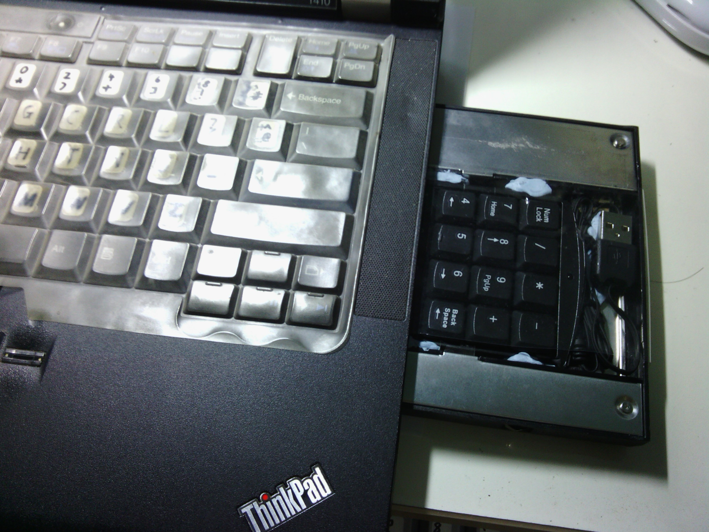

Having switched to the Programmer Dvorak, its major shortcoming was the lower priority of the number keys. For my laptop, this was even more acute for number-intensive applications like spreadsheets. That was when I bought a number pad but I was afraid of losing it. So brainwave!

Put the number pad into the rarely-used DVD slot!

I cut the USB number pad down to size then placed it into an Ultrabay hard disk caddy. (IBM calls the DVD slot Ultrabay as it can be used by devices other than the DVD)

Scrutinise the picture carefully and you will notice that there is a thin film of plastic on the top of the number pad. Even when cut down, the number pad keys still protrude above the caddy. When the caddy is inserted into my laptop, the keys may pop up against the drive-bay grooves, jamming the entire caddy from easy removal. The plastic film forces the keys down away from the grooves thus preventing this jamming.

I was definitely not the first with this idea IBM came up with the [Ultrabay Plus Numeric Keypad](http://www.thinkwiki.org/wiki/Ultrabay_Plus_Numeric_Keypad) about a decade ago but did not make newer versions when the UltraBay size changed. You can say I reinvented the idea.
