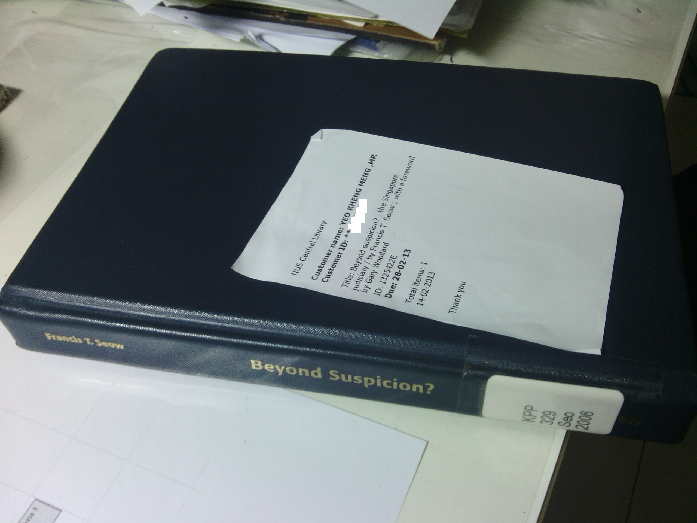

The full title of this book is actually Beyond Suspicion? The Singapore Judiciary. Shortened for brevity.  This book is apparently not carried by the National Library but it is by the NUS Central Library. Being an NUS student, I am glad to have this privilege to borrow out this book and do a review of it. So why is this book so special that only NUS seems to carry it?

As the title suggests and just like Once a Jolly Hangman, this book insinuates that the Singapore Judiciary at that point in time may not be as clean as one would think. As I am no lawyer and has not very well read in that period, it is not my place to verify or judge the accuracy of his opinions. This book was published in 2006 so its still relatively new and online reviews few and far between. So who is this author in the first place?

For those not familiar with the author, Francis Seow was formerly a Solicitor-General in Singapore. His claim to fame was when he attempted to represent the detainees accused of being Marxist conspirators. He himself was then detained by the ISA for allegedly receiving overseas support. He contested in the 1988 General Election in the Eunos GRC under the Workers Party banner and lost with a percentage of 49.1%. He was subsequently charged with tax evasion and left Singapore. There is more to him you can find online, but these are just the main points.

This book is however not about the events surrounding his detention. Those are in his book "To Catch a Tartar: A Dissident in Lee Kuan Yew's Prison" which I have wrote the [review](/2013/05/book-review-catch-tartar-dissident-lee-kuan-yews-prison-francis-seow) for as well. It is primarily about the events and his opinions of lawsuits between the PAP leaders and Workers Party politicians Tang Liang Hong and JB Jeyeratnam(JBJ).

A fairly nondescript book with its cover removed.  Don't belittle the opinions of this coward-looking book!
 <!--more--> 
The initial impression of this book as I traversed the first few pages was his liberal use of bombastic words, Latin and legal jargon. Not a page goes by without me having to consult my handphone dictionary, failing that, online ones. Definitely not for the faint-hearted outside of legal circles. If you manage to get through this book and trust his opinions fully on what was written, you would be shaken by the independence of the Singapore's judiciary with regard to political cases. That is of course, if everything he says is true. Several times, he refers to The Straits Times/TV stations derogatorily as the "command news media".

Now comes the exciting parts

**Tang Liang Hong's case:**

In the 1997 General Election, Tang was accused of being "an anti-English education, anti-Christian Chinese chauvinist" by the PAP leaders apparently based on his [speech](http://www.singapore-window.org/tlh0894.htm) he made in Zeng Yi association's national day dinner in 1994. He called them "liars" and that was when his troubles started. He was slapped with 13 lawsuits from the PAP leaders for allegedly defaming them.

The Inland Revenue Authority of Singapore (IRAS) conducted simultaneous raids in the middle of the night on his home and office to seize documents purportedly on tax evasion charges. Seow's argument to this is why wait until the hustings of the 1997 GE to conduct these raids. Tang's tax payment history was apparently sound until he contested on the side of the opposition. The seizure of these documents would later hamper his efforts in his defense of the defamation suits. Tang also complained that the ISD officers were openly tailing he and his family to instill a climate of fear in them.

Given the similarity of  the 13 lawsuits, Tang applied to have them consolidated to reduce costs but was rejected by the judge. Seow's opinion was that this was done deliberately to escalate the the costs of Tang's defense and to overwhelm him financially. The [Mareva injunction](https://en.wikipedia.org/wiki/Mareva_injunction) was also applied to freeze his assets with exception of a withdrawal of $2000/week which includes his defence costs. Rationale given by the PAP leaders was that Tang purposely wanted to wear down his assets to reduce his eventual payout if he was to lose the suit. I read this part I also find it an amusing reason.

Seow also comments that the speed at which Tang and his wife's applications was handled pales in comparison to those of the PAP leadership implying a double standard.

**Jeyeratnam's case:**

Tang made a police report during the election rallies against the PAP leaders for defaming him. JBJ  upon pressure from Tang waved the reports to the crowd and told them Tang made those reports. For that, JBJ was slapped with defamation suits. Seow argues that JBJ was just stating facts and should not be faulted. The PAP leaders saw it differently, they saw JBJ as supporting those reports and their opinions and therefore had defamed their characters.

In the courtroom, the judge ruled that he deliberately released the contents of the police reports and was thus liable to large damages to the PAP leadership. This according to Seow was untrue as JBJ merely _waved_ the reports but said _nothing_ about the contents. It was the PAP leaders that somehow managed to obtain the contents and released them to the media. The judge was apparently misled and awarded a huge quantum of damages on this basis and the PAP's lawyers said nothing of this error.

\----------

 

The details I listed above are just the tip of the iceberg of what was covered in the book. Seow also talks about the Hotel Properties Limited [incident](http://sgcentral.blogspot.sg/2006/04/hotel-properties-limited-hpl-saga.html), and short recaps on questionable judgments made in the past.  In the appendix which occupies about 1/3 of the book, Seow includes the purchase price lists of the HPL properties made by MM Lee and his relatives. He also includes documents of various court exchanges and letters from international organisations. Want to know more? Borrow this book from the NUS library or the other universities if they carry it.

Obviously I am no specialist in this area, if you find this review to be sorely lacking, I can understand. I hereby point you [this site](http://jg69.blogspot.sg/2008/12/book-review-beyond-suspicion-singapore.html) for a more opinionated review.
