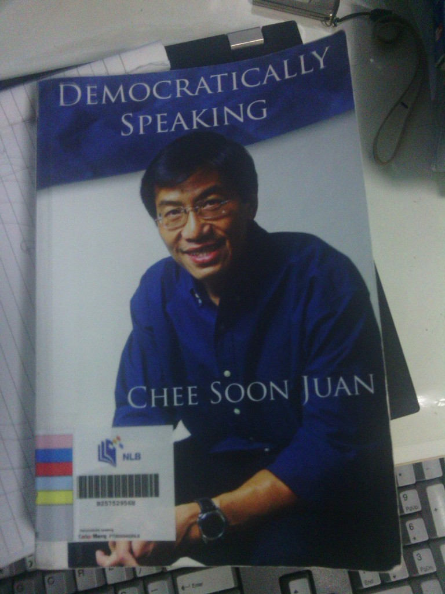

(This is not a full-fledged review, just a short personal opinion piece about this book.)

It was quite awhile since I read the last book by Dr Chee Soon Juan which was a Nation Cheated. I have to admit it was a refreshing read and overturned many of my misconceptions about him and the SDP. So when I heard about this book last year, I knew I had to borrow it. NLB had only 4 copies when I reserved it and I had to wait a month to finally get my turn.

Unlike the Men in White or Hard Truths, this book received scant media coverage. After all to me,  this “almost forbidden” fruit is the sweetest kind.

<!--more--> 
If you want me to summarise this book into 2 phrases I can

1. Call to action
2. His side of the story

Having said that, summarising the book into 2 phrases is a gross misrepresentation of its content and depth.

There are 4 sections to this book but the first 2 are mostly about giving evidence to support his call to action. In it, he discusses a lot about the problems faced in Singapore over the years. If one follows the news (not just the mainstream ones), the issues and solutions he highlighted will not be unfamiliar to you. The sections that are deemed more exciting to me are the last few sections. In them, you will learn about the resignation (and not ouster) of Mr Chiam from the SDP, the court transcripts of the exchange between him and the PAP leaders in his defamation suits as well as interviews with the non-mainstream/foreign media.

For those sections, it was really a second eye-opening experience. Although I consider myself a judicious reader of alternative news sources like theonlinecitizen, I was not aware of the intricacies surrounding his court cases as most of them occurred before I started reading “off-mainstream”.

Unlike how the mainstream media has seemed to portray based on my memory, according to Dr Chee, it was Mr Chiam who made the move to leave the SDP. The mainstream media spun the story to make it seem like Dr Chee was the bad guy and seemed to have done so ever since.

The court transcripts were in short, stunning.  Questions were raised by Dr Chee but was shut out by the judge and Lee’s council. The explanation given that it was a case of determining the quantum of damages to be paid and not a trial. The verdict had already been decided in a prior summary judgement. I’m no lawyer, but I’m inclined to agree with Dr Chee that it was strange that summary judgement can be awarded without the need for going to trial.

Other than the words said, Dr Chee on one occasion describes the courtroom in detail, like how our former PM Lee Kuan Yew has 6 bodyguards compared to our PM Lee Hsien Loong who only has 1 even though he IS the Prime Minister. The way water was given to him by one of his bodyguards also reminded Dr Chee of the emperor-like treatment from their courtiers. Really breath-taking stuff you will never hear about from our typical media sources.

There is more content then I can summarise in this short review. However, what I have mentioned above should have piqued your interest sufficiently to get this book. A new perspective I say, is never harmful.
