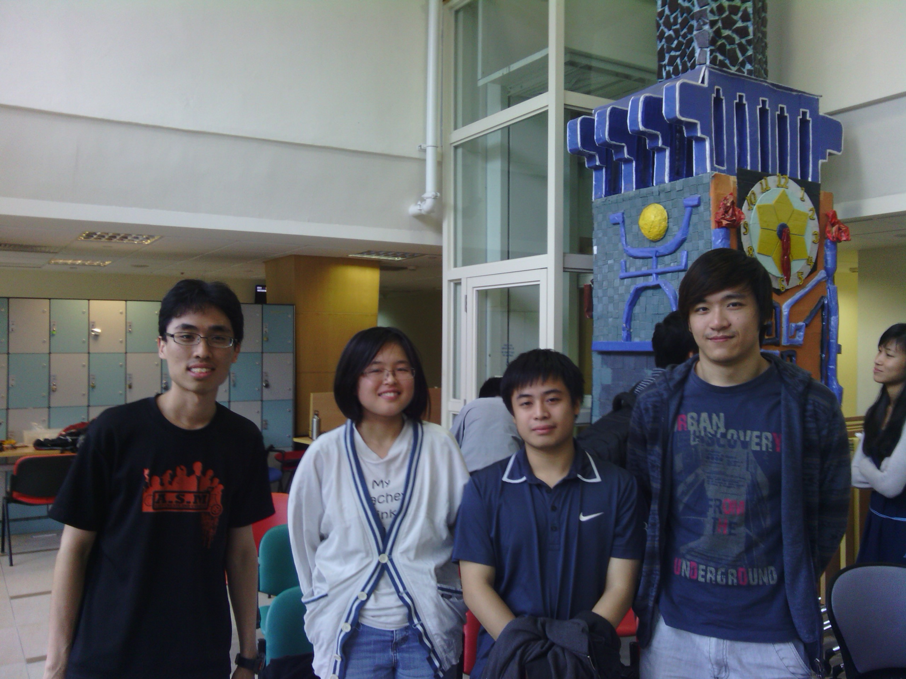

I confess I signed up for this weekend event at the last minute. One of the team members who was an acquaintance of mine said they needed one more member so I joined. I can say, I left this 24hour hackathon today with no regrets other than the proverbial, I could have done that better in hindsight attitude. This was my first hackathon and most definitely won't be my last.

Sitting down with your team coding through the day and night then day again for only a single goal while surviving on a steady supply of snacks, soft drinks and fast food is an unforgettable experience.

My team, which I barely knew before the event but nonetheless worked reasonably well together in the end.
 <!--more--> 
The product we did was for the conducting for an indoor Treasure Hunt aka Geocaching but with some differences. It consists of 2 parts, the Android application front-end and a Game Master server application using Ruby-on-Rails. One member and I worked on the Android app while the other 2 worked on the server aspect. The client-server communication was done using HTTP requests utilising  the Json format.

The game works as follows:

1. The game master designate certain locations in a building as "treasure sites". He then hands out the first clue to the participants.
2. The players will then navigate towards the checkpoint. In the general area of the checkpoint, they will use the Android app to verify they are in the immediate vicinity of the treasure or not.  Now how do we do that since GPS does not work indoors. We use the MAC addresses of the Wifi access points and the associated signal strengths in the area to determine if the player has arrived in the right location.
3. Once checkpoint arrival is confirmed, the player can do something/anything before the app will show a clue to the next checkpoint.

Of course, the signal strengths have to be measured beforehand.

The idea of indoor navigation using Wifi access-points is not new although it is not pervasive at the moment due to precision issues. Nevertheless, we felt that extreme precision is not really an issue for our product. After all, its more fun for the players if they know they are near the goal but still not at it yet.

As time is short, the planning and coding process would put any Software Engineering practices lecturer to tears. Unit Tests? Sequence Diagrams? Cohesion and Coupling concerns?  Assertions and Exceptions? We knew most of them were out of the table before we started. The only thing we standardised upon was the APIs between the different modules we wrote. And even that was subject to mistakes as interpretations and implementations between members differed. Even at the end, we were unsure about the stability of the software since the mobile app seemed to crash at random moments but strangely not on the PC emulator. One of the features I worked on in the Android app failed to work at the last moment and could not be corrected in time for the deadline. Very likely, it was some regression somewhere but dunno where. This example clearly shows the importance of applying software engineering practices.

For me, it was a huge learning experience for me. Some say, if you too lazy to pick up a programming language/framework, work on the right project in the hackathon to do so. As of 3 days ago, I did not know a thing about programming on the Android platform. One hackathon later, an Android app is born! Working as team especially with more senior members to provide tips also allows me to step out of my comfort zone. Sometimes, I may be too used to coding in a certain manner without bothering to find out alternatives. Having members suggesting other methods forces me to look up and adopt other more efficient practices.

There was also a short 7-minute presentation at the end where teams have to showcase their products. This is something like [CS2101 presentation](/2012/11/1213-s1-cs2101cs2103t-software-engineering-task-manager-program) except it was completely impromptu with no prior rehearsals and plagued with fatigue by 24-hours of non-stop coding.  This was one area we could have done better. Imagine trying to demo a product UI with no content on it except for blank webviews and buttons. That was what I did and attributed it to the limitations of the Android PC emulator. The only working prototype was on my Nexus 7 tablet with only one to go around so many judges. The Year-4 guy who worked on the server-side was pretty good and I attribute him as the best presenter of our team.

I say, the prize winners deserved the awards/ rewards they got. In fact, the first prize went to a product that is not used by end-users at all. It was a software library dealing with map coordinate-conversions. The judges nevertheless saw the potential benefits to society at large even if laymen are unaware of its existence. I can safely say first prize is a mere understatement to the potential benefits of their project. A trip to Silicon Valley is what most Singaporean geeks can only dream about and is what the winning team rightly deserves.

Another hackathon next time, with the right members, definitely!
