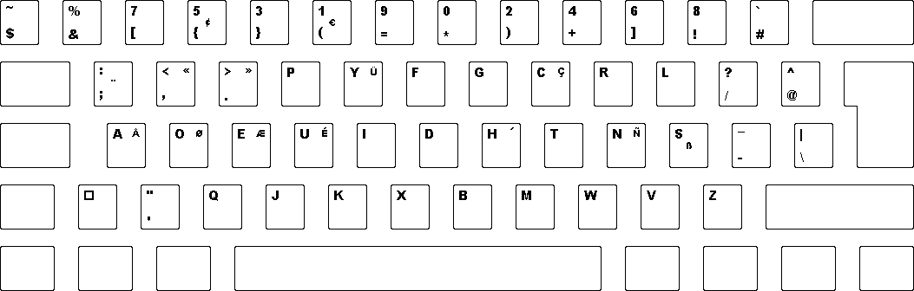

I have been using the [Dvorak keyboard layout](https://en.wikipedia.org/wiki/Dvorak_Simplified_Keyboard)  since out of army. It took me months for me to attain my previous typing speed of the Qwerty layout. From that point on, I never looked back as the Dvorak layout was simply very comfortable to type on. I can attest to the fact that my fingers leave the home row much lesser. I came across this [Programmer Dvorak](http://www.kaufmann.no/roland/dvorak/) layout created by an IT professional Roland Kaufmann.

The primary difference between this and the normal Dvorak layout is that the numbers at the top row are now secondary with the symbols taking precedence. Meaning: Symbols are by default, you have to press the Shift key to get at the numbers. This layout was arrived at after Kaufman realised that programmers tend to use more symbols and he scanned source code to obtain the most commonly used characters.

(From Roland Kaufmann's [site](http://www.kaufmann.no/roland/dvorak/index.html))
<!--more-->
During the 2012 December holidays, I made the switch for my Unicomp Spacesaver 104 mechanical keyboard.

Transitioning to this layout is much simpler for me since I already have a foundation in standard Dvorak.

The Programmer Dvorak layout is included by default in most Linux distributions. The only issue was with Windows. Kaufman provides a program to install the layout for you. However, the strange thing is that he reverses the layout of the number pad as well which I dislike. I therefore created my own layouts for both Windows and Mac with the only difference being the number pad being untouched. My custom copy of the installable layout and source files can be found [here](https://github.com/yeokm1/coders-dvorak-regular-keypad). You may need to reboot the machine after the layout is installed for it to be visible in the Control Panel.

Advice to those intending to switch:

1. Don't make a direct leap to Programmer Dvorak, practice on the normal Dvorak first using typing software.
2. Set aside a lot of time to practice
3. Go cold turkey, don't use Qwerty layouts in the meantime. You need to wean yourself off your Qwerty muscle memory.
4. Don't give up! This transition period would be the best test of your peseverence in your entire life. You can trust me on it. The rewards will be worth it though.
