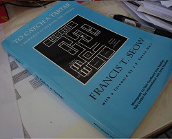
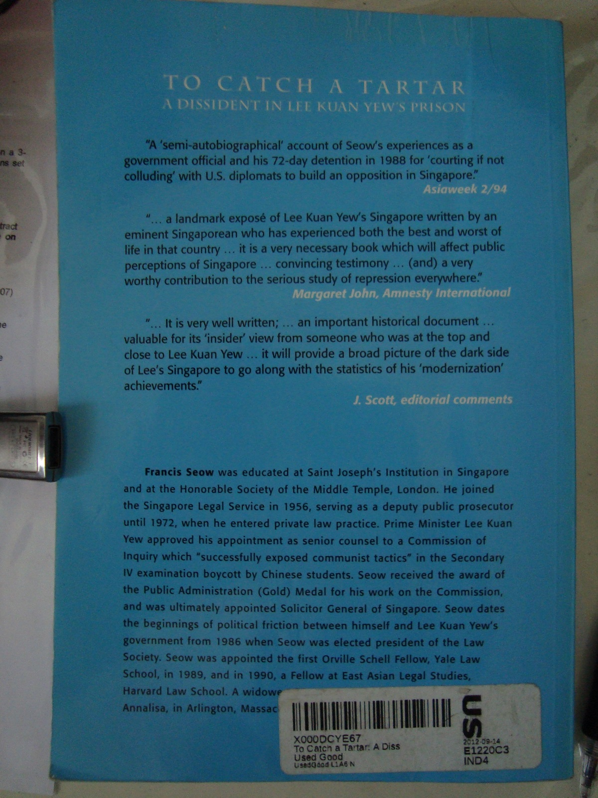

Edit 1 (21 May 2013): Today marks the 26th anniversary of Operation Spectrum. Before you suspect anything, it is just a pure coincidence that my review of this book falls so close to this date.

**I managed to obtain an ebook just recently and have uploaded it [here](to-catch-a-tartar.pdf). I know this may not be totally legal but seeing as this book is out of print and the author/publisher aren't doing this for profit, they probably wouldn't mind if more people have access to this material.**

It was not not too long ago that I did my [previous book review](/2013/02/book-review-beyond-suspicion-francis-seow) on the newer Francis Seow's book, [Beyond Suspicion](/2013/02/book-review-beyond-suspicion-francis-seow) (2006). If you do not know who Francis Seow is, check out this [Wiki link](http://en.wikipedia.org/wiki/Francis_Seow) or take a look at the previous review to check out my short summary of him.

Now having just received and completed this older 1994 book, I shall do a review on it. Unlike Beyond Suspicion which was itself hard to obtain, this book is even more tightly controlled for possible reasons you shall see later. According to this unverified comment [here](http://furrybrowndog.wordpress.com/2011/08/03/old-newspaper-articles-disappearing-from-nlbs-newspapersg-archives/), To Catch a Tartar used to be available in the National Library some years back before it vanished. Unlike the 2006 book which can be borrowed out of NUS Central Library, this book has the status "[USE IN LIBRARY](http://linc.nus.edu.sg/record=b2495274)" which I infer that you can only read the book onsite but not borrow it out.

Making many trips all the way to the NUS library just to read is a little lame. So how did I get my hands on this material? A foreign book store like Amazon of course! Note, this book is [not banned](http://www.thinkcentre.org/article.cfm?ArticleID=417) if you are wondering.

As with all my reviews, I will include a snapshot of this book so it will be easier to locate this book should you desire to read it as well. I strongly encourage that you click on the pictures to view the higher resolution images to read the text.

A map of the Whitley Detention Centre for Internal Security Department (ISD) detainees. To lend credibility to this book, the Foreword was written by Singapore's former President, the late Devan Nair. You can view Nair's full foreword posted by another blogger [here](http://singaporerebel.blogspot.sg/2009/05/lees-betrayal-of-pap-and-singapore.html).

As usual, comments from other reviewers.

Neat summary: _**"A semi-autobiographical account of Seow's experiences as a government official and his 72-day detention in 1988 for "courting if not colluding" with U.S. diplomats to build an opposition in Singapore"**_

It was not explained why the title was chosen to be "To Catch a Tartar", the definition from this [online dictionary](http://dictionary.reference.com/browse/catch+a+tartar) should suffice. _"to deal with someone or something that proves unexpectedly troublesome or powerful."_

This book offers a rare peek behind the doors of (in my opinion) one of Singapore's most secretive government units. So enough of the lengthy introduction, now to contents.

The book is divided into several parts, but generally they can be classified into, his life before his detention and his experience at Whitley.

**Before the main event**

Seow was a Solicitor General from 1969-1971 before he left to start his own law firm. He maintained a low profile for the next few years.

In October 1986, he was approached by a law friend to stand for the presidential elections of the Law Society. The rationale given was that many pro-PAP/establishment were seeking re-election in the Council. He on the other hand, was at least known not to be pro-PAP.

Two more lawyers Patrick Seong and Teo Soh Lung would later assist him in his presidential campaign. If you find the latter’s name familiar, it was because she stood in the GE 2011 elections under the banner of the SDP.

We know from history that Seow won the election. What you may have surmised is that this is the start of increasing friction between him/Law Society and the government. At his first speech as President in January 1987, Seow advocated for a more “assertive and caring” bar. He sought greater influence by the Law Society on legal matters such as comments on legislation and personnel selection of judges and officers.

As an example, the Law Society criticised the Newspaper and Printing Presses Act which proposed to curtail the distribution of foreign publications should they publish politically “sensitive” articles. After the vocal interferences of the Law Society, the Law Profession Act was enacted by the government to curtail its ability to comment on legislation unless its advice was sought for.

Due to actions directly or indirectly led by him, seemingly underhanded tactics against Seow began to show up. He recounts that creditors began to pressure him to pay up ahead of time, the Inland Revenue Authority of Singapore (IRAS) served unusual asset and liability assessments against him and the accounting staff of his firm were made bear long meaningless waits at IRAS offices.

**Operation Spectrum (21 May 1987)**

No, in case you suspected, Seow wasn’t arrested on this day but his former helper Teo Soh Lung and 15 other church members and voluntary workers were. Another 6 more were detained a month later on 20 June. Some of the detainees helped the Workers’ Party in prior elections. The alleged charge of being Marxist conspirators intending to topple the government is never proven till this day.

Seow and Subhas Anandan (a famous criminal lawyer today) represented Teo in advisory board to argue for her release. To make things more difficult for Seow, his fiancé a Malaysian by nationality was declared a prohibited immigrant to prevent her entry to Singapore.

Teo and 6 other detainees were released on 26 September 1987 after they “confessed” to their alleged offences. In the following year 18 April 1988, they made a joint press statement retracting their previous confession claiming it was made under duress. They were promptly re-arrested with the notable addition of Patrick Seong. The latter was the legal representative for some of the detainees and apparently disseminated information regarding the situation in Singapore to foreign human rights organisations.

**ISD’s trap to detain Francis Seow (6 May 1988)**

Seow’s firm received a fax allowing him to visit Teo and Seong at 4pm that afternoon at the Whitley Detention Centre. He and his assistant Roslina made his way there as scheduled. He was then asked to leave the waiting room on the pretext that someone wanted to meet him. Seow was brought to another man who told him he was now under arrest by the Internal Security Act (ISA).

Seow claims the rest of the ISD officers lied to Roslina that he had already left the Centre after he failed to appear for some time to get her to leave.

**The 72-day ordeal begins**

He was placed in a cell 6x12x15 feet large. A raised concrete platform with no mattress or pillow served as his bed. The only illumination came from a fluorescent tube and a light bulb. There was nothing else, not even a window. The only way in or out was through a wooden door secured by 2 iron bolts on the outside.

**Interrogation**

Seow was brought to an interrogation room. He recounts that he was made to stand barefooted in the middle of the room directly under an air-con duct. Powerful blinding spotlights were trained at him to keep his eyes down. On the pretext of pity, they offered him a chair to sit with the fourth leg perversely part sawn off. This kept the unfortunate detainee on a constant state of maintaining his balance. The chair was later replaced with a proper one.

Questions about his involvement with US diplomats like the political secretary of the US Embassy Hank Hendrickson were directed at him. The ISD officers wanted to establish a link between him and possible US clandestine operations in Singapore.

The ISD officers told Seow that Hendrickson has been [expelled from Singapore](http://en.wikipedia.org/wiki/Singapore%E2%80%93United_States_relations#Hendrickson_affair) on the basis of a "confession" made by Patrick Seong. They wanted him to implicate Hendrickson on the basis that he cannot be hurt anymore. Seow obviously disbelieved them. Hendrickson however was indeed pushed out a day after Seow was arrested.

**Living Conditions**

Seow says there was no privacy when it comes to usage of the toilets. Whenever he had to answer the call of nature, he had to use the older squat toilets with the door kept partially open so the Gurkha guard could watch him when needed.

He was only provided basic toiletries after 4 days. A second towel was given after he complained about the inadequacy of the first. Clothes had to be personally washed.

Breakfast consisted of an omelette sandwich and sweetened tea with milk. Sardine sandwiches were served on alternate days. He emphasised that it was not as good as the names suggested.

Despite the inconveniences, Seow noted that effort was made to ensure he was kept in good health.  A doctor will be on hand to examine him during each interrogation. Sometimes, outside food will also be ordered in to supplement his diet.

**The road to release**

Seow was made to write a statement. He refused so an ISD officer wrote it on his behalf. Words were suggested and re-suggested if Seow didn’t agree with their usage or connotation. Statements were made, vetted for mistakes, corrected and remade. Seow describes it as a process of tiring you out so you will accept whatever they suggest.

To digress, somewhere around this time, Seow’s law firm requested the ISD return seized accounting documents to carry out business operations. IRAS officers were also there on the same day to collect those documents on the day of the return. In effect, the documents were handed from ISD to his employees only to be taken away by IRAS a few seconds later.

**The release (16 July 1988)**

Seow recounts that his captors told him that day was his release date. They have not forgotten that the next day (17 July) was his fiancé’s birthday. His release would take place at 1pm with government press releases coming many hours later to prevent the media from descending upon the detention centre beforehand. Seow later left for Malaysia to see her.

**It is still not over…**

When he returned to Singapore on 1 August 1988, he was served with a document from IRAS instructing him to answer 12 years’ worth of tax returns by 3 September 1988. Seow notes that the election date was 5 September (it was later set at 3 September). He suspects this was a ploy to keep him occupied so he will be too busy to contest the elections.

Seow wrote to IRAS asking for an extension. He also made a press statement on August 6 condemning the ISA and announcing the pressure he faced by IRAS. Seow says IRAS then replied on August 10 that they did not believe he would comply and thus had to report to the subordinate courts to answer 6 tax evasion charges on August 16. Note the sudden bringing forward of the deadline.

Seow went to court to answer these charges while contesting in the elections. He and his Worker’s Party team lost in Eunos GRC with 49.1% of the vote. As the best loser, he was entitled to an NCMP seat. He was in the US seeking medical treatment at the point the government was reconvened in early 1989. He never took the seat as he never returned to Singapore. He was later convicted [in absentia](http://en.wikipedia.org/wiki/In_absentia).

**The end of the book, now a short personal opinion.**

Let me state that there is no reasonable way for me to verify the accuracy of the contents of this auto-biography. After all, there aren’t much, if any, alternative sources of information to corroborate his story. So if you find my summary unbelievable, just take it with a pinch of salt. Nevertheless, I do not believe he has a reason to lie seeing as how he got this book published under the Yale University Publications.

If everything he says is true, it is chilling reminder of how the ISA can be misused by the government in power for political purposes. My stand has and always will be that the broad-natured ISA should be abolished. If necessary, a law that targets only terrorism-related activities should be enacted. If a law is on the books and is used at least once, it can be used again despite what politicians may claim. It is just a matter of time before the conditions become ripe or desperate enough again for its use.

The use of IRAS to put pressure as claimed by him in the book mirrors those used against Tang Liang Hong also described by him in the 2006 book. If these are true, it is again a shocking revelation that state apparatus has been utilised against political opponents in such an underhanded manner.

As for Seow, he is under a self-imposed political exile in the USA. At the age of about 85 today, it is unlikely that he will set foot back on the country that born and bred him. All because he disagreed with the views of our leaders.

From what we have seen here, it is easy to guess why the availability of this book is highly curtailed. It is sad that the National Library large as it is, chose not to hold all books written on Singapore. It can't be that many right?

At the back of the book contains several interesting appendixes detailing maps of the detention centre, press releases and letters. Obviously I cannot copy word for word here, I have left out (what I deem to be) non-critical sections like his dealings with Devan Nair, Subhas Anandan and how he suspected the ISD was trailing him even overseas. Get the book or borrow from me if you wish to know more.
