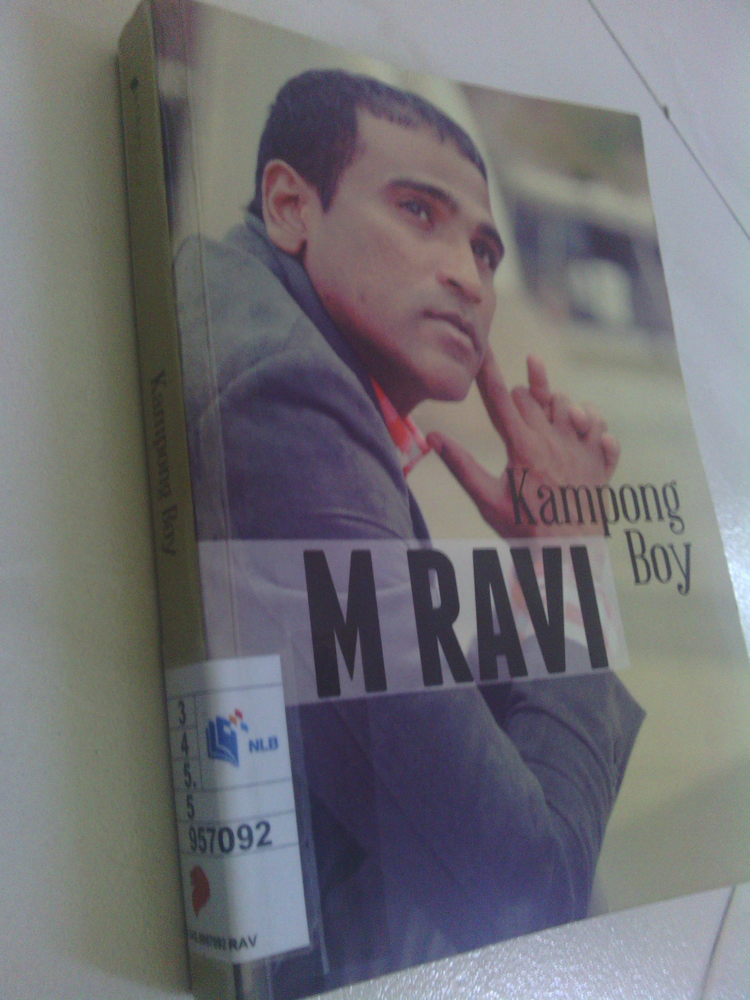

When it comes to defending the accused in cases relating to human rights such as the death penalty or political vendetta, only one lawyer in Singapore seems to come to my mind. He is Madasamy Ravi or M Ravi for short.

This book Kampong Boy gives an auto-biographical account about his life from his childhood days to the present time and the impetuses that drove him to take up such cases and causes. As expected, when this book was launched in April this year, there was hardly a mention in the mainstream media but cyberspace was quick to give him the necessary publicity.

<!--more-->
**Before his legal career**

Beginning from how his parents met and married in 1959, M Ravi navigates the series of the events that cumulated into his present being. I shall not bore you with details suffice to say that M Ravi did not come from a well-to-do family unlike the stereotype we usually have about lawyers, much less those who regularly do pro-bono work.

Fights between his parents and relatives were common with his mother usually on the losing end. At one point, he describes that the best contraceptive for his parents was if his father went to jail, if you catch my drift.

One of his early brushes with justice was when he tried to report his father to the police for stealing money meant for his school fees to buy alcohol. He remembers this encounter with the amused but dismissive policeman as the moment when he first utilised his skills in oratory and debate honed from watching TV courtroom scenes.

His next lesson came about when he entered Anderson JC.  A Student Wall comprising of a large piece of paper which allowed students to write whatever they wanted. A student wrote “JBJ, where are you?” JBJ refers to the late JB Jeyaretnam, a prominent opposition politician that was sued to near oblivion but not out. The pro-establishment principal was so enraged even by the mere mention of an opposition politician that he ordered the Student Wall torn down. If there was one thing this incident has taught him, it was that political conformity is instilled very early in life for citizens of Singapore. On a side note, he later made his way to meet JBJ himself to inform him about the incident in his name.

He details several other incidents which naming here would extend this article inordinately. These honourable mentions include standing up for a Nigerian student when racist comments were directed at her while he was in Cardiff University. He also advised a student/gang member of his rights during arrest when he was a relief teacher.

**Legal Cases**

The first defining case of his career was when he defended Vignes Mourti a Malaysian charged with drug trafficking. By the time the case reached his hands, a death sentence and even the execution date had been handed down to his client. He complains about the unsympathetic judges he encountered through his last-minute defences to prevent Vignes from meeting the hangman.  At the final defence before a 3-judge panel, M Ravi put a question to the prosecutor asking if **an innocent man can be hanged because of procedural matters**. Before the DPP answered, Chief Justice (CJ) Yong Pung How interjected with the now notorious reply “**Yes; the answer is Yes.**”.  Coming from the CJ himself, this sets a very chilling tone about how the Singapore judiciary seems to operate.

Another landmark case he handled centered about Alan Shadrake, author of the book “Once a Jolly Hangman”. For the uninitiated, this book goes into depth about the death penalty cases in Singapore and even the hangman himself Darshan Singh. _Shadrake insinuates the possible bias in the Singapore judiciary when it comes to cases involving the accused hailing from more privileged backgrounds._ (Words in italics are from my personal opinion based on reading Shadrake’s book itself)  Because of this book, he was arrested in the wee hours of the next morning after his Singapore book launch on the charge of “criminal defamation of the judiciary”. The learning point from this episode was the debate on whether the court should use the “real risk” or “inherent tendency” test. Those are legal terms which you should find out more if you are interested.

He also assisted SDP’s secretary-general Dr Chee Soon Juan in his court case against defamation suits from the PAP leaders. This is also mentioned in Dr Chee’s auto-biography which I have [reviewed](/2013/02/book-review-democratically-speaking-dr-chee-soon-juan) too. Further cases include the failed defence of the Nigerian Amara Tochi in drug trafficking where he flew around the world to secure support for his release. Ravi was also involved in a Section 377A constitutional challenge when he represented a client charged under this act. (You can see my views on Section 377A [here](/2013/04/my-views-section-377a))  His latest landmark case to date was by Vellama Marie Muthu who filed an application to the High Court demanding the Prime Minister hold a by-election to replace deposed MP Yaw Shin Leong of Hougang.

**Now to my comments**

From his personal accounts, one can surmise M Ravi comes from a humble background no different from the majority of Singaporeans of that era. The similarities however, end there. He shows himself to be one of the few that have broken away from the mould that has shaped most Singaporeans. As reward for his out-of-the-mould behaviour, he was once [accused](http://sg.news.yahoo.com/law-society-applies-for-order-to-determine-m-ravi%E2%80%99s-mental-health--.html) to be mentally ill and not fit to practise.

Without this book and alternative news sites to tell his story, it is very likely many Singaporeans would be taken in by the anecdotally biased mainstream media reporting. He shows that he comes from one of us. The ability to analyse, exert and protect your own rights is not the sole domain of the rich and powerful. There is this adage when it comes to the learning of languages “Use it or lose it”. Even for seemingly insignificant minions like us, rights do matter.

As with all the books I have reviewed so far, some cynical people will be quick to dismiss them as one-sided and irrelevant to know more about.  I beg to differ on this point, you can never get enough viewpoints. A single source of news or opinion is always dangerous.

**About my views on the death penalty**

M Ravi’s stand on the death penalty is that it has to be abolished. Here is where deviate from him, my stand on this issue is that the death penalty should be around in principle but not be made mandatory for any crime. Not drug trafficking, murder, illegal handling of weapons, kidnapping or treason.

Recent [changes in the law](http://www.mha.gov.sg/news_details.aspx?nid=MjY4NA%3D%3D-9UYtY1flAog%3D) allow accused drug traffickers to escape the gallows if they are couriers and demonstrate actual assistance to law enforcers. This is a small step in the right direction. But as NMP Lawrence Lien [puts it](http://publichouse.sg/categories/community/item/807-baying-for-a-pound-of-flesh-and-more) “_I believe the life and death of an offender should not be decided based solely on their utility to the state.”_

Only judges have the full information required to make the sentencing decision, let them have discretion to do so. Parliamentarians who craft and pass the law are never the best people to decide who lives and who dies for after all, politicians come and go but the law stays on the books for a very long time.

When the death penalty is to be meted out, it has to be carried out only when all reasonable doubt of the accused has been wiped out. If the words of the CJ is reflective of how the judiciary conducts its business, I rather the death penalty be removed to avoid the chance of a wrongful sentence.
