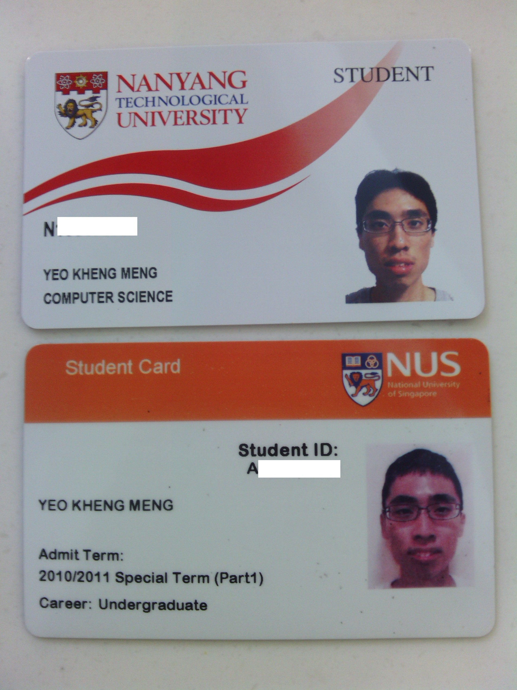
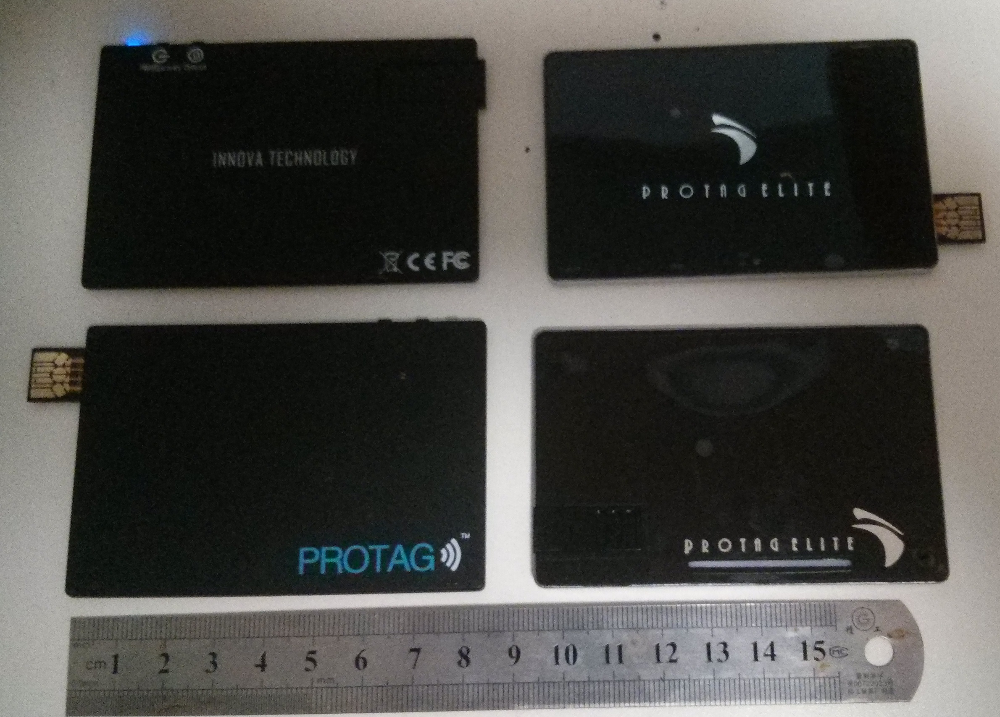

It is an obvious fact that the workload each semester is always greater than the one preceding it. This adage has never been more right up to this semester. In fact, greater is just an understatement. In just 2 weeks into this semester, I cannot even count the number of days I have slept for a reasonable number of hours.

This semester will be my most pivotal semester so far and I although I can’t predict the workload for subsequent semesters, the jump has been greatest in this one.  Notable reasons for this preliminary conclusion include the notoriously heavy CS3216, my partial exchange to NTU including a French module, continuing my part time work from my internship and my weekly community service.
<!--more-->
**CS3216: Software engineering for evolving platforms**

This module has an official academic schedule of just 2 hours a week, no final exams and is worth 5 MCs. Don’t let those details fool you. If such an arrangement exists for any other module, you can bet students will be willing to fork out 4-digit points to get it.

The 2-hour lectures tend to overshoot as they end at 8.30pm on Monday. Saturdays are occupied by “optional” workshops. When things are optional in university, you know they are equivalent to a must-do to secure a good grade. These workshops are beneficial though, so most people do attend.

This is the only module I have encountered that runs concurrent projects. 3 projects before the recess week and one major one after that. A special requirement dictates that you cannot work with the same team member twice in the first three.

(These are from my [CS3216 blog entry](http://khengmengcs3216.wordpress.com/2013/08/25/kheng-meng-week-3-barely-threading-above-the-water-surface/))

Having nearly zero web programming prior to this course, describing the first Facebook app assignment is tough is a mere understatement. With the second assignment now out, I feel like I’m barely threading above the water surface. Nevertheless, I feel our team has something reasonable to show for our first milestone on Monday.

I have to give credit to the Twitter Bootstrap workshop. Having been exposed to this library, we were wondering why we didn’t use this earlier. The silver lining is that having not known about this, we were forced to go back to fundamentals during the initial process to code our UI. If I have a suggestion to make, it is that this Twitter and Photoshop lesson should be conducted on the first workshop instead of the Github one. After all, we have to make something first before we can commit anything to the repository.

The learning curve for this module is indeed high. Unlike CS2103 where knowledge in Java/C++ gained from prior modules can be applied, there is no web module before this to equip us with the skills. We have to learn and apply in a shorter time span. But hey that’s why I’m here for right?

Finally, let me end with a complaint. CS3216, why are you worth only 5MCs??? This module deserves at least 8MCs.

**Partial Exchange to NTU**

Which matric card design is better? Both are not very good but if I have to go out on a limb, my vote goes to NTU.

Why an exchange to NTU and not a foreign exchange?

My official reason: To expose myself to the different teaching environment in another university. The opportunity to meet new people to gain new perspectives is also useful for personal development. Other than for myself, I can allow NTU students themselves to obtain different perspectives I may have gained in NUS.

(I actually put those cheesy lines in the application form)

Unofficial reason: Can SU modules while retaining the advantage of staying in Singapore.

I’m taking up Intro to French, Forensic Science and Artificial Intelligence.  From the 2 weeks I have spent at NTU, I have a rough idea about the pros and cons between studying in the 2 Unis. I shall however reserve judgment to a future blog post after this semester ends. Now why French? Partly because the alternative Japanese will only to translate to 2 MCs when converted back to NUS rather than 3 MCs. My superior in my internship company is also French speaking so it could provide opportunities for usage of the language. And my gut feeling tells me that French is easier than Jap, just my gut.

Travelling to NTU is a whole new different ball game compared to NUS. Going to NUS requires me to take a bus, the NS Line, then the Circle Line. Going to NTU, take the above plus the EW Line then 179/shuttle bus then a mandatory long walk to classes. My Mondays are the worst 9-11am at NUS, go to NTU  and stay till 5.30pm then rush back to NUS by 6.30pm for CS3216.  Thankfully, this arrangement is just for one semester.

**My Summer Internship at Innova Technology.**

Innova Tech is a local startup company that makes Bluetooth-based anti-loss devices known as the Protag. It is about 2.5 years old, still new but its first-gen product is already selling in the market.

This is my first internship so I have no baseline to compare with. However, from what I have experienced and the comments from the other interns, Innova is a good place to intern at. I was never made the office boy to make coffee or push documents which is stereotypical for an intern. I was given real stuff and proof-of-concepts to work on. As usual, interns are usually obtained because we are the next best thing over free labour, but this is the norm suppose.

Now having completed this internship, I’m continuing on part-time basis. I believe the greatest motivational factor for me is seeing the product succeed and the fact that this is a product I would personally want to use. Nothing beats faith in the product. Especially in the emerging area of Bluetooth Low Energy, experience in this technology is good to possess.

The Bluetooth 2.0-based Protag (already selling) and Bluetooth 4.0-based Protag Elite (pre-production sample). For an independent comment on this product, take a look at the local review by [zitseng.com](http://zitseng.com/archives/4998).

Working in a startup, it is normal to do stuff outside my job description of an Android developer. Notable events including going to Sim Lim Square during work hours to buy a computer, setting up a local version control server and web programming.

I wouldn’t mind working in a startup when I graduate though. Less bureaucracy, meetings, job boundaries. More time spent on real work and being a jack of all trades. There are trade-offs though, less job security, remuneration. At this point, I think the trade-offs are worthwhile.

Oh I can’t help but self-advertise, support us by contributing to our [Indiegogo page](http://www.indiegogo.com/projects/elite-the-world-s-most-comprehensive-lost-and-found-system)!

**Yishun Reading Stars Regular Volunteering Program (RVP)**

This is my 4th semester in this RVP, a subsection of NUS Community Service Club. I’m lazy to repeat details so just take a look at the about page on [Facebook](https://www.facebook.com/CscYishunReadingStars).

Kids who attend this usually come from poorer family backgrounds and have learning difficulties. For those who are in this RVP with me, you will know my assigned kid is notorious for being one of the most difficult to handle in an RVP comprising of already naughty kids.

In preparation for a video for this RVP’s outreach, I was interviewed for a few questions with the best appearing in the actual footage. This question “what was the motivational factor that made me go every session?” This answer did not make it into the video but I answered along the lines of seeing my kid improve every week. I only had a few minutes to prepare for this. In hindsight and with less political correctness, I should add the following below. (When the video is posted, I shall link it here)

Despite the tough kid I was given, he is the one of the few constants left in YRS. Many volunteers come and go, kids come and go and even the full-time coordinator has changed but this kid and I have stayed for 2 semesters and likely for a few more. The five golden behaviour rules seems to have been scrapped but trust me, this kid won’t forget. In fact by the time this kid leaves the programme, it is probably time for me to leave as well.

For those who wonder why I’m not in the committee, I was approached to apply for committee positions but I had to decline it. I guess my workload levels above should explain why. It is not ethical for me to apply for positions for badges when I know I cannot put in my best for them.

Finally...

Learning a new language, not trivial. Couple that with CS3216, a part-time job and community service, super not trivial. Will my next semester be tougher than this one, likely so but it will just be the next ladder rung away. Nothing special, nothing as pivotal as this one.
