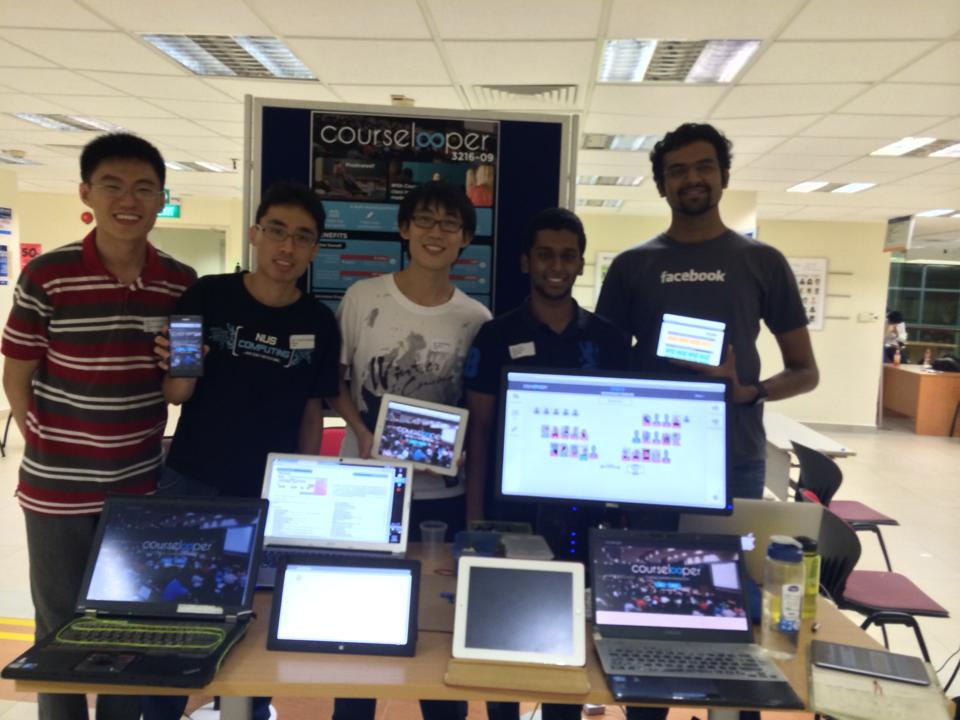

So yesterday was the Steps exhibition that marks the end of the module and the return to the reality of the final exams, other than the final report of course. It was really an interesting experience to pitch our class management app to both teachers and students alike.

<!--more-->

My team: from left, Kai Yao, myself, Boyang, Muneer and Vishnu.

As Vishnu (one of our team members) said, the best decisions that increased our coolness factor was the inclusion of a new, much better but untested teacher UI and the ability to take pictures to join our demo class in a more interactive manner. The funny thing was that both features were added very late. The new UI was added to the master branch just hours before and the picture taking was only finished the day before.

This was the general idea of my pitch which seemed to work quite well:

>Profs in NUS especially those from Business face some issues in the classroom. One of them came to us with these 2 problems  
>1. Students are afraid to raise their hand to volunteer to answer questions or in some classes, students are too enthusiastic.  
>2. Difficulty in tracking participation marks and who are the active ones. It’s currently done by pen and paper which is, prone to mistakes and troublesome as grades have to transferred to the computer later.   

>Our app Courselooper, is designed to solve these 2 problems:    
>Problem 1: We demonstrate the “pick-me” features and class poll explain things along the way.  
>Problem 2: We show the giving of participation marks as a 2 click affair, select the student and just give how many marks you want. Colour codes are assigned to students based on their level of participation to enable teachers to know at one glance who are the quiet ones.    
>We also show how to create a class room using our class layout generator.  Also explain modularity of system like how more features can be added and deployed to other schools.

Some were stone-faced throughout and some were just plain excited about our project. Most of the visitors told us there is strong potential in our project and a few teachers even expressed interest in possibly using our app in their classes.

As Boyang remarked, _“Coffees and sleepless nights, Sunday Macs and IE bugs... More to come my friends!” _ This is my first semester where practically one day of each weekend was spent in school for a project. And seriously, I’m sick of MacDonald’s already (Mac’s is the only food establishment near to Computing that operates on Sundays). Ready to boycott that at least till next year.

I’ll be applying for CS3217 next Sem and I vow not to make the same mistake and enter the course without some basic knowledge first.  According to the people who have taken CS3217, it seems the module is more structured and “more manageable” than this mod. At the very least, I do hope to pick up the basics of iOS programming over the holidays for I wanna port my [SOC Printing](https://play.google.com/store/apps/details?id=com.yeokm1.nussocprintandroid) app to iOS!

This is exactly what I said in the closing video of our team but I shall repeat it here.

“Finally, we would like to thank Prof Colin Tan, Su Yuen, Prof Ben Leong and Prof Liu Qizhang from Business school for their advice throughout the course of the project. We hope Courselooper will be useful addition to your classroom. Thanks!”
