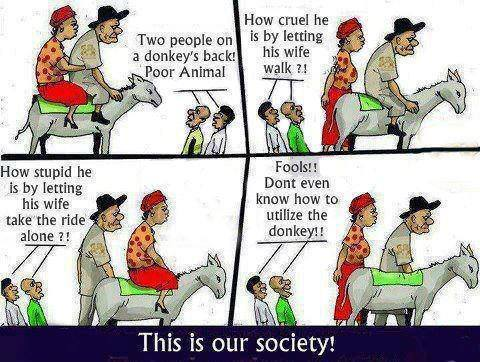

At the beginning of this semester, I [wrote](/2013/08/why-semester-will-be-most-pivotal-me) about how this semester shall be the most pivotal for me. Now coming to the end of this semester, I do agree with most of the points I foresaw earlier with exception to the NTU part.  Anyway, this most are mostly for CS3216, the rest shall come after the exams.
<!--more-->
It was hellish experience in this module so far. Most of the project has already been completed with exception to the final [Steps](https://www.facebook.com/events/542707119147478/) project show case on Tuesday evening and a final project report.

(For those who are not aware, please COME and SUPPORT my team at our booth in COM1. We do not know our exact booth location yet but we are Team 9 of CS3216. The more comments/votes we get, the higher our grades! See [here](https://www.facebook.com/events/542707119147478/) for details)

To say the concurrently-running assignments as being tough and time-consuming is the greatest understatement I could say in my life. The time I spent on this mod is greater than the rest combined. Fortunately for the default SUs accorded by my NTU exchange, if not I really wouldn’t be able to hold my head above the water.

I’m literally from a person with almost zero web programming knowledge to able to do something, not the best, but still enough to contribute to my team. I have picked up HTML5, CSS, Javascript, PHP, SQL and many frameworks along the way to get things done for my project. Though I’m far from a being web ninja, at least I will not be totally blur when I encounter these languages in the future.

For those who do not know already, my team’s final project for this module is to make a classroom management system for teachers to encourage students to speak and to grade them effortlessly at the same time. My part of this project is on the student’s interface. Have to admit though, my weaker web skills compared to them has required me to seek their help many times which I have to thank them for.

On the surface, this may seem technically easy and this is what our team thought so initially. There are no fancy algorithms, no need to code a game engine and no need to use unique frameworks. But as Colin says, the issue with our project is not with the coding but with the requirements. With a few stakeholders like our mentor Ben Leong, our customer Prof Liu and more, each with their own set of opinions; it is difficult to satisfy them all.

Like this famous comic

]

On the technical side, we ran into problems like browser compatibility and mass testing which is critical since our app is meant to be used on masse at once.  The numerous UI and backend components had to be integrated well.  On the lower levels, the dual communication channels, the typical http requests and sockets had to be coordinated well. Student and Teacher UIs on the high levels have to match.

We shall see the results of our labour when we gather feedback from the Steps Visitors. Do remember to sign up and give positive feedback for our team!

[https://www.facebook.com/events/542707119147478/](https://www.facebook.com/events/542707119147478/)
