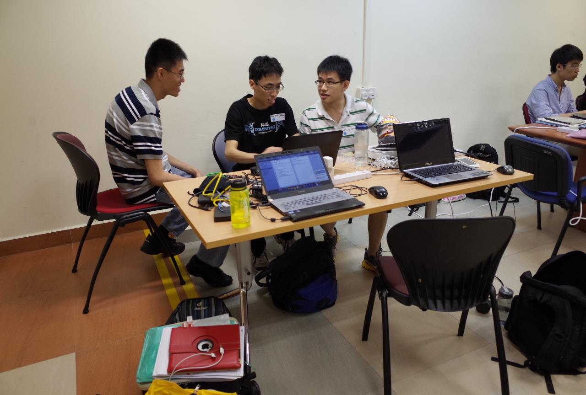

NUS Hackers tried to encourage participants to write a blog post or on social media about their experiences in the HacknRoll 2014, so here it is.  Nah, I would have written this anyway without their encouragement. But after they read what I wrote, I wonder if they would still share it.

So this hackathon which was on 25-26 Jan was the second one I had attended. You can read up about my first one [here](/2013/02/my-experience-nus-hackroll-2013).  Although this time, instead of being “drafted” into a team by an acquaintance, I was the one who asked a few people if they willing to join my team.

The idea we agreed to work on was the iOS version of the SoC print app. I first started on the Android version of that app nearly one year ago. From that point up to now, several  SoC friends have asked me for an iOS version. As I did not have a Mac, an iOS device or knowledge of Objective-C, there was no way for me to pick up iOS programming much less write an iOS app. Fast forward 10 months later, I’m in CS3217 with basic knowledge of Objective-C, have a Mac and a CS3217 rental iPad,  I have the tools to do so now.

I have several peeves with the way this hackathon was organised compared to last year but I shall leave that to the later part of this article. 

So here is my team in planning/discussion/problem solving  when we were “shot”. From left, Kaiyao, myself and Yong Quan. Both of them were also the beta testers for my Android app.



Our project video. Narration was done by Yong Quan. (Try to view in HD if possible)
<!--more-->
Just like last time, my first official Android app was written in a Hackathon. Now my first functional iOS app was also written in a hackathon.  I wrote then that “Some say, if you too lazy to pick up a programming language/framework, work on the right project in the hackathon to do so”. It came true for me once again.

So what happens to that app now? It may seem the app is operational from the video. It is true it does what it does, but that is just for the sake of a demo. As expected of Hackathon quality code, it is messy, follows no reasonable software engineering practices and is buggy. Furthermore unlike the Android Play Store, Apple places restrictions on the quality of an app before it is allowed up on the App Store. Since my team members are not keen to continue it, it may take me a couple of months to get it to the required standard considering my hectic schedule. It also costs USD$99/year for the developer account so I will not upload unless I’m really sure.

So here comes my peeves. 

**1\. Wrong timing.**

The hackathon last year was held at the start of recess week. That in my opinion is the best time to hold one. There was time to rest after the hackathon and homework can still be completed. This time, it was held just before the start of tutorial week which I think is the worst possible time. I had to rush my CS3217 problem set and even had to complete part of it during the hackathon itself. One of my modules also had a new tutorial uploaded on Friday evening to be prepared for on Monday morning!  If it has to be held early in the semester, one week earlier would have been better.

**2\. Prizes.**

The first prize last year was a trip to Silicon Valley to Palantir offices (main sponsor). Subsequent prizes included a Quadrocopter and other unique prizes. This year though, mostly gaming peripherals and pebble watches. Not that I would decline them if I won those prizes, the issue I have with those is that most people who would want them could afford and would buy them already. Even if those prizes cost more than a Quadrocopter (I heard it cost SGD$450), you normally won’t go out and buy a Quadrocopter. It is what makes it unique and cool prize.

There was a clear lack of spot prizes, there were only 2 spot prizes this time, best freshmen and most voted award. Last year I remembered there a few more including a “most useless” project. With more teams this time and less prizes, I think many teams would go back disappointed. It would be nice to give everyone a token of appreciation for their efforts. It can be small, like the Razer Goliath mousepad in the top prizes, but it will serve as a souvenir of your effort and keep people coming back.

The prizes are also reserved on a basis of a 4-man team. If a winning team has only 3 or less members, why not give out the remaining prizes as spot prizes? I think it’s also better that a team should not win more than one set of prizes, if it already gotten the top prizes then so be it lah, not like the spot prizes will increase their utility compared to the benefits of another happier team and a higher chance to attract people back next year.

**3\. Judging.**

All teams last year who wanted to pitch their project to the judges were given the opportunity to do so. If I remember correctly then, each team was given 7 minutes to present and 3 minutes to answer questions. This time, only the 5 selected teams can present but are given only 5 and 2 minutes respectively which has clearly shown to be not enough by the questions posed to them by the judges.  The selection of these 5 teams was based solely on a video and a short writeup. I did not go into this hackathon with desire to win although a spot prize would have been nice. There was no way this simple idea could do so. What I believe is that teams wouldn’t mind to have their projects validated in front of 3 people experienced in the tech industry. Who knows, what extra insight we could gain?

Will I attend the hackathon next year? Probably yes if I have the time and an idea. Not entirely for the prizes, but for the environment. I would especially like to thank Vishnu for his help.  He assisted us in minutes what hours of Googling could not help us. Without him, we would probably have wasted a few more hours or even not completed the app. Despite my annoyances with how this hackathon was organised, the fact that they could get so many people is testament to the hard work of NUS Hackers. I do not see the above 3 peeves as complaints that only existed this time. The issue of the a team should not win another spot prize if they have gotten a top prize already also existed last year. What I see are potential improvements to how a better organised hackathon can potentially make more teams happier and attract more people back in future.
