I recently got a new Casio Protrek triple-sensor watch. This watch model [PRW3000-2](http://www.casio.com/products/Watches/PRO_TREK/PRW3000-2) was released in 2013 featuring Casio's new "Triple Sensor Version 3 engine" which is better than my previous fatter and heavier [PAG-80](http://www.casio.com/products/archive/Watches/PRO_TREK/PAG80T-7V/). Not forgetting that it is solar-powered too meaning I will never have to change the battery in the usable lifespan of this watch! Ever since I got my PAG-80, my "OCD self" cannot live without knowing that I can measure the attitude, compass heading and temperature of the surroundings. So this PRW3000-2 is the next in the upgrade path.

I like the colour green, and the only green version available is in the negative display where the numbers are set against a dark background. Contrast that to the more typical positive display where the numbers are set against a white background like most calculators. As I did not own a watch with a negative display in the past, I thought it shouldn't be an issue. Turns out it is HUGE one, take a look at the picture below.

[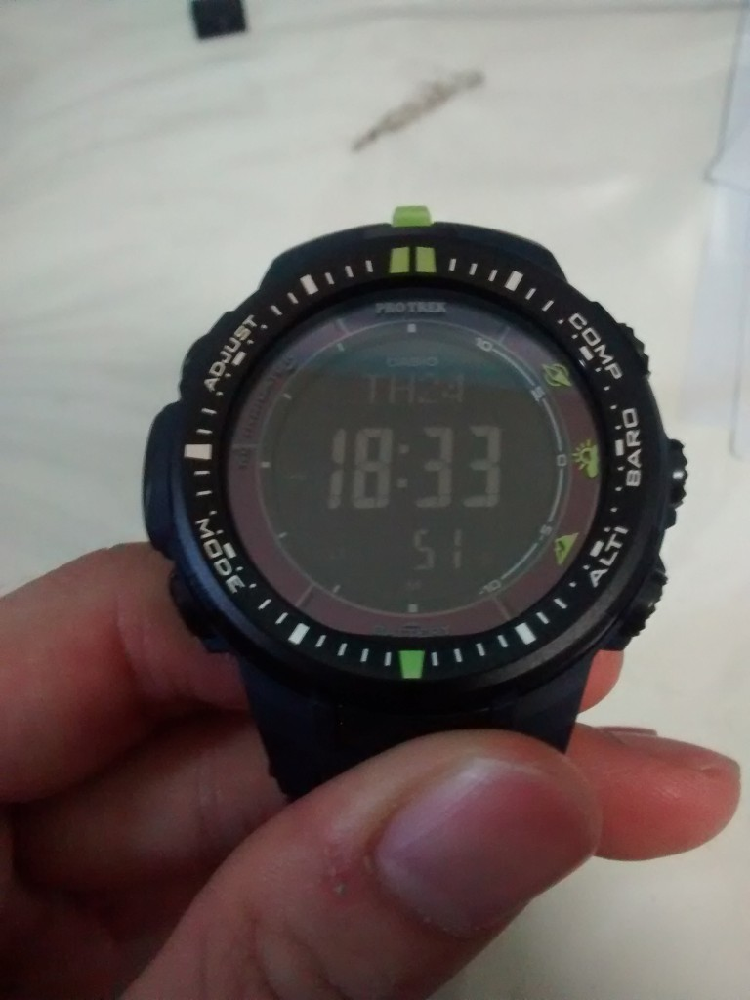]images/2014-07-24-18.33.49.jpg)
<!--more-->
Under a bright ambient light, it is legible. But when the surroundings become slightly dimmer, the display becomes hard to read without the help of the backlight. It was a rather troublesome affair for me to keep pressing the light button under slightly-dim environments. This [link](http://www.stefanv.com/watches/why-negative-lcds-are-so-hard-to-read.html) explains the issue.

I Googled for a possible solution and I found this [instructables tutorial](http://www.instructables.com/id/How-to-convert-a-plain-G-Shock-DW-5600-to-a-negati/). It is about converting a positive display to a negative display just by turning the polarising filter by 90 degrees. Me doing the reverse should achieve a similar result right? I decided to try out at the risk of damaging my "not-cheap" watch, but hey, no risk no gain.

[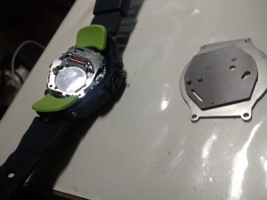](images/2014-07-24-19.09.19.jpg)

So out comes the backplate and the inner rubber back. The 4 corner screws of the backplate are hidden behind the green strap.

[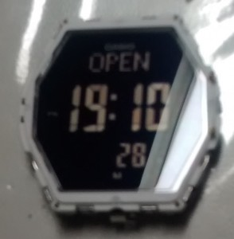](images/2014-07-24-19.10.26.jpg)

So there you are, the innards of the watch. The display shows the word "Open". Nice. Notice the diagonal line near the bottom-right edge of the display? It indicates that the polarising filter is stuck on the display itself. I used a sharp tip to carefully pry it out.

[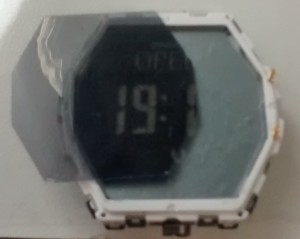](images/2014-07-24-19.19.40.jpg)

Without the filter, the display is invisible to the naked eye.

The filter is glued firmly to the display so it is hard work to remove. The removal process also leaves a lot of adhesive residue which is hard to clean off but it has to be done or it will obscure the display.

[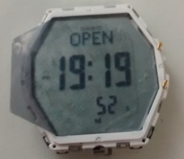](images/2014-07-24-19.19.50.jpg)

Turning the filter by 90 degrees is the proof-of-concept. Now to put everything back!

[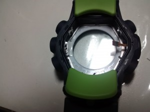](images/2014-07-24-21.00.36.jpg)

Since the shape of the 90-degree-turned filter precludes me from just sticking it back to the display, I thought why not just stick to the case instead? So out comes my trusty double-sided tape! A small patch goes to the middle left.

[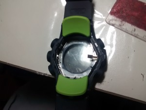](images/2014-07-24-21.03.38.jpg)

And in goes the filter.

[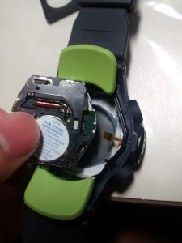](images/2014-07-24-21.09.19.jpg)

Next is the board itself. Not forgetting to connect the tiny cable to the external sensor.

[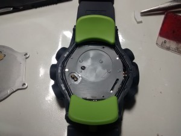](images/2014-07-24-21.15.06.jpg)

Putting in the rubber back first. Ensuring that the edge clips hold it in place.

[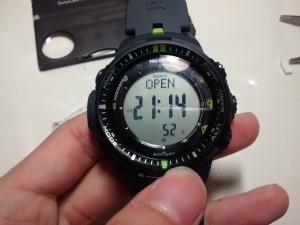](images/2014-07-24-21.14.50.jpg)

One final double check before closing the back.

[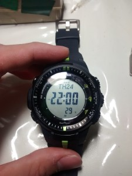](images/2014-07-24-22.00.27.jpg)

Done! Looks easy right? It always does from pictures but the reality is never so. It is my first time opening a watch to such a depth so I took about 3 hours for the whole process including the cleaning of the residue which took up half the time.

My PRW-3000-2 is probably the only one in the world with a positive display! Cheers to myself and an easier to read watch!
