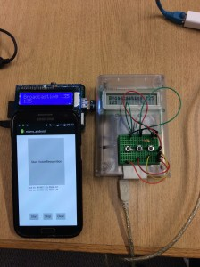
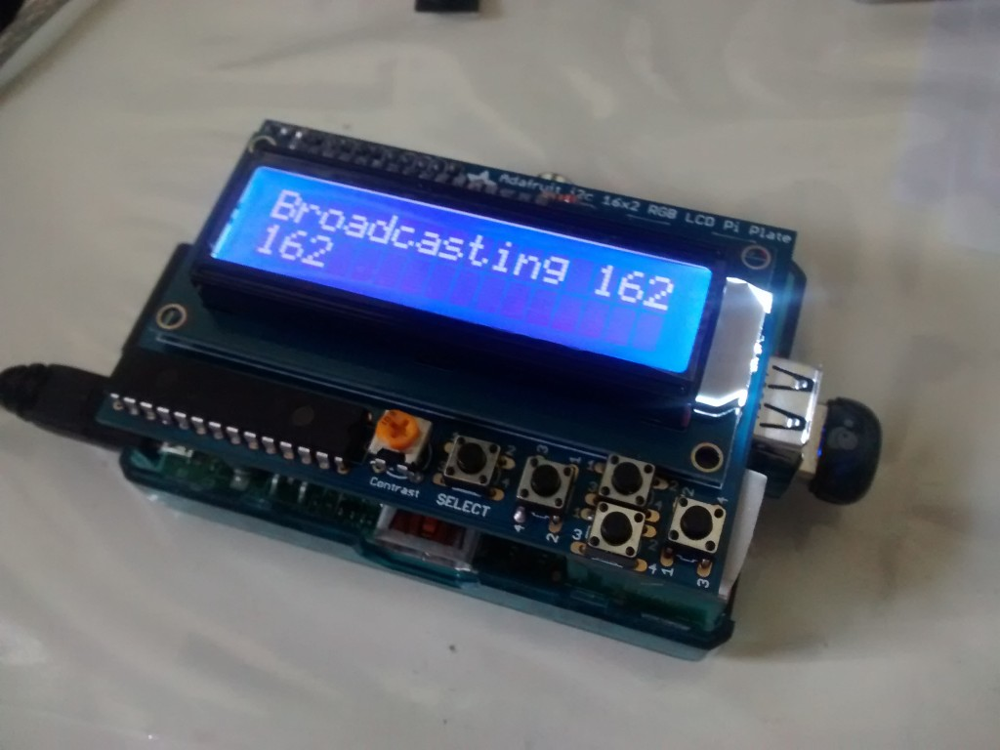
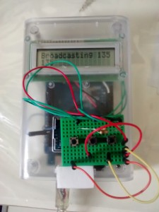
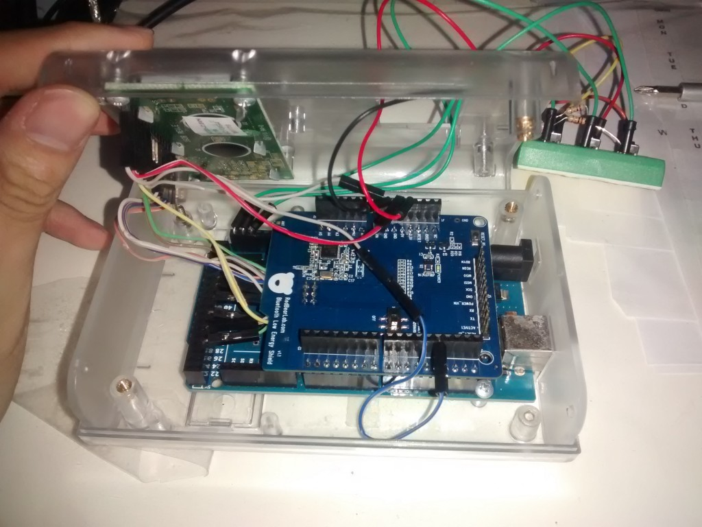
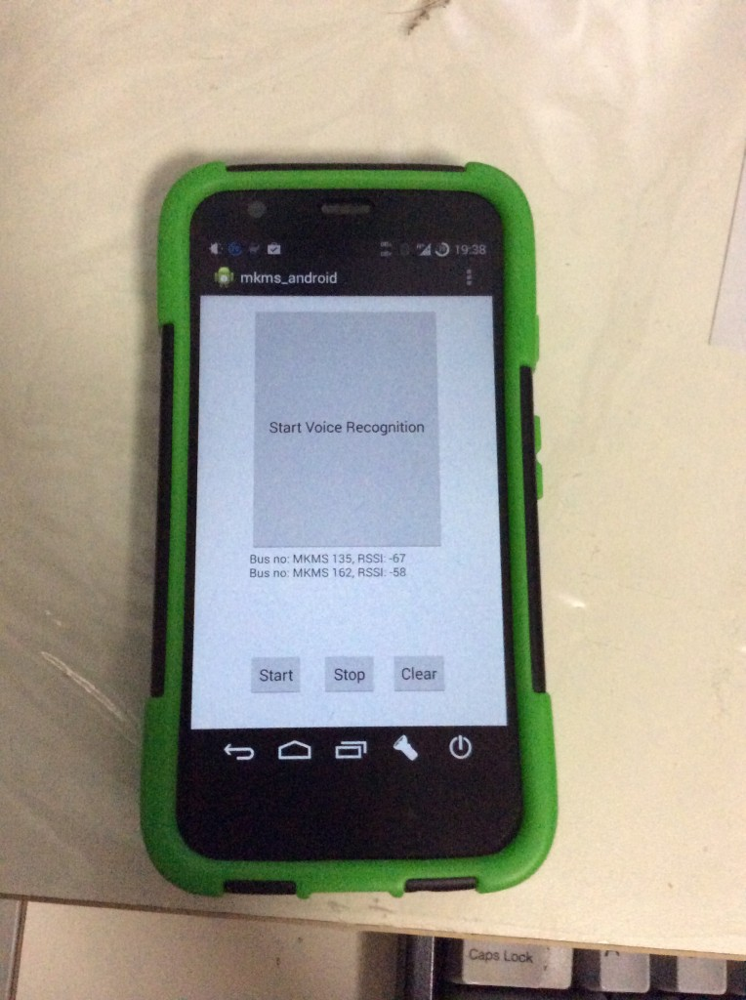
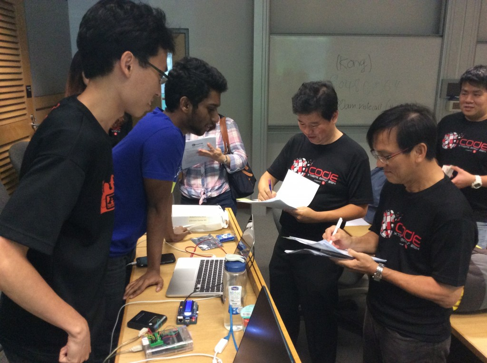

This is the third hackathon I have joined and the first that involves hardware. Although my team was not selected to go for the next round of judging, I'm glad to have learned alot during this IDA-organised XtremeApps hackathon held at SMU.

My team comprising Muneer, Sathish and myself brainstormed on the first day for ideas based on the themes given. We decided to build something to help the visually-impaired identify buses when they are at the bus stop. We came up with this idea when we remembered that the visually-impaired had to stop every bus to ask the driver for the number if no one was around or constantly question the people around him. Wouldn't it be a good thing if we could automate this tiresome process?

Although we did not have the opportunity to ask them if such a device would be useful, we felt it was worth a try anyway. The tool we thought of was for a device to be permanently attached to the buses. This device will permanently broadcast the bus number when it is turned on. Whenever the buses approach the bus stop, a phone application which we have written will sense the proximity of this device via the broadcast and verbally read out the bus number to the visually-impaired.

The main technology used to sense the proximity was Bluetooth Low Energy (BLE) for its connectionless nature, minimal power consumption and yet have reasonable warning range of about 30 metres. The tool should also have a simple hardware interface to allow bus numbers to be easily changed by the driver. This is so as bus companies don't always use the same buses for a particular bus route.

(Click the pictures for a larger view)

Our end result! 2 independent devices powered by a Raspberry Pi and an Arduino with the companion Android app. A similar app can be written for the iPhone too but this is just a proof-of-concept and Android presents a lower learning curve. For this hackathon, Sathish and Muneer worked primarily on the phone app while I did the Raspberry Pi. Muneer and I jointly worked on the Arduino.

**Raspberry Pi broadcaster**

I initially started with the Raspberry Pi as I was more familiar with using BLE on the Raspberry Pi in the course of my internship. Hardware used

1. Raspberry Pi Model B
2. [Adafruit RGB LCD Pi Plate with monochrome LCD](https://www.adafruit.com/product/1115)
3. Bluetooth 4.0 USB adapter

The software stack used is a mixture of Python and Node.js. Python was used to control the Pi Plate as the software library provided by Adafruit is in Python. Node.js in conjunction with the bleno module was used to control the BLE aspect. This was the case as bleno is the more established library compared to what was available on Python.

To reconcile the two languages, I first started our Python app to display the LCD and listen to button presses. The Python app than launches our Node.js app providing a command line argument containing the bus number to broadcast. Whenever the number changes, our Python app will restart Node.js with the new bus number.

**Arduino broadcaster**

I finished with the Raspberry Pi "rather quickly". I thought, with the extra time, might as well try an Arduino solution since the Raspberry Pi is quite an overkill and it would be better to demo with 2 devices to simulate 2 buses.

Parts used

1. Arduino Mega 2560 R3
2. [RedbearLab's BLE shield v1.1](http://redbearlab.com/bleshield/) based on Nordic NRF8001 chipset
3. LCD based on Hitachi HD44780 LCD controller
4. 3x button switches
5. 3x 10kohm pull-down resistors

This was my first time using this BLE shield so I did not know what to expect. I initially wanted to try using the Arduino Uno with the BLE shield coupled with an I2c-based 1.3 inch [Adafruit OLED](https://www.adafruit.com/products/938). However, the BLE libraries given by the shield seems to conflict with the Adafruit libraries so we had to swap the Adafruit OLED display with a more traditional HD44780 parallel display. The issue with the HD44780 display is that it requires **lots** of pins/wires as you can see from the picture. With the BLE shield taking up precious pins as well, we were left with no choice but to use the Arduino Mega if we wanted to connect the additional buttons.

With Muneer's help, we finally managed to get it working. The Arduino broadcaster works much better than the Raspberry Pi one. It starts immediately and bus numbers can be adjusted instantly. It looks more messy though but it works. We have our second bus!

**Phone receiver and voice announcer**

The app written by Sathish and Muneer will receive the BLE broadcast and read out the bus numbers. The app starts on boot and can be operated both by button press and voice as a proof-of-concept. It uses the relatively new Android 4.3 BLE APIs so it means it will only work on newer Android devices. Speech recognition and text-to-speech features both use the native Android APIs.

**Judging Time: Questions and Answers** 

1. Bluetooth interference: We cannot test this within the Hackathon time frame but we are not using BLE to connect. Just one way broadcasting so chances of interference is reduced.
2. Range? About 30 meters based on adhoc within the building tests.
3. Connection drops, my Fitbit everytime got connection problems? Again, we do not establish a connection between the phone and the device so this is a non-issue. Our device broadcasts and the phone receives.
4. Multiple clients? BLE broadcast is a one-to-many relationship so many phones can listen in at the same time.

I got the skeptical vibe from the judges as they seemed to be locked to the way traditional classic Bluetooth works. Then again, I will never know and there wasn't much time to explain to them how BLE works. Our device functions closer to an iBeacon which just broadcasts unlike the Fitbit but I was too tired to mention this point.

Suggestion: Range may not be enough, augment with online Bus arrival data. One of the judges raised the point that the LTA API key was provided in the hackathon. I was again too tired to think of a proper answer.

I would have said that bus arrival times is only available through SBS Transit and their APIs are locked down to only selected pre-approved developers. Besides, the bus arrival data does not have the precision required of our app. Very common, we see several buses "Arriving" but it takes about a minute or so to arrive.

**Here are my suggested improvements: **

1\. Food: The food is edible but not what I would have expected for a hackathon based on my experiences of those organised by NUS Hackers. The food is the traditional 4-meals in packed style, rice and beehoon which is ok for a main meal. What was lacking was junk food like snacks and drinks to power us through the night. NUS Hackers are famed for their pizzas which was something I look forward to.

2\. Allow contestants to go home and return: The rules were very strict. Everyone has to report by 7pm or be disqualified. You cannot leave the premises unless you don't want to return. We faced this problem as Sathish wasn't feeling well and needed to go home and rest. He was told that if he did so, he cannot come back to the Hackathon the next day even for the judging. It was sad to see Sathish leave and we understood as his health was the priority. Eventually they allowed us to leave but only 10-15mins at one go. Unlike NUS Hackers where at least one team member has to be around throughout.

3\. Soldering stations, outside lights too dim: I thought for a hardware hackathon, locations for soldering would be provided for. Though not forbidden, I felt it was unethical to do soldering in the enclosed air-conditioned room so I I went outside. At night and during the holiday period, the lights outside seemed to be in power-saving mode where most of them were off. The student helper told me he did not know how to turn on all the lights so I was left to solder in a dark area.

4\. Include bins of parts like wires: Though not within their obligation and the organisers clearly stated that you have to bring everything you want to use, it would help greatly if some basic components like LEDs, breadboards and wires were provided in case we were short of such stuff.

5\. Level playing field: A friend of mine brought this up. Teams who could afford more had the advantage. Some teams even came in with a finished product which I felt was against the spirit of the hackathon. My suggestion is that perhaps to limit the use to Arduino Uno or Raspberry Pi and no other microprocessors or microcontrollers. Parts wise maybe limited to $100 based on receipts for teams that make it to the finals since an affordable solution is desired.

**Conclusion:**

I was happy with this hackathon in general. I got to see what interesting projects others did. Baring a few peeves, I wouldn't mind coming again for a hackathon organised by IDA. Just as with my previous hackathons,  I did not come here with the intention to win. I wanted to have an opportunity to encourage me to learn more than usual by forcing the pressure of time. Sathish and Muneer made very capable and motivated partners. Sathish despite being ill, contributed the best he can before he left.

It was kinda funny though our roles were reversed, Muneer being from Computer Engineering did most of the phone app but I from Computer Science did most of the hardware. Moral of the story: Never be constrained by what your degree says.

The code written in this hackathon is available on Github [here](https://github.com/yeokm1/bus-number-reader).
