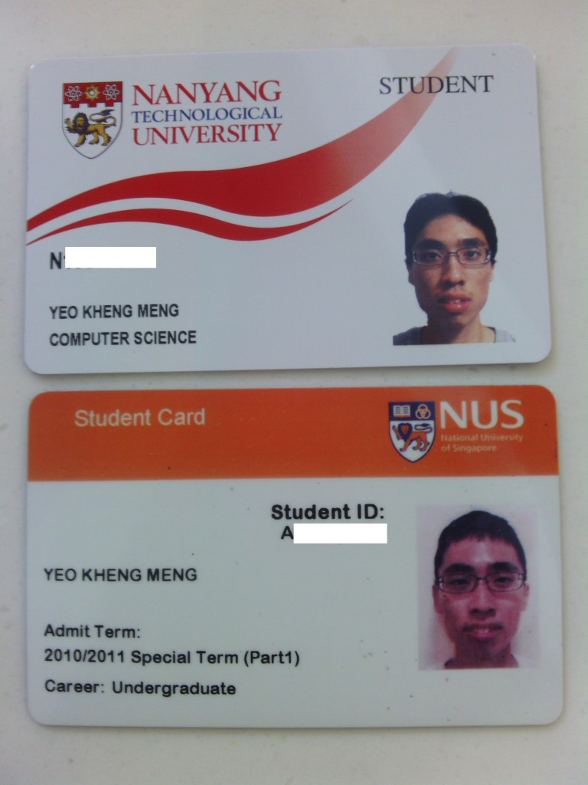
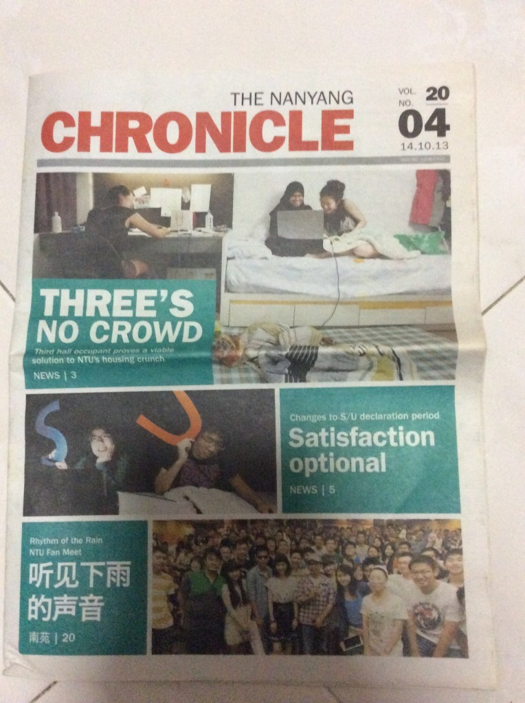
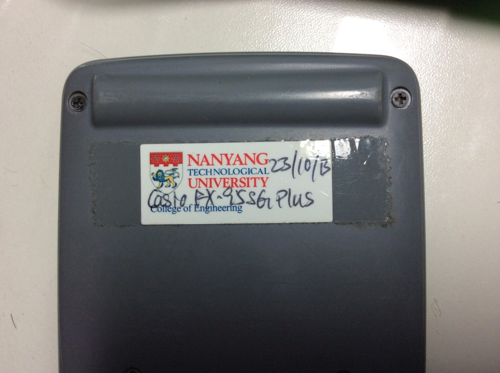
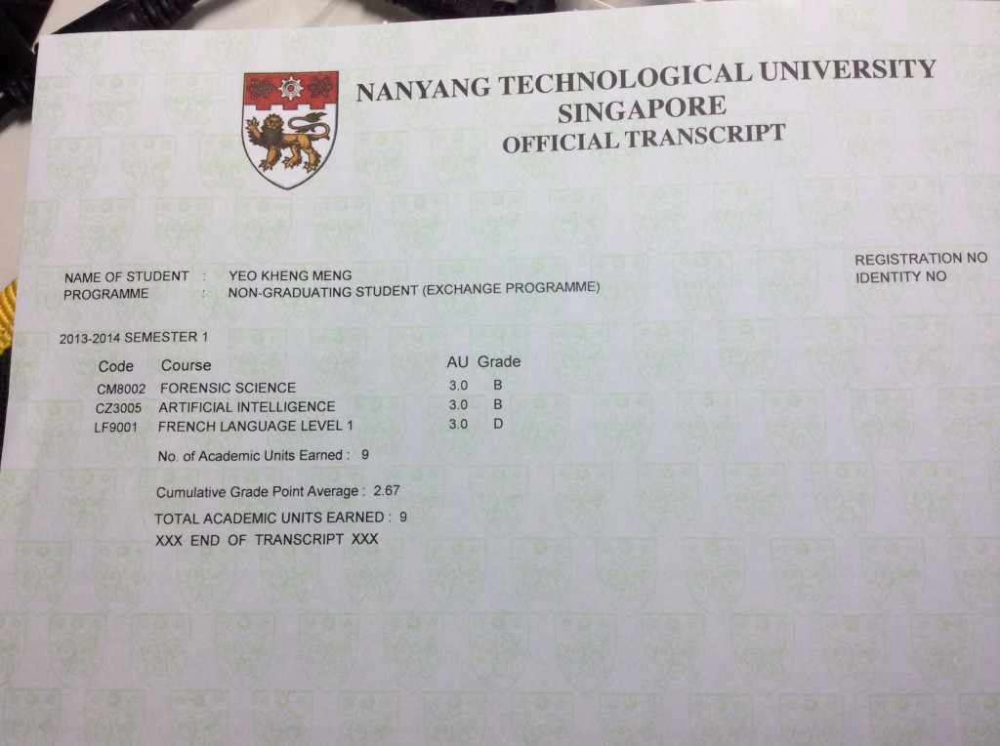

This post is more than one semester late but better late than never. So minor disclaimer, my experience is at least half year out of date by the time you read this post.

Every semester, 20 lucky students from NUS will get to go for a local exchange (both full and partial inclusive) to SMU and NTU respectively.  School of Computing is awarded a measly quota of only TWO but I guess that is proportionate to our student population.

I was one of the two in SoC to go for the NTU partial exchange from August to December 2013, AY 2013/2014 Sem 1. A partial exchange is a unique programme for only local exchange students obviously. Unlike a full exchange, I took modules concurrently at both NTU and NUS. I had to do this as I had an un-mappable core module CS3216 that had to be taken in that particular semester.

<!--more-->
For completeness, I think people are curious to know why I chose a local exchange? The official reasons I put onto the application form were

_“To expose myself to the different teaching environment in another university. The opportunity to meet new people to gain new perspectives is also useful for personal development. Other than for myself, I can allow NTU students themselves to obtain different perspectives I may have gained in NUS.”_

My unofficial reason: Can S/U modules while retaining the advantage of staying in Singapore.

I’m ashamed to say that I did not enjoy the “full” exchange experience as CS3216 was a rather heavy module that took most of my time away. This is something I regretted actually, things like possible CCAs, the numerous canteens etc. My experience will thus be rather academic in nature.

So I concurrently took 3 modules in NTU and 2 modules in NUS. The 3 mods were 1.    CZ3005 Intro to Artificial Intelligence 2.    CM8002 Forensic Science 3.    LF9001 French Level 1

No online timetable builder will ever support a fringe case like a local partial exchange student. So I just copy and pasted stuff from the respective online builders.  My Mondays are the worst 9-11am at NUS, go to NTU and stay till 5.30pm then rush back to NUS by 6.30pm for CS3216.

Traveling to NTU is a whole new different ball game compared to NUS. Going to NUS requires me to take a bus, the NS Line, then the Circle Line. Going to NTU, take the above plus the EW Line then shuttle bus then a mandatory long walk to classes. I'm already tired by the time I step off the shuttle bus, so my salutes go to the NTU students who don't stay in the halls.

**Online:**

The module selection system in NTU, STARS, is based largely on luck where you choose and pray unlike the NUS CORS bid points system. You have to opt for your lecture and tutorial slot together unlike NUS where you pick your lecture slot in an earlier round then the tutorial slot later. I actually prefer NTU's style as it eliminates any uncertainty that you may not get that sole tutorial slot after that.

I really hated the web interface of STARS though. In order to choose a particular lecture/tutorial combination, you have to look up its associated serial number from a list and input that into a ranked list of priorities. Totally non-intuitive especially for a first time user. NUS CORS shows you the exact date and time of the slots you are choosing.

Edventure, the equivalent of IVLE in NUS is the site to get all your notes. This site is not too bad though. However, I dislike the part where you have to click the module name and enter another page before you get to download notes. You can get your IVLE module’s workbin the moment you login.

Webcasts. NTU’s LTs at least those in the North Spine seemed rather well-equipped. Every LT is webcast by default regardless of class size. CZ3005 had only about 25 students yet it is webcasted. This is unlike NUS where only module intakes above 200 qualify for webcasts.

NTU has less spam in the university email account. I’m not sure why or is it because I’m an exchange student. I hardly ever get emails other than those related to the modules I’m taking.  This is not the same for NUS where we get spammed like mad from the university-wide to faculty level. The only emails that can remotely be classified as "spam" in NTU are the occasional Campus-Buzz emails.

The [NTU's campus map](http://maps.ntu.edu.sg/maps) is something I have to give credit for. It is very powerful and intuitive. You can even search up to the location of tutorial rooms, something which cannot be done for NUS.

**Timetable:**

The timetable generally starts on a half-hour offset. For NUS, barring some exceptions, a typical lesson usually starts at 9 or 10am. Many NTU lessons start as early as 8.30am.

Many lectures from College of Engineering (Computer Science is under Engineering in NTU) are broken down to 2 1-hour slots per week instead of 1 2-hour slot in NUS.  I personally prefer the NUS one. After all, less time is wasted for students coming in late from a previous class or having to leave which brings to the next point.

**School layout:**

Although NTU is big if you consider the halls, the main areas are small and dense. The only shuttle buses you need to take are if you either want to go to the halls on the outskirts or to the MRT. The rest of the time you just walk.

I initially had a back-to-back lesson where one was at LT3 and the other was at LT13. This seems really far apart if you are in NUS but in reality, it is just the next block across the giant centre aisle in NTU. You see NTU is largely divided into North and South spines. In each spine, there are 2 long parallel buildings. The bottom 2 floors are usually the lecture theatres (LT) and the upper floors are the tutorial rooms. Faculty buildings containing any extra labs and rooms extend perpendicularly from the spines.

The reality is that even if your lessons are back-to-back, you can actually “run” to your next class even if they are at different spines and you still get there without being uncomfortably late. Try doing that for NUS if your lessons are back-to-back at Science and Computing as I have personally experienced. As I was a rather new student, I kept getting lost even weeks into the semester. The problem was that the buildings are really consistent, too consistent in fact that I have to count how many rooms, LTs or staircases I have to pass by before I get to my destination.

The university layout seems too uniform and factory like. Don’t shoot me for this, students I met there all said the same thing. Halls are named numerically unlike NUS which prescribes unique names to each one. NUS has many small faculty-level canteens. Except for the hall canteens, NTU has just two gigantic ones just called A and B. Even within the canteens, you have a central cutlery collection area shared by many stalls. Everything seems to be geared towards efficiency.

Thankfully this is only one semester, I’m spoilt by the “changing landscapes” of NUS whenever I need to travel between faculties. Although I hate the squeeze on our shuttle buses, at the least the changing surroundings give me some variety to look at.

The tutorial rooms in NTU are very well-equipped compared to NUS. Almost every one of the TRs in the North Spine comprised of 8 tables with a dedicated VGA input and projector. This means there are about 8 projectors in the room with a document camera for the teaching assistant. Every student can present at his table and have his slides projected to every other projector. Just wow!

**Newsletter**

This is not really important but I do regularly read the NUS's campus newsletter known as The Ridge. NTU's equivalent is the Nanyang Chronicle (NC). Just like the Ridge, few students read the NC as evidenced by the untouched piles everywhere.

I still have this old issue with me. Here they are talking about their recently modified S/U system where they can S/U after the exams but before the results whereas they have to S/U before their exams in the past.  Just for the record, many NTU students adore the NUS post-results S/U system. So lucky to be in NUS.

The unique thing about the NC is that several pages in it are dedicated towards articles in Mandarin. An acknowledgement perhaps towards their heritage unlike the historically English-oriented NUS.

**Computer Science Program:**

Unlike NUS where we have lots of freedom to arrange our CS modules, NTU's (CSC\*) program seems to be more rigid. You have an expected schedule of modules to take. Only your Year 4 Technical elective modules have room for some specialisation and variety. This causes the professor to reasonably assume that you should have all the Math Linear Algebra and Statistics skills by the time you reach Year 3 which may not be always true for a Year 3 NUS CS student.

\*NTU uses the CSC acronym to represent Computer Science

This may seem like a disadvantage but it may not be so clear cut. For example, according to their [curriculum structure](http://sce.ntu.edu.sg/CURRENTSTUDENTS/UNDERGRADUATE/Pages/CS.aspx), a CSC student has to take intro to Artificial Intelligence, Computer Graphics, Database and Compiler modules. All these are optional for NUS CS students depending on which focus area you are aiming for. The NTU CSC curriculum forces students to be basic all-rounders which is not at all a bad thing actually.

Otherwise, the variety of Computer Science modules seems to be a lot lesser, probably because you only have more freedom in the Year 4 Technical electives.

**CZ3005: Intro to Artificial Intelligence**

This mod is quite straightforward. I wouldn’t say it is downright easy but it wasn’t too hard either. I mapped this module back to NUS as CS3243 of the same title. The class was small but I was damn badass on my first day of tutorial. When the professor realised I was an NUS student, he asked me why I came to NTU, and didn't NUS have this module as well? I just blatantly told the entire class verbatim “Because come here can S/U my modules” to the envy of the entire class.

Thereafter, I’m think I must have tarnished NUS’s image many times over. I just skipped his lectures and don’t do tutorials etc. I skipped so much that once I went for a lab session that he informed was actually not meant for us in an earlier lecture. Damn paiseh. Come to think of it, I will never know what I missed by skipping his lectures. It was very regrettable now.

**CM8002: Forensic Science**

The equivalent of this in NUS is GEK1542 although I mapped it back as a Science Gem. CM8002 is one of the mods that are restricted for exchange students, meaning that native NTU students have priority. Nevertheless, I chose it in an advance round for exchange students and I got it! Inside the STARS “lottery” system, I really feel sorry for the 5000 plus NTU students waiting for a limited chance to get the double-digit free spaces.

This mod was rather slack and was one of the few to be held in the 2-level Nanyang Auditorium, the largest lecture hall in NTU. No other LT in NUS comes close except for the University Cultural Centre which is not used as an LT in the first place.

No tutorials or labs, just attend a weekly 3-hour lecture on Wednesdays. Even that I skipped it half the time. Considering that the lectures are not webcasted, I actually lost out in learning a lot of interesting stuff. I did study the lecture notes before the final exam and I realised gosh, how interesting those lectures would have been if I attended them.

My seat number for the exam is 1185, implying the intake size of this module. Can any NUS module match this size?  I was seated at the last of this mod for the exams, exchange students at the back plus local exchange at the back still. I cannot forget the moment when I decided to leave the exam hall 40 minutes ahead of schedule to prepare for my NUS exam the next day. The shocked faces of the NTU students are one I will remember for a long time.

**LF9001: French Level 1**

I deliberately took this mod on exchange for S/U purposes and I got a big fat D to show for it. I have no flair for languages but I just took it for fun. It was really nice to use another language for awhile.

Taking French has actually made me realise that English is a rather laid-back language. French has genders attached to each noun including countries and objects and this actually forms the core of the language. Except for countries, gender-assignments have no logic attached to them, one has to memorise by hard. A wrong gender will affect the adjective and even the greetings you use for a person.

The accents were almost impossible for me to master. The number system changes slightly when you hit above 70. Oral tones of one word flow to the next unlike English where we generally read word for word.

I had an oral test partner where we had to perform a graded skit with. If I were in her shoes, I feel like what the hell partner with an exchange student who can S/U this mod by default. YL, I really apologise for my poor performance. I was really busy this Sem with my heavy NUS modules.

Although I cannot speak or understand a word of French now, taking another language with a certain semblance to English really opened my world into the understanding of languages. English and Mandarin may be the two most common languages in the world but they may not be the most elegant. French is known to be a romance and beautiful language, sad that I did not put in the effort to study it.

A note for mapping NTU language modules to NUS. NUS's language department seems to think that NTU's language mods are worth less by virtue of their lesser lesson hours so they are only worth 3MCs when mapped back. This is unlike the full 4MCs I got for the other mods and yet French had the heaviest workload of them all.

**Final Exams:**

The final exams are conducted similarly to NUS in sporting or any large enclosed areas. Usually before the exams in NUS, the chief invigilator goes to the mic and reads out instructions like no unauthorised materials and consequences of cheating so-and-so. In NTU, they played this as a recording on the speaker over and over. On my first exam, I actually thought it was an invigilator speaking. Only until the second exam did I realise it was just a recording. Epic noob!

During the CZ3005 exam, I saw a student just left her phone on the table. I raised it to her to keep it but she just said turned off can already. I got this epic shock, like what, handphone on the table, no way in NUS. Many invigilators walked past without issue so I guessed it is normal. Anyone care to enlighten me?

Another issue I don't get is that any calculators used in the final exam have to be pasted with this approval sticker. It is a one time thing but something that could trip up exchange students who have not been through the typical orientations.

**Epilogue:** Although exchange modules are S/U, I could have paid more attention to my classes and not pon so much. So much knowledge I have lost for good and an exchange experience wasted. Gosh.

Have to thank my JC friend YC Yellow for showing me around NTU. The "hidden" lift you introduced to me between the North and South Spine is one that I wound up taking every time when I was in NTU. I would not discovered it so early otherwise. You also suggested that I walk further down to wait at a different less-crowded shuttle bus stop rather than the typical one at the Admin building. This is also something I would do every single time when I was in NTU. Also like to thank my army friend Oon for advising me about the module selection process.

I miss the queuing ritual with other NTU students for the MRT shuttle bus at the Pioneer station, reminds me of waiting at the Kent Ridge MRT except the frequency is a lot better at NTU even at non-peak hours. Something NUS should learn from.

If I have to do it all over again, I would probably have chosen SMU. NTU is much too similar to NUS. If I still chose NTU, I should have probably done more stuff and taken some pictures.

Right now, my transcript is the only thing I have left to show for my experience. The Bs are not bad for something I did not study much. The D is shameful. Thankfully, all the mods are S/U, my official NUS transcript will not show them.

Fun fact when I’m in NTU, I regularly wore the NUS computing shirt to troll the NTU students. I got stopped a few times by some curious NTU students. Muahahaha. The NTU mid-term break is also one week behind NUS so in essence, I had a half-half 2-week mid-term break. It was messed up for me during that period to remember which classes I had to go or not.

Anyway I tried applying for SMU exchange but I received a personal call from the SoC administration office that I was actually barred from taking another local exchange. Damn.

Overall, it was an interesting experience to see how things are done in our two local universities and made me more appreciative about the things I took for granted at NUS. Even though NUS is ranked higher than NTU by most indicators, we can see that it does not mean NTU is totally inferior in every way. Going for a local exchange has shown me that NUS has its own imperfections too.

This experience is by no means complete compared to a full 4-year programme. I could have make some incorrect impressions or let my NUS life cloud my judgement so feel free correct me if I have made a mistake.
