The apps in question are active and can be downloaded from their respective app stores.

1. [Android Play Store](https://play.google.com/store/apps/details?id=com.yeokm1.nussocprintandroid) ([source code](https://github.com/yeokm1/nus-soc-print)) ([User and Developer Guide](https://github.com/yeokm1/nus-soc-print/raw/master/user-dev-guide/NUS%20SOC%20Print%20Dev%20Guide%20-%20Android.pdf))
2. [Apple App Store](https://itunes.apple.com/sg/app/id916524327) ([source code](https://github.com/yeokm1/nus-soc-print-ios/)) ([User and Developer Guide](https://github.com/yeokm1/nus-soc-print-ios/raw/master/user-dev-guide/NUS%20SOC%20Print%20Dev%20Guide%20-%20iOS.pdf))

This post is about 3000 words long as I wanted to go as in depth as much as possible to describe my experience in developing for both Android and iOS. If this length scares you already well I do not blame you, I tend to get long-winded in my reflections but I usually hope my readers learn and understand my underlying thought process behind certain decisions I made.

There should be something here for Android devs, iOS devs or people just interested to know the inner workings of my app or Sunfire.

<!--more-->

Printing stuff in NUS SoC has always been tedious as it requires one to have a laptop or use the lab computers to send the document. If one forgets his laptop and the labs are in use then GG. Our lab computers are also notoriously slow to login.

Facing the above problems around the time in February 2013, my friend Yong Quan and I joked about using our phones to send the print job instead. A quick Google uncovered the fact that our Unix system Sunfire has this [little-known feature](https://docs.comp.nus.edu.sg/node/1583) to use Unix commands to send ASCII or Postscript documents to the printers. ASCII is out of the question and no school document will ever be released in Postscript but at least the "API" is there.

As I'm an Android user with no Apple hardware initially, developing on the Android platform was the natural first choice although in the industry this is not usually the case.

Brief history:

- 12 March 2013: Initial Android version
- 28 Sept 2013: Published on Play Store
- 28 Jan 2014: Coded iOS version in [HacknRoll 2014](/2014/01/what-i-did-nus-hackroll-2014/) with iPad provided in CS3217
- 20 Sept 2014: Rewritten in Swift and published to App Store
- 23 Dec 2014: Further UI refinements to Android app

Quite a long journey I have here with this app of mine. A more complete history can be viewed in my app's Github releases page, [Android](https://github.com/yeokm1/nus-soc-print/releases) and [iOS](https://github.com/yeokm1/nus-soc-print-ios/releases).

## UI Overview

(You can click on the pictures to get a larger view)

My app running on different operating systems

[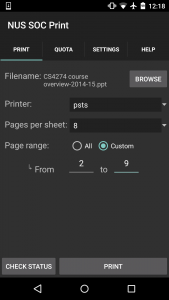](images/android-main.png)[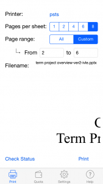](images/ios-main.png)

From left: Android 5.0 and iOS8

[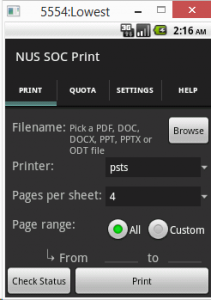](images/main-android-2.2.png)[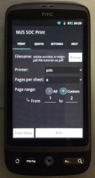](images/main-android-2.3.jpg)[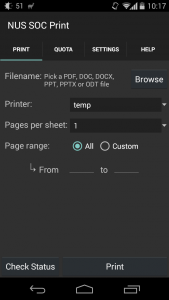](images/main-android4.4.png)

From left: Android 2.2 (emulator),  Android 2.3 (HTC Desire) and Android 4.4

## [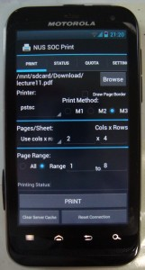](images/android-old-front.jpg)

This is the older version of my app prior to the Android "revamp"

The Android UI prior(third row) to this(top row) was extremely cluttered but no more. I have ensured UI consistency across both platforms as much as possible.

The Android version supports Android 2.1 and up, a nearly 5-year old OS. Although this level of OS support is overkill considering that the majority of SoC students who use Android phones carry modern ones, I chose to do it as a personal challenge. This caused several fragmentation issues when it came to testing for me. You can see above how the same app appears slightly different across all the Android versions.

I have to applaud Google in the area of backward compatibility as its AppCompat library brings non-native Fragments and ActionBar features to versions as old as Android 2.1. I previously used ActionBarSherlock on my initial Android version.

Regarding the browsing of file systems, I use the [aFileChooser](https://github.com/iPaulPro/aFileChooser) library as an integrated file explorer as I cannot be sure that all Android phones have their own file managers. Android 4.4 and above returns the activity result of a file selection in a slightly different format so one has to be careful. iOS apps are heavily sandboxed so my app has to rely on other apps to pass in the associated documents to use them.

Regarding file previews, I only have this feature for iOS. This is so as Android's integrated webview cannot open many types of documents unlike iOS and its features are heavily fragmented depending on the Android version. It may also be rather memory-heavy on old phones.

The iOS app is coded in Swift which was still in beta when I started coding on it. Code and API examples were scarce then and even till now. I supported the minimum OS which is iOS7 that caused some fragmentation issues too.

[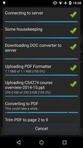](images/printing1.png)[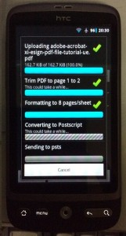]((images/printing-android-2.3jpg)[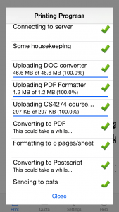](images/ios-printing.png)

The printing status is detailed and shows the progress as it goes. A detailed explanation for each step is at the later part of this post. Both apps open this window as a (pseudo) dialog/pop-up and both had issues. I have no idea why the progress bar is so fat on Android 2.x devices.

For Android, the Material Design tint of the AppCompat library somehow does not support Theme.Dialog. Hence, this particular window (Holo theme) appears as if it is from the Ice Cream Sandwich (4.0) era even though the phone is a Nexus 5 running Android 5.0. Running my app on pre-Honeycomb devices (3.0) will degrade gracefully to the older Android theme. This is done by specifying styles.xml in "values" and "value-v11" directories.

For the green tick and red X icon, I could have taken the easier way out by just dumping the pictures into the "drawable" folder and let Android scale it on runtime but this may be computationally expensive on older devices. I use [Android Asset Studio](http://romannurik.github.io/AndroidAssetStudio/) to generate the pictures at multiple dpi settings before saving them into the xxhdpi, xhdpi, hdpi, mdpi etc directories. The equivalent in iOS is the 1x, 2x and 3x assets. This is usually done only on production apps and not in school or prototype projects.

For iOS, checkout this Stackoverflow post on the [background darkening issue](http://stackoverflow.com/questions/16230700/display-uiviewcontroller-as-popup-in-iphone) between iOS7 and iOS8. The AlertView class was deprecated for AlertController in iOS8 so I have to do an if-else (See the showAlert() function in [code](https://github.com/yeokm1/nus-soc-print-ios/blob/master/NUS%20SOC%20Print/Constants.swift)). iOS is no different from Android if you want to support multiple OS versions.

[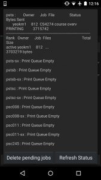](images/android-status.png) [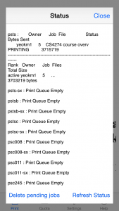](images/ios-status.png)

Status is accomplished by using the "lpq -P" and deletion with "lprm -P" commands. I just call these commands repeatedly with all the printers that I know. The output is the direct dump of the stdout result. I thought of parsing this result but since I do not know all the possible output formats, I might as well just show everything as-is.

An interesting observation with regard to the delete command is that it cannot cancel print jobs sent via the Samba account. It appears that if you send a print job via the typical SMB or Windows network printer, it is done as a similar yet somewhat different account. I'm not too sure the correct terms to phrase this so correct me if necessary. In essence, "lprm" will only work for print jobs sent via your own Sunfire account, not even for those sent via the usual NUSSTU domain.

[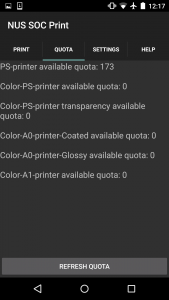](images/android-quota.png)

Quota code for [Android](https://github.com/yeokm1/nus-soc-print/blob/master/app/src/main/java/com/yeokm1/nussocprintandroid/fragments/QuotaFragment.java) and [iOS](https://github.com/yeokm1/nus-soc-print-ios/blob/master/NUS%20SOC%20Print/QuotaViewController.swift)

Many people believe I use the "pusage" command to get the quota. That was initially what I tried but for some reason, I received no output from pusage when I ran it using the SSH libraries on both Android and iOS. You can read more about pusage on Yong Jie's [blog](http://blog.yjwong.name/pusage-hacking/).

Initially, I just opened an integrated webview to [https://mysoc.nus.edu.sg/~eprint/forms/quota.php](https://mysoc.nus.edu.sg/~eprint/forms/quota.php). During [HacknRoll 2014](/2014/01/what-i-did-nus-hackroll-2014/), Kai Yao improved this to use a POST request to the above site then use a a regular expression to parse the HTML results for the quota. I later included this improvement on Android.

## **The Print Process**

So now we come to the beef of my application, the printing process. It takes up to 10 steps to print a single document and it took me months to finally settle with these steps so applauds to me :) .

You can follow this in code in this two classes. [Android code](https://github.com/yeokm1/nus-soc-print/blob/master/app/src/main/java/com/yeokm1/nussocprintandroid/print_activities/printing/PrintingActivity.java), [iOS Code](https://github.com/yeokm1/nus-soc-print-ios/blob/master/NUS%20SOC%20Print/PrintingViewController.swift). You will notice that both classes are very similar even up to the variable names speaking of the similarity in both Android and iOS development.

### Step 0: Connecting via SSH to Sunfire

Connecting to Sunfire via SSH obviously! Android uses the Jsch library while iOS uses NMSSH. The Jsch library causes crashes on phones with Android Runtime enabled (ART) as some of its class dependencies are missing in its JAR. For this reason, I have to include the entire source code and its dependencies in my app. Kudos to open source!

It was in my testing process that I found out Sunfire actually has a whitelist of IP address ranges that can connect to it. Nevertheless you will mostly likely use this app only when you are beside the school printer so it is fine but something to take note of if you try to print over mobile data.

### Step 1: Housekeeping

I create the "socPrint" folder in the user's home directory to cache the converters and store temporary conversion files. If this directory is already there, likely there are leftover temp files from the previous print job. Let's clear them.

_"find socPrint/-type f \\\\( \\\\! -name 'nup\_pdf.jar' \\\\) \\\\( \\\\! -name 'docs-to-pdf-converter-1.7.jar' \\\\) \\\\( \\\\! -name 'Multivalent.jar' \\\\) -exec rm '{}' \\\\;"_

The command above has been escaped to prevent compile-time errors. In the old Android version, the "clear server cache" button was to invoke a manual clear of this directory, but no more. This command clears everything in the folder except for the conversion programs. Credit for this goes to Kai Yao as well.

### Step 2: Getting the document converter to Sunfire

If a file is not a PDF, it has to be converted to one so it can be further processed down the line. To do this, I actually started an open source project to create a single standalone app to convert Microsoft Office files to PDF. You can checkout this project [docs-to-pdf-converter](https://github.com/yeokm1/docs-to-pdf-converter).

That java application weighs in at about 44MB which is a little on the large side. I included this into the iOS binary since I'm still within Apple's 100MB app size limit for over-the-air downloads. When the time comes, just upload it directly from the app to Sunfire. For Android, there is a 50MB limit on APK size. I will have to download a separate attachment which I thought would be rather troublesome and not always feasible if certain phones have limited flash memory.

You may ask, why not just host somewhere and download on Sunfire when needed? Turns out Sunfire's WAN speed is pitiful, it will take about 3 minutes to download the entire converter from say Github. So to cater for Android users, I temporarily host it on my own Unix public folder so internal downloads will be fast with the Github releases page as fallback. I still have to revise this in the near future as the day will come when my own Sunfire account is deactivated after I graduate.

The reason this is uploaded first instead of the PDF formatter is that on iOS I will check if the user is on mobile data and ask for permission to continue to upload such a huge file if the converter is not already cached on Sunfire.

### Step 3: Uploading the PDF formatter to Sunfire

Students rarely ever print one page per sheet for their notes so I need a way to format the PDF file to multiple pages per sheet. The first method I used was "psnup" as suggested by the [SoC Document repository](https://docs.comp.nus.edu.sg/node/1583). This program is strange though as it formats documents on the right column first. I needed another solution.

I scouted around and found this program [nup\_pdf](http://blog.rubypdf.com/2007/08/24/how-to-make-n-up-pdf-with-free-software/) which worked rather well and can intelligently decide between portrait or landscape modes. Its only limitation is that it can only format to 2^n pages per sheet which means it cannot format to 6 pages which I felt was a rather common thing. For 6 pages, I used another program called [Multivalent](http://multivalent.sourceforge.net/Tools/pdf/Impose.html). The limitation with this program however is that it will always format to a portrait layout. This was why the earlier version of my Android app had this M1, M2 and M3 system to give the user a choice.

For both programs, they are rather small so I included them into the application binary.

### Step 4: Uploading the document

Rather straightforward, nothing special to say here.

### Step 5: Converting document to PDF

This is done only if the file is not a PDF. Using the docs-to-pdf-converter in Step 2. Command goes something like this:

_java -jar socPrint/docs-to-pdf-converter-1.7.jar \-i socPrint/source.docx  -o socPrint/source.pdf_

### Step 6: Trim PDF to page range

This function is rarely used by most people as we usually just print all the pages. Anyway, this is accomplished using the Ghostscript tool.

_gs -sDEVICE=pdfwrite -dNOPAUSE -dBATCH -dSAFER -dFirstPage=2 -dLastPage=9 -sOutputFile=socPrint/source-trimmed.pdf  socPrint/source.pdf_

### Step 7: Format to required number of pages per sheet

Depending on the PDF formatter in step 3, this can either be

_java -jar socPrint/nup\_pdf\_jar socPrint/source.pdf socPrint/formatted.pdf 4_

or

_java -classpath  socPrint/Multivalent.jar tool.pdf.Impose -paper a4 -nup 6 socPrint/source.pdf_

### **Step 8: Converting to Postscript**

_pdftops socPrint/formatted.pdf socPrint/document-name.ps_

I deliberately replaced the document-name with the original filename of the uploaded document so the printed output can be easily identified when the status sheet is printed with the document. For some reason, the lpr command in the next step only accepts Postscript files generated by pdftops.

This step is usually the longest step of the print process, sometimes up to 2/3 of the wait time is due to pdftops. Been trying to look for alternative solutions to convert files to Postscript but to no avail. Will appreciate if somebody knows another faster way.

### Step 9 : Send to printer

Just use the lpr command

_lpr -P pstsb socPrint/document-name.ps_

### And we are done!!!

Phew, even reading and typing the above was tedious much less coding it. I hope you can appreciate the hard work done to craft out the above steps.

## Other issues encountered and learning points:

### Swift language

I started writing the iOS version quite soon after Swift came out as early as when Xcode6 beta4 was released. It was an extremely difficult endeavour as Apple kept changing the Swift language specifications and APIs with every new Xcode beta breaking things everywhere. There were virtually no online examples and Stackoverflow was barely of use.  If that is not bad enough, Xcode can auto-complete things wrongly for you. A crash loop is the worse thing an IDE can give you.

Things have improved significantly as Swift is no longer in beta but its specification is still not 100% locked down. Even today, there is still no auto-refactoring for Swift.

But hey, meeting the challenge of using a real app to learnt a new programming language was well worth it. For people new to the iOS platform, I actually suggest that one learns (the basics of) Objective-C first as all the existing libraries (and online examples) are still and will remain in Objective-C for years to come until Swift stabilises.

### Code revisiting

Although the Android version was the first to be written, many of its later features actually came on my iOS app first due to help from others. It was because I wrote the iOS version that made me gain more insights to improve the Android one as well. Coding on iOS exposed me to new ways of doing things and that there is not always one way to code.

Apple's stringent UI requirements made me simplify my UI and make my app more intuitive to use. For the sake of UI and codebase consistency, I improved the Android one as well. Something I would not have done initially since Google's Play Store does not do UI verification.

I strongly advice coders to try out multiple platforms to gain new perspectives.

### Fragmentation

This is more of an issue on Android but increasingly on iOS. The iPhone alone now has 4 screen types, 3.5" for iPhone 4S, 4" for iPhone 5/5S, 4.7" for iPhone 6 and 5.5" for iPhone 6 Plus. As you have partly seen above, designing UIs, overcoming deprecated APIs and dealing with multiple phone types are not trivial. I still have a HTC Desire running CyanogenMod 7 (Android 2.3) specifically for the purpose of testing.

Every single design has to be tested against multiple screen types. Android Studio has improved this with dynamically rendered layouts on multiple virtual screen sizes but there are still some inaccuracies so I still prefer an actual device. This is totally unlike a school project where you only have to test on the single device you are given.

From this app and my part time jobs, one is also more alert to which Android APIs are potential candidates for fragmented results and be on the lookout. If you are coding an Android app, I highly recommend [Crashlytics](https://try.crashlytics.com/) automated crash reporting tool. When your app crashes, you will get an email alert with details of the crash up to the line number. Very useful as sometimes certain APIs can return "null" for no good reason. I couldn't get this to work on iOS though.

### Posting to their relevant app stores

If coding the app itself is hard, posting to the app stores is the last 10% of irritant. Unlike an informal app in a school assignment, posting on the app store requires your app to have a certain polish especially for Apple. Apple's (up to 2-)week long review process makes the wait horrendous but it has driven me and other iOS devs to be very careful and 100% sure before uploading for review.

Tracking down that last bug or thinking of every UI possibility that can make my app crash was always on my mind. Taking screenshots especially for iOS which requires 4 sets of screenshots was tedious. Having to write app descriptions which are like miniature reports was necessary work too.

### Why not a web app?

This is a rather common question posed to me. There are several issues that made me go native (besides the fact that I dislike web development).

1. Cannot upload a document through the phone's web browser. Only images are supported on both Android and iOS as far as I know.
2. Cannot make an SSH connection from the browser which is considered a rather low-level connection.
3. A project similar to this in Orbital 2014 lets the web server make the connection instead and interfaces with Dropbox and IVLE APIs to load the files. This implementation is fine as long as you are willing to manually integrate with every service you want to get files from. Not to mention the hassle of storing all the credentials on top of the Sunfire one. The SSH connection credentials will then have to be stored in a clear or in a reversible encryption to use for a SSH connection. I prefer a more universal solution though that can receive files from any app.
4. Sunfire has a whitelist of client IP address ranges so a web solution should be hosted in school. I tried "SSHing" Sunfire from DigitalOcean (Singapore) but it refused the connection.

However, if somebody has an alternative means to do so easily and securely via the web, I'm all ears. I won't mind giving some advice too. I would also strongly recommend consulting with [Zit Seng](http://zitseng.com/), IT Architect in SoC if you want to do anything related to Sunfire.

If I have to do this all over again, I may have considered using a hybrid approach like using Phonegap or Cordova to reduce UI development time across both platforms. But then again, my UI is considered rather simple and the debugging overhead of the use of such frameworks may not be worth it. The fragmented Webview of Android phones may pose a problem.

### Possible Improvement areas

1. **Dynamic preview of final formatted** **file**
2. **Improve print speed/reliability (Postscript conversion****)**
3. Multiple copies
4. Better UI
5. Choice of flip with long/short edge
6. Use Android 4.4 Printing API
7. iOS 8 Extensions

## The conclusion

I hope you had fun reading through this post as I have coded my app. The initial impetus of writing this app was for convenience. In the end, the total time I spent coding and supporting both of these apps has far eclipsed the time I would have saved using it. Fellow Computing students have told me they have found this app useful and some are so confident that they do not bring their laptops if they just want to print. That is good enough for me :) .

Regardless, I have learned lots developing apps on two mobile platforms and to completion no less. Some people think that developing Android/iOS apps are simple and straightforward based on their impression in their modules. That is until you realise that achieving production quality is much more than just fulfilling your assignment objectives on a fixed device configuration.

A large chunk of this post is about fragmentation problems on Android but let me emphasise it is because I was looking for "unnecessary trouble". Please do not be overly turned away from Android development because of this.

Finally I would like to thank these people, Kai Yao, Yong Quan, Gabriel, Jason, Zit Seng, Prof Sim Khe Chai, Vishnu and Lenny who have assisted me in one way or another in my app.

If you have any questions, clarifications or suggested improvements, feel free to comment below. I'm graduating in one more semester so very soon I won't be able to use and maintain these apps. Hopefully somebody else can take over too.
