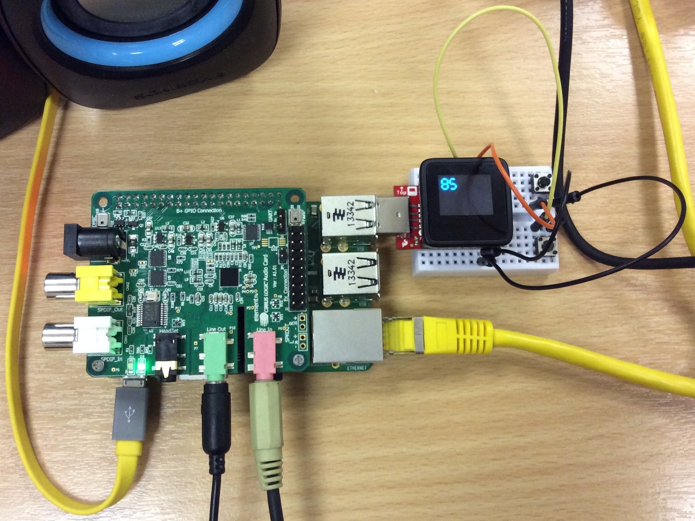

This is the third Hack&Roll hackathon I have joined and my very last one for this hackathon and as an NUS student.  Can check out my first two [here](/2014/01/what-i-did-nus-hackroll-2014/) and [here](/2013/02/my-experience-nus-hackroll-2013/ "here").  Didn't win anything but not that we were expecting any, it is the stuff we learned that were most important.

So presenting to you the Raspilizer! Done by myself and my friends Kai Yao (KY) and Yong Quan (YQ), two of my technical go-to buddies.

An independent device that does dynamic audio compression in "almost" realtime. Just feed in audio via the 3.5mm input jack and connect your speakers/headphones to the output jack!
<!--more-->
### Hardware used:

1. Raspberry Pi (Rpi) Model B+
2. [Cirrus Audio Shield](http://www.element14.com/community/community/raspberry-pi/raspberry-pi-accessories/cirrus_logic_audio_card)
3. Microview (miniaturised Arduino with screen) and USB Programmer
4. Mini breadboard and buttons

I borrowed the Raspberry Pi from my company to save costs. The Microview was technically "half price" since I was [given a replacement](https://www.sparkfun.com/news/1575) for a "faulty" production set which I later fixed. Everything did not cost more than a 100 bucks.

Although we technically classified our project as hardware, the software part was the main difficulty. We just treated the Raspberry Pi as another Linux computer.

### Motivation:

When watching the TV or listening to music sources, we sometimes encounter loud sounds like from advertisements and explosions and rush to lower the volume. Conversely, if a conversation is too soft, we turn up the volume again.

We wanted to have an automated way to handle this process. At the same time, the user should also be given a means to customise the target volume level if needed.

### **Software **

The main difficulty is trying to retrieve, process and output the audio quickly. There will no doubt be delay, the goal was to do it well and make the delay as unnoticeable as possible.

The first thing we did of course was to ensure minimum project viability i.e, can the Rpi receive and send out unprocessed audio without significant delay in the first place.

We did try a Java version although it worked quite well on a computer we couldn't get it to run on the Rpi. The C++ version using the ALSA APIs had no noticeable delay though.

YQ coded with the C++ version throughout the course of the hackathon. Nearly tore his scalp off and I can empathise. It is difficult to handle C++ stuff as you have to keep transferring the code to the Rpi for compilation. We learned alot from doing the C++ especially this particular feature of the language. This version in the end had not much latency although manipulating the audio PCM data by hand will never match conventional libraries.

KY then tried using the [Dynamic Audio Normaliser](https://github.com/lordmulder/DynamicAudioNormalizer) and SoX binaries by piping from one program to another. It worked well on the computer but introduced unacceptable delays at first. We later still did use it as it offered the best result.

All the source code we used is available from this [repo](https://github.com/yeokm1/rpi-audio) but beware, it is messy and undocumented.

### Hardware

As I was more familiar with hardware stuff, I did this part.  We needed a screen to show the current volume setting. I initially thought I brought an I2C-based OLED screen but I actually forgot to bring it. I ended up having to use a Microview to display the volume level which is kinda overkill. The Microview is viewed as a serial port on the Rpi so data can be transferred to it.

As we needed buttons on the volume control, I tried to locate the GPIO pinouts on Cirrus Audio shield expansion header that are pass-throughed from the Rpi. The header documentation was apparently poorly written and the board did not mark out which was the first and last pin. I had then to resort to using the Continuity function on my multimeter to manually check.

That failed also so as a last resort, I connected the buttons directly to the Microview and have it transfer the button status to the Rpi. I have a C++ program running on the Rpi using the Boost ASIO library and an [online example](http://www.webalice.it/fede.tft/serial_port/serial_port.html) to interact with the Microview. Surprising the Boost libraries has a feature that deals with the serial port.

In case you are wondering why I used C++, I did actually start with Python but I needed the information to be transmitted to the C++ audio code dynamically. I later switched to C++ so the serial port code can be in the same program, just running on a separate thread.

### Personal/Group Critique

When a person is tired, he tends to let his guard down and his ugly side may show. As I'm a person that cannot go without sufficient sleep easily, I became irritable even to my team mates. I did not prepare sufficiently well for the demo to other teams too leaving too much to YQ.

When it was only me around to present, I just explained to the other participants the general idea of our project. I did not actually demo cos I did not know how to start up the program. I really made an ass out of myself in front of the other participants and to some of my friends. Probably lost a lot of potential votes on than one, not that it could matter but I regretted giving such a negative impression. Giving a sales pitch was never a strong suite of mine but even I admit I could have done better this time.

The (video) submission was halfheartedly done by us and submitted barely in the nick of time. No heart to the video unlike the one the three of us did last year. The [video](https://www.youtube.com/watch?v=PRGcK7gzbnM) was good enough that I used it during the App store submission too.

Imagine doing so much and not properly demoing it. A bad way to end my last hackathon in NUS.

I'm also a more "usefulness" oriented person so after 4 hackathons, I actually realised hackathons are not really my style lah. Coolness and uniqueness are usually prized as evidenced by the grading criteria where creativity is ranked first and usefulness last. "Coolness and uniqueness" qualities are personally not even what I describe myself to be much less by others or the projects I make.

### About the hackathon in general

The hackathon was generally conducted better than the [last year'](/2014/01/what-i-did-nus-hackroll-2014/ "What I did in NUS Hack&Roll 2014")s one. Better (cash) prizes, the return of the "most useless prize", better meals etc. I missed having chocolates like Mars and Snickers offered in last year's hackathon though.

This year's hackathon also saw much more hardware-related projects including those of my team. It is fine in theory but when you see most of the prizes being taken by hardware teams with very fancy/complicated/expensive projects, you start wondering if the playing field is level. Everybody will claim they did everything in one day, but I personally have unsubstantiated doubts when I see the quality of those projects lah.

I have seen this problem happen in [code::XtremeApps::2014](/2014/07/codextremeapps-2014-aar/) hardware hackathon. The last thing I and probably many cash-strapped students want is future Hack&Roll hackathons to become a competition of who has the deepest pockets. Not that I want to care further, this is my last Hack&Roll hackathon I can join anyway.

The Wifi this time was bad though although it has nothing to do with the the Hack&Roll organisers or the fact there any many people. I believe this also partly contributed to hardware teams having a slight edge as software projects are generally more heavily dependent on an internet connection.

### Last hackathon as a student

So this ends it, the last hackathon I have attended as an NUS student. I have learned lots from the 3 hackathons organised by NUS Hackers. There are issues definitely, but those are rather trivial and I'm grateful for the time and effort they went to organise this. I have never won anything from a hackathon but I relished the opportunity to learn so much in such a short time, and that, is all that I ask for.
