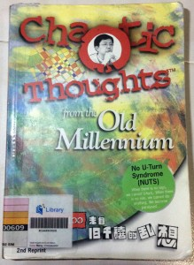
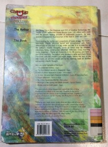

I have heard of the acronym NUTS some years back coined by the famous Singaporean technopreneur Sim Wong Hoo (SWH). For the unaware, SWH is the founder of Creative Technologies (CT), the maker of the Sound Blaster sound cards that used to be the industry standard for computer audio and very popular up to a decade ago. As I encountered this phrase quite recently again, I decided to further explore its origins.

It turns out this phrase was originated from his Dec 1999 book “Chaotic Thoughts from the Old Millennium”. Since then, this phrase has been bandied around several times by our political leaders and prominent people. It was also at this time when the Dot-Com bubble had yet to burst and CT was still at its heights.

 
<!--more-->
## So what is NUTS?

NUTS stands for “No U-turn Syndrome”. This is SWH's observation in Singapore where drivers only do a U-turn if a U-turn sign is present whereas drivers in other countries do not U-turn only if a sign prohibiting is shown. SWH explains this as a “no-rule = no-do” phenomenon where this subtle difference inhibits the creativity and initiative of Singaporeans.

## Let's focus away from NUTS at the moment

It is true that NUTS is the hottest topic of this book and SWH even placed it on the front cover. However, the attention to NUTS has made many forget that this book is so much more than NUTS especially for those that did not read it.

This book is a collection of dozens of short stories based on SWH's life observations from his childhood to the time of the book's publication. The amazing thing is that he wrote this entire book in a mere 6 weeks just in time to be sold in bookstores by 31 Dec 1999!

He talks about the Singapore of the past where digital entertainment did not yet exist and the rule-of-law wasn't that strong yet. Before the popularity of computers and game consoles, creative children came up with games to amuse themselves. Housewives regularly gambled with spare change on adhoc gambling tables set up by gangs. Limited rule of law implied that swindlers and scams were more common and people had to be more “street-smart” to survive.

SWH highlighted 8 key stories of the book in the back cover (See picture above). Nevertheless, I will talk about the own set of stories other than NUTS which left me with the greatest impression.

### The Unplanned Holiday

This is the first story in his book and he talks about taking a trip to visit the Himalayas region in Nepal and see Mount Everest with his own eyes. You would suspect that such a holiday would require months of preparation and take at least a week to complete. He shocks you with the fact he made this decision only at Changi Airport and managed to complete his adventure in about 2 days. And this was in the slow-Internet days of early 1996.

He reminisces the series of coincidences and luck that led him to finish his journey in record time. From catching a connecting flight via Bangkok, stepping aboard a Russian military helicopter to reach a recently-reopened Japanese Hotel at 4000m above sea level. The icing on the cake was capturing Mount Everest with the correct exposure settings at midnight. Remember this was before the era of digital cameras.

Right from the opening story, one can infer the just-do-it attitude of SWH. Of course all these was helped by the fact that he was very affluent and could afford the last-minute prices of everything which was by his words to the travel agent “Price is not a problem....”.  Perhaps, one day I would personally like to try such a journey for myself.

### Unqualified BCS lecturer

The main point of this story was that SWH had the knowledge to be a computer lecturer at a private computer school but lacked the necessary qualification (a degree or BCS-equivalent) as required by the rules of the school. BCS stands British Computer Society, you can think of it as a certification authority.

The principal eventually gave him the job and SWH started teaching students. On the day of the exams, he took the BCS papers with his students partly to set an example and partly so that he could earn the degree himself.

Once he got his degree, he immediately put the title into his name card to prove his credibility. He snidely remarked that when he went to the US to start his business, he dropped that title as it “was no use in this new frontier”.

Imagining myself in his shoes, I can understand his mockery of the Singaporean obsession with degrees and other paper qualifications. We can see this especially in civil service recruitment where the “higher-quality” paper you have, the better your starting pay and promotional prospects. Even the class of degree matters. All these without regard to the other capabilities of a person.

### The most honest person in Singapore

This story is exceptionally funny. He talks about how a man forgot to tear his parking coupon and was thanking his lucky stars that he was not caught by the enforcement officer. Regardless, his wife still forced him to tear the parking coupon as she did not want him to “cheat the government like that”!

Absolutely hilarious!

### Smoking affects your Logic

This is SWH’s anecdotal observation that engineers or people who work in jobs that require logical thinking almost always do not smoke. He admits that there is no scientific proof of this but based on his experience working with engineers in his company, he has never encountered one who does.

So yeah, we know smoking is bad alright but interesting to see how it may affect our mental faculties.

### Sound Blaster titbits

This is one of the last stories of the book where SWH traces the history of the Sound Blaster from the initial launch in Nov 1989 to 1999 at a Comdex Fair in Las Vegas.

He boasts that the Sound Blaster 16 was in production for over 7 years and supported a multitude of Microsoft Operating systems from DOS all the way till Windows 98 and 2000 which is rare in the tech world. This proves the popularity of the product. He then talks about his then latest product the Sound Blaster Live! My parents bought a Creative BlasterPC in 2001 equipped with this very sound chip in the motherboard and I still fondly remember it still supported my DOS games.

SWH later proclaims “If I were to leave Creative and you gave me all the money in the world, I would still never dare to compete with Creative in this area”.

We know today SWH had perhaps made this bet a little too early. Perhaps his arrogance and past success has blinded him when the advent of cheap audio chips began to flood the market and be integrated directly into motherboards alleviating the need to buy sound cards from CT.

### Lets come back to NUTS

If you are interested, you can read the NUTS story in its entirety from this [blog post](http://singaporeelection.blogspot.sg/2006/06/no-u-turn-syndrome-nuts.html) of a netizen.

In a political science class I took long ago, I heard a phrase that goes along the lines of “Don't start until I say go” for the civil service and “Go until I say stop” for the private sector. It is understandable why this two organisations have this two different goals and is consistent in many countries elsewhere.

In the civil service, this is pushed to what I feel is the extreme. I can cite a recent example where the food truck culture is almost driven to extinction because of [excessive adherence to rules and regulations](http://mothership.sg/2014/03/bureaucratic-red-tape-restrictive-regulations-killing-food-truck-culture-in-spore/). Government contracts regularly goes to contractors who submit the lowest bid just because some directive says that taxpayers money be spent carefully never mind it may cost more in the long run if the contractor cannot deliver. Extra holidays are not given to religious events like Thaipusam because of the fear of business costs.

What is worse is if the private sector in Singapore acts this way as well. In recent years, there have been a proliferation of startups that on the surface may have proven that the stranglehold of NUTS could finally be loosening its grip on the Singaporean psyche. I hope my confidence is not misplaced.

## Conclusion

Creative Technologies is a shadow of its former self today. This days, its Sound Blaster cards are hardly heard of (pun intended) and much less used except by hardcore gamers, audio connoisseurs or niche business applications. Even so and despite the fact that this book was written 15 years ago, his lessons about NUTS and many others still remain relevant and yet to be obsolete.

I would highly encourage any Singaporean to pick up this enlightening and inspirational book. It is available for free in our National Libraries so there is no excuse. Have you driven the NUTS traits out of yourself today?
