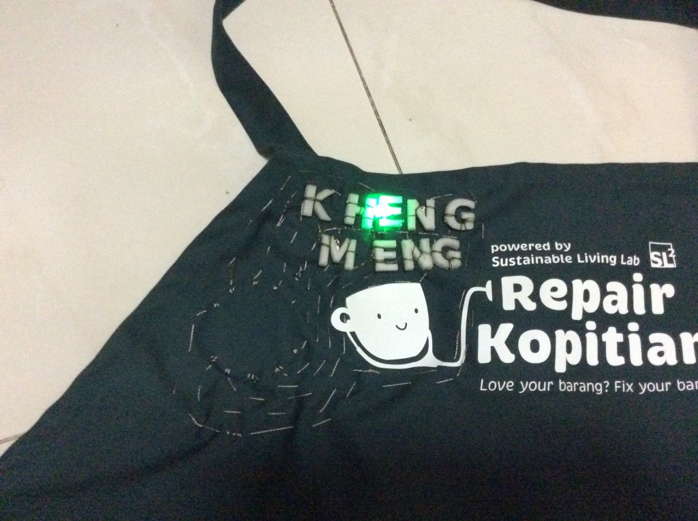
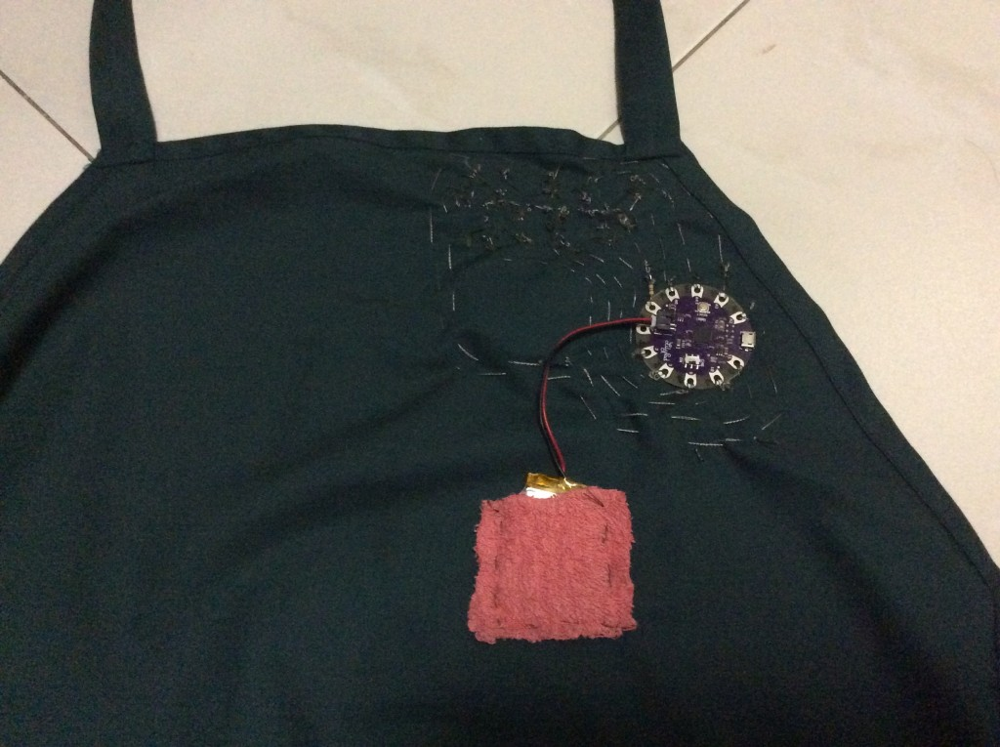
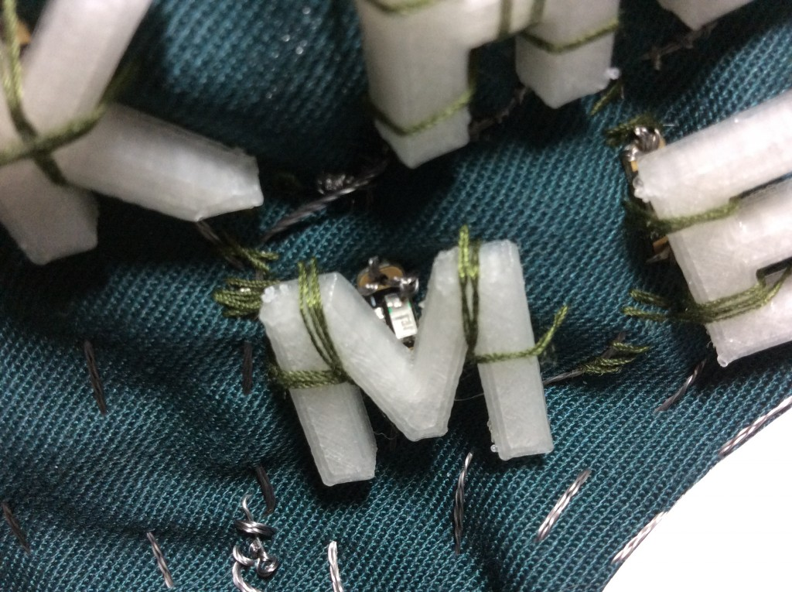
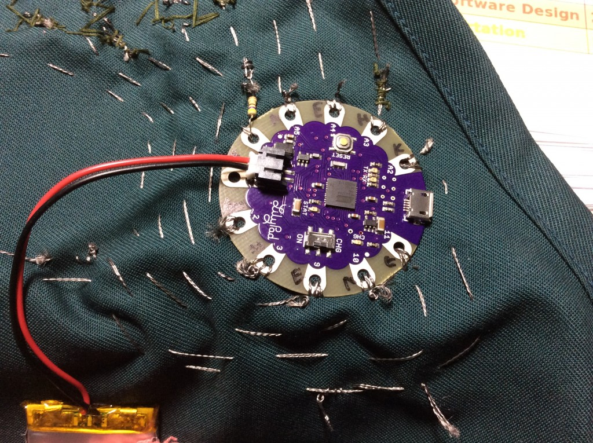
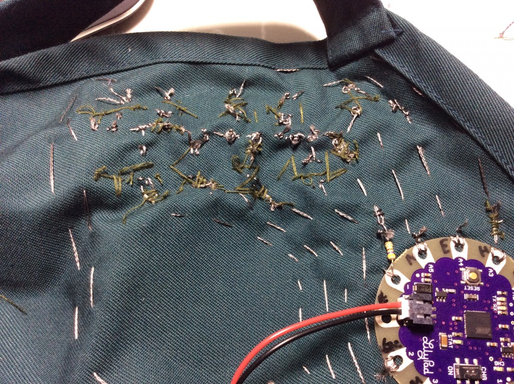
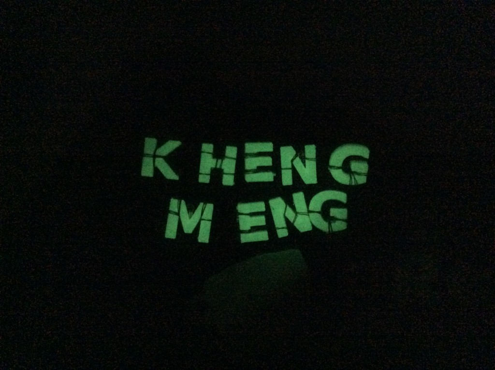

Since I started dabbling with hardware like the Arduino, I have always wondered what it would seem like to integrate it with clothing (materials) but did not find the urge to learn.

After I joined [Repair Kopitiam](http://repairkopitiam.sg/) as a voluntary Repair Coach, I was given an apron that both distinguishes us from the participants that we are helping and protects our clothes as well. Every Repair Coach is given the liberty to personalise their apron to their liking. Some sew their names and some punch on a metal sheet etc.

So I thought why not take this opportunity to do some wearable tech and 3D print some stuff as well!



A quick video to highlight how it appears.

# General Pictures

The result of more than 7 hours of labour from coding, 3D printing to sewing.

Now you see "who" is running the show. I have sewn on a small piece of cloth to act as a mini pouch for the 1000 mAh battery.

<!--more-->

# Close-up

This is just one of the 9 LED sequins that are hiding under the letters. My name excluding my surname is 9 letters gosh. I have realised this is longer that most since I was young. Anyway, it means I have a lot more sewing to do.

The letters are 3D-printed as it is near impossible to find products that fit my requirements of the exact size, strength and translucent material.

The one pulling the strings (almost literally).

It is the Arduino Lilypad USB. Think of it as your typical Arduino microcontroller specifically designed for such wearable uses-cases. It is engineered to be washable but I don't intend to test this anytime soon. This particular Arduino comes with an integrated battery charger which is more useful in the long run than other physically smaller alternatives.

I had to max out all of the 9 output pins to control the 9 individual LEDs, "curse" my long name again.

The thing to note here is the 470-ohm resistor I placed on the ground wire. The resistor serves 2 functions.

1. Slightly dim the LEDs as the standard 3.3V supplied to the LEDs makes them too bright.
2. Prevent the Arduino from "bursting into flames" if anything is shorted to the ground wire. This is a preventative measure as I anticipate this possibility due to the proximity of the ground wire to other wires.

If you thought managing 9 different LEDs is hard, think about how am I going to connect them? Unlike conventional electronics planning where I can just use jumper wires, I have to SEW them! Imagine what happens if I make a mistake like wire wrongly or accidentally cut something which I actually made many times.

The wire I'm using is a a stainless steel conductive thread. 2-ply for LED wire and 3-ply for the shared ground wire. I would prefer the stronger 3-ply thread for everything but it is actually very difficult to thread this through the needle much less sew that in the first place. So I only used it for the more sensitive ground wire since it is shared.

The stainless steel thread also has a habit of fraying much more than the conventional cotton threads we are used to so it made my life even harder.

Did I mention the 3D printing material I used glows in the dark too? I printed at 40% infill instead of the standard 20% to increase the glowing effect but I should have gone even higher instead.

# Conclusion

If you wish to know more about the technical details behind this project, the code for the Arduino is pushed to a [Github project](https://github.com/yeokm1/name-blinker). As a potential expansion, I may consider adding a flexible solar panel so I will never again have to charge this project from the wall. Talk about truly sustainable living.

Hope this will inspire you to consider implementing your own wearable projects too!
