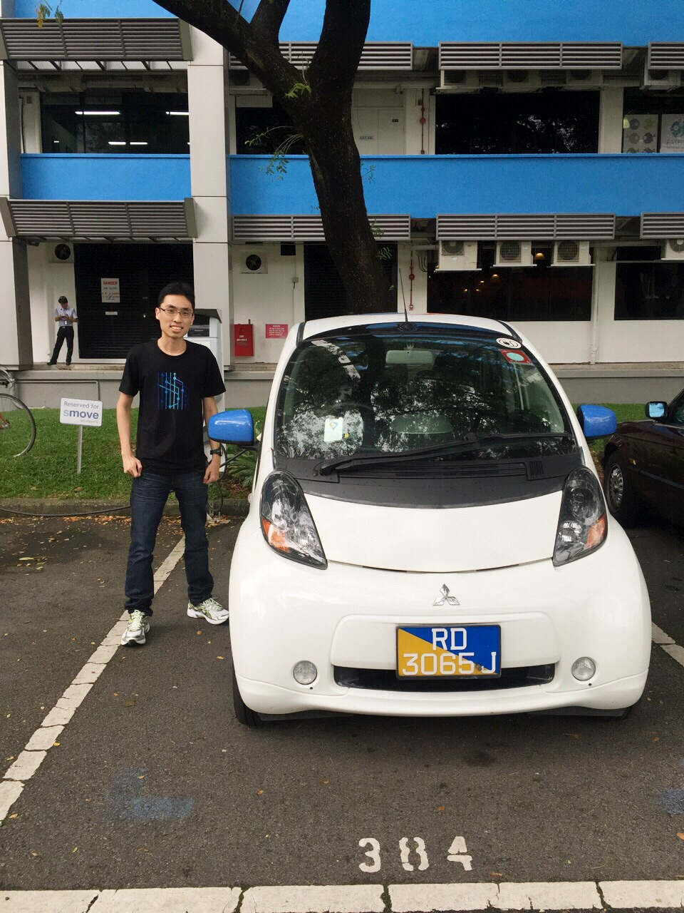
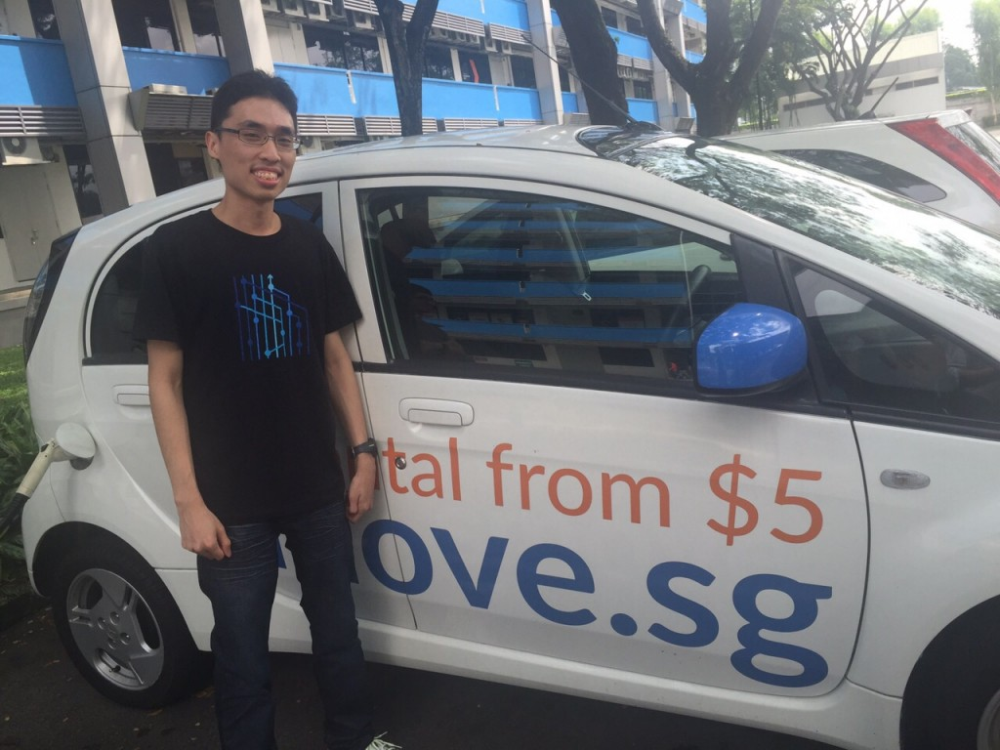
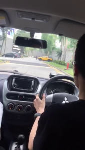
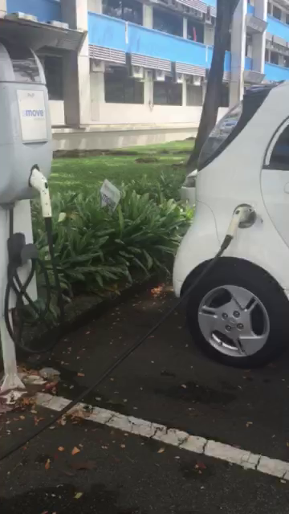

In case the title confuses you, I'm not buying an electric car or any car for that matter anytime soon given the crazy car prices in Singapore. You can't even buy an electric car here.

Nevertheless, when I saw this pure-electric [Mitsubishi i-MiEV](http://en.wikipedia.org/wiki/Mitsubishi_i-MiEV) roaming around [Plugin@Blk 71](http://www2.blk71.com/), I could not resist asking for the opportunity to drive one of the handful of electric cars in Singapore.

<!--more-->
The license plate prefix RD indicates this car is for research and development purposes only. This car is currently operated by [smove.sg](https://www.smove.sg/), a car-rental startup located in the same building Blk 71 where I work in. I contacted them and they were kind enough to let me take this for a short spin within the carpark.



Beside me is Joseph from Smove. The video was taken by my colleague from the back seat.

The car's range is about 100km assuming the air-con is not turned too high and one does not drive aggressively. People are usually worried about range for such cars but I personally feel 100km is enough in tiny Singapore lah.

The $5 rental logo is a misnomer. Smove used to have a fleet of i-MiEV electric cars for public rental but Joseph explained to me they no longer do so as they do not have insurance for this type of car for the public anymore. My test drive therefore could only take place within the (still quite huge) Blk 71 carpark.

They keep this sole electric car only for their employees to run company errands like if one of their other vehicles break down outside and need attention. I'm fortunate that they made this decision so I could still have the opportunity to drive it today.

This days, they only rent out the Toyota Prius C petrol-hybrid car. A hybrid car is a combination of petrol and electric engines so range is not an issue. Check out their [website](https://www.smove.sg/toyota-prius-c-hybrid/) for more details.

It was quite a smooth ride. Describing the car as silent is still an understatement. Without the engine noise, I could get a greater feel of the road conditions and surrounding environment.  I was not surprised by this of an electric car but is definitely something I was not used too. The power of the car is not too bad lah. I don't have much driving experience with many cars but I suspect its pickup at low speeds seems greater than cars of a comparable size even considering that 3 of my colleagues were at the back.

Joseph even encouraged me to floor the accelerator along a straight stretch and it was a unique feel to not expect an accompanying growl typical of conventional engines. He also told me that this car has regenerative braking to help recover additional energy when the car is slowing. Something unique only to electric cars.

Unlike conventional combustion engines, electric cars do not have gears, they are single-speed vehicles. Even your automatic transmission vehicle still has gears, the gearbox just switches gears for you unlike the manual transmission vehicle. The layman's explanation is that conventional engines only have a narrow speed band where it is most effective so gears are required to keep the engine within this speed band. The electric motor however, is effective across the entire usable speed range of the vehicle.

You can see this car requires a special charging station. A typical wall plug would probably take too long to charge the car.

So that ends this. I initially wanted to take this out on normal roads to get a taste of it under actual traffic conditions but a test-drive in the carpark is better than nothing. I will probably not drive another electric car again for years.

It was a good experience and I would like to thank Joseph from Smove for his time in letting me test drive the car. To my surprise, he even told me I'm the first person that actually asked his company to test-drive this vehicle. Since smove is a car-rental company, I'll probably use their services at least for the first time if I require a rental car as a form of thanks for this test-drive.

I hope in the interest of the environment, electric cars like this will be more commonplace in future.
