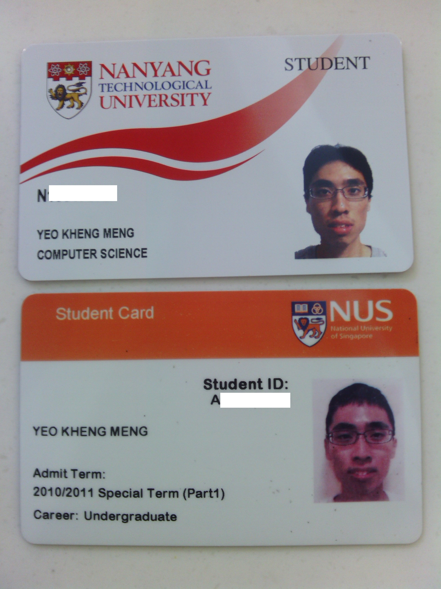
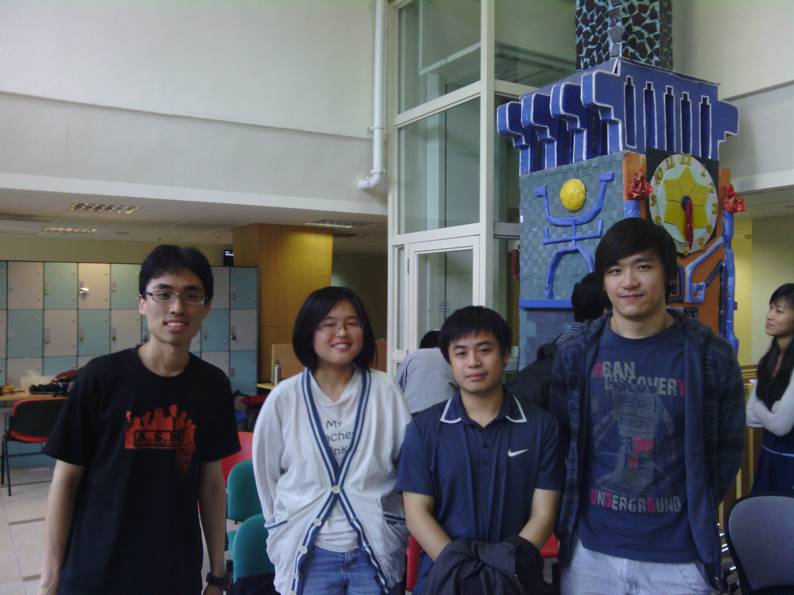

(Long post warning: 2.5k words)

This post is 2 weeks late as I was rather busy during this period. Anyways, as this will be the last post I will have about Uni life, thought would like to thank a few key people and describe the 5 story arcs that has greatly defined my time in Uni.

The mandatory first picture is of course this one lah.

Just collect the dummy scroll simply with no fuss. Unlike the few from the Information Systems Department who pulled selfies on the stage.

Proof that my degree is real. I managed to get myself to graduate with a Computer Science degree. However, part of me will always regret the fact that I did not choose/switch to Computer/Electrical Engineering.

My cert says I'm technically second-upper but the reality is that I'm just a borderline 4.05/5. It was thanks to my A+ for FYP that pulled my back on my final Sem.

I took part in several events and internships throughout my time in NUS. So I shall divide this post in several key story arcs and thank the key people involved in them.

### Arc 1: Groups in CS modules (Throughout)

#### To thank: Kai Yao

Kai Yao has been one of my closest friends in NUS. I first knew him in Freshman Orientation Programme 2011.  I can safely say without teaming up with him in many of my CS modules, I wouldn't have that second-upper today.

Because of the similarly in surnames and the mods we take, Kai Yao and I are usually placed together during exams. No exception even during the commencement.

As my appreciation for our friendship, I made him a vibration clock v2 for his birthday early this year.



Recommended to view at 1080p. Technical folks can find out how I made this [here](https://github.com/yeokm1/vibrate_alarm_clock_2).

Since this is v2, what about v1? The first version actually goes to one of my oldest friends Jason which for completeness sake I shall include here.

I regretfully did not take a video of this in action. Technical details are [here](https://github.com/yeokm1/vibrate_alarm_clock).

### Arc 2: Yishun Reading Stars (YRS) (Mar 2012 - June 2015)

#### To thank: Jason

For the uninitiated, [YRS](http://www.nus-csc.org/main/yrs.html) is a regular volunteering program (RVP) under the [NUS Community Service Club](http://www.nus-csc.org/main/) where volunteers interact with children with learning/behavior issues. I was introduced to this program by Jason during my freshman year and I continued on for 7 consecutive semesters.

As further details about this RVP are confidential due to privacy issues with children, I can't really talk more about this.

For my efforts heh. As I'm not that a prolific volunteer in CSC, I didn't know such an award existed till I was told that I would receive it.

Prior to this I also received two awards:

Those are probably the best awards given out to a YRS volunteer. (Look closely and you can see the quote is from me too). I admitthe reason I got the first award was what I did in the situation I was in. Lets just say I was assigned a kid that was particularly unique and I had to come up with extraordinary measures to deal with him. The second one, I guess it's more of a formality already.

What kept me going throughout was the smiles of the kids faces. Call me cheesy, but I'm really addicted to those smiles. Volunteering also gave me a much needed break from the drone of school work not to mention the interaction with more students from other faculties as well. Can't even state the numerous points of views, opinions and perspectives I have gained from people other than Computing.

### Arc 3: NTU local exchange (Aug 2013 – Dec 2013)

#### To thank: Sathish

I have actually written a [long blog post](/2014/08/my-ntu-local-exchange-experience-aug-dec-2013/) about this before. For those who do not know, I only went for one exchange programme throughout my time in NUS. And of all places, it is in Singapore itself! I went for local exchange at NTU.

How many students can boast about having two matric cards from our local Unis?

I have to thank Sathish for introducing me to the existence of such an exchange programme. Entry to such a programme is rumored to be much tougher than most overseas SEPs as places are limited to 20 to NTU and SMU each for the whole NUS.

This is a unique experience by itself. To quote my blog post:

_"Overall, it was an interesting experience to see how things are done in our two local universities and made me more appreciative about the things I took for granted at NUS. Even though NUS is ranked higher than NTU by most indicators, we can see that it does not mean NTU is totally inferior in every way. Going for a local exchange has shown me that NUS has its own imperfections too."_

Read my [blog post](/2014/08/my-ntu-local-exchange-experience-aug-dec-2013/) to know more.

### Arc 4: CS2103 tutor (Aug 2014 - May 2015)

#### To thank: Prof Damith and Kai Yao

I guess Computing is one of the few faculties where undergraduate students can apply to conduct tutorials. It was no doubt a unique experience to now stand on the other side of the aisle instead of just listening to my tutor.

CS2103 is also one of the more unique CS modules where tutor-tutee interaction is almost on the level of FASS modules. Compared to the typical Computing/Engineering/Science modules where students just come to class and listen to the tutor vomit answers. I was very motivated in this mod so CS2103 is one of the only 3 A+ I have ever received too (the others are CS1010 and my FYP). If there is one module that CS students should apply to tutor for, CS2103 should be near the top of the list other than CS3216/CS3217 of course. (I rejected the tutor offer for CS3217 due to time commitment issues)

I was given the tutor opportunity during my final year as Prof Damith had a shortage of tutors and I applied for it. Tutoring students was a unique experience. Throughout my 2 Sems as a tutor, I was in charge of a total of 22 students. Having that responsibility on your hands though unnerving initially became second-nature as time flew past.

 

My Sem 1 tutees

   

My Sem 2 tutees

Comments given by my Sem 2 tutees

I wrote the following on a Facebook post about the comments my Sem 2 tutees gave me which I felt is worth copying here

"_For my CS2103 tutees who wrote the tutor feedback about me, I’m touched and appreciative of your efforts for taking the time to do so even during the exam period. Regardless of whether you actually wrote for me, I’m still grateful for the opportunity to tutor you bunch._

_Normally the tutor feedback is for the tutor to improve for the next semester. Although there will not be a next semester for me, I will still remember the experience and positive comments for a long time to come._

_Someone once told me I should consider a career in teaching. Perhaps someday with these encouraging words, I will."_

As to the most important influence being a tutor on my Uni life: If I used to be a student that dared not speak up in class, now I understood first hand from the perspective of the tutor that talks to a quiet class. I was never the same anymore, I tried to contribute to my future classes even though class participation points are usually not significant/non-existent in CS modules.

Anyway, thanks to Prof Damith for giving me this enlightening tutor opportunity in the first place and Kai Yao too for the recommendation to him.

### Arc 5: Print apps/Jobs/Skills (Feb 2013 - present)

#### People to thank: Samantha, Yong Quan, Joo Khai, Veera

I saved the best for the last because this story arc actually continues on to the present. I can say this story arc began with 2 underrated people Samantha and Yong Quan whom I have a lot to thank for in hindsight for influencing my life's direction.

#### Arc 5a: NUS Hack&Roll 2013 (Feb 2013)

It all began in February 2013 when Samantha invited me to join her hackathon team for NUS Hack&Roll 2013.

I was forced to pick up Android programming within the span of the few days leading up to the hackathon. Our team did nothing extraordinary for the hackathon but the seeds for my future have been sown. I wrote a [blog post](/2013/02/my-experience-nus-hackroll-2013/) on this hackathon.

#### Arc 5b: SoC Print app (Mar 2013 - present)

A month after this hackathon, I was chatting with Yong Quan near our printers at COM1. The conversation steered to the difficulty in printing to SoC printers from anything other than our personal laptops. I remembered opening the Putty program on my then Windows Thinkpad, connecting to Sunfire and trying out the commands to print a document. It succeeded and the rest as they say is history.

I probably have the most affinity to these printers than any other SoC student.

A complete writeup on my mobile print app is in this [blog post](/2014/12/nus-soc-print-androidios-background-technical-aspects-and-learning-points/).

#### Arc 5c: Working at Innova Technology (May 2013 - May 2014)

I then used this app to apply for an internship in Android development at Innova Technology. Innova I guess is one of the few hardware startups in Singapore.

This startup's primary business is to sell Bluetooth anti-loss tags. The concept is simple, you have a Bluetooth tag attached to your valuables. An app on your smartphone maintains a Bluetooth connection with the tag. When the tag goes out of range, your phone rings to alert you of the loss. Simple in concept but as with all hardware startups, difficult in execution.

I stayed on in this startup as a part-timer for the next one year. The best takeaway for me is my still unique knowledge/expertise in Bluetooth Low Energy (BLE), a new emerging technology that is hard to master in detail in anywhere but a hardware-related company.

#### Arc 5d: Taking CS3216 and CS3217  (Aug 2013 - May 2014)

For CS3216, I was granted automatic entry since I got A+ in CS2103.

For CS3217, I used my print app as part of my application and I got in! CS3217 like CS3216 are two of the toughest undergrad modules in SoC with stringent selection criteria. One can do a [quick search on NUSWhispers](http://nuswhispers.com/search/cs3216) to know about the application saga.

Both mods really stretched me out. CS3216 students are required to maintain a blog post to describe their experiences throughout the semester so here is [mine](https://khengmengcs3216.wordpress.com/). Reading it again brings back so much memories. If you think an entire blog is TL;DR, just this [final blog post](/2013/11/finally-end-cs3216/) will do.

On CS3217, the iOS skills I learned will prove very useful later. The first start was also to port my print app to work on iOS.

#### Arc 5e: Working at Algo Access Pte Ltd (May 2014 - present)

Lets just say it was time for me to try something new. I applied for a summer internship in this company. Algo Access is a med-tech startup that happened to require skills in BLE and iOS. My unique knowledge in both skill sets was in all probability, a significant factor that got me selected to join this company. I also used my Print app as one of the best open-source projects I could showcase.

After my internship, I would convert to a part-timer till I graduated. I have converted to a full-time position at this time and am still working there. I like my current job so far, I have access to a 3D printer and undertaken PCB design just to name a few. You wouldn't imagine a CS grad doing such tasks.

#### Arc 5f: Knowing about the One Maker Group (OMG)  (Oct 2014)

Through this startup, I would get to know about a weekly meetup group called [Hackers and Painters](http://hackersandpainters.sg/). In one of the talks about [hardware prototyping](https://www.facebook.com/events/586247801481288/), I would meet this brilliant maker in Singapore called Joo Khai who works for OMG.

I took up several classes under OMG such as 3D Printing, soldering and PCB Design. All these were taught by Joo Khai. Suffice to say, I have learned so much and some of his maker attitude has rubbed off me personally.

#### Arc 5g: Presentations I have given so far (Jan 2015 to present)

If you kept up, you would know this happens to be my final Sem in NUS. At the start of the sem, the CS3217 Prof Khe Chai invited me to give a guest lecture to his students about iOS and the Swift programming language. I was initially mentally hesitant as I have never given a talk to such a big group of people before. But I thought WTH, what better way to improve my presentation skills than to give more of them.

##### Presentation 1: [iOS Development experience (with Swift) guest lecture for NUS CS3217](http://www.slideshare.net/yeokm1/kheng-meng-cs3217-guest-presentation) (Jan 2015)

##### Presentation 2: [Introduction to Raspberry Pi and Linux](http://www.slideshare.net/yeokm1/introduction-to-raspberry-pi-and-linux) (Mar 2015)

For presentation 2, it was more of a 3-hour workshop actually. I conducted it because I was requested to do so by Veera from Sustainable Living Lab. I prepared this workshop in just 2 weeks. The first time in my life I conducted a workshop instead of just attending one.

The reason I had the expertise to conduct this workshop was because I used the Raspberry Pi in Algo Access.

##### Presentation 3: [Introduction to Bluetooth Low Energy](/2015/06/introduction-to-bluetooth-low-energy/) (April 2015 - present)

This is a presentation that I initially gave at [Hackers and Painters](https://www.facebook.com/events/466440616841706/) upon the request of my boss and organiser of H&P [Calvin Cheng](https://sg.linkedin.com/in/calvinchengx) (not the former NMP).

Because of the uniqueness of this talk, I would go on to give it [two more times](http://www.meetup.com/Hackware/events/221996446/) at [Hackware](http://www.meetup.com/Hackware/), another tech meetup. In fact, I may even give it once more at NUS Hackers once the semester reopens.

In terms of presentations given in such a span of time, these year has been the highest in my life so far. All of them gave me the required practice for my FYP presentation in April. I would venture to say I may not have gotten an A+ if my presentation skills were not polished by all these "dry runs".

#### Arc 5h: Repair Kopitiam (Mar 2015 - present)

In my interaction with folks from the One Maker Group especially Veera, I would get to know about [Repair Kopitiam](http://repairkopitiam.sg/) (RK). RK is a social initiative started by [Sustainable Living Lab](http://www.sl2square.org/) (SL2) to teach people how to repair their household stuff to combat the throwaway culture in Singapore.

As a voluntary Repair Coach in RK, I have taught/interacted with dozens of people so far. In terms of technical skills, I have learned together with the people I'm coaching the intricacies in repairing household appliances. The most important skill however, are the softer communication ones. How to communicate technical terms with the elderly, the Chinese-speaking and children in a way that they can understand.

I quite like this voluntary role so far and I'll continue to volunteer at least in the near future.

### Conclusion:

So this kinda concludes my undergrad experience in NUS. A lengthy roundup. Arc 5 is no doubt the most significant one. Sometimes I wonder, if my interactions with Samantha and Yong Quan did not carry on as they did, would I have been what I am today? It is tough to attach an "if" to such extreme turning points in my life but meh, hard to know unless I can enter the parallel universe.

I have now officially stepped into the working world. My responsibilities have changed, I'm no longer just a dependent on my parents anymore, I'm expected to contribute home and more. Although my NUS education has ended, my role as a student has not changed, in life, we should always see ourselves as students, never stopping the learning process and continuously upgrading ourselves to face the world of tomorrow.
