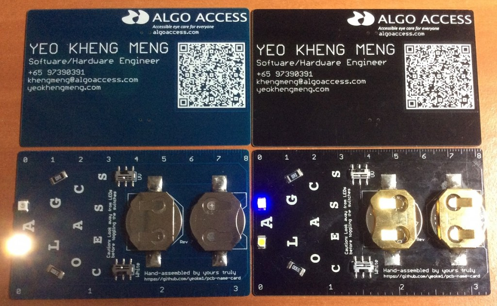
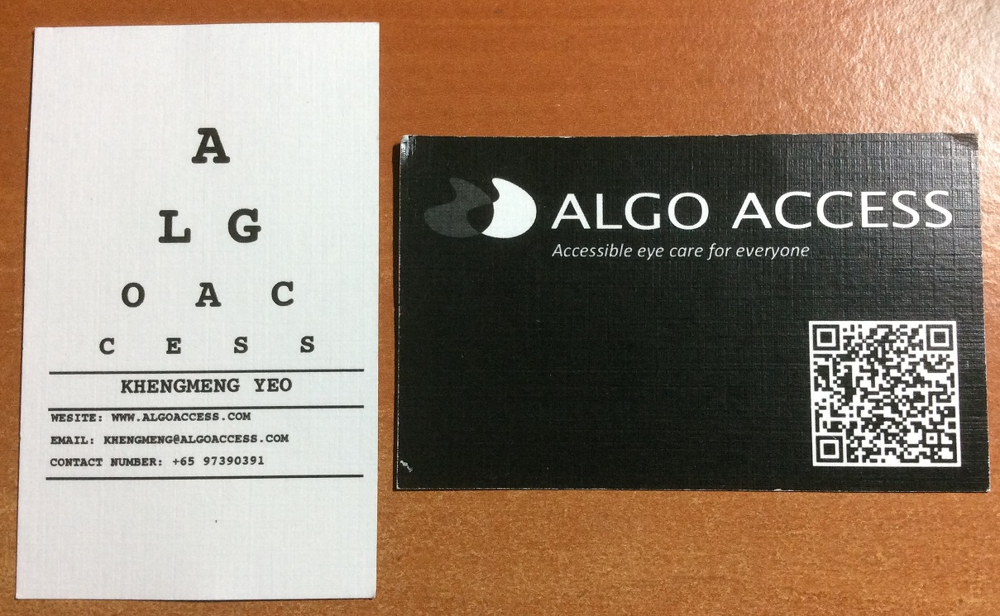
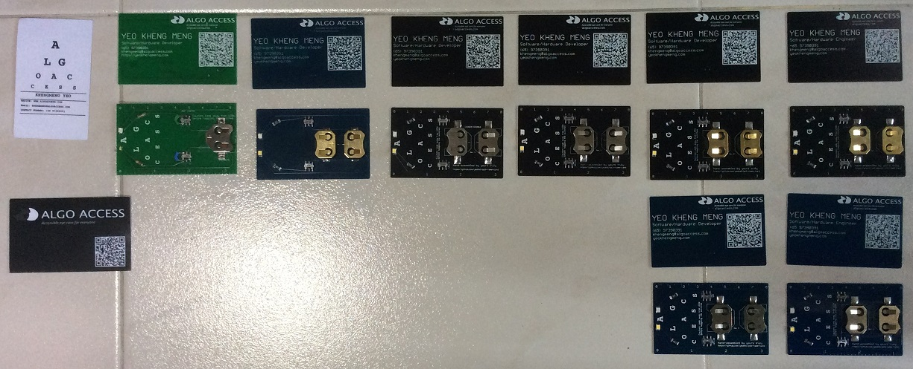
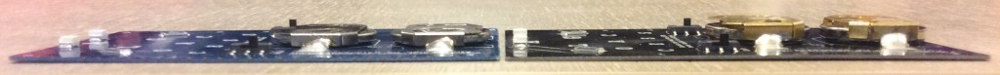
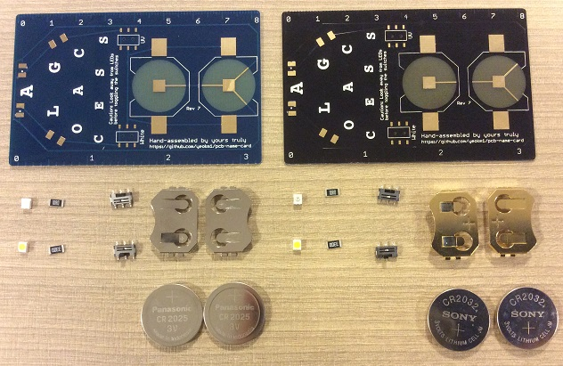
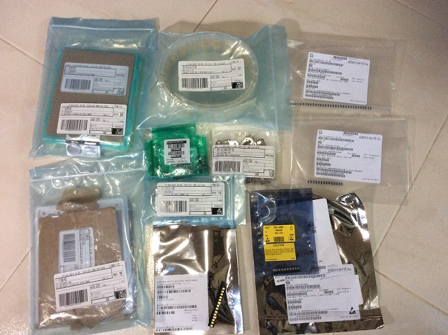
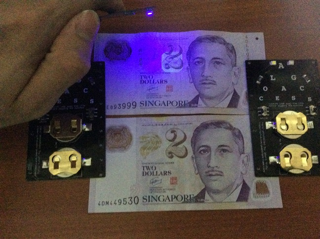

I can't count how many times I have received business cards only for me to forget about them shortly afterwards. I'm sure I'm not the only one that feel this way when you get a card from someone. For the technical-oriented, you can go directly to my [Github link on this project](https://github.com/yeokm1/pcb-name-card).

Lets jump right into business. Here is my card:

(As with all pictures in this post, you can click to view the higher resolution versions of them.)

Front and back view of my business card as of Revision 7. All versions before Revision 6 are considered to be prototypes. The revision number can be found between the two battery holders.
<!--more-->
Other than the colours, both name cards have similar features although I will explain the differences later. I shall hereby call them Young Blue and Formal Black indicating the target "market" in which I will pass my card too.



Video of the same Hackware v1.5 talk. Have to admit I was a little too excited.

Hope this has sufficiently piqued your interest to read further!

## Backstory:

I actually have a traditional paper name card as you see here:

Just like any typical name card you would receive. The only problem with this is a spelling error in the word "website" which renders my entire stack useless. As I'm an engineer that rarely deals with customers, getting a replacement stack is shall I say, not that high on a priority list.

Nevertheless, I have been in more than one occasion where a name card would be useful so I thought, why not make one on my own!?

Before I set out to make my own, I envisioned the following goals:

1. Standout from the crowd
2. Reflects my capabilities and job scope
3. Be useful for my receiver
4. Appear to be sufficiently valuable yet not too extravagant that it burns my pocket too much
5. A personal touch for every single name card
6. Maintain similarity with the paper name cards used by my colleagues so people can recognise our cards to be from the same company.

## Moving to the details

With the goals in mind, I decided on a name card made up of a Printed Circuit Board (PCB). I'm obviously not the first to come up with this idea. You can checkout [here](http://mikepuchol.com/my-pcb-business-card/), [here](http://www.instructables.com/id/USB-PCB-Business-Card/) and [here](http://makezine.com/2010/05/25/pcb-business-card/) for some examples.

With the above inspiration in mind, I came up with the following features:

1. White LED as a torch
2. UV LED to aid detection of counterfeit currency
3. Ruler, cos it is does not cost me extra
4. QR code containing a Vcard so people can add my contact easily
5. Every single piece will be hand-soldered and checked by me, not outsourced to some assembly house. Every piece is a labour of love so to speak.

Each column represents one iteration of the card up to Revision 6. Revision 2 has a manufacturing error with missing [silkscreen](http://www.omnicircuitboards.com/blog/bid/312861/Understanding-PCB-Manufacturing-Silk-Screening) on the back.

Even with the list of features in mind, it is difficult to get anything right on a first iteration. Like any hardware project, every iteration takes considerable amount of money not to mention time. I had to make 6 versions of the card over a span of 2 months before I was more or less satisfied with it. Although I have revision 7, I consider revision 6 to be out of beta.

Major iterated changes:

1. Mitered (Smoothed) corners to prevent sharp cuts (Rev 2)
2. Dual batteries to more than double the battery life\* (Rev 2)
3. Increase size of while LED to reduce soldering time (Rev 2)
4. Larger electrical pads for the battery holder to increase strength of solder (Rev 3)
5. Draw a dummy wire on the top to prevent PCB manufacturers from rejecting my design\*\* (Rev 3 & 4)
6. Dual versions to cater to different target receivers (Rev 5)
7. QR code that uses Vcard format instead of normal text (Rev 6)
8. Job title changed from Developer to Engineer as the latter sounds better (Rev 6)
9. Country code changed from (65) to +65 to be consistent with Vcard format (Rev 6)

\*The lithium coin-cell battery I'm using CR2025/CR2032 will have a lower maximum potential capacity when a higher current is drawn from it. To reduce this effect, I use two batteries connected in parallel to reduce the current load placed on each one.

\*\*Reason is too lengthy to explain without bringing in technical PCB knowledge. Explanation of this is in my [Github repo](https://github.com/yeokm1/pcb-name-card).

### Dual versions (Young Blue vs Formal Black)

A side view to show the primary difference between Young Blue and Formal Black. The reason I gave these nicknames is because it seems younger people around my age prefer the slimmer CR2025 battery holder and blue colour.

For formal occasions or people decades older than me, the black version may be more suitable. The gold-plated battery holder gives it a more premium effect so it cost slightly more. The black version uses thicker CR2032 batteries which offer 50% more battery life.

## Parts

Like a military aircraft photoshoot with all its weapons laid out, these are all the components before I solder unto the board itself. I take on average 15 mins to fully solder then clean each card. Multiply this number by every piece I have given out so far and you can get a fair idea how much time I have dedicated to this side project of mine.

###  

All the components still in their source packaging

As with all production-level (even if self-soldered) hardware projects, managing the components I use is not a trivial matter. I have to purchase from 4 different sources, [Digikey](http://www.digikey.sg/), [Element14](http://sg.element14.com/), [Seeedstudio](http://www.seeedstudio.com/) and [RS-Online](http://sg.rs-online.com/web/) to get a good balance of price and availability. If you are curious about the detailed breakdown, you can see my [Github repository](https://github.com/yeokm1/pcb-name-card) on this project.

## How much does each piece cost?

This is a question I get a lot so here is the unit cost in Singapore dollars I have calculated for each piece at different order quantities.

| Pieces | Young Blue | Formal Black |
|--------|------------|--------------|
| 10     | $15.53     | $17.19       |
| 50     | $10.53     | $12.26       |

As my order increases, costs drop due to economies of scale like delivery costs and manufacturers offer lower unit prices at higher quantities.

Going forward as I leave the prototyping phase, I will now purchase in larger quantities for each card to maximise savings. Even then, I will still control the handing out of my cards only to people who can appreciate my work or who I anticipate can provide "meaningful return of investment" in the future.  After all, my company is not sponsoring this side project.

## Counterfeit Money detection

It seems not many people (at least among my friends) are aware of the security features in our notes. From the [Monetary Authority of Singapore's website](http://www.mas.gov.sg/Currency/Security-Features/How-to-identify-genuine-notes.aspx), you can see the full list of characteristics of our currency that enable you to determine its authenticity.

One of the features is a watermark that is only visible under ultraviolet(UV) light as you can see below.

  

This is just one of the watermarks. As my UV LED is not so powerful, the other watermarks are not so visible unless you check in a dark room.

## Final Words

For those of you who have received my prototype name cards, I hope you would appreciate the hard work that has gone into the piece that you have. I have given out my prototype models slightly more liberally in order to get quick feedback on how to improve. This has blown a not insignificant hole in my pocket. From Revision 6 onwards, I have to throttle my rate of giving in order to preserve my budget and sanity.

I still do have a significant inventory of Revision 5 (QR code that does not use Vcard) that I intend to clear. Drop me a personal message if you want to reserve one.

As usual if you have any suggestions, I'll be willing to hear it.
