I design Printed Circuit Boards (PCBs) as my part of my job. I also have some PCB projects outside of work with my most famous project among my peers being my [PCB name card](/2015/09/pcb-businessname-card/).

A major problem PCB designers like myself face is time and cost. It takes about 2 weeks (1 week if you can afford to pay much more) between the time I send a PCB design (Gerber) file to a fabricator in China to the time I receive the boards. This wait time is frustrating as my work will stall till the boards come back and I can test them. There is also a minimum order quantity of 5-10 pieces which most of the time I rarely need during the prototyping process, 1 or 2 is usually more than enough. All these including the delivery costs add up to a hefty sum as one typically has to design a few iterations before getting it right.

Is there a better way?

A friend of mine Leon Lim introduced his technique of custom PCB etching to the maker community in Singapore for quite some time now. He uses the toner transfer method, heat press and chemical etching to remove unused copper. The process is detailed by him in 2 blog posts [here](http://blog.leon-lim.com/2014/07/the-diy-pcb-making-guide.html) followed by drilling [here](http://blog.leon-lim.com/2014/08/drilling-pcb-board.html). This whole process can be completed within 1 work day which can help speed up the number of prototype iterations before sending for mass production.

I tried out this process including screen printing on my own name card as you can see below.

The only information missing is how does one generate the relevant image files for etching from your Electronic Design Automation (EDA) software aka PCB Design Software.

This is where this blog post will come in using the Eagle software as an example.

Please read Leon's 2 blog posts before proceeding with the rest of this post to get a complete idea of what this process is about.

1. [DIY PCB making](http://blog.leon-lim.com/2014/07/the-diy-pcb-making-guide.html)
2. [Drilling PCB Board](http://blog.leon-lim.com/2014/08/drilling-pcb-board.html)

The board file which I'll be showing in this example is none other than my name card of course. Note that my name card does not have through-hole components but the steps I'll list will still take account of them.

[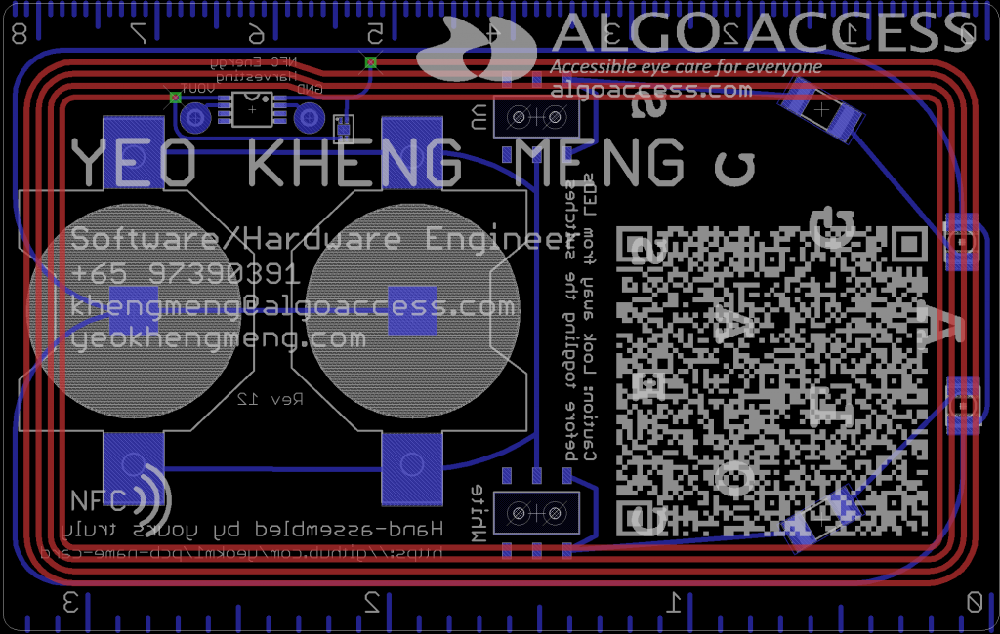](images/pcb-name-card-board.png)

\*The board image is slightly different as I have updated my board design since the time I etched my boards.

Now we want to fabricate the above using the custom etching method, how do we generate the files to do so? Unlike Gerbers which we send to the fabricator, we have to export as images instead.

# PCB Design considerations before DIY PCB Etching

## Electrical Design

1. Can only do 2-layer boards. Reason is obvious, you can't etch inner layers.
2. Avoid ground/power planes or large connected regions. A small mistake in the etching process around the plane will cause massive short circuits.
3. Use thick traces if you can afford the space as they may be some imperfections in the etching process that may reduce trace/signal integrity.
4. Use large vias and pads. Ideally the minimum is 1mm diameter but it depends on your drill bit. This is so we can still drill through properly with sufficient copper remaining.
5. Don't put vias/holes too close to traces as we need space to drill through them later. Custom etching does not have the precision of your fabricator.

## Silkscreen Design

This part is if you want to also print silkscreen on your custom etch board using Leon's toner transfer method.

1. Use larger and thicker font. If the font is too thin, it can't be transferred onto the board at all. For Eagle, the default Font Ratio of 8% is grossly insufficient. Use at least 12%.
2. Avoid overlapping your silkscreen on top of the traces. The increased height of the traces may cause the silkscreen toners to break. An example of this failure is in my QR code above.

# Exporting Steps

## Step 1: Export Top layer

This step will decide the traces that will remain on the top layer of your etched board. Open your PCB design in Eagle's "Board mode" as shown below.

[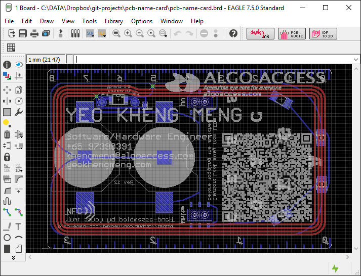](images/etching-eagle-board.png)

We now have to select the layers that are relevant for the top.

[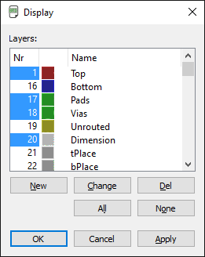](images/etching-eagle-board-layer-display-top.png)

The relevant layers are Top, Pads, Vias and Dimension. Once you click OK, you will see the result below.

[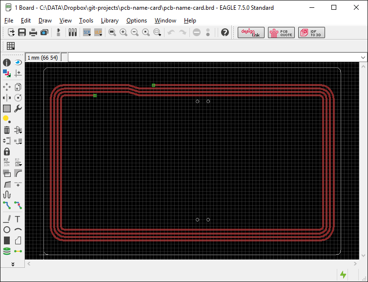](images/etching-eagle-board-top.png)

Since I do not have through-hole components, I will not have through-hole solder pads here but they will be visible if you have them in your design.

We now have to export the file as PDF. Click File->Print.

[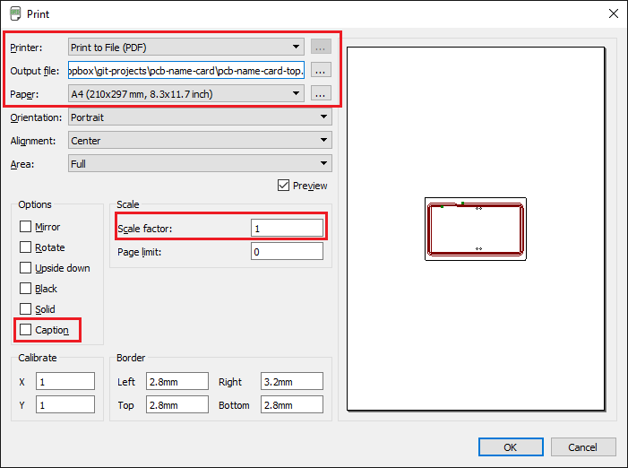](images/etching-eagle-board-top-print-to-pdf-highlight.png)

Ensure the highlighted portions are set as they are. The reason we print as PDF is so we can get a sense of the proportion when we print this out at a laser printer.

## Step 2: Export Bottom layer

The steps here are similar to that of the top layer except we now select the bottom layer. Click the "Layer Settings" icon to open this window.

[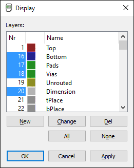](images/etching-eagle-board-layer-display-bottom.png)

The relevant layers are Bottom, Pads, Vias and Dimension. Once you click OK, you will see the result below.

[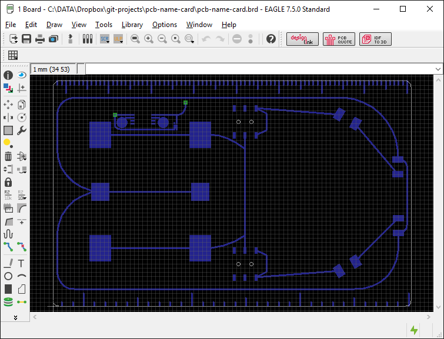](images/etching-eagle-board-bottom.png)

Again you will not see through-hole solder pads here as I do not have through-hole components.

We now have to export the file as PDF. Click File->Print.

[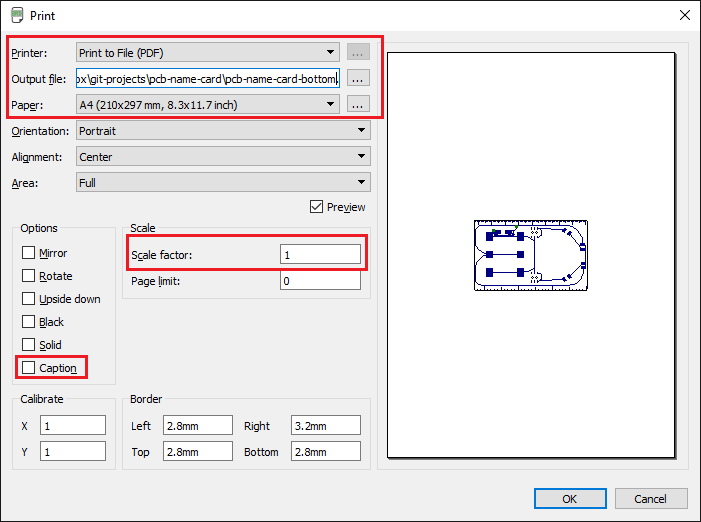](images/etching-eagle-board-bottom-print-to-pdf-highlight.png)

Ensure the highlighted portions are set as they are. The reason we print as PDF is so we can get a sense of the proportion when we print this out with a laser printer.

## Step 3: Etching your board

I got Leon to screen print the toner on my future traces with his heat press.

At this point, you will follow Leon's [PCB making guide](http://blog.leon-lim.com/2014/07/the-diy-pcb-making-guide.html) to prepare the solution of hydrogen peroxide, vinegar and salt.

Anyway here is the result of my etch after following Leon's guide.

This is the top view which contains the NFC antenna trace. The toner still remains after the excess copper has been "eaten" away by the solution.

The bottom view.

We will now use thinner to wipe away the toner to expose the trace.

If you don't wish to have silkscreen, you can technically jump to Step 6 to drill.

## Step 4: Export Top silkscreen

The top silkscreen is primarily held at the tPlace layer so we will export that.

[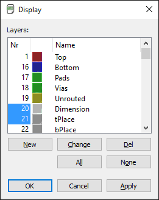](images/etching-eagle-silkscreen-layer-display-top.png)

The relevant layers are Dimension and tPlace. Once you click OK, you will see the result below.

[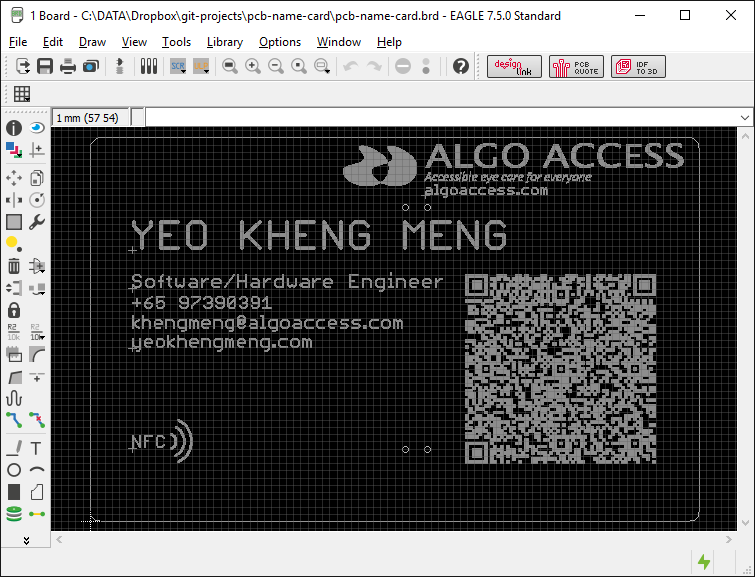](images/etching-eagle-silkscreen-top.png)

You should only see the top silkscreen. We will now export this as an image as Eagle's PDF is of rather low quality for image printing.

Click on File -> Export -> Image.

[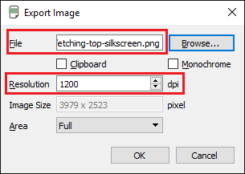](images/etching-eagle-silkscreen-top-export-image-highlight.png)

Set the highlighted portions before pressing OK. The resolution should be at least 1200 dpi so we can have a more precise print.

[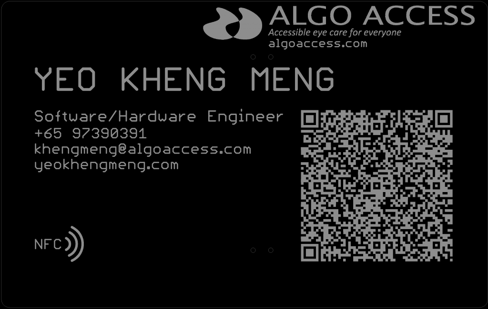](images/etching-top-silkscreen-1024x650.png)

The result should be something like this.

## Step 4: Export Bottom silkscreen

Not much difference from the previous step.

[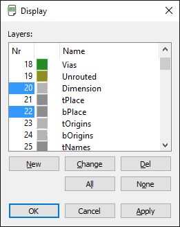](images/etching-eagle-silkscreen-layer-display-bottom.png)

The relevant layers are Dimension and bPlace. Once you click OK, you will see the result below.

[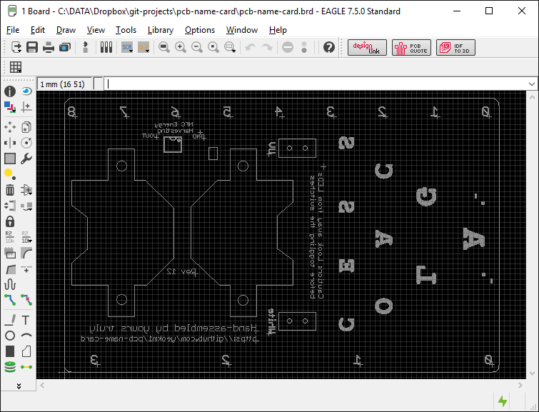](images/etching-eagle-silkscreen-bottom.png)

You should only see the bottom silkscreen. We will now export this as an image for image printing.

Click on File -> Export -> Image.

[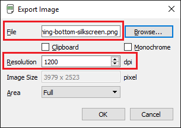](images/etching-eagle-silkscreen-bottom-export-image-highlight.png)

Set the highlighted portions before pressing OK.

[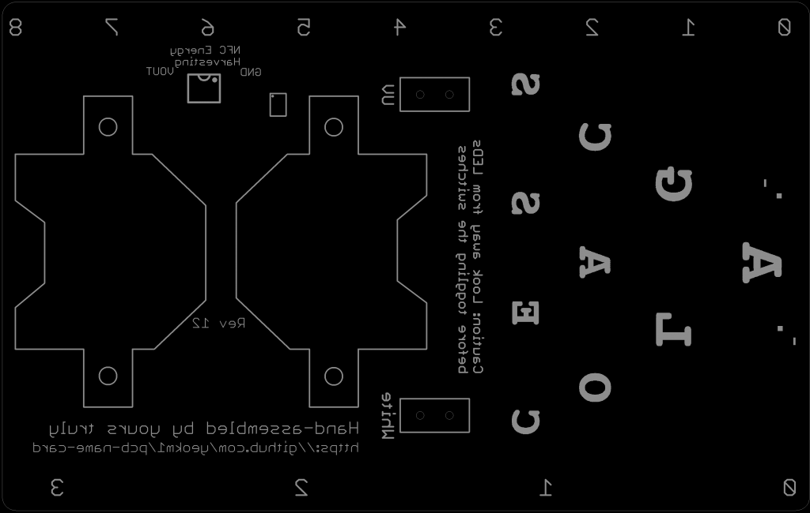](images/etching-bottom-silkscreen.png)

The result should be something like this.

## Step 5: Silkscreen Printing

At this point, I hand the image files over to Leon so he can screen print my silkscreen with his heat press.

I requested Leon to set a variety of colours to different sections of my silkscreen to see how they will turn out for future reference. The QR code has been modified to be inverted from my initial design.

## Step 6: Drilling

Follow the [drilling guide](http://blog.leon-lim.com/2014/08/drilling-pcb-board.html) set by Leon.

[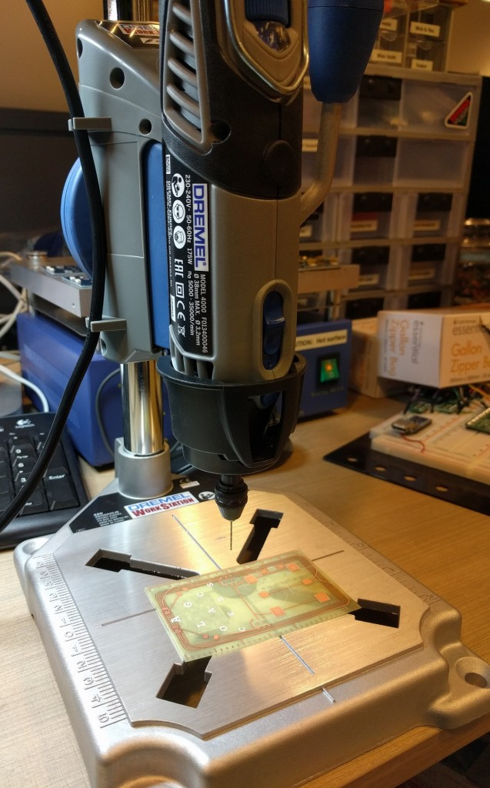](images/etching-drilling.jpg)

For my purposes, I use a Dremel 4000 mounted on a stand to ensure I can stably drill a perpendicular hole through. Although I do not have through-hole components, my surface-mounted switches require holes for stable adherence to the board.

## Step 7: Soldering components

You will now manually solder the components.

[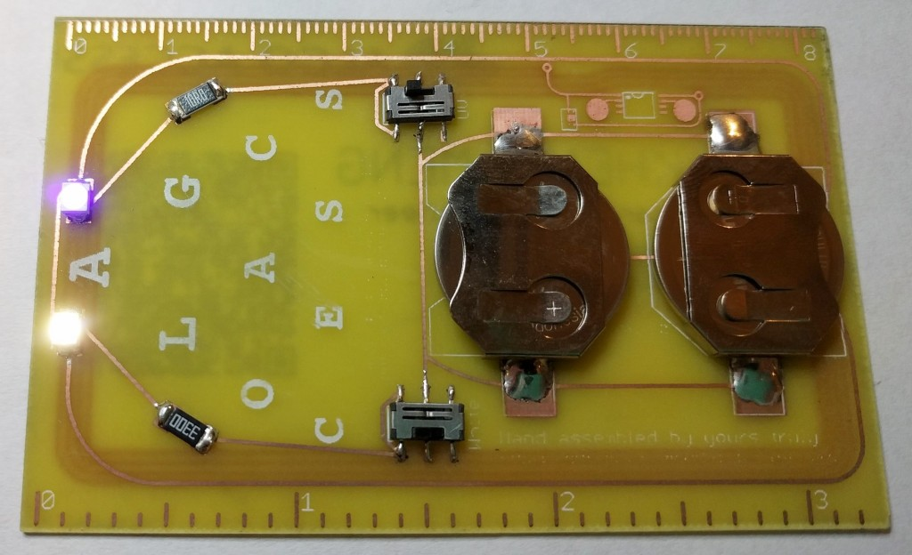](images/etching-soldered.jpg)

And my board works!

Since I have the stencil for my board, I was tempted to try reflow soldering with my hot plate.[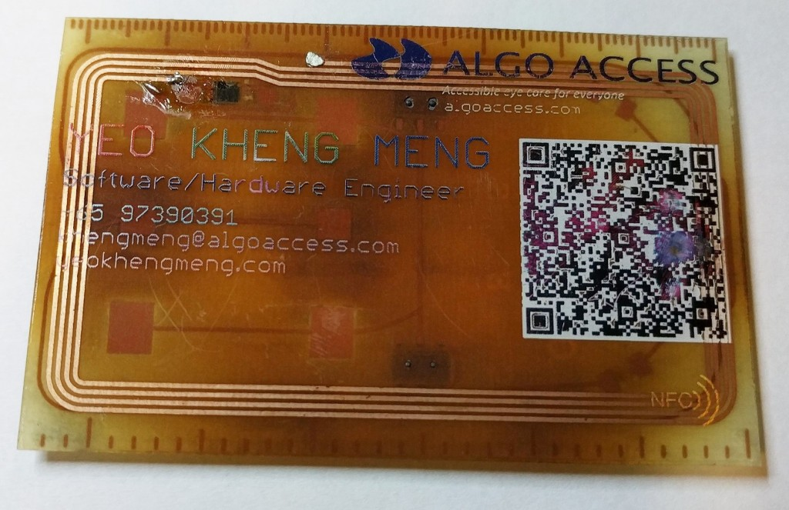](images/etching-reflowed-screen-print-fail.jpg)

Not a pretty sight. The mass heating of the entire surface has turned the board brown. It seems the toner silkscreen print cannot withstand the high temperatures of reflow soldering. Regardless, this DIY PCB making technique is meant to be for prototyping purposes, you can't reasonably expect industrial quality and tolerances.

# The End

This concludes my rather picture-centric guide on how to get from your Eagle design to something that can be etched. Feel free to comment if you have any questions.

You can contact Leon to find out more about the services he provides. He runs a shop called [Touch & Print](http://www.touch-print.com.sg/) at Sunshine Plaza in Bugis where he does screen printing for a living. This PCB printing is one of his side projects/services that I felt was rather interesting and can be adopted by both makers and industrial uses.
