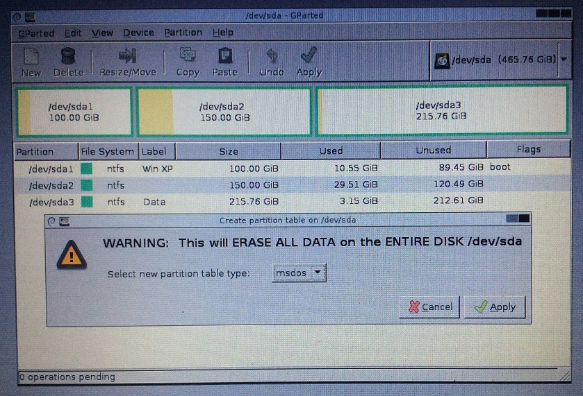
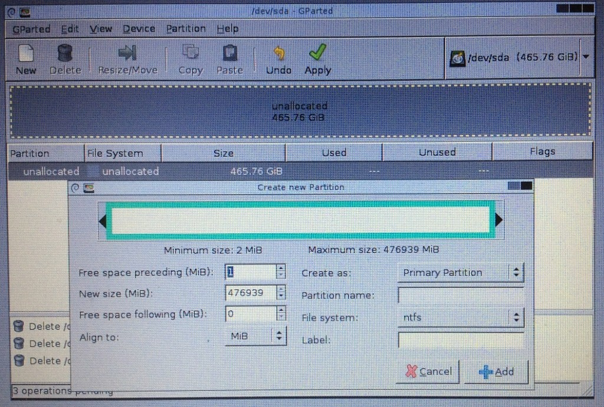

(This is a long ~2900 words post, I recommend reading this from a tablet or computer)

Windows XP is the second-longest supported operating system (OS) in Microsoft's history. Support by Microsoft finally [ended on 8 April 2014](https://www.microsoft.com/en-us/WindowsForBusiness/end-of-xp-support) after a record-setting 12.5 years.  The number one rank is technically\* held by Windows 1.0 at 16 years from 1985 to 2001.

\*I say "technically" as that was when Microsoft finally declared Win 1.0 obsolete but I doubt Microsoft was updating Win 1.0 during its final years. This was unlike WinXP which was updated up to its final moments and even had an [emergency patch](http://www.cnet.com/news/microsoft-fixes-big-ie-bug-on-windows-xp-even/) after its support ended.

This [page](http://www.makeuseof.com/tag/windows-xp-lasted-longer-world-wars-ii-combined/) here also puts XP's length of support in perspective with other Microsoft OSes.

Released in October 2001, it is almost 15 years old today.  I was only 11 years old when this OS was released so you can imagine I pretty much spent much of my teen years using XP machines other than Red Hat Linux of course.

Despite its age, XP continues to live on in embedded systems like ATMs, factory and medical machines where replacement costs and re-certification (timelines) makes them infeasible to be replaced in the near future. An extreme example is how the 23-year-old [Windows 3.1 which crashed is still used in a French airport](http://www.zdnet.com/article/a-23-year-old-windows-3-1-system-failure-crashed-paris-airport/) as of late last year.

# The problem

I work in a startup called Algoaccess where we deal with medical devices specifically optician-related ones. Without going into too much detail, let's just say we occasionally have to handle such older systems and test to make sure our product can work with them. This means we actually need a Windows XP installation for testing purposes. No, virtual machines like VirtualBox or VMWare will not cut it, we need a native installation for realistic testing.

My company could easily procure a machine of an older era with full Windows XP drivers. There are guides like [this](http://multimedia.cx/eggs/running-windows-xp-in-2016/) where people have used an older system to install WinXP in 2016.

But where is the fun in that? I saw this as an opportunity to determine if it is really possible to install WinXP on a much newer system.  It was also a good way to relive a bit of my childhood that way.

First thoughts? It shouldn't be that hard right? I know drivers could be an issue but it shouldn't be a show-stopper? Turns out things are not so easy to put WinXP on modern hardware.

<!--more-->

## The machine

A photo to show that I have successfully installed WinXP on this machine abet with lots of missing drivers.



A short video for "extra proof"

The target machine is a Lenovo Ideapad U330p which was manufactured in 25 July 2014.

### Here are the key specifications:

- Intel Core i5-4210U 1.7Ghz Haswell CPU
- Intel HD Graphics 4400 GPU
- Intel HM77 chipset
- 8GB DDR3 RAM
- Realtek HD Audio
- Intel 7260N Wireless-N and Bluetooth 4.0
- 1366x768 screen
- 500GB + 8 GB SSHD

The Haswell CPU/GPU [was released in Q2 2014](http://ark.intel.com/products/81016/Intel-Core-i5-4210U-Processor-3M-Cache-up-to-2_70-GHz), which is about the time when Microsoft was stopping support for WinXP. Although the HM77 chipset was released earlier in [Q2 2012](http://ark.intel.com/products/64339/Intel-BD82HM77-PCH), both the processors and chipset are not "officially" supported by Intel for WinXP. If this laptop model was just one generation older aka Ivy Bridge, things would have been much easier.

This laptop also does not have an Ethernet port.

# The installation

I took many steps and trial-and-errors to finally get WinXP on the system. So the methods I will detail here contains the finalised set of instructions for it to work.

I have ordered my installation method into 9 steps:

1. [Get a legitimate Windows XP license and ISO CD image](#step1)
2. [Configure your BIOS](#step2)
3. [Slipstream AHCI drivers into WinXP installation media to avoid F6 problem](#step3)
4. [Convert GPT partition table to MBR and create partitions](#step4)
5. [Actually installing Windows XP](#step5)
6. [Install Drivers](#step6)
7. [Windows Update](#step7)
8. [Install relevant software](#step8)
9. [Optimisations](#step9)

## Step 1: Get a legitimate Windows XP license and ISO CD image {#step1}

No license, no installation as simple as that. Considering that I'll be using this machine for business purposes, all the more I cannot be using illegitimate copies.

It is impossible to obtain WinXP via normal retail channels as Microsoft has stopped[ selling it](https://www.microsoft.com/windows/letter.html) as of 30 June 2008. The deadline for OEM partners also ceased not long after. There is however a way, if your business has an Microsoft Developer Network (MSDN) subscription, you win! As Algoaccess is a startup of less than 5 years, we enrolled into [Bizspark](https://www.microsoft.com/bizspark) which gives us 3 years of free access to Microsoft software.

MSDN provides legitimate software licenses and disk images of almost every Microsoft product. This even includes old ones like MS-DOS 6 and Windows 3.1. Talk about going further down memory lane if you want to!

### The MSDN details on my download

Anyway, the disk image I chose is Windows XP Professional with Service Pack 3. There exists a 64 bit version of XP Pro but I rather not go that way as drivers for that are hard to find even in its era.

This disk image is only 589MB which fits nicely inside a CD, modern OS images are nowhere near that size now.

## Step 2: Configure your BIOS {#step2}

XP was created in an era where there was no Serial-ATA (SATA) drives, no SSD drives, no UEFI, no GPT, USB was starting to get more popular and floppy disk drives were still commonplace. Your BIOS settings must take care of these limitations.

Make sure to disable UEFI booting.

Not shown in the picture is the "USB Legacy" option. As this laptop does not have a CD drive, we have to start off from either a USB CD or flash drive. Both of these will require the USB Legacy option to be enabled if your BIOS has it.

Another optional setting is SATA mode. If you have a choice for IDE or AHCI mode, you should always pick AHCI if you have the drivers or IDE for maximum compatibility. AHCI is required for the extra features like extra bandwidth, [Native Command Queuing](https://en.wikipedia.org/wiki/Native_Command_Queuing) and hotplugging. AHCI will require extra drivers which have to be slipstreamed into the WinXP installation media which is in the next step.

For my case in the U330p, there is no SATA mode option in the BIOS so the AHCI mode is constantly enabled. This means I'll definitely need extra AHCI drivers before installation.

## Step 3: Slipstream AHCI drivers into WinXP installation media to avoid F6 problem {#step3}

### What is this F6 problem?

This was a common problem even during the heydays of Windows XP. A more detailed post about this issue has been written by another blogger [here](http://www.tim.id.au/blog/tims-f6-driver-guide/).

Basically since WinXP was created in an era where there were no SATA drives, the installation CD can only recognise IDE/Parallel-ATA drives.  Windows XP also happens to be the last OS I believe to have its installation interface seem like a DOS-lookalike text-based installers of its predecessors.

When you boot an original installation CD, this message will flash for about 3 seconds at the start. You can press F6 to immediately proceed with loading your own SATA drivers. This is where the issue got its name from. If you ignore this, you will still get another chance later.

If you ignored the F6 keypress earlier, this installer can't see the SATA drives in your system and prompt you for the hard disk controller drivers, via no kidding, a FLOPPY DISK as you can see below.

Seen in the context of that era, the floppy disk thing is quite understandable. If your hard disk controller is not recognised, your CD drive is holding the Windows CD and USB flash drives are not yet commonplace then what is left?

### How do we solve this?

The proper way if one does not have an internal floppy drive is to get a USB floppy drive, load the AHCI drivers into the floppy disk and proceed as per normal. Believe me, I have tried this solution years before and it works provided if you have the right USB floppy chipset. More details on supported floppy chipsets in the same [F6 explanation link](http://www.tim.id.au/blog/tims-f6-driver-guide/).

The more elegant solution however, is to inject the AHCI drivers directly into the installation media so WinXP can recognise your hard disk controller from the get go. If one is using an older machine, getting the AHCI drivers is no biggie, just a download away from the Intel website. However, we are now using a more modern 8-Series chipset.

Thankfully, a Google search brought a lifesaver. Somebody has modded his own universal AHCI drivers with support for the newer chipsets. You can download the driver [here](http://www.win-raid.com/t11f23-Modded-Intel-AHCI-and-RAID-Drivers-digitally-signed.html) or in the picture link below.

Download older version of [nLite 1.4.9.3](http://www.nliteos.com/download.html) instead of the newer NTLite which does not work with Windows XP. (For the following nLite steps, I'll not screenshot every step, just the important ones)

Extract the WinXP ISO, open nLite and point nLite to the extracted folder. 

You should see the above if everything is done properly.

Select the Drivers and Bootable ISO options.

Just add everything in. Don't worry about conflicts, the XP installer is smart enough to select the correct driver for your system. If you really do get problems, you can consult the TXTSETUP.OEM in the driver zip to see which is the correct driver for your Southbridge model to specifically slipstream in.

Once done, just burn this image to disc/file, copy to USB flash drive depending on how you are starting the system.

## Step 4: Convert GPT partition table to MBR and create partitions {#step4}

Modern disks now come pre-formatted with the [GUID Partition Table (GPT)](https://en.wikipedia.org/wiki/GUID_Partition_Table) instead of the legacy [Master Boot Record (MBR)](https://en.wikipedia.org/wiki/Master_boot_record). If you wish to know why GPT has superceded MBR, just consult the Wikipedia articles. The problem is that WinXP cannot be installed on hard disks that use GPT. We have to convert them to MBR. Note that MBR only supports hard disks up to 4 terabytes (TB).

We shall use a partitioning tool called [GParted](http://gparted.org/) to do the job. Just download the ISO image and boot from it.

### Converting to MBR

The GParted program will start automatically on boot. Just click Device -> Create Partition Table. Choose the new partition table type to be "msdos" which is actually MBR.

### Create your partition(s)

You may be tempted to just restart and allow the XP installer create the partitions during the (next) install step. I do NOT recommend you let XP handle partitioning especially if you are using an SSD or modern magnetic drives. Modern [Advanced Format](https://en.wikipedia.org/wiki/Advanced_Format) drives from 2009 now use a 4KiB sector size instead of 512bytes which was the era where XP was designed. If your created partition is not aligned to 4KiB, which a legacy OS like XP will get wrong, you will have performance issues. More details can be found [here](http://www.seagate.com/sg/en/tech-insights/advanced-format-4k-sector-hard-drives-master-ti/) and [here](http://superuser.com/questions/982680/whats-the-point-of-hard-drives-reporting-their-physical-sector-size).

So it is better to let GParted handle the partition creation.

Ensure that your first partition has a Free space preceding of 1 MiB to ensure the partition is aligned to the 4KiB boundary. Remember that in an MBR layout, you can have at most 4 primary partitions. If you need more partitions, then one of the partitions have to be created as "Extended" and then you place multiple "Logical" drives inside it.

## Step 5: Actually installing Windows XP {#step5}

Boot from your favourite install media, whether it is CD, flash drive or CD-ISO emulators like the [Zalman VE-350](http://www.zalman.com/global/product/Product_Read.php?Idx=965). Modify your BIOS settings if necessary if you can't boot from your media.

This screen greets you at the start. Future Windows setups will no longer have this blue background with white text theme. This is a legacy from the Windows 3.0 installer which was released in 1990. You can see the similarity in this [Windows 3.0 setup video](https://www.youtube.com/watch?v=E2WUIcfKwWQ).

The XP installer should now treat your hard disk controller as if it has recognised it from the day the image was made.

It will reboot to the GUI installer after some time. Easiest Windows eh? Integrated CD recording was such a hit thing then, nobody ever does it today.

At one point you can customise the date range option. The default is 2029 which is awfully close already, you should change that to something further away.

This window indicates your Setup process is coming to an end. This section was actually introduced in Service Pack 2 in 2004 to encourage more people to update Windows in response to greater security threats. Both options don't matter today, Windows XP no longer has any new updates. In fact, turning off updates is better as the OS does not need to constantly poll Microsoft's servers for non-existent updates.

And we are almost done! Not totally, but successfully reaching the desktop is a major milestone in any OS installation. Look at the mass of missing drivers man. I'll try to rectify that.

Notice the AHCI driver is a third party one I slipstreamed in earlier. As this is a 32-bit OS, we can't use the entire 8GB of RAM and some of it is taken up by the GPU.

## Step 6: Install Drivers {#step6}

I'm mentally prepared that we can't install all the drivers but the ones I'm targeting are major ones like network, video and audio.

### Network

The internal wifi card is an Intel Wireless-N 7260 which does not have Windows XP drivers. This laptop does not have a RJ45 ethernet adapter. To initially tide my way through, I tentatively used a USB-Ethernet adapter. I happened to purchase this [USB 3.0 hub/Ethernet](http://www.amazon.com/Cable-Matters-SuperSpeed-Gigabit-Ethernet/dp/B00ESFQCGO) combo sometime back so I used it. It is based on the ASIX AX88179 which thankfully has a [Windows XP driver](http://www.asix.com.tw/FrootAttach/driver/AX88179_178A_WinXP_Vista_32bit_Driver_v1.4.2.0_WHQL.zip).

The USB 3.0 is obviously in name only in this context. USB 3.0 is not supported on Windows XP.

I later used another USB Wifi adapter based on the Mediatek MT7601 which also had [Windows XP drivers](http://www.mediatek.com/en/downloads1/downloads/).

### Video

Without graphics drivers, the video performance of the OS will be very sluggish. The screen will occasionally flicker and frame rate is low when you do stuff like dragging the application window or scrolling in your web browser.

The Intel HD 4400 has a grey area when it comes to WinXP driver support. Many sources online claim Intel no longer supports it yet drivers seem to be floating around like [here](http://drivers.softpedia.com/blog/Intel-Outs-HD-Graphics-Driver-Build-5441-for-Windows-XP-360898.shtml) and [here](https://downloadcenter.intel.com/download/22875/Intel-HD-Graphics-driver-for-Windows-XP32-Embedded). Anyway those drivers didn't work, only caused my laptop to [BSOD](https://en.wikipedia.org/wiki/Blue_Screen_of_Death). I was on the verge of giving up when I stumbled on this [Universal VESA/VBE Video Display Driver](http://navozhdeniye.narod.ru/vbemp.htm).

Now VESA is a name I have not heard in a long time. This aim of that driver is as follows:

_"This driver is intended for using in case when your have some new or unknown video card(s) and you don't have drivers for it. It's better to contact manufacturer of your video card or search THE WEB for the drivers. ONLY if you finally cannot find driver for your video card I recommend you to use mine (vbemp.sys). My driver is very simple one & does not provide any kind of 3D hardware acceleration (DirectX & OpenGL)."_

This is EXACTLY my use case here!

I happily used the VBE 3 version and am happy to report that things are much improved. Not as good as one by the manufacturer itself as there is no hardware acceleration but still much better performance than no driver at all. The brightness is also locked at maximum so be wary about straining your eyes if you are using a laptop. The HDMI output of the laptop is also unusable.

### Audio

This is an easy one, [Realtek's website](http://www.realtek.com.tw/downloads/) still provides Windows XP drivers for its High Definition Audio Codecs so I just got the drivers from there.

### The result

I still don't have all the drivers but at least the major stuff is working. The missing USB controller driver is not mandatory for usage of the USB ports. However, USB 3.0 speeds may still be possible even though the proper drivers are not be loaded. Thanks to AJ's comment below.

Contrast this with the complete reference installation on Windows 7

## Step 7: Windows Update {#step7}

Although WinXP no longer has new updates, it does not mean we do not install the existing ones. Microsoft fortunately did not pull the product activation and update servers. Hundreds of updates await. The .NET frameworks that come with Windows Updates will also be useful. 

You can turn off Automatic Updates. Remember to run Windows Update repeatedly until no more updates are displayed as the installation of some updates will "spawn" more updates.

This was one of the last updates by Microsoft, the End-of-life notification.

(June 2017 update): I recently reinstalled a fresh Windows XP system and could not get Windows Update to work. Nevertheless, I found someone has made an unofficial Service Pack 4! Check it out [here](https://ryanvm.net/forum/viewtopic.php?p=133918).

A separate update that you might want to install is the exFat update which will allow you to handle external drives formatted with the exFAT file system. The update was originally available [here](https://support.microsoft.com/en-us/kb/955704) but Microsoft pulled the update file. Thankfully another blogger has downloaded a copy and is [hosting it](http://blog.tatedavies.com/2013/02/20/exfat-drive-not-working-in-windows-xp/).

You might also want to install a patch to defend against the Wannacrypt attack if Windows Update does not do it for you. More details can be found in this [Microsoft blog post](https://blogs.technet.microsoft.com/msrc/2017/05/12/customer-guidance-for-wannacrypt-attacks/).

## Step 8: Install relevant software {#step8}

One of the first software you should install is a modern web browser. Windows Update will upgrade you to Internet Explorer 8 from 6 but that is still grossly out of date. Google Chrome will [stop supporting Windows XP as of April 2016](https://chrome.googleblog.com/2015/11/updates-to-chrome-platform-support.html) which is this month so I won't be using that. This leaves Mozilla Firefox [which is still supported for XP](https://support.mozilla.org/en-US/kb/get-latest-version-firefox-windows-xp-vista).

Here is my recommended list whose latest versions still support Windows XP as of time of writing.

1. [Mozilla Firefox](https://www.mozilla.org/en-US/firefox/new/)
2. [7zip](http://www.7-zip.org/download.html)
3. [VLC](http://www.videolan.org/vlc/index.html)
4. [Sumatra PDF Reader](http://www.sumatrapdfreader.org/free-pdf-reader.html)

If you like, you can install some [Powertoys for Windows XP](https://en.wikipedia.org/wiki/Microsoft_PowerToys#PowerToys_for_Windows_XP). They are a collection of tools I used to enjoy using years back when XP was still my primary OS.  I especially like Tweak UI, Open Command Window Here, Image Resizer and Alt-Tab Replacement. You can [download the entire collection from Majorgeeks](http://www.majorgeeks.com/files/details/microsoft_windows_xp_powertoys.html).

## Step 9: Optimisations {#step9}

You can follow [this guide](https://www.marksanborn.net/software/what-to-do-after-a-fresh-install-of-windows-xp/) written by another blogger.

On top of his steps I usually do this list of non-exhaustive steps also:

1. [Solve .Net Framework 4.0 service startup time](http://answers.microsoft.com/en-us/windows/forum/windows_xp-performance/kb982670-net-framework-4-client-profile-slows-down/4476f6ab-3355-4ed6-bec2-bfe18dd408b0)

- _"%systemroot%\\Microsoft.NET\\Framework\\v4.0.30319\\ngen.exe executequeueditems"_

1. You must be wondering what is the black theme in the screenshots above. It is the [Royale Noir](http://www.istartedsomething.com/20061029/royale-noir/) theme, a unique Microsoft-signed theme that was not released initially.
2. [Enable Cleartype](https://support.microsoft.com/en-us/kb/306527) for screen fonts as they display better on LCDs. Remember XP was created in an era where [Cathode ray tubes (CRT)](https://en.wikipedia.org/wiki/Cathode_ray_tube) monitors were more common and LCDs were a luxury.
3. [Disable Security Centre](http://www.wikihow.com/Disable-the-Windows-XP-Security-Center) to avoid being irritated by updates and antivirus alerts that are no longer applicable.
4. [Display hidden files, folders and extensions](https://www.microsoft.com/resources/documentation/windows/xp/all/proddocs/en-us/win_fcab_show_file_extensions.mspx?mfr=true)

## The End

So I have come to the end of my post. I assume most of you readers will not actually try to install XP in this day and age, at the most you will only do so in virtual machines. Nevertheless, I have learned lots especially the universal AHCI and video drivers part which will continue to be applicable in future.

Other than the latest Windows 10, currently supported operating systems like Windows 7/8 will eventually meet the fate of WinXP years from now and the problems will repeat again once more. I'm not surprised somebody will write a future guide: "How to install Win 7 on a modern system". Till then, I had fun writing this post and going down memory lane and I hope you will too.

If you like this post, you can read about how I got [Windows 3.1 working on both a vintage and modern machine in 2016](/2016/09/windows-for-workgroups-3-11-on-vintage-and-modern-hardware-in-2016/).
