I'm part of this voluntary social initiative called [Repair Kopitiam](http://repairkopitiam.sg/) (RK) started by the social enterprise [Sustainable Living Lab](http://www.sl2square.org/). On a monthly basis, we teach Singapore residents how to repair their household electrical appliances, fabrics and furniture. Our volunteers are called repair coaches. This initiative is similar to [Repair Cafes](https://en.wikipedia.org/wiki/Repair_Caf%C3%A9) which originated in Europe. My area of speciality is of course in the electrical appliance department.

This post is however not about the intricate details of volunteering, it will be about the special electrical tools I have developed in the course of my volunteering in response to certain unique issues faced by the RK team.

A literally high-level view of the tools I developed.

[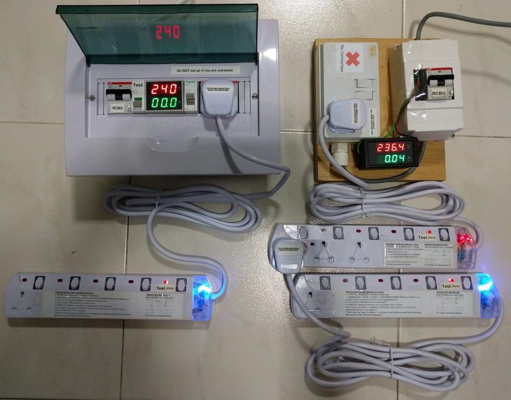](images/rk-equip-equipment-overview-small.jpg)

<!--more-->

Here is the video of the talk I gave at [Hackware v2.0](https://www.facebook.com/events/481593632030061/) about these tools. 



# The problems

I'm sure everyone of us have heard about [circuit breakers](https://en.wikipedia.org/wiki/Circuit_breaker) (CBs). They are basically automated switches that cut the circuit if they if they detect something dangerous like current overload or if earth leakage has been found. Breakers are installed everywhere in buildings, homes and even at void decks of HDB flats where RK operates.

Since RK is about repair, we encounter numerous faulty devices where a significant fraction is due to earth-leakage issues. When plugged in to a wall socket, an appliance with an earth-fault will cause your [residual-current circuit breaker (RCCB)](https://en.wikipedia.org/wiki/Residual-current_device) to trip cutting power to your entire home.

### Problem 1: Safety

Since we deal with so many faulty appliances, the risk we face is far higher than the typical household person. The safety margins of typical household CBs may not be sufficient owing to our higher exposure to potentially dangerous situations.

### Problem 2: Inaccessible onsite breaker

Typically when an appliance trips your household breaker, all you have to do is unplug the faulty device and reset the breaker. Not so simple for RK, the electrical services of void deck of HDBs are usually under the purview of an external company contracted by the town council. For the case of our Tampines location, it is by the Essential Maintenance Service Unit (EMSU). The EMSU does not allow us to have unaccompanied access to the electrical room holding the circuit breaker for security reasons.

[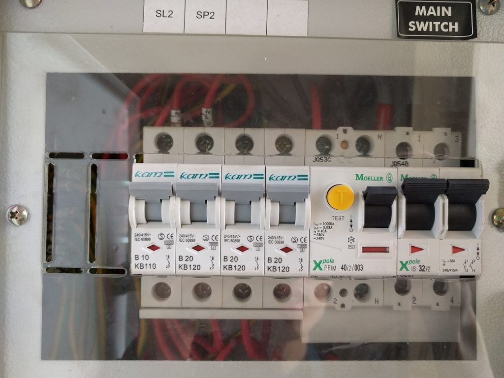](images/rk-equip-onsite-cbs.jpg)

This is a photo of the onsite breaker in one of the distribution boxes in a HDB block at Tampines.

So whenever the CB trips, we have to call EMSU and they have to send a representative down to unlock the room to reset the breaker. This process can take up to 75 minutes when in the meantime, there is no power and no testing can proceed.

### Problem 3: Inconvenience of breaker trip

Even if a tripped breaker can be easily reset, the sudden loss of power can affect the work of others. RK has a fabric and home improvement section as well so they will be affected. For example, imagine the frustration if someone is using a sewing machine or welding and the power were to suddenly go out.

Frequent tripping of a CB may also reduce its lifespan and sensitivity even if one is rated for thousands of trips. We should avoid trips if we can.

# The solution

I came up with a 4 tools to address these problems. Specific hardware details of all the tools can also be found in this [Github repo](https://github.com/yeokm1/repair-kopitiam-training-and-equipment).

## Solution 1: A more sensitive circuit breaker

Circuit breakers come in 2 forms, the [miniature circuit breaker(MCB)](https://en.wikipedia.org/wiki/Miniature_circuit_breaker) and the [residual-current circuit breaker (RCCB)](https://en.wikipedia.org/wiki/Residual-current_device). The former trips when an overload current threshold is reached and the latter when an earth-leakage threshold is detected. To be safer, our CB has to be more sensitive than the existing one.

The lowest rated MCB at Tampines  is "B 10" which is a Type B characteristic at 10 Amperes. The Earth leakage threshold is the typical 0.03A or 30mA which is the same for most homes.

You can [read more](https://en.wikipedia.org/wiki/Circuit_breaker#Standard_current_ratings) about CB trip characteristic types but the Type B is already the most sensitive one out there which will instantly trip at 3x-5x rated current (at 3x-5x of 10A). The more important rating is the Earth leakage, a 30mA threshold is not that low actually, it will be safer to have a lower rated one.

[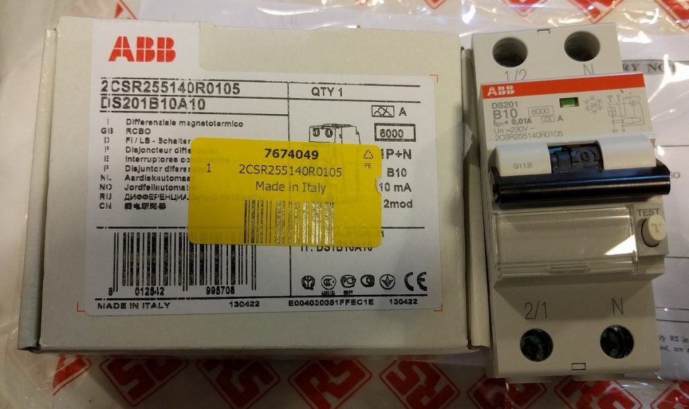](images/rk-equip-rcbo-raw.jpg)

So I bought a residual-current circuit breaker with overcurrent protection (RCBO) [from RS-online](https://sg.rs-online.com/web/p/rcbos/7674049/) which combines the functions of an MCB and RCCB to save space. This RCBO is a DS201 model from ABB which can trip at 10mA residual current and 10A Type B overload.

[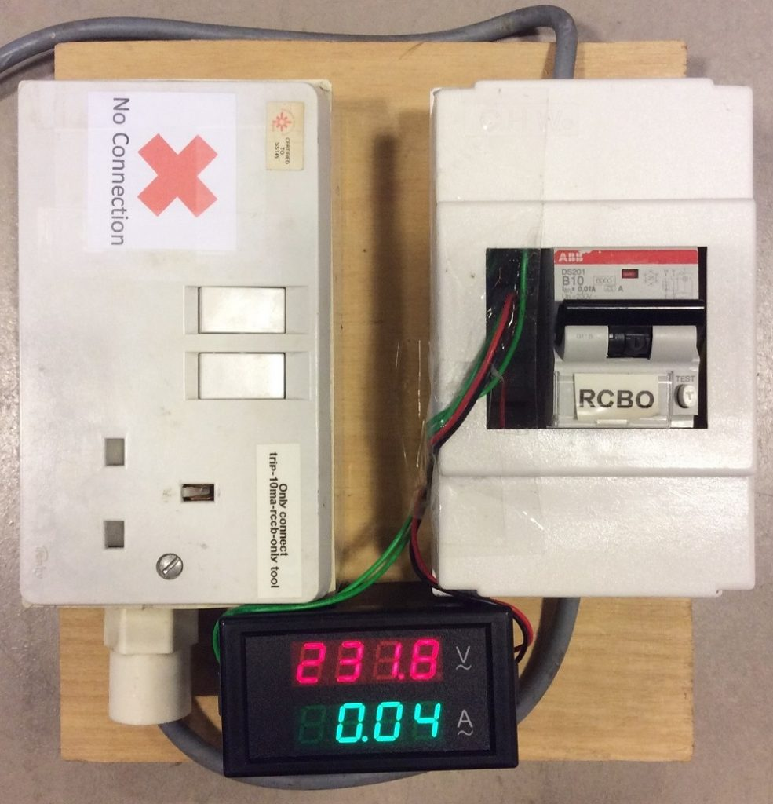](images/rk-equip-10ma-rcbo-front-985x1024.jpg)

A wooden piece secures all the parts together. A previous batch of Repair Coaches built this tool to attack this very problem but failed. For me, I replaced their existing MCB+RCCB combination with my RCBO. I added a multimeter [bought from AliExpress](http://www.aliexpress.com/item/AC-Digital-Ammeter-Voltmeter-Dual-Digital-LCD-Panel-Amp-Volt-Current-Meter-100A-80-300V-w/32264125864.html) because I felt it was just right although it does not affect the circuit in any way. Technical data of this solution can be found [here](https://github.com/yeokm1/repair-kopitiam-training-and-equipment/tree/master/10ma-rcbo).

One of the multimeter's LCD cells is faulty at the time I took the video...

Demo video to showcase the multimeter abilities. 



## Solution 2: Prevent the onsite circuit breaker from tripping

As mentioned in the problem statement earlier, if the onsite-breaker trips, everyone has to stop work for an hour plus till it is rectified. So we have to prevent the onsite CB from tripping but at the same time, due to safety considerations, our solution still has to disconnect the power in the event of an earth fault.

Below is a demo video illustrating the operation of the tool which I shall aptly name: trip-10ma-rccb-only-tool. 



Technical data of this solution can be found [here](https://github.com/yeokm1/repair-kopitiam-training-and-equipment/tree/master/trip-10ma-rccb-only-tool).

Notice the use of the test button and how a direct short from the Live to Earth wire only trips the 10mA RCBO and not that of the room. The red LEDs blink for an instant confirming a presence of an Earth fault.

[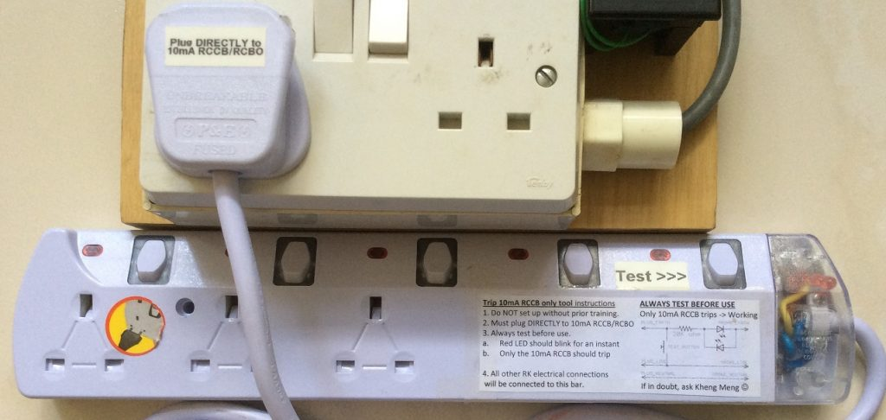](images/rk-equip-trip-10ma-rccb-only-tool-front-1024x486.jpg)

### Usage instructions of this tool:

1. Do NOT set up without prior training.
2. Must plug DIRECTLY to 10mA RCCB/RCBO
3. Always test before use.
    - Red LED should blink for an instant
    - Only the 10mA RCCB should trip
4. All other RK electrical connections will be connected to this bar.

### What has been modified?

We shall look at a schematic of the modifications I have made to a power strip.

[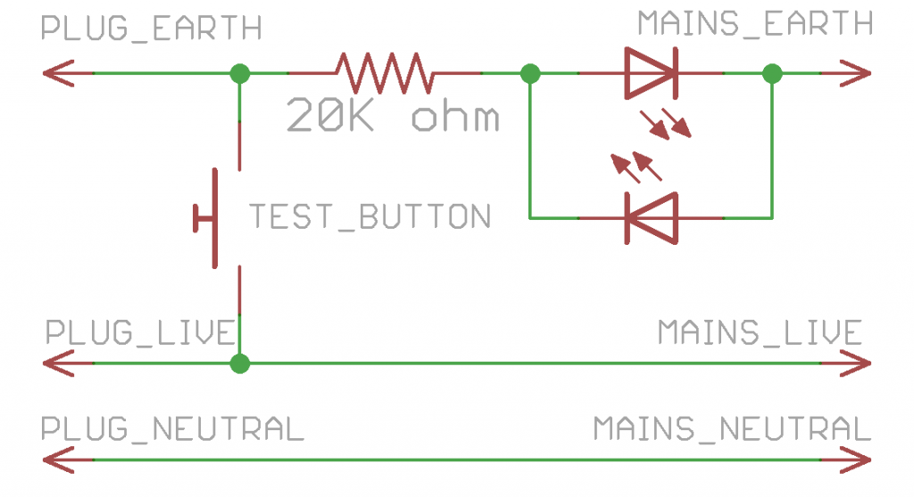](images/rk-equip-trip-10ma-rccb-only-tool-1024x558.png)

I have placed a 20K ohm resistor and some red 400mcd LEDs on the Earth line. Notice that the LEDs are in opposite directions. This arrangement will still allow the AC current to flow unhindered.

[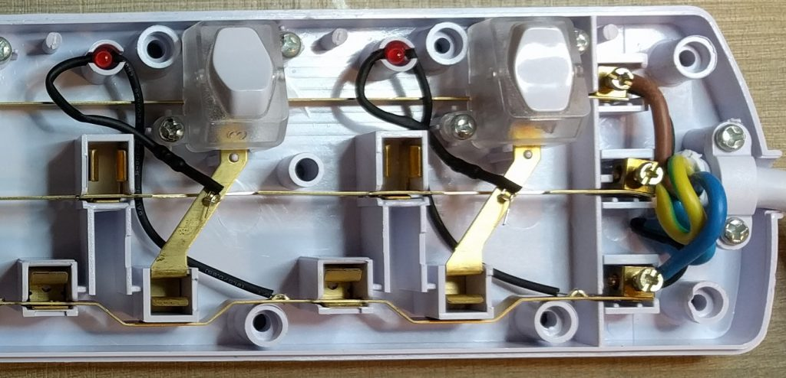](images/rk-equip-bar-original-1024x494.jpg)

This is the power bar in its original form

[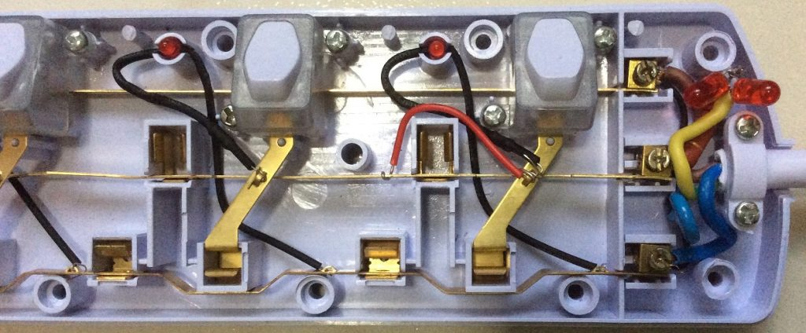](images/rk-equip-trip-10ma-rccb-only-tool-internal-1024x424.jpg)

Here are my modifications. The rightmost button has been converted to a test button where the socket live is connected to the earth line by the red wire to simulate a faulty appliance. If pressed, the red LEDs will blink for an instant and only the 10mA RCCB/RCBO will trip, not the 30mA onsite breaker.

### How it works?

The main component of this tool is the 20K ohm resistor whose value has been carefully chosen. Remember that we want to trip our 10mA breaker and not the 30mA onsite breaker. Although the breakers are rated at those levels, the trip margins of most breakers can actually be as low as half their rated values which will be 5mA and 15mA respectively.

Recalling secondary/high-school Physics, we have the electrical equation

Voltage (V) = Current (I) x Resistance (R)

\-> R = V / I

If we want to trip just below the onsite threshold of say 14ma, it will be I = 0.014A. The mains voltage in Singapore is about 240 volts.

R = 240 / 0.014 ≈ 17K Ω

One also requires the power rating in order to purchase resistors so using

Power (P) = Current (I²) x Resistance (R)

P = 0.014² x 17K ≈ 3.3W

The closest resistor value I can easily obtain as such high wattage is 18K ohm as most resistors are rated at 0.25W. Nevertheless even at 18K ohm, the onsite breakers I have tested with still trip occasionally as being so close to the threshold, just a small amount of existing Earth leakage in the system will still trip the onsite breaker.

I eventually selected a 20KΩ, 3W resistor which will reduce the Earth leakage to 12mA which is above the threshold of our breaker but not enough to trigger the onsite breaker.

### That is the worst case scenario, what happens if the device leaks a small current in the first place?

My prior calculations assume a worse case scenario of a direct short from Live to Earth. What happens if an appliance leaks an earth current of exactly 15mA which is the minimum threshold that will still trip the breakers of most homes. Will my tool still safely disconnect the circuit?

To produce a 15mA current:

R = V / I = 240 / 0.015 = 16K Ω

This means a home appliance has to have at most a 16K ohm resistance somewhere between the Live and Earth lines to just barely trip a typical breaker. Adding to the 20K Ω used in my tool yields a total of 36K Ω resistor between Live and Earth.

I = V / R = 240 / 36K ≈ 6.67mA

6.67mA is below the theoretical threshold of our 10mA RCBO but may be within its trip margin. I did try adding a 36K resistor behind our RCBO and it still does trip. In fact, just for fun, I decided to see at what threshold will our RCBO fail to trip.

[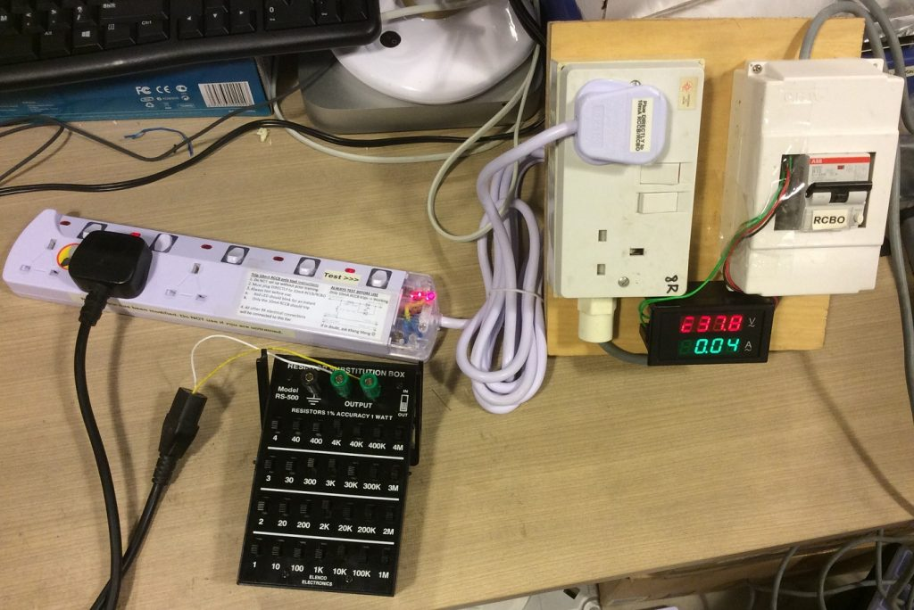](images/rk-equip-max-no-trip-resistance.jpg)

The lowest resistance to eventually not trip our setup is 39300Ω which generates 6.1mA of earth leakage. 39200Ω is the highest that still trips.

In short, this tool is safe. If the earth leakage of an appliance does not trip with our tool and RCBO, it will not trip your house CB anyway.

## Solution 3: Totally prevent Circuit Breaker trips

To not interrupt the work of others, we should not unnecessarily trip the CB yet we still need a way to detect that an appliance has an earth-fault.

Below is a demo video illustrating the operation of the tool which I shall also aptly name: anti-trip-earth-leakage-detector. 



Technical data of this solution can be found [here](https://github.com/yeokm1/repair-kopitiam-training-and-equipment/tree/master/anti-trip-earth-leakage-detector).

Notice the use of the test button and how a direct short from the Live to Earth wire only light up the blue LEDs and does not even trip our RCBO.

[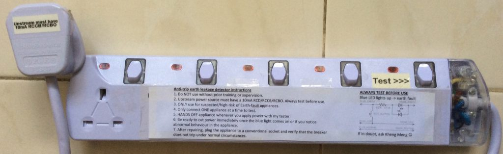](images/rk-equip-anti-trip-earth-leakage-detector-1024x314.jpg)

I block out all the sockets except one not just for instructions but to prevent people from connecting more that one appliance to this tool. Connecting one appliance is dangerous as it is. If 2 or more appliances are connected, just one faulty appliance will cause the external surfaces of the other connected appliances to be Live as they all share the same Earth wire.

**Usage instructions of this tool:**

1. Do NOT use without prior training or supervision.
2. Upstream power source must have a 10mA RCD/RCCB/RCBO. Always test before use.
3. ONLY use for suspected/high-risk of Earth-fault appliances.
4. Only connect ONE appliance at a time to test.
5. HANDS OFF appliance whenever you apply power with my tester.
6. Be ready to cut power immediately once the blue light comes on or if you notice abnormal behaviour in the appliance.
7. After repairing, plug the appliance to a conventional socket and verify that the breaker does not trip under normal circumstances.

**What has been modified?**

The modification is very similar to the previous solution.

The only schematic difference now is the higher 62K ohm resistor.

[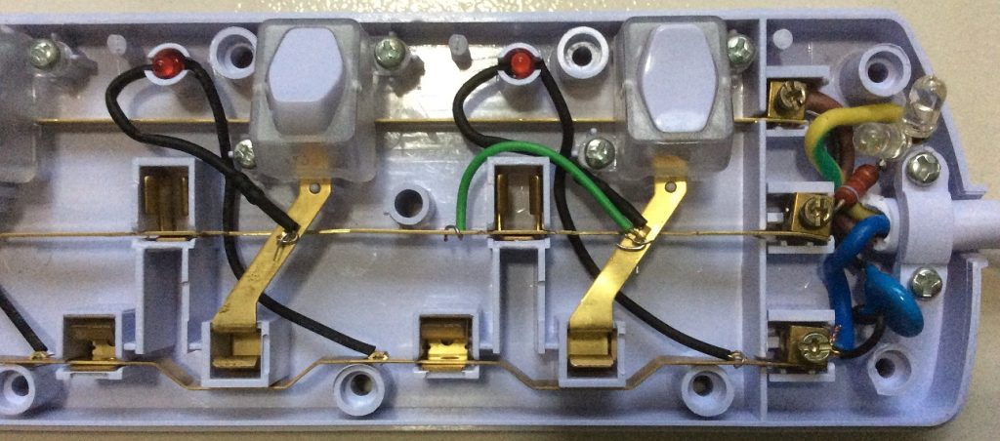](images/rk-equip-anti-trip-earth-leakage-detector-internal.jpg)

The rightmost button has been converted to a test button where the socket live is connected to the earth line by the green wire to simulate a faulty appliance. If pressed, the blue LEDs will light up continuously until the test button is switched off. The 10mA RCBO should not trip.

### How it works?

The main component of this tool is the 62K ohm resistor whose value has been also been carefully chosen. We do not even want our 10mA RCBO to trip. To guarantee that, our earth leakage current has to be less than half (5mA).

R = V / I = 240 / 0.005 = 48K Ω

The resistance should at least be 48K Ω.

P = I² R = 0.005² x 48K ≈ 1.2W

Resistor must be able to handle at least 1.2W.

I eventually settled on a 62K ohm, 2W resistor that I can easily obtain at such high power levels.

I = V / R = 240 / 62K ≈ 3.87mA

For the LEDs, I deliberately chose the bright 600mcd blue LEDs as they can still output significant brightness even if the input current is low.

### Safety consideration

This tool is actually very dangerous if one does not understand how to use it properly. Since this tool prevents the CB from tripping, a person will get a huge shock if he touches an appliance with an earth leakage issue. Once a shock happens, the RCBO will finally catch the issue and trip but it will be a reactive trip to a human electrocution and not due to an earth leak. It will be bad during the few 100 milliseconds it takes for the RCBO to respond.

Therefore this tool should only be used by experienced electrical coaches.

## Solution 4: Combine Solutions 1 and 2

As I have a better understanding of the problem and the solutions, I realised that Solution 1 and 2 are always stuck together. It would thus make sense to combine both of them to avoid the case where the person setting up forgets to connect the trip-10ma-rccb-only-tool to the 10ma-rcbo.

Below is a demo video illustrating the operation of the tool which I shall also aptly name: 10ma-rcbo-and-anti-external-cb-trip. 

<iframe src="https://www.youtube.com/embed/h-DokWP5Kic" width="560" height="315" frameborder="0" allowfullscreen="allowfullscreen"></iframe>

Technical data of this solution can be found [here](https://github.com/yeokm1/repair-kopitiam-training-and-equipment/tree/master/10ma-rcbo-and-anti-external-cb-trip).

The video also demos the use of this tool with Solution 3: anti-trip-earth-leakage-detector.

[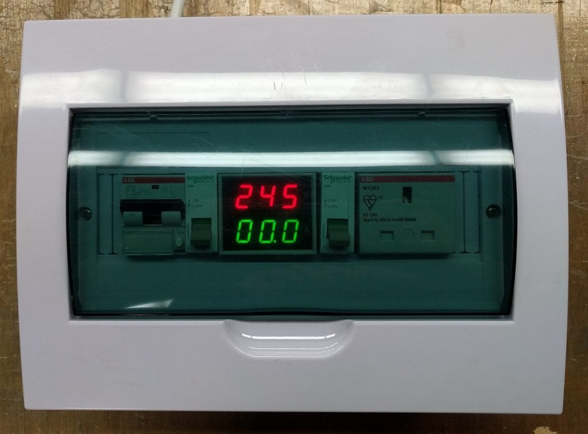](images/rk-equip-10ma-rcbo-and-anti-external-cb-trip-front-close.jpg)

The front of the tool with the protection hood down.

Window up with everything shown. Looks much more elegant and neater than the other solutions right?

### Usage instructions of this tool:

1. Do NOT set up without prior training.
2. Always test before use.
    - a. Only the 10mA RCCB should trip
    - If it does not, there may be a problem with the external Earth connection or with this tool. Do not continue to use.
3. All other RK electrical connections will be connected through this.

### Design

[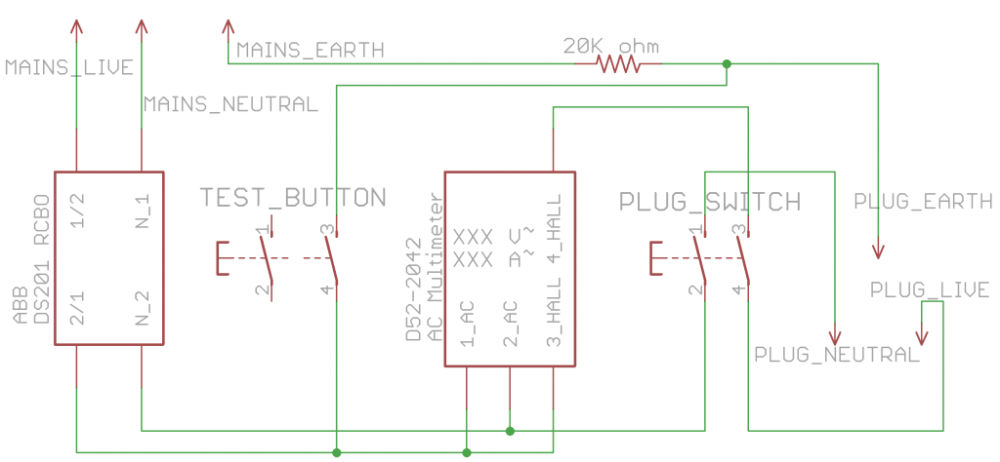](images/rk-equip-10ma-rcbo-and-anti-external-cb-trip.png)

If you have seen the video and the previous solutions, it should not be difficult to understand this.

The AC Multimeter has an integrated hall-effect sensor so all that is needed is to pass the Live wire through it to measure the current. The switches are double pole-single throw, meaning the switch button controls two circuits. For the PLUG\_SWITCH, both Live and Neutral lines will be disconnected if the switch is turned off compared with most switches which only do so on the Live line.

[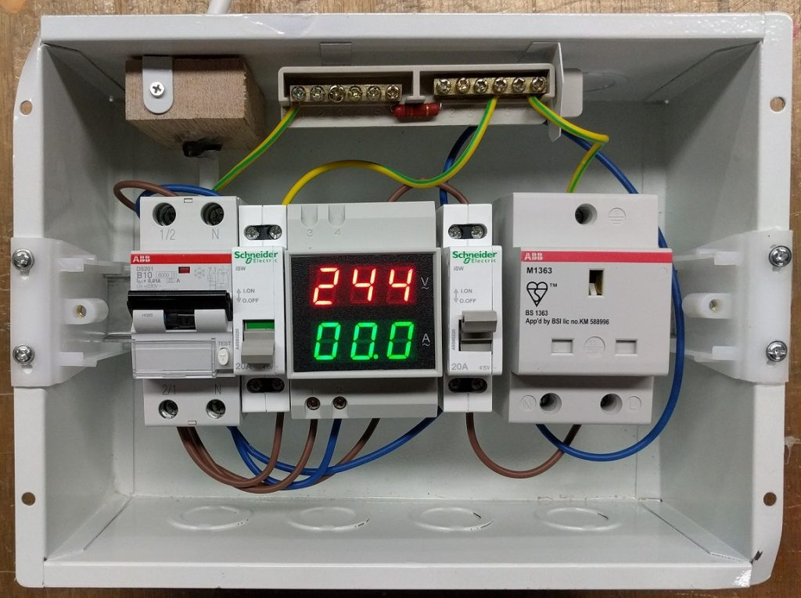](images/rk-equip-10ma-rcbo-and-anti-external-cb-trip-internal.jpg)

This is how things look internally where all the large components are mounted on a 35mm DIN rail. The 20K ohm resistor is mounted in top. I purchased this box from Aliexpress. I could technically make my own box and mount a DIN rail internally but I guess it wouldn't be an efficient use of my time.

[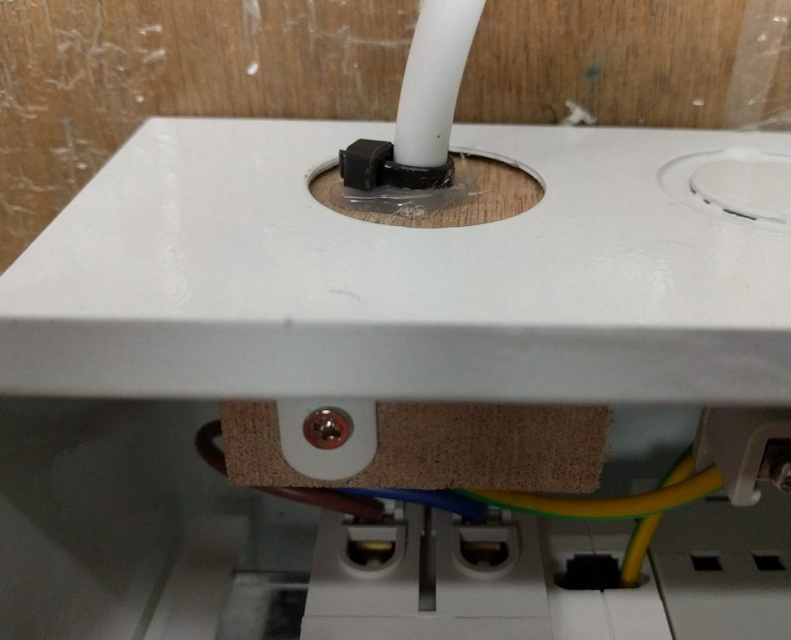](images/rk-equip-10ma-rcbo-and-anti-external-cb-trip-spacer.jpg)

For the mains input into the box, a wooden piece has been cut to size and placed near the opening. A hole is drilled through to allow the mains wire to go through it. After that, everything is secured using cable ties and glue from a hot-glue gun. This should prevent the cables from disconnecting.

Overall, this is a much more elegant, compact and lighter tool compared the Solution 1 and 2 of before.

## Solution 5: Solution 4 + MCBs

Solutions 1 to 4 are targeted only at earth-leakage problems as I thought an external [Miniature Circuit Breaker](https://en.wikipedia.org/wiki/Miniature_circuit_breaker) (MCB) trip is of sufficiently low probability that I should not have to handle it. However, I was wrong as a resident brought down an appliance with a short-circuit issue that tripped the MCB.

This is the MCB in question that tripped.

The MCB is rated as Type B 16A which is very close to the rating of our RCBO which is Type B 10A.

Here is my improved solution which will aptly name: 10ma-rcbo-mcb-and-anti-external-cb-trip

Technical data of this solution can be found [here](https://github.com/yeokm1/repair-kopitiam-training-and-equipment/tree/master/10ma-rcbo-mcb-and-anti-external-cb-trip). [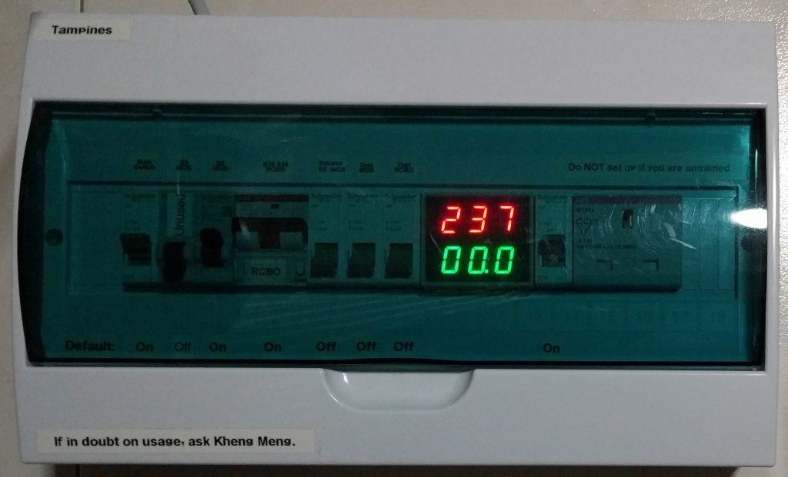]images/rk-equip-10ma-rcbo-mcb-and-anti-external-cb-trip-front-close.jpg)

The front of the tool with the protection hood down.

[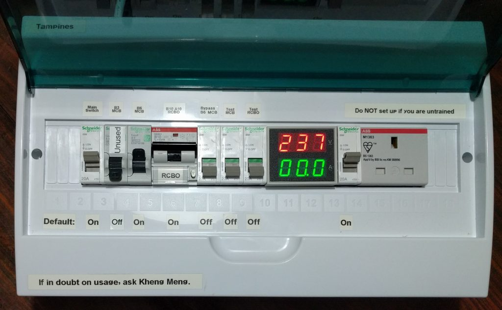](images/rk-equip-10ma-rcbo-mcb-and-anti-external-cb-trip-front-open.jpg)

Window up with everything shown. More complex but just as elegant as the previous Solution 4.

### Usage instructions of this tool:

1. Do NOT set up without prior training.
2. Always test RCBO before use.
    - Only the 10mA RCCB should trip
    - If it does not, there may be a problem with the external Earth connection or with this tool. Do not continue to use.
3. Only test MCB if you are ready for a trip of your onsite MCB.
4. All other RK electrical connections will be connected through this.
5. If the “B3 MCB” keeps tripping due to high-current appliance, you can temporarily engage the “Bypass B3 MCB” switch.

### Design

[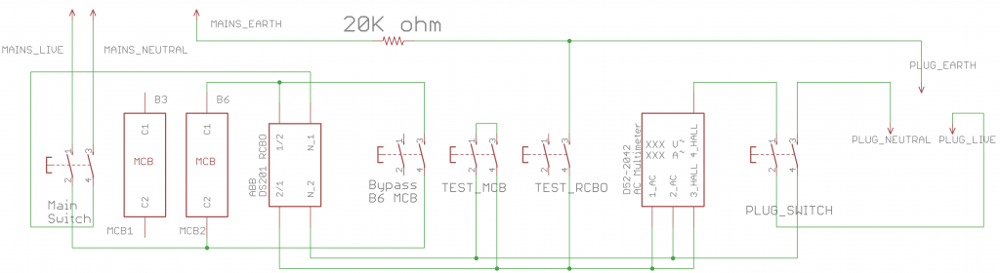](images/rk-equip-10ma-rcbo-mcb-and-anti-external-cb-trip.png)

The primary additions here are the 3A and 6A MCBs as well as extra switches. It is hoped that the lower rated MCBs can "catch" the overcurrent conditions faster than the higher rated ones can. This cannot be guaranteed but I believe it should help. (After use in the field, I disconnected the B3 MCB as it is too sensitive and prone to nuisance trips.

I have also added a Bypass Switch for the B6 MCB. If a high-current appliance is in use, this switch can be temporarily engaged to prevent unnecessary nuisance trips of the B6 MCB.

This Switch was originally placed around the B3 MCB but I realised that B3 MCB was tripping too often so I left the Bypass constantly on. I then found out nuisance trips can occur around the B6 MCB as well. The MCB is rated to trip at 3 – 5 times rated current, but can trip at 50% of rated current under prolonged use. So its effective trip rating can be 6A x (3 to 5) x 50% = 9A to 15A.

Therefore a household appliance which can use up to 13A of current which is within the trip threshold of the B6 MCB.

[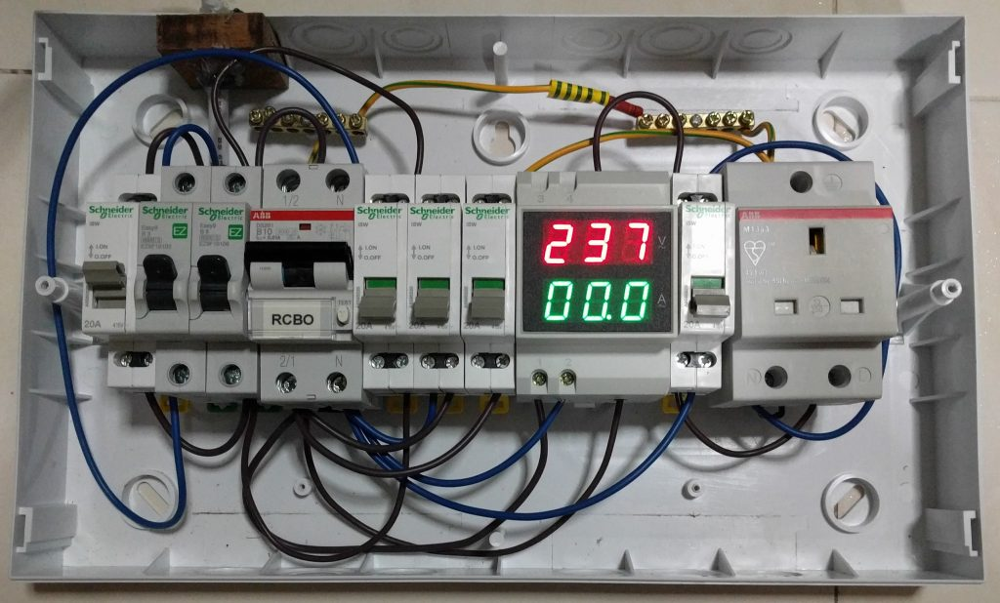]images/rk-equip-10ma-rcbo-mcb-and-anti-external-cb-trip-internal.jpg)

The mounting is largely similar to Solution 4. I just use a bigger box that can accommodate more DIN rail components.

# The conclusion

It took me a span of a few months to finally iterate out this solution that works. For whoever is facing a similar problem, I hope you will find this post useful. I really relished this opportunity to solve unique problems where there are no off-the-shelf solutions after all as they say, "constraints drive creativity".

If this post interests you and you wish to know more about Repair Kopitiam or even better to join us, feel free to check out our [website](http://repairkopitiam.sg/) and [Facebook page](https://www.facebook.com/repairkopitiam/).

[Part 2 of this project can be found here](/2017/07/repair-kopitiam-specialty-electrical-tools-part-2-short-circuit-limiter/).
