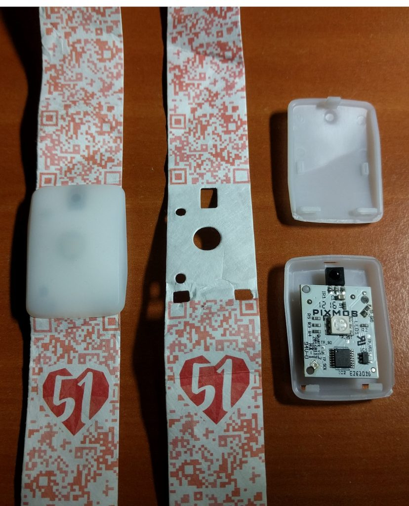
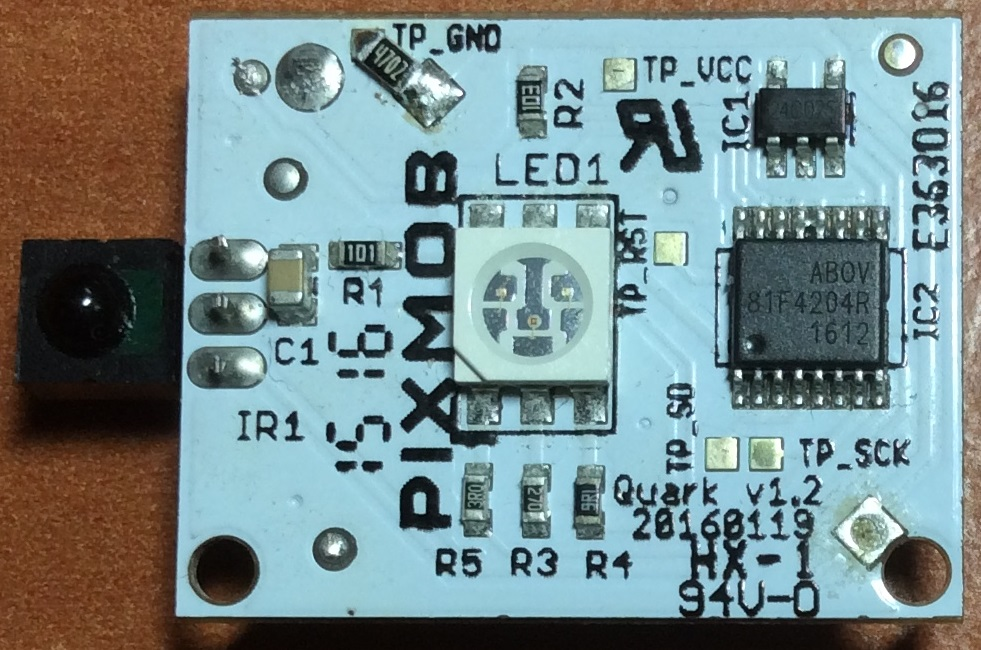
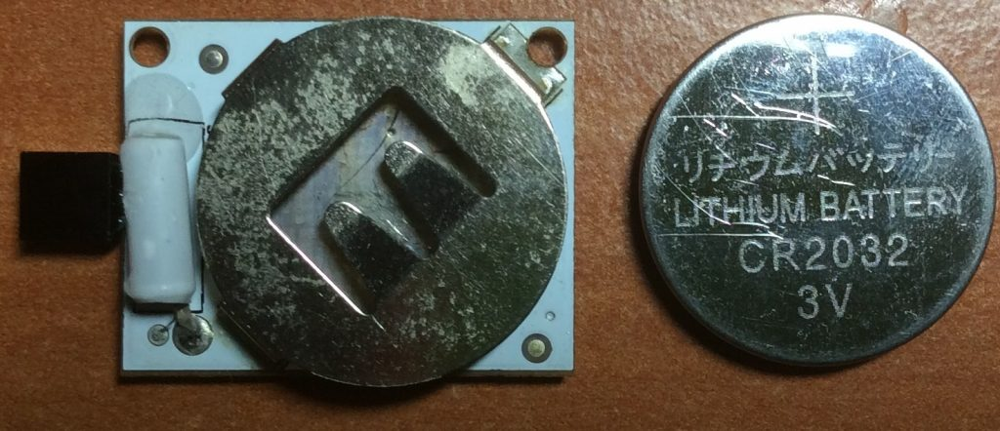
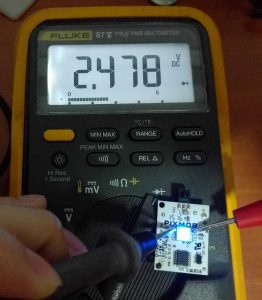
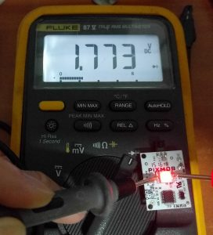
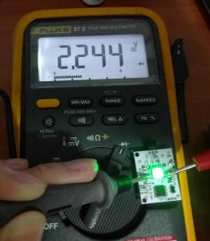
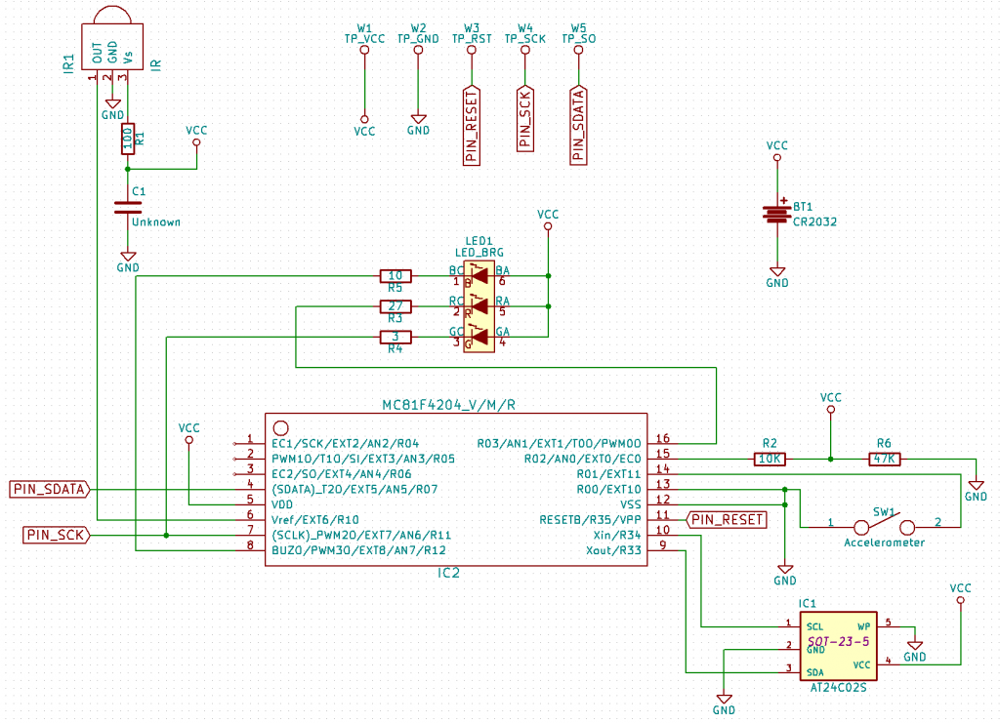
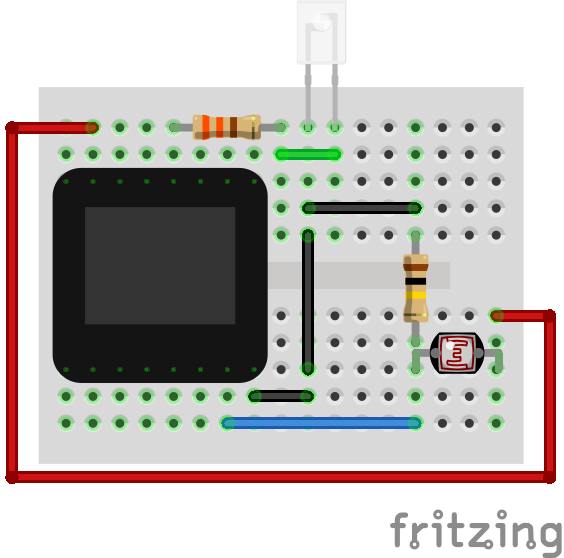
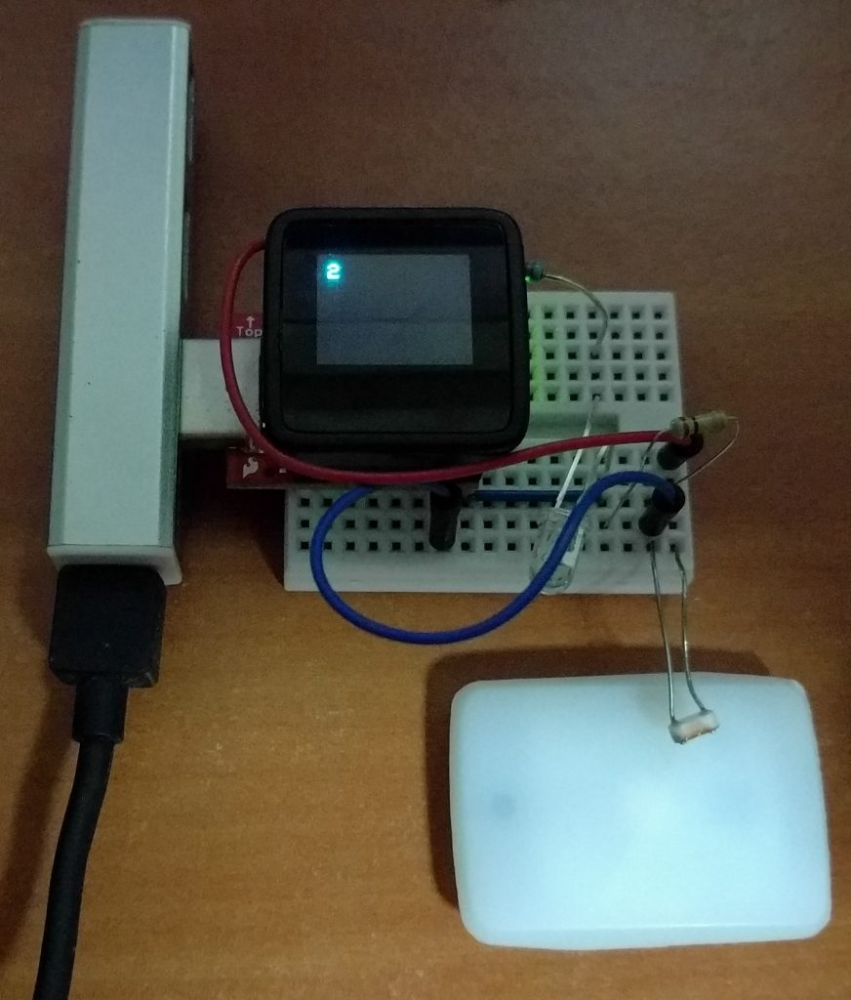
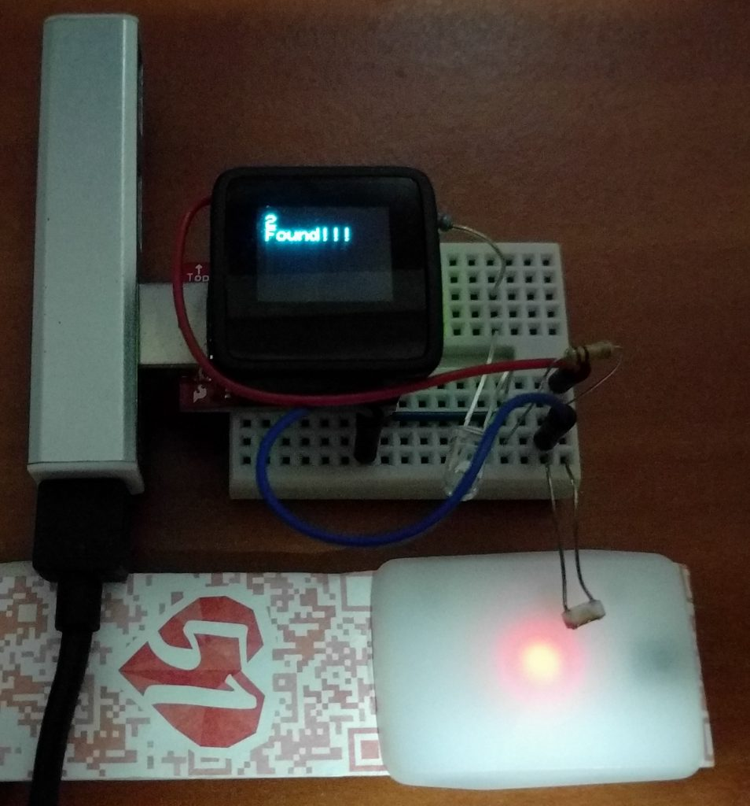

(Checkout the 2019 version [here](/2019/08/teardown-of-ndp2019-led-wristband/)!)

The Singapore National Day Parade (NDP 2016) happened on 9 August 2016 to celebrate its 51st birthday. For those who had the opportunity to attend the actual parade or its previews/rehearsals, they will also get to receive a funpack where one of the items will be a wearable LED band made by a company called [Pixmob](http://pixmob.com/).

This band receives infrared(IR) signals from the organisers and then displays the LED colour of their choosing. There is also an onboard accelerometer. After the event when the IR signals disappear, the (single-axis I believe) accelerometer will cause the Red LED to light up when a shock is detected.

Here is the talk video on this subject I gave at [Hackware v2.1](https://www.facebook.com/events/245575175803923/).


<!--more-->
I had the opportunity to attend the Preview 2 (or rehearsal) of this event on 30 July 2016. Here are 2 videos of the wristband in action during the NDP Preview 2.



Each segment is given a particular colour theme and the band blinks in tandem with what the organisers want.



You can see how the colour changes during the show.

So obviously I was curious about how this wristband works. A look at Pixmob website shows they have 2 products to cater to different audience capacities

1. [Professional](http://pixmob.com/solutions/ignite/) (1500 to 150000 attendees) that runs on infrared
2. [Spark](http://pixmob.com/solutions/spark/) (Up to 1500 attendees) that runs on Bluetooth Low Energy

Since the National Stadium where NDP2016 was held has a capacity of 55000, it has to the former. I believe how the system is set up is that there are numerous Infrared emitters placed around possibly on the ceiling of the stadium to reach all the audience.

That is however not enough, I want to know MORE! So I proceeded to the teardown.

# Teardown

I cracked open the case to reveal the following:

Front view of the board. I have identified the major components in the list below

- IR1: Infrared Receiver
- LED1: RGB LED
- IC1: [Atmel AT24C02S](http://www.atmel.com/images/doc0180.pdf) 2KB, 2-Wire Serial EEPROM (SOT23-5 package)
- IC2: [Abov 81F4204R](http://www.abov.co.kr/en/index.php?Depth1=3&Depth2=1&Depth3=1&Depth4=2&Item=MC81F4204) 8-bit microcontroller (MCU) with 4KB ROM and 192B RAM (TSSOP16 package)

I have no idea why there needs to be Atmel EEPROM chip, what does Pixmob need to store inside there?

Back view of the board. The device is powered by a 3V CR2032 battery. The tube on the left is what I believe to be a single-axis accelerometer.

# Hardware Reverse Engineering

If you are interested in the raw schematics/code used in this post, you can see my [Github link](https://github.com/yeokm1/reverse-engineering-ndp2016-wristband).

I was not satisfied with knowing what components goes inside the band, I'll like to know how are they connected together. So using a multimeter, I set down to work.

  

Using the Diode mode of the multimeter, we can see the different colours on the LED exhibit different voltage drops.

After some painstaking work mapping out all the connections, I drew out both the necessary Kicad libraries and schematic as you can see above. I even included the test points. Note that I cannot guarantee the schematic is correct.

## Programming pads

The test points TP\_SCK and TP\_SO are no doubt used to program the board for the first time after the PCB is fabricated and assembled. I anticipate that ROM dumping could be possible but I don't have the time and tools to make it happen.

## Connection between host chip and EEPROM

What surprised me was the connection between the Abov MCU and the EEPROM chip. The AT24C02S uses the I²C bus to connect with a host MCU. However, the Abov MCU does not have hardware I²C support according to its datasheet. If I'm right, this means the Pixmob engineers had to bit-bang the GPIO pins to simulate a I²C bus to communicate with EEPROM, not trivial to do!

## EEPROM write-protection is not enabled

According to AT24C02S's datasheet, shorting the WP pin to ground disables the write-protection. This implies the MCU host can write new data to the EEPROM chip. Hmmm... Wonder what is this for?

## R2 and R6?

I have no idea what is the purpose of R2 and R6? Measure battery voltage?

# Unsuccessful attempt to brute-force the IR combinations

As many would have thought, it would be great if we can reuse this band by mimicking the IR signals sent by the NDP organisers. Googling shows that [someone has made his previous Pixmob model light up](https://www.youtube.com/watch?v=N1cR-x_0YAw) using just a typical TV remote. I tried all the remotes I have in my possession, none worked. This means there are only 2 ways left to derive the IR code combinations

1. Dump the code of the MCU and decipher the machine code
2. Brute-force the IR combinations and hope for a response.

Since I lack the time and equipment to do option 1, I wanted to try out option 2. This could possibly work assuming that Pixmob has not programmed in a Kill code that will disable further IR functionality should the organisers send out this code at the end of the event.

## My IR brute-forcer

This is a Fritzing schematic showing my design of a IR brute-forcer:

The brains of this project is a [Microview](http://microview.io/), an Arduino-compatible component that has a standard ATmega328p chip and an OLED screen. The Microview drives an IR LED with the numerous IR combinations. Should a particular combination work, the wristband will light up and the differing light intensity can be captured by the photocell.

This is the setup, the IR LED and the photocell are both aimed at the wristband.

This photo shows a false positive. Should the wristband light up, the OLED screen will display "Found". The corresponding IR combination will be then sent via the Serial port to the computer.

## Brute-force conclusion

This didn't work out in the end as I realised there are literally trillions of IR combinations made up of IR-ON, IR-OFF, multiple delay timings and the Arduino can only output about a few hundred or thousand combinations a second. Even worse, even if one can find a faster way to brute force quickly, if a Kill code has been sent, then there is no way this could work.

# Concluding remarks

Coming back to the title, this is not a complete reverse-engineering project as I did not dump the code and analyse it which is above my current skill level anyway. Nevertheless, I have learned lots in the process and I hope this will prove informative to those interested in the inner workings of this wristband.
