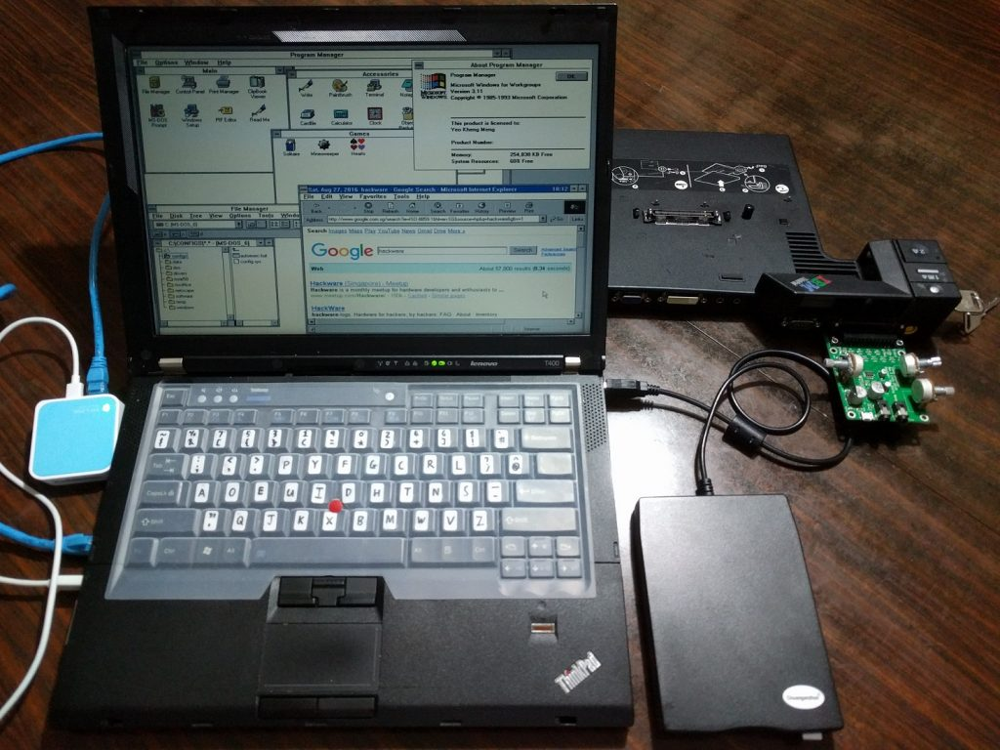

(This is a long 5600+ words post, I recommend reading this from a tablet or computer)

Windows for Workgroups 3.11 (WFW3.11) was an operating system (OS) released by Microsoft in August 1993 and ended support in December 2001. It is part of a series of OSes released by Microsoft at that time so it is common for people to refer to it as part of Windows 3.1x (Win3.1). The specific history behind its name and version number and be found on its [Wikipedia article](https://en.wikipedia.org/wiki/Windows_3.1x). Here is a brief list of first-impressions I have if I were to describe this OS.

1. First Windows OS to have practical (installable) networking capabilities
2. Last one to not have a Start Menu and legacy interface before Windows 95
3. Last OS to require DOS as an initial install
4. Last 16-bit OS

[](images/wfw-first.jpg)

Here is a teaser screenshot showing that I managed to get WFW3.11 installed on a "modern" 2009 Thinkpad T400 with networking capabilities. Recognise some familiar applications there?
<!--more-->
# Demo video



About 8 minutes of video for the vintage computing buffs. This shows the results of my work.

# Why install WFW3.11?

[](images/wfw-t400-boot-screen.jpg)

Too free nothing to do is it?

Something like that I would say. I had a previous project to [install Windows XP on a modern machine](/2016/04/installing-windows-xp-on-a-modern-unsupported-haswell-system-in-2016/). Someone then challenged me to do the same for Win3.1 so this blog post is the result!

Win3.1 is also actually part of my childhood. I started using computers when I was 5 and Win3.1 and DOS 6.22 used to be my staple computing experience then. Going through this project also made me relive part of my childhood. In fact, I have one one step further with the networking capability as I did not use the Internet till I got my second computer  which ran on Windows 98 Second Edition.

Windows For Workgroups 3.11 is something like the corporate version of Win3.1. It comes with Workgroup networking features amongst other improvements.

Moving from Win3.11 to its successor Windows 95 marks the transition from 16-bit to 32-bit computing. The 16-bit nature ups the challenge of installing things.

For a bit of trivial, even as late as recent as 2015, a French airport was also using a Win3.1 machine. The reason this fact came to light is because that machine crashed which took down the airport services. You can read more about it [here](http://www.zdnet.com/article/a-23-year-old-windows-3-1-system-failure-crashed-paris-airport/). Also, due to its low hardware requirements, Microsoft actually [sold licences to embedded systems manufacturers till 2008](http://arstechnica.com/gadgets/2008/11/microsoft-puts-windows-3-11-for-workgroups-out-to-pasture/)!

# WFW3.11 System Requirements

To put things in perspective lets take a look at what the system requirements. To derive a complete list, I have combined information from this [source](https://support.microsoft.com/en-us/kb/32905) and this [source](https://support.microsoft.com/en-us/kb/89333).

- MS-DOS 3.1 or later
- Intel 80386 (12 - 40 Mhz)
- 5.25-inch (high density) or 3.5-inch floppy drive
- EGA, VGA, SVGA, XGA, 8514/A, or Hercules video card or 100% compatible card, and monitor
- 3 MiB RAM (4 MB is recommended)
    - 640K Conventional memory
    - 2048K Extended memory
- 6.2 MiB disk space (14.5 MiB recommended)
- Mouse recommended

Any modern machine can easily meet this requirements, or can they? We shall see. Notice also how Microsoft defines the disk space requirements to one decimal place. This shows how much premium people place on disk space then, up to the hundreds of kilobytes.

# Installation Goals

I wanted to set certain reasonable goals before undertaking this project. Due to the age of the OS, it is impossible to get everything up and running due to lack of drivers but I want certain features at the minimum.

1. No Virtual Machines. I consider that cheating for obvious reasons! Everything must be installed natively.
2. Video driver. The default driver-less resolution of Win3.1 is an intolerable 640x480
3. Sound driver. Well, cause I want to hear something like the starting tones at least.
4. Network. Or more precisely, the ability to go online and surf websites.

Throughout this post, I'll use the term Win3.1 to refer to a case where a driver, software or instruction is compatible with both Win3.1 and WFW3.11. WFW3.11 is only used when a certain feature say networking can only be used on this version.

# The initial "vintage" machine

Since it was a long time since I used Win3.1, I initially started with something simple, with a machine of that era.

[](images/wfw-first-390e.jpg)

I got this second-hand 1999 IBM Thinkpad 390e-2626 from Ebay.

## Here are the key specifications:

- Intel Mobile Pentium II 300Mhz
- Intel 440BX chipset
- NeoMagic Media256AV 2.5MB VRAM
- 384MB SDRAM (Specs say max 256MB but I added in the sticks and this works)
- ESS Solo-1 Audio
- 13.1" 1024x768
- PATA hard drive (I used an SD card with SD-PATA converter)
- CDROM + Floppy combo
- Serial, Parallel, PS/2, USB 1.0, IrDA
- 2x Cardbus slots

[](images/wfw-390e-front-right.jpg)

The machine is 4.5 cm thick and weighs a hefty 3.4kg! Nowadays virtually no laptops are that thick and only gaming laptops weigh this much but in those days such dimensions are normal. Notice the floppy and CD Drive.

The reason I initially chose this is because being a business-oriented notebook, drivers should be more easily located compared to most consumer models. Lenovo is [still hosting the original drivers](http://thinkpads.com/support/Thinkpad-Drivers/download.lenovo.com/lenovo/content/ddfm/390e.html) for the 390e nearly 2 decades after this machine is sold. Talk about lasting corporate support. This machine originally came with Windows 98 but Win3.1 was also supported by IBM then.

This laptop costs US$2700 in 1999's dollars and was considered a mid-range model by IBM. After accounting for inflation, it would be US$3900 or about SG$5300 today.

## Hard Drive:

The system originally came with a conventional PATA hard drive.

[](images/wfw-390e-ide-sd-drive.jpg)

The drive itself is more than a decade old. Although it works properly on startup, I seriously doubt its reliability. Therefore I replaced the drive with an SD-PATA adapter. An SD card is now a hard disk! Sure, an SD card may be slow but its read speed is definitely on par with hard drives of that era.

## Drivers and Networking:

I managed to get the video and audio working. No big issue, just download and install from Lenovo's website. The hard part was networking. This machine is not equipped with Ethernet port. Wifi is out of the question for a machine sold in the 20th century. The conventional way to get networking ability is via the Cardbus expansion slots which is basically a PCI slot for notebooks.

[](images/wfw-cardbus-ethernet.jpg)

The expansion card I used is a Xircom Realport Cardbus Ethernet 10/100. Xircom was bought over by Intel in 2003 and the latter still [hosts the legacy drivers](https://downloadcenter.intel.com/product/50588/Xircom-CardBus-Ethernet-10-100-Adapter-CBE-10-100BTX-) of this device till this day.

There exists DOS/Win3.1 drivers for this particular card but the issue is that I could not get the DOS Cardbus drivers I downloaded from Lenovo's website to work. Without those Cardbus drivers, the Xircom card would not work so after searching around, I discovered an alternative.

[](images/wfw-390e-connec-pe3.jpg)

I found a network adapter than runs off a parallel port! Presenting the 10Mbps [Xircom Pocket Ethernet PE3-10BT](http://www.brutman.com/Dos_Networking/xircom_pe3.html). The adapter draws power from the PS/2 port since the parallel port has no power supply pins. Xircom provides a passthrough cable so you can still connect a PS/2 mouse.

[](images/wfw-390e-network-config.jpg)

I installed the [relevant drivers](https://downloadcenter.intel.com/product/50622/Xircom-Pocket-Ethernet-III-Adapter-PE3-10Bx-) and it worked! For some reason, only the older NDIS 2.0 [real mode](https://en.wikipedia.org/wiki/Real_mode) drivers worked instead of the then modern NDIS 3.0 [protected mode](https://en.wikipedia.org/wiki/Protected_mode) ones. WFW3.11 can be modified to support TCP/IP and therefore both DHCP and static IP addressing. Notice that the "ipconfig" command has existed since this era.

After much thought, I realised this is not much of a kick actually. If a vintage machine can run Win3.1 in its era, it will definitely run it today. The **real challenge** is to do what Win3.1 was not supported for by computer manufacturers, run it on a machine far ahead of its time.

# The "modern" machine

Fast forward 10 years, IBM has long sold its PC division to Lenovo and we have the Lenovo Thinkpad T400-2768.

[](images/wfw-t400-front-and-docking.jpg)

There are many things in this picture which I will explain later.

## Here are the key specifications:

- [Intel® Core™2 Duo processor T9400](http://ark.intel.com/products/35562/Intel-Core2-Duo-Processor-T9400-6M-Cache-2_53-GHz-1066-MHz-FSB) (Dual-core 2.53GHz, 6MB L2)
- [Intel GM45 chipset](http://ark.intel.com/products/35134/Intel-82GM45-Graphics-and-Memory-Controller-Hub)
- Switchable Graphics with Intel GMA 4500MHD and ATI Mobility Radeon HD 3470 (256 MB)
    - I locked the graphics in the BIOS to Intel as the ATI card has issues (out-of-scope) and for power-saving
- 8 (2x4) GB DDR3 RAM
- Conexant High Definition SmartAudio 221 based on Intel HD Audio
- 14.1" TFT matte display with 1440x900 with LED backlight
- 240GB Samsung 850 Evo SATA3 SSD (T400's SATA port is SATA2 only)
- Serial Ultrabay DVD-RW Multi
- 3 USB2.0 ports, 1 IEEE1394, Gigabit Ethernet
- Intel Wireless-AC 7260 2x2 dual-band with Bluetooth 4 via mini-PCIe
- 1 Cardbus slot
- 1 ExpressCard slot

This machine has a manufacturing date of April 2009. Although technically not a cutting-edge machine by 2016 standards, it has the characteristics you would see in a modern machine, 64-bit multi-core processor, gigabytes of RAM, SSD and even USB 3.0 can be added by an expansion card via the ExpressCard slot.

This machine is also 8 years ahead of the time when Microsoft stopped supporting Win3.1. To put things in perspective, to equal this feat for Windows XP which support ended in 2014, you have to install XP on a machine to be built 2022. I don't mind trying to see if that is possible then!

## Accessories:

### Docking Station:

I did not pick this laptop model from the second-hand market for no good reason. I purchased this primarily because I wanted to use the docking station which has a parallel port whose relevance will be clear further down the post.

[](images/wfw-t400-docking-rear.jpg)

[](images/wfw-t400-docking-rear-docked.jpg)

This is the [Thinkpad Advanced Mini Dock](http://www.thinkwiki.org/wiki/ThinkPad_Advanced_Mini_Dock). It contains the usual connectivity options one would expect of a docking station, USB, LAN, video and audio. This dock is the final one by IBM/Lenovo to still have the legacy native serial and parallel ports. The T400 is also the last Thinkpad that can utilise this docking station. Its successor the T410 (2010 model) uses a newer docking connector that does not have the serial and parallel lines.

### USB Floppy Drive

Laptops have long dropped floppy drives as part of their main chassis. In fact, most laptops this days don't even have optical drives anymore. Regardless, I'll need a floppy drive as DOS and Win3.1 installation is accomplished via floppy disks.

[](images/wfw-floppy-drive.jpg)

The solution is simple, just procure a USB floppy drive! You might wonder do DOS or Win3.1 support USB devices? The official answer is no but some BIOSes do emulate USB floppy drives as native ones so the OS is none the wiser. This is also true for USB mice as a P/S2 connection. Of course, not all USB devices can be emulated, you have to try.

### Parallel Port Sound Card

I'm pretty sure no DOS/Win3.1 drivers exist for the internal Conexant HD audio chip. The solution is therefore to locate an external sound card that has legacy drivers. The first choice is usually via the Cardbus slot but the Cardbus drivers for DOS/Win3.1 obviously does not exist given the relatively young age of this machine. What about ports then?

After Googling, I found the existence of this parallel port sound card called the [Covox Speech Thing](https://en.wikipedia.org/wiki/Covox_Speech_Thing) first sold in 1986. Covox Drivers for Win3.1 can still be [found online](http://files.mpoli.fi/unpacked/hardware/sound/other/covoxwin.zip/). I wanted to purchase it but could not find any source for such a vintage piece of equipment. This when I thought, the circuit is not that hard what, WHY NOT MAKE IT MYSELF?

[](images/wfw-pcb-covox.jpg)

Presenting my Covox-based sound card! The first sound card I have designed! It has onboard controls as well as an amplifier. More details and schematics can be found in the [Github repository](https://github.com/yeokm1/pcb-covox-amp). I even [wrote a blog post](/2017/01/a-science-project-bringing-the-covox-speech-thing-to-2017/) on this sound card.

# The installation

Now that all the hardware components are ready, lets proceed to get work done.

I took many steps and trial-and-errors to finally get WFW3.11 on the system. So the methods I will detail here contains the finalised set of instructions for it to work. Since I intend to use this laptop for more than just legacy work, I will also install Windows 10 and Linux Mint in a multi-boot configuration.

I have ordered my installation method into the following steps:

1. [Get the DOS6.22 and WFW3.11 installers](#step1)
2. [Configure your BIOS](#step2)
3. [Convert GPT partition table to MBR and create partitions](#step3)
4. [Actually installing DOS6.22 and WFW3.11](#step4)
5. [Configure CONFIG.SYS and AUTOEXEC.BAT files to load DOS drivers](#step5)
6. [Install Windows 3.11 drivers](#step6)
7. [Install relevant software and updates](#step7)
8. [Multi-booting with other operating-systems](#step8)
9. [Accessing HTTPS websites](#step9)
10. [Bonus Windows 1.04](#step10)

## Step 1: Get the DOS6.22 and WFW3.11 installers {#step1}

It is important to note that Win3.1 cannot be installed as-is. One needs to install a version of DOS first before installing the legacy Windows on top. The latest standalone version of DOS released by Microsoft is 6.22 so that is what I'll be aiming for.

It is almost impossible to obtain such old OS install media via retail channels this days. Thankfully one can download the floppy disk images from sites like [winworldpc.com](https://winworldpc.com/). They host the [DOS6.22 images](https://winworldpc.com/product/ms-dos/622), [WFW3.11 images](https://winworldpc.com/product/windows-3/wfw-311) and many other legacy software. All one needs to do is write those images to actual floppy disks to install with a tool like [RawWrite](http://www.chrysocome.net/rawwrite). This is technically illegal since legacy or not, these are proprietary Microsoft software but I doubt it will care about this.

[](images/wfw-floppies.jpg)

After obtaining the disk images, I had to write them to my good old stash of floppies. DOS6.22 requires 4 while WFW3.11 requires a whooping 8!

Note that if you are using a Mac, Apple has r[emoved USB Floppy drive support as of El Capitan](http://macvalley.blogspot.sg/2016/05/accessing-floppy-drives-when-your-mac.html). This means you can only use Windows or Linux to write the floppy drive images.

## Step 2: Configure your BIOS {#step2}

### USB

[](images/wfw-bios-usb.jpg)

If your BIOS has something like a USB legacy mode, enable it to give the best chance of DOS detecting as many USB devices as possible as a legacy connection.

### SATA mode

[](images/wfw-bios-sata.jpgg)

For SATA mode option, it is actually surprising to leave it as AHCI! DOS is so primitive that the difference between AHCI and IDE Compatibility mode is not an issue. The only problem is with the SATA optical drive. The DOS CD-ROM driver cannot detect the drive when the SATA mode is on AHCI. If you need the optical drive such as when I was installing [Microsoft Office 4.3](https://winworldpc.com/product/microsoft-office/4x), you can temporarily set to Compatibility mode.

### Other options

Since this T400 was sold before UEFI was commonplace, its BIOS does not have this option. But if your modern machine has UEFI, you have to disable it.

Make sure floppy booting is one of the higher boot options so the computer can start the installer from disk.

## Step 3: Convert GPT partition table to MBR and create partitions {#step3}

(I have paraphrased part of this section from my earlier post [Installing Windows XP on a modern unsupported (Haswell) system in 2016](/2016/04/installing-windows-xp-on-a-modern-unsupported-haswell-system-in-2016/))

### Converting to MBR

Modern disks now come pre-formatted with the [GUID Partition Table (GPT)](https://en.wikipedia.org/wiki/GUID_Partition_Table) instead of the legacy [Master Boot Record (MBR)](https://en.wikipedia.org/wiki/Master_boot_record). If you wish to know why GPT has superceded MBR, just consult the Wikipedia articles. The problem is that DOS cannot be installed on hard disks that use GPT. We have to convert them to MBR.

We shall use a partitioning tool called [GParted](http://gparted.org/) to do the job. Just download the ISO image and boot from it.

[](images/modernxp_gparted.jpg)

The GParted program will start automatically on boot. Just click Device -> Create Partition Table. Choose the new partition table type to be “msdos” which is actually MBR.

### Create your partition(s)

You may be tempted to just restart and allow the DOS installer create the partitions during the (next) install step. I do NOT recommend you let DOS handle partitioning especially if you are using an SSD or modern magnetic drives. Modern [Advanced Format](https://en.wikipedia.org/wiki/Advanced_Format) drives from 2009 now use a 4KiB sector size instead of 512bytes which was the era where DOS was designed. If your created partition is not aligned to 4KiB, which a legacy OS like DOS will get wrong, you will have performance issues. More details can be found [here](http://www.seagate.com/sg/en/tech-insights/advanced-format-4k-sector-hard-drives-master-ti/) and [here](http://superuser.com/questions/982680/whats-the-point-of-hard-drives-reporting-their-physical-sector-size).

So it is better to let GParted handle the partition creation.

[](images/modernxp-gparted-partition-creation.jpg)

Ensure that your first partition has a Free space preceding of 1 MiB to ensure the partition is aligned to the 4KiB boundary. Remember that in an MBR layout, you can have at most 4 primary partitions. If you need more partitions, then one of the partitions have to be created as “Extended” and then you place multiple “Logical” drives inside it.

[](images/wfw-t400-partition-layout.jpg)

This is the layout I settled with since I intend to multi-boot with Windows 10 and Linux. Notice for the first partition "/dev/sda1", the file system has been set to FAT16 and the boot flag has been set. These are required if not the DOS installer might have problems. FAT16 is limited to 2GB partition size max so make sure your partition size is smaller than that.

## Step 4: Actually installing DOS6.22 and WFW3.11 {#step4}

Connect the USB floppy drive to the machine, insert Disk 1 of the DOS 6.22 install media and boot the machine from it!

[](images/wfw-t400-dos6-install.jpg)

After the DOS installation completes at Disk 3, you will be brought to the DOS prompt.

[](images/wfw-390e-dos-supp.jpg)

You should insert supplementary disk 4 at this time to install extra tools. Above is me doing so on my 390e. After that reboot the machine.

Once you are ready, insert WFW3.11 Disk 1, go to A: drive and run the setup.exe program.

[](images/wfw-t400-wfw311-install.jpg)

The first screen to greet you on starting the WFW3.11 installer. This white text on blue background theme of the installer will be maintained all the way till Windows XP.

[](images/wfw-t400-first-boot.jpg)

Upon installation completion, you will reboot to the desktop! Yay! Half the battle is won when you can reach this stage! The resolution at this time is a pathetic 640x480 which we will rectify later.

## Step 5: Configure CONFIG.SYS and AUTOEXEC.BAT files to load drivers {#step5}

These files are 2 of the most important configuration files for DOS-based operating systems up till Windows ME. They are processed on startup by the operating system. DOS and WFW3.11 are rather primitive OSes so things we take for granted like optical drives and mice do not work out-of-the-box.

### CONFIG.SYS

config.sys is loaded before autoexec.bat. [Wikipedia defines it as](https://en.wikipedia.org/wiki/CONFIG.SYS) _"It is a special ASCII text file that contains user-accessible setup or configuration directives evaluated by the operating system during boot." _

Here is a snippet of what I used for my T400:

```plaintext
rem DEVICE=C:\DOS\HIMEM.SYS
DEVICE=C:\DRIVERS\HIMEMX.EXE /MAX=262144 /VERBOSE 
DOS=HIGH 
DEVICEHIGH=C:\DRIVERS\CDROMDRV\CDROMDRV.SYS /D:MYCD 
DEVICEHIGH=C:\DOS\POWER.EXE 
DEVICE=C:\WINDOWS\IFSHLP.SYS 
FILES=40 
STACKS=9,256
```

I'll explain them line by line. "rem" is the equivalent of commenting out the line.

1. [HIMEM.SYS](https://en.wikipedia.org/wiki/HIMEM.SYS) is as default extended memory manager provided by DOS. Before HIMEM.SYS, DOS programs can only use the first 640KiB of RAM which is known as conventional memory or the next 384KiB known as[ High Memory Area](https://en.wikipedia.org/wiki/High_memory_area) which can be mapped as [Expanded Memory](https://en.wikipedia.org/wiki/Expanded_memory). Extended memory is something like the rest of the RAM we know of today. HIMEM.SYS "unlocks" RAM beyond the first 1MiB on the higher memory addresses so applications and Win3.1 which requires more memory can use them. Although I have tested HIMEM.SYS to work, this line is commented out as I'll be using HIMEMX.EXE.
2. [HIMEMX.EXE](https://sourceforge.net/projects/himemx/) is a modern alternative to HIMEM.SYS. It has the ability to address much more RAM than HIMEM.SYS. However for the sake of compatibility with WIn3.1, I have capped the maximum extended RAM to 256MiB as exceeding this number causes Win3.1 to fail to boot.
3. DOS=HIGH loads DOS to the [High Memory Area](https://en.wikipedia.org/wiki/High_memory_area) (HMA) to conserve precious conventional memory. This is because only conventional memory can be used by DOS programs to hold executable code.
4. CDROMDRV.SYS is a DOS CD-ROM driver by Toshiba. This driver can only work if the SATA mode of the machine has been set to IDE or Compatibility. It is recommended by this [legroom guide](http://legroom.net/howto/msdos). MYCD is a drive identifier that will be used later. The reason I prefix DEVICEHIGH is to load the driver into High Memory to conserve conventional memory. DEVICEHIGH requires HIMEM.SYS or HIMEMX.EXE to be loaded beforehand.
5. POWER.EXE is a DOS power utility that provides simple power management like battery level reporting. It is highly recommended to use this for laptops as it issues [x86 HLT instructions](https://en.wikipedia.org/wiki/HLT_(x86_instruction)) to help save power when the CPU is idle.
6. [IFSHLP.SYS](https://en.wikipedia.org/wiki/IFSHLP.SYS) is a driver that allows Win3.11 to have "32-bit faster file access" to disk.
7. FILES means how many files can be opened at once. I followed 40 as stated in the [legroom guide](http://legroom.net/howto/msdos#addendum).
8. STACKS as the name suggest is really how many program stacks can run at the same time. 9256 is a number set by Win3.1 setup. Details can be found in Microsoft's knowledge base [KB82774.](https://support.microsoft.com/en-us/kb/82774)

### AUTOEXEC.BAT

This is a batch file that will be executed at the end of the DOS boot process. [Wikipedia defines it as](https://en.wikipedia.org/wiki/AUTOEXEC.BAT) _"It is a plain-text batch file in the root directory of the boot device. The name of the file is an abbreviation of "automatic execution", which describes its function in automatically executing commands on system startup."_

Here is a snippet of what I used for my T400:

``` plaintext
@ECHO OFF 
rem loadhigh c:\dos\mscdex.exe /D:MYCD 
loadhigh C:\drivers\SHCDX33F.COM /D:MYCD 
loadhigh C:\drivers\doskey25\doskey.com 
C:\drivers\ctms21b4\bin\ctmouse.exe /3 
PROMPT $V$_$D$_$T$_$p$g 
PATH C:\MSIE50;C:\WINDOWS;C:\DOS 
SET TEMP=C:\TEMP 
SET TMP=C:\TMP 
C:\WINDOWS\net start 
KEYB DV,,C:\DOS\DVORAK.SYS
```

I'll explain them line by line. Similar to config.sys, "rem" is the equivalent of commenting out the line.

1. @ECHO OFF is to prevent the command interpreter from displaying the current command being run in this batch file to avoid cluttering up the screen.
2. MSCDEX.EXE is the default program used to map a drive letter to a CD-ROM driver loaded earlier using the identifier "MYCD". I however did not use this in favour of a newer alternative SHCDX33F.
3. [SHCDX33F](http://optimizr.dyndns.org/dos/shsucdx.html) is a MSCDEX replacement written by a third party which uses less memory. "loadhigh" here has the same meaning as "devicehigh" in config.sys, load the program in upper memory.
4. [DOSKEY.COM](https://en.wikipedia.org/wiki/DOSKEY) adds features to the terminal like command history and auto-completion. However, the version of DOSKEY I'm using is not provided by Microsoft, it is written by Paul Houle who has named it [Enhanced DOSKEY.com](http://paulhoule.com/doskey/index.php) which has extra features yet using less memory.
5. [CTMOUSE.EXE](http://cutemouse.sourceforge.net/) is a modern DOS driver for PS/2 mice. There is no need to "loadhigh" as this program is smart enough to do so by itself.
6. "[PROMPT](http://ss64.com/nt/prompt.html) $V$\_$D$\_$T$\_$p$g" modifies the prompt to display the OS version, date, time with the current directory.[](images/wfw-t400-prompt.jpg)
7. PATH sets the Path for the OS to look for executable binaries.
8. Sets the temporary directory
9. Sets the temporary directory
10. NET START is to initialise the network adapter for WFW3.11
11. KEYB DV,,C:\\DOS\\DVORAK.SYS is to set the keyboard layout to Dvorak which I use.

The Win3.11 adds [SMARTDRV](https://en.wikipedia.org/wiki/SmartDrive), a disk caching software to autoexec.bat to boost disk performance. However I removed it to reduce the chance of data loss when there is improper shutdown. Very common as Win3.11 is prone to crashes.

## Step 6: Install Windows 3.11 drivers {#step6}

Remember that the goals of this project are to install video, audio and network drivers in order to consider this a proper installation.

### Video

Obviously no Win3.11 driver will exist for modern graphics adapters. From my [installation experience in Windows XP](/2016/04/installing-windows-xp-on-a-modern-unsupported-haswell-system-in-2016/#step6), I suspected someone will have written a universal video driver so I searched along those lines. I found a [patched SVGA driver](https://sites.google.com/site/chitchatvmback/misc) that is meant for Virtual Machines. I tried it and it worked!

[](images/wfw-t400-video-audio.jpg)

Now I have Win3.11 in 1024x768! Not the native 1440x900 of this laptop's screen but a huge improvement nonetheless.

Note that there is a side effect of this driver. When you open the MS-DOS Prompt, the entire screen will fizzle out. Even exiting the Prompt does not solve the issue, only a Ctrl+Alt+Del reboot will clear the problem.

### **Audio Part 1**

I mentioned earlier that I fabricated my own sound card based on the design of the [Covox Speech Thing](https://en.wikipedia.org/wiki/Covox_Speech_Thing). I located the [drivers online](http://files.mpoli.fi/unpacked/hardware/sound/other/covoxwin.zip/) and installed them. This can be seen in the previous screenshot.



The thing about this sound card design is that it is driven directly by the CPU via the parallel port. So when a sound is being played, the entire system will lock up till the playing stops. The entire user-interface is unresponsive. You can see also this effect when I shake the mouse at [0:40](https://youtu.be/WdrfEXHc0PM?t=40s). There is quite a significant static noise. This is not a fault of my card as I tested in on a different setup. Probably a grounding issue with the docking station's parallel port.

### Audio Part 2 (Added in April 2017)

I came across this software Dongle Cracker found at this [site](https://www-user.tu-chemnitz.de/~heha/basteln/PC/USB2LPT/AddressTranslator.en.htm). What it does is it allows a parallel port address to be redirected to another address. This lit a bulb in my head! Could I use this tool to redirect the LPT1 address 0x378 to an Expresscard parallel port adapter at 0x3008 thus dropping the docking station?

See the results below: 



[](images/wfw-1024x656.jpg)

My sound card connected to a [Startech Expresscard to Parallel Port adapter](https://www.startech.com/Cards-Adapters/Parallel/1-Port-PCI-Express-Base-Parallel-ExpressCard~EC1PECPS).

[](images/wfw-dc.jpg)

Note the settings used. The programs traps the 586 debug registers. I have to supply the 378 address which is original address of LPT1 and 3008 which is used by the Expresscard adapter. To obtain the Expresscard address, I used Device Manager in Windows 10 to locate it.

The software is apparently able to keep up with the low-latency requirement of the playback.

With this, I technically don't need the docking station anymore and can theoretically WFW 3.11 run this on an even more modern systems which have Expresscard slots.

### Network

I thought this would be a tougher problem to crack but the solution turns out to be much simpler. Lenovo hosts the [DOS network drivers for the Intel Gigabit adapter](http://support.lenovo.com/sg/en/downloads/migr-70318). I tried it and the installation proceeded flawlessly. Amazingly, even till today, Intel still provides [DOS network drivers for its latest network adapters](https://downloadcenter.intel.com/download/4239/Intel-Network-Adapter-Drivers-for-MS-DOS-)!

On top of the network drivers, you have to install the TCP/IP stack as that does not come by default. Just download [tcp32b.exe](http://www.conradshome.com/win31/files/tcp32b.exe) from [this site](http://www.conradshome.com/win31/). The default ones IPS/SPX and NetBeui are long obsolete.

[](images/wfw-t400-network.jpg)

It is quite an oxymoron to see the words Win3.11 and Gigabit Ethernet come together but the proof is in the screenshot above!

On a side note, if your laptop has a Cardbus slot and you have the DOS drivers for it, it is technically possible to grant Wifi abilities to it.

[](images/wfw-cisco-aironet.jpg)

Something like this [Cisco Aironet 350](http://www.cisco.com/c/en/us/support/wireless/aironet-350-wireless-lan-client-adapter/model.html) has [DOS drivers](http://www.cisco.com/c/en/us/support/docs/wireless-mobility/wireless-lan-wlan/25106-DOS-Aironet.html) but it only goes up to 802.11b with WEP encryption. Nevertheless, this is worth a try if you can get your Cardbus slots working.

## Step 7: Install relevant software and updates {#step7}

By default, WFW3.11 is rather bare bones, it does not even come with a web browser. To make it "more useful", we should install some stuff. Most of the software can be downloaded from [this website](http://www.conradshome.com/win31/) which hosts most of the legacy Win3.11 software.

### Web Browsers

There are several web browsers to choose from. All of them will not support modern HTTPS due to changes in the SSL/TLS standards since then. In order of preference:

1. [Internet Explorer 5](http://www.conradshome.com/win31/files/ie5ful16.zip) released in March 1999. Renders quite well. It is ironic but it is the first choice after considering everything. You have to add the parameter "/f: 16" if not the installer will not install due to "lack of memory". Probably due to a variable overflow. Install the [128-bit high encryption pack](http://www.conradshome.com/win31/files/se128-16.exe) too. 
[](images/wfw-ie5setup.jpg)
2. [Netscape 4.08](http://ftp.vim.org/netscape/communicator/english/4.08/windows/windows3.1/navigator_standalone/) released on November 1998. It is much slower and renders much more poorly compared to IE5. Avoid this totally.
3. [Opera 3.62](http://arc.opera.com/pub/opera/win/362/english/): This is the newest browser for Win3.1 that was released in March 2000.  It renders the best compared to the other two. By virtue of it requiring a (unobtainable today) serial key to unlock it after 30 days, I have to place it last.

### Microsoft Office

[](images/wfw-t400-office.jpg)

The last Microsoft Office version to run on Win3.11 is [Office 4.3](https://winworldpc.com/product/microsoft-office/4x). Note the familiar applications, Word, Excel and Powerpoint? The basic interface of things have not changed much.

The Powerpoint format is used 4.0 is long obsolete. However, you can install a [Powerpoint 97 to 4.0 translator addon](http://www.filewatcher.com/m/pp8trans.exe.673171-0.html).

In theory, the latest Office 2016 can save as a PPT97 format. You then have a direct path to open Powerpoint documents even from those created in the latest Office versions. Other viewers can be downloaded from [here](http://www.win31.de/esoft.htm) too.

In practice, some formatting and images might be lost. I actually recommend installing Powerpoint 97 which works even on modern Windows 10 64-bit. Open your PPT97 file and save it as PPT95. Powerpoint 97 has difficult saving as Powerpoint 4.0's native format for an unknown reason, probably because that part of the code is 16-bit.  Powerpoint 4.0 can open both PPT97 and PPT95 files with the translator addon. Also note that there are no animations for Powerpoint 4.0.

### Others

- Winzip v6.3
- Acrobat Reader 3.01
- Winclock. You noticed the date and time on the top of every window? That does not come by default in the OS. Thank this program.
- Y2K-compliant File Manager. The default one has problems with post-Y2K dates.
- Win32s. This adds a small subset of Win32 APIs to allow some 32-bit programs to run

## Step 8: Multi-booting with other operating-systems {#step8}

I did not get this laptop just to install a legacy OS that I will not use frequently. I wanted Windows 10 and Linux Mint as well.

Typically the procedure to install multi-boot OSes is to install the oldest Windows version to the newest with Linux last. The idea being Windows should recognise the older OS and add it to its boot menu. Linux's Grub bootloader is the most advanced and therefore it should be set up after everything else.

However due to the age of DOS/Win3.11, the Windows 10 bootloader does not recognise the first primary partition holding DOS to be a legacy Windows version and thus will fail to add it to its bootloader. Even worse, the installer hangs after the first reboot.

After some thought I came up with and used the following steps

1. Install DOS6.22 and WFW3.11 as per the steps previously
2. Use Gparted to set the boot flag to the second primary partition which holds Windows 10. This will make the Windows 10 installer think it is the only OS that will start on the machine.  [](images/wfw-t400-bootflag-change.jpg)
3. Boot from Windows 10 install media and install to the second primary partition. DOS will be temporarily unbootable.
4. After Windows 10 setup completes. Reboot using Gparted to set the boot flag back to the first primary partition holding DOS. Windows 10 will be temporarily unbootable.
5. Install Linux as per normal. The Grub boot loader installation will detect both DOS6.22/WFW3.11 and Windows 10.
6. Upon the next reboot after the Linux installation completes, Grub will now list 3 bootable OSes.  [](images/wfw-t400-grub.jpg)
7. Profit!

## Step 9: Accessing HTTPS websites {#step9}

Due to the age of the browsers that ran on Win3.11, they are unable to access modern sites that use HTTPS. IE5 and Netscape 4.08 top out at SSLv3 and Opera 3.62 ends at TLS1.0.

SSLv3 has been banned by servers for years due to security risks. TLSv1.0 has some security issues so it is on the way out. In theory Opera should still work but I tried with the major websites and it failed to load the HTTPS pages.  Even if we solve the encryption protocol issue, the outdated certificates on the browser would still pose a problem but one can simply press "ignore" when the browser warns you.

To enable HTTPS support, one will have to conduct a man-in-the-middle attack. I attempted 2 methods

1. Use Squid Proxy with the [SSL-Bump](http://wiki.squid-cache.org/ConfigExamples/Intercept/SslBumpExplicit) feature to intercept the SSLv2/3 requests from these browsers and make another request using the newer TLS protocols. Due to security reasons, the OpenSSL library which Squid Proxy relies on does not include SSLv2/3 support so one has to recompile this package from source. Anyway I had difficulty setting up the proxy in this configuration. Due to lack of time, I gave this solution up but I believe given time, this could theoretically work.
2. Use [SSLStrip](https://moxie.org/software/sslstrip/) to remap HTTPS links to HTTP ones. I managed to get this up and running on a Raspberry Pi 3. [](images/wfw-t400-static-sslstrip.jpg) All you need is to point the Gateway setting of the machine to the Raspberry Pi's IP address and you are set! This trick does not work on all websites though, only those that accept HTTP requests like Wikipedia. The setup instructions I used can be found [here](https://github.com/yeokm1/start-sslstrip-on-boot).

[](images/wfw-t400-sslstrip.jpg)

Some servers like Wikipedia will redirect you to its HTTPS version by default. With SSLStrip, you will always be directed to the non-encrypted version of the page provided the server allows it.

## Step 10: Bonus Windows 1.04 {#step10}

After going through the above steps, I thought why not do a bit more and install Microsoft's oldest operating system [Windows 1.0](https://en.wikipedia.org/wiki/Windows_1.0).  The original mass-market version Windows 1.01 was released in 1985 but I'll be installing the updated version 1.04 released in 1987.

[](images/wfw-win1.jpg)

Win1.04 install media is in the form of 7 360KB 5.25 inch images but they can be written to larger 1.44MB ones with no issues. The Win1.04 setup.exe could not run on both my 390e and T400. So what I resorted to was to install it via a Virtualbox VM. I then copied out the Windows directory from the virtual disk image and placed it into the same drive as DOS6.22.

Win1.04 supports 1984-standard [EGA graphics](https://en.wikipedia.org/wiki/Enhanced_Graphics_Adapter) at the maximum and it is astounding that the Intel graphics adapter can display this mode with no issues!

Win1.04 notes/issues:

1. Win 1.04 has no PATH dependencies so it does not conflict with WFW3.11.
2. Win1.04 only supports serial mice and not PS/2 ones. I just [followed the instructions I found](http://www.betaarchive.com/forum/viewtopic.php?t=3159) to extract the mouse driver (MOUSE.DRV) from Windows 2.0 install disks and put them into the Win1.04 install disk image to solve the problem.
3. The OS makes the PC Speaker beep like hell during the splashscreen loading phase! You can hear this in the video at the start of this post.
4. I could not launch any programs from MS-DOS Executive its primary user-interface. Launching any program will cause the system to hang necessitating a restart.

# Conclusion

I got the comment from some people that there is simply no practical use for such a project. In fact, I think this is one of my rare projects that I have committed significant amounts of time (over almost half a year) and money that serves no relevant purpose. After writing this post, I'll probably cease using such a legacy OS. However, going through all these has made me appreciate how far computing has come since the old days of DOS and Windows.

What I was impressed with is the backward compatibility. Intel and Microsoft need to be applauded for their efforts in ensuring backward compatibility with old software/hardware. It is surprising things turned out as well as it did.

You may wonder why did I title this post “A Science Project”. This was [coined in a blog post](https://blogs.msdn.microsoft.com/oldnewthing/20130319-00/?p=4913) by a Microsoft software engineer Raymond Chen to describe projects that fall into any of the following categories:

1. A feature that is really cool and challenging from a technological standpoint but is overkill for the user-scenario.
2. Requires hardware few people have.
3. Trying to solve a problem that nobody really considers to be a problem. You’re doing it just for the Gee Whiz factor.

I would like to believe this project hits the last point. Who still needs to use Windows 3.1 in such a modern manner?

I gave a talk on this project at [Hackware v2.2](https://www.facebook.com/events/284795248528239/) on 7 September. Here is the video.



If you like this post, you can read about how I installed [Windows XP on a modern machine](/2016/04/installing-windows-xp-on-a-modern-unsupported-haswell-system-in-2016/).
