The [Covox Speech Thing](https://en.wikipedia.org/wiki/Covox_Speech_Thing) (CST) was a sound card released in 1986 by Covox, Inc to enable computers with parallel ports to have sound capability. Unlike modern machines, proper sound support was not a given on computers in that era and the Soundblaster by Creative has yet to be released.

As you will see later, the design is rather simple so I decided to revisit this old piece of hardware and see if it is possible to get it working on modern systems.

[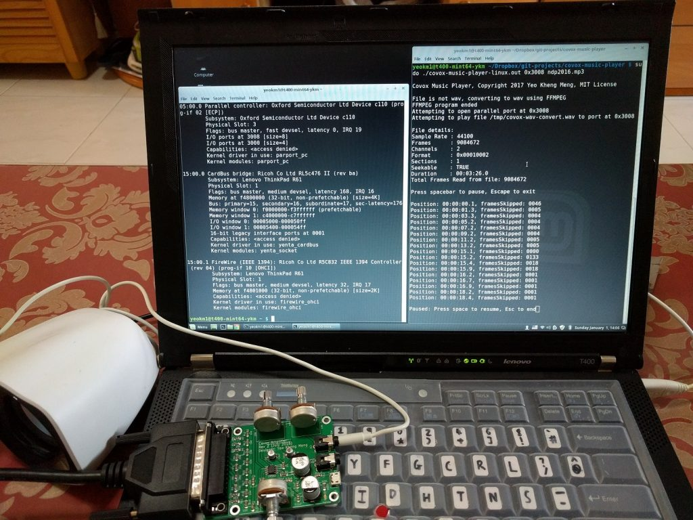](images/covox-music-player.jpg)

My remake of the Covox Speech Thing with a self-wrote media player software.



Video of everything in action
<!--more-->
If you are in a hurry to obtain the raw schematics and code, everything can be found in the following links.

Verified designs: [Media player code](https://github.com/yeokm1/covox-music-player), [pure Covox clone](https://github.com/yeokm1/pcb-covox), [Covox clone with amplifier](https://github.com/yeokm1/pcb-covox-amp/)

Untested work: [USB to 8-bit adapter](https://github.com/yeokm1/pcb-usb-ft245r-parallel-adapter), [Covox clone with amplifier and USB 8-bit adapter](https://github.com/yeokm1/pcb-covox-amp-v2)

# Background

Some time back, I wrote a blog post on how I managed get [Windows 3.11 working on a relatively modern Thinkpad T400](/2016/09/windows-for-workgroups-3-11-on-vintage-and-modern-hardware-in-2016/) with video, audio and network capability.

[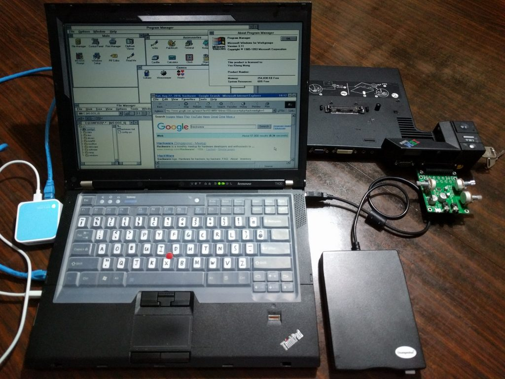](images/wfw-t400-front-and-docking.jpg)

Since support for modern audio hardware is obviously non-existent for such an old operating system, I decided to fabricate a clone of the CST as I managed to locate the [Windows 3.11 drivers for it](http://files.mpoli.fi/unpacked/hardware/sound/other/covoxwin.zip/).



This is the result of my earlier efforts, playing reasonable-quality music though the system will be unresponsive in the process.

# How does the hardware work?

Before taking a deep dive into the software, I shall first explain the hardware setup. Since the CST relies on a parallel port and the younger generation might not know about it, I shall cover that first.

## What is a parallel port?

To put it simply, it is a 25-pin interface meant for connecting computer peripherals before the era of USB connectivity. It was first introduced in 1970 by Centronics before it was standardised as [IEEE1284](https://en.wikipedia.org/wiki/IEEE_1284) in 1994.

### Parallel Port connector

[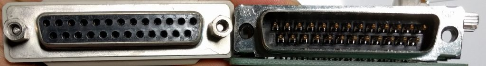](images/covox-parallel-port.jpg)

Male and female DB-25 connectors used by the parallel port standard.

### Parallel Port pins

[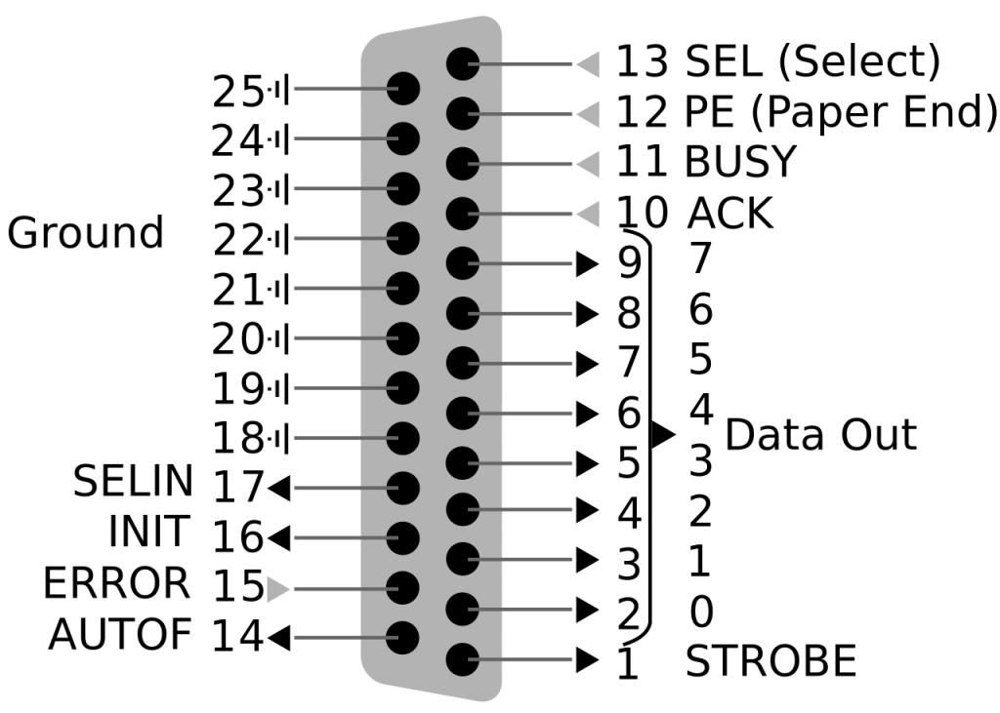](images/covox-parallel-port-pins.png)

Image credit: [https://en.wikipedia.org/wiki/Parallel\_port](https://en.wikipedia.org/wiki/Parallel_port)

Above is the functionality pinout of the parallel port. For the purposes of the CST, only the 8 data pins (2-9) and 8 ground pins (18-25) are used. The data pins are used to transmit an 8-bit digital signal to the sound card to be converted to an analog sound wave.

### Parallel ports in modern computers

Parallel ports have long been considered to be obsolete and hence no longer available on modern machines. To get a parallel port, I'll have to purchase an adapter.

[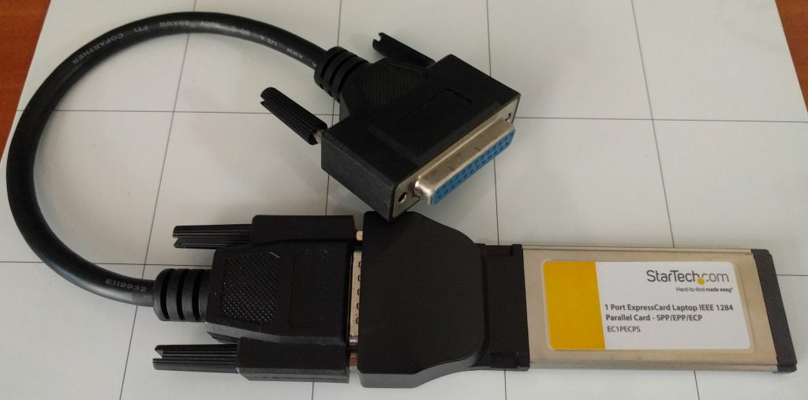](images/covox-startech-express-adapter.jpg)

I used this [Startech Expresscard to Parallel Port adapter](https://www.startech.com/Cards-Adapters/Parallel/1-Port-PCI-Express-Base-Parallel-ExpressCard~EC1PECPS) with my laptop. If you are on a desktop, you can use a PCI-E adapter card. I have tested this [serial-parallel combo](https://www.startech.com/Cards-Adapters/Serial-Cards-Adapters/1S1P-Native-PCI-Express-Parallel-Serial-Combo-Card-with-16950-UART~PEX1S1P952) from Startech to work although other models might work as well too.

USB-Parallel adapters are best avoided as they are not _true_ parallel port hardware as they usually appear as USB printers and abstract the IO pins away. Thus you can't bitbang the pins as my program does. Besides, USB is not really suitable for realtime control due to latencies in its protocol.

## How does the Covox Speech Thing work?

### The original Covox Speech Thing

[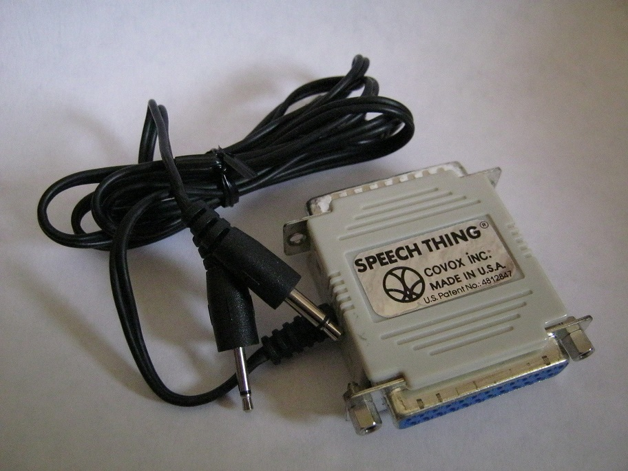](images/covox-original.jpg)

Image obtained from the [Wikipedia Page](https://en.wikipedia.org/wiki/Covox_Speech_Thing).

Notice that the audio connector only has the 2 conductive points: tip and sleeve indicating this is a mono connector. Since the parallel port has only 8 data lines, the CST only supports 8-bit mono audio.

### CST Design

At the heart of every sound card are components that covert digital signals to analog audio signals or a digital-to-analog-converter (DAC) for short.

[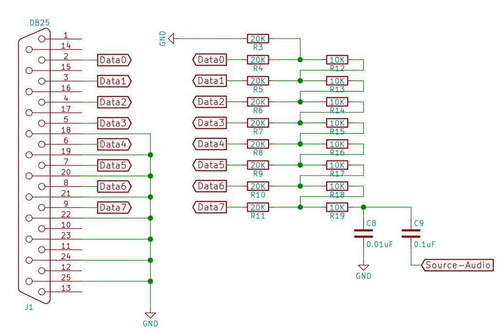](images/covox-pure-schematic.png.png)

Above is the schematic of the CST-specific DAC portion on my sound card.  The 8 data pins are connected to a bunch of 10K and 20K ohm resistors. This is called a R-2R resistor ladder setup.

### Why this design?

I referenced the design from this [Russian site](http://kb.gr8bit.ru/KB0010/GR8BIT-KB0010-Adding-multimedia-capability-covox-device.html) which also includes detailed explanation of the component selection and rationale. 



To avoid reinventing the explanation wheel, take a look at the video above by Collin Cunningham on how the R-2R ladder is used to generate sound.

Basically, each step of the ladder contributes a small voltage to the final audio output. The closer sources to the output Data 7 onward have a greater influence (more significant bits) compared to those up the ladder. The key requirement of this setup is that the resistors must as close as possible to their actual values. If not, the imprecision in the more significant outputs can overwhelm the output of the least significant bits.

The Russian guide recommended 1% tolerance resistors but I chose the more precise 0.5% ones as the price is not extravagantly more considering I make only a few of these boards.

## Additional onboard amplifier

Unless your speakers has an internal amplifier, the raw output of the CST is at a very low volume. For use with devices like headphones, the output has to be amplified.

[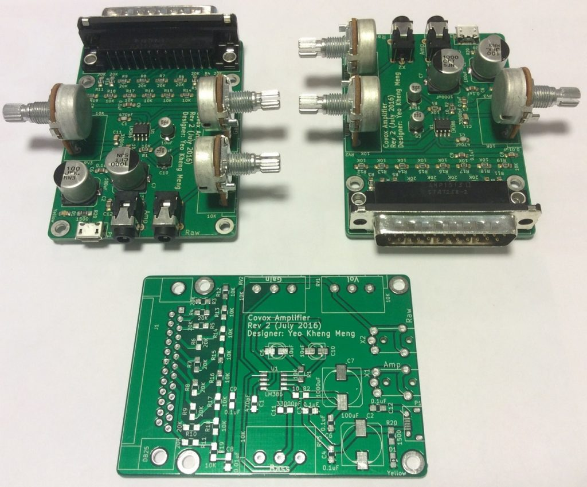](images/covox-assembled.jpg)

The R-2R setup is on the left. The R-2R output is piped to to a [Texas Instruments LM386](https://en.wikipedia.org/wiki/LM386) power amplifier to boost the output.

[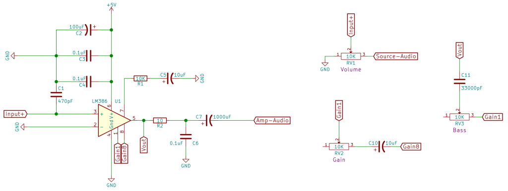](images/covox-amp-circuitry.png)

I referenced the LM386 usage from this [Circuit Basics site](http://www.circuitbasics.com/build-a-great-sounding-audio-amplifier-with-bass-boost-from-the-lm386/). The volume, gain and bass can be adjusted with 3 10K ohm linear potentiometers.

### Volume

Volume is adjusted via a potentiometer(RV1) which acts on the input audio itself. Varying the resistance on a potential divider shapes the amplitude of the audio signal.

### Gain

Gain is basically the range of volume can operate in. The gain can be set on the LM386 via pin 1 and 8. If nothing is connected, the default gain is 20. To make it adjustable, we add a 10uF(C10) capacitor to increase the maximum gain to 200. The potentiometer(RV2) will then let the user vary the gain between the range of 20 and 200.

### Bass

According to the [LM386's datasheet](http://www.ti.com/lit/ds/symlink/lm386.pdf), _"we can compensate poor speaker bass response by frequency shaping the feedback path. This is done with a series Resistor-Capacitor(RC) from pin 1 to 5 (paralleling the internal 15 kΩ resistor)."_

The datasheet specifies 0.033uF (C11) as the capacitor value. A 10Kohm potentiometer(RV3) completes the resistor portion to make the bass adjustable.

### Other components

The other stuff are mostly for electrical decoupling and low/high-pass filters. Read more about it on the [Circuit Basics site](http://www.circuitbasics.com/build-a-great-sounding-audio-amplifier-with-bass-boost-from-the-lm386/).

# How do we send audio data to the CST?

Before we go to using the CST and its limitations, let's see how typical sound hardware on your machines work.

## How do conventional sound cards/chips work?

Typical sound hardware on PCI or PCI-Express bus uses a technique called Direct Memory Access (DMA) to access sound data at the system RAM. Since the peripheral can access the RAM, the CPU can be freed up as it does not have to micromanage details of the data transfer. You can read a good write-up on this topic [here](https://geidav.wordpress.com/2014/04/27/an-overview-of-direct-memory-access/). Simply put, this is a series of steps that happen for sound data to reach the sound card or any peripheral device.

[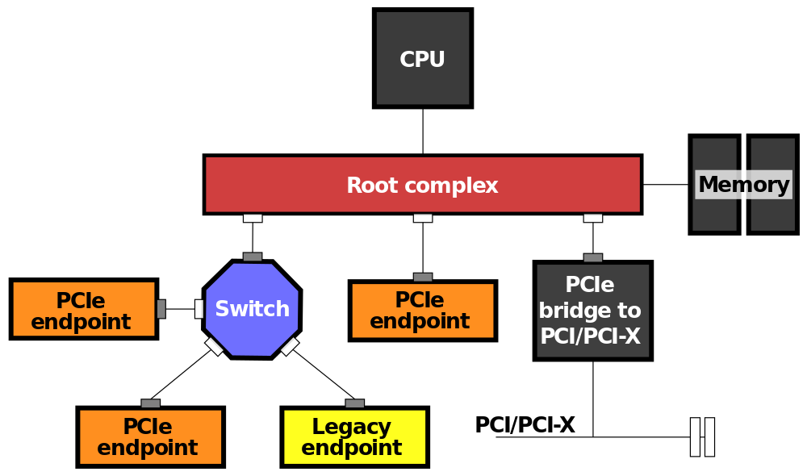](images/covox-pcie-bus.png)

PCI-E bus image source: [https://en.wikipedia.org/wiki/Root\_complex](https://en.wikipedia.org/wiki/Root_complex)

1. CPU loads sound data into memory
2. CPU tells the peripheral's DMA engine data from which memory addresses needs to be copied over
3. CPU tells peripheral to start fetching the data
4. Once the peripheral has finished the transfer, it will send an interrupt signal to the CPU to inform it of the completion.

Since the CST is such a simple device, it obviously does not have a DMA engine to do the DMA. The CPU has to be involved in every stage of the data transfer to the CST.

## A sample DOS program



I found a DOS program [CovoxMP3](http://rayer.g6.cz/programm/programe.htm) written by Martin Rehak that can operate the CST standalone without any drivers. The CST requires precise CPU timing in order to generate a proper audio frequency unlike typical sound hardware.

DOS and early Windows operating systems work well in this aspect as they are considered to be single-threaded and applications have low-level raw access to hardware. CovoxMP3 was therefore feasible in the DOS environment since no other applications will jockey for system resources. Modern computers although more powerful have more feature-rich operating systems and numerous user applications that increase the multitasking demands.

Is it possible to do the same on a modern system?

## My Program

If you saw the video at the top of this post, obviously I succeeded in writing a program that plays sound to the CST. The source code can be obtained from [here](https://github.com/yeokm1/covox-music-player). I chose the C language as I needed to extract the best performance I can get from the system as you will see later. Besides, all the APIs I used are also in C.

[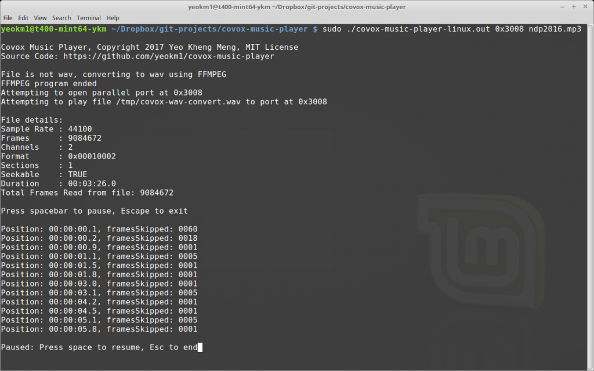](images/covox-music-player-screenshot.png)

Screenshot of my command line application

### High Level Workflow

1. Get the parallel port address and path to music file via the command line arguments
2. If the file is not a Wav as defined by the extension, call FFMpeg to convert it to Wav
3. Use the [libsndfile](http://www.mega-nerd.com/libsndfile/) C library to parse the WAV file to reduce my coding load.
4. Read the file using the _[sf\_readf\_short](http://www.mega-nerd.com/libsndfile/api.html#readf) _which will produce 1-byte-sized chunks regardless of the original bit-rate of the file.
5. Average the values in each frame of the stereo or multiple channels to convert to mono
6. Map the _short_ chunk to _unsigned short_ or _uint8\_t_
7. Write the _uint8\_t_ value to the parallel port address with the Linux [outb](http://man7.org/linux/man-pages/man2/inl.2.html) API.
8. Go back to Step 4 until the file ends

The high level understanding is simple enough, implementation less so.

### Writing data to the CST

The hardest problem I had was ensuring the audio data was written to the CST at the right rate. To put things in perspective, the typical music file has a sample rate of 44100 Hz. The sound system has to play these samples at the correct time if not the audio will be distorted.

Time to play each sample = 1s / 44100 = 22.68 microseconds

Typically the dedicated sound chip will handle the playback at the microsecond precision. All the CPU has to do is to make available the sound data in RAM.

[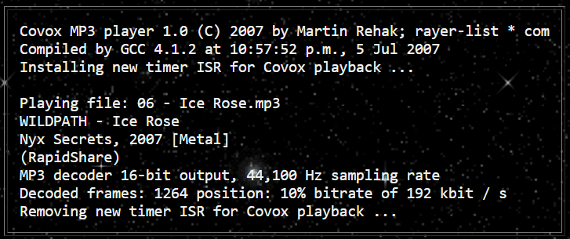](images/covox-dos-player.png)

Image source: [http://rayer.g6.cz/elektro/covox.htm](http://rayer.g6.cz/elektro/covox.htm)

The CovoxMP3 DOS program prints out the fact that it installs a new timer interrupt service routine (ISR) as the [typical DOS ISR only has 55ms precision](http://webpages.charter.net/danrollins/techhelp/0105.HTM). I'm unsure how did Rahak do it but I believe his solution provided a more precise timing to drive his program to output data at the correct speed.

Since I'm using a modern Linux operating system, such a precise ISR routine is unavailable. There is an API called [_usleep_](http://man7.org/linux/man-pages/man3/usleep.3.html) where the program will wait for at least the provided number of microseconds before resuming. In practice, this does not work well due to the multi-tasking nature of modern operating systems.

The only recourse for me is to run everything in a tight while loop as fast as possible to wait for the right moment to write to the parallel port.

Linux provides an API to get a system time from an arbitrary epoch with nanosecond precision.

```c++
long long getCurrentNanoseconds(){ 
    struct timespec spec; 
    clock_gettime(CLOCK_MONOTONIC, &spec); 
    long long specTime = (spec.tv_sec * 1E9) + spec.tv_nsec; 
    return specTime; 
}
```

This is the code I used. The _timespec_ structure has both the seconds and nanoseconds field so both have to be added to obtain pure nanoseconds reading.

The nanosecond-precision reading is more than enough to let my program decide when to write a particular sample to the port. The only drawback is that my program will take up 100% CPU utilisation on one CPU core due to the tight loop. Even with everything going for it, the program still skips samples at certain moments as it is interrupted by the OS scheduler.

# Conclusion and potential work

I have learned lots of interesting stuff in the project and have gained a better appreciation of the sound hardware that goes into modern computers. I actually wondered if it were possible to ditch the parallel port and use a USB-Bridge chip instead to make the hardware truly modern.

[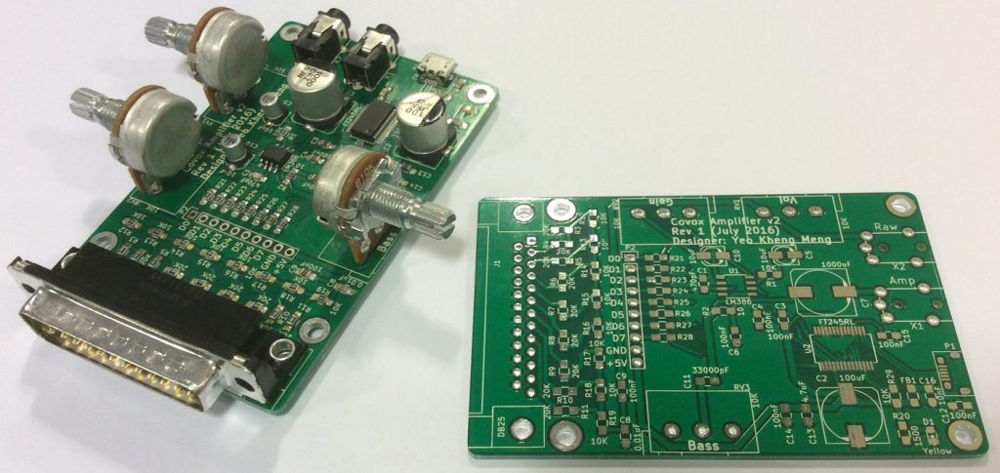](images/covox-with-ft245.jpg)

This is my newer design including an FTDI FT245R USB to 8-channel chip which will appear by default as a USB-Serial port to the machine. This design has not been tested at this time. If I have the time to do it, I might continue in this path.

You may wonder why did I title this post "A Science Project". This was [coined in a blog post](https://blogs.msdn.microsoft.com/oldnewthing/20130319-00/?p=4913) by a Microsoft software engineer Raymond Chen to describe projects that fall into any of the following categories:

1. A feature that is really cool and challenging from a technological standpoint but is overkill for the user-scenario.
2. Requires hardware few people have.
3. Trying to solve a problem that nobody really considers to be a problem. You're doing it just for the Gee Whiz factor.

I would like to believe this project has elements of some of all of them, after all, how many people still use parallel ports this days and who needs a parallel port sound card in an era of integrated audio on motherboards.

Finally, if you have any suggestions or loved what I have done, feel free to ping me in the comments below.



Video of the talk I gave about this subject at [Hackware v2.6](https://www.facebook.com/events/693979027431863/).