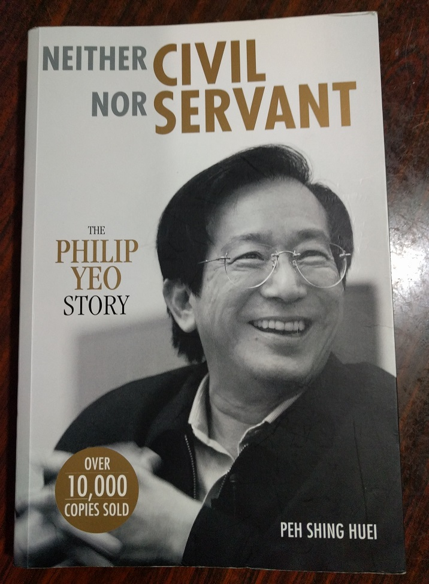

"life sciences graduates are only fit to wash test tubes" this statement I heard more than a decade ago was the first time I knew of this guy called Philip Yeo. Then chairman of Agency for Science, Technology and Research (A\*Star), it caused quite a ruckus I believe in Singapore at the time where there was a strong push by the government into the bio-medical field.

That line partly factored in my decision against taking up a triple-science (Physics, Chemistry, Biology) subject combination in secondary school. I opted for Physics and Chemistry only.

When I recently heard from online sources of this biography of the man himself "Neither Civil Nor Servant", I was intrigued. I admit I did not know much of this supposedly very "notorious" Singaporean civil servant. So when existence of this book came to me, I decided I had to read it.

So here is my take of reviewing this book!
<!--more-->

# Getting the book

As usual, the National Library (NLB) is my first choice cause to avoid shelling out hard-earned cash if I can. I tried to reserve the book.

My gosh! 200+ people ahead of me. My NLB request would expire long before it would reach my turn. I decided to buy the book for US$35 from [STPress](http://www.stpressbooks.com.sg/Neither-Civil-Nor-Servant-The-Philip-Yeo-Story.html).

# Review

I'm obviously not the first person that has reviewed this book. A simple Google search reveals that many prominent bloggers and journalistic personalities online have already done so. What I'll do instead is to extract out certain stories or learning points that I feel have impressed me the most or impacted the way I saw or will see things.

The author of the book journalist Peh Shing Huei has arranged the contents of the book chronologically in these sections which I'll follow.

1. The Early Years (short section only)
2. Defending the Nation
3. Jobs, Jobs, Jobs!
4. To Live

I'll use the abbreviation PY instead of writing Philip Yeo every time.

## 1\. The Early Years

Due to his extensive portfolios, PY was seldom at home. He credits his wife for taking care of his children while he was away. His son Eugene had this to say:

> He's sort of omnipresent. When you need him, he will appear. I think that's better than a father who was always around but would disappear when you need him.

Not that I'll be like PY if I do have kids one day, just that is a useful quality I feel all parents should have. Be always present as far as possible, if you can't, make sure you are there for the important moments.

## 2\. Defending the Nation

PY started his career as a branch head in Mindef Logistics Division after finishing his studies in 1970.

### Gumption and thinking out of the box: Personnel recruitment

His branch didn't have enough engineering staff. He then proceeded to recruit non-combat-fit but engineering-trained conscripts throughout the SAF. Striking deals with commanding officers of logistics camps to get those men but salaries still paid by their home bases. He got his manpower from other sources without paying a single cent.

My impression of the civil service, SAF and even typical Singaporeans is that this kind of out-of-the-box thinking is uncommon. Most people would probably do the traditional hiring strategy or just complain.

It was during this role that PY would meet the then defense minister Goh Keng Swee (deputy prime minister later) who was instrumental in shaping his career.

### Just do it mentality: Our SAF "lost territory" for the first time to PY

PY was the chairman of Singapore Automotive Engineering (SAE) which provided vehicle maintenance and servicing. One day he saw 2 fields owned by the SAF and he told Goh Keng Swee:

> Look at the football fields, they are not being used. I need space for SAE. I'm going to take one for SAE's expansion.

Before he received Goh Keng Swee's permission, he got his people to fence off a field with concertina wire. For the first time since independence, our military lost ground!!! No dilly-dallying and putting things off via official channels.

### Ultimax 100

I knew before that the [Ultimax 100](https://en.wikipedia.org/wiki/Ultimax_100) Section Automatic Weapon is Singapore designed and manufactured from our Social Studies (SS) textbooks by Chartered Industries Singapore (CIS), today part of ST Engineering.

What I didn't know is its origins actually came from PY who was also head of CIS. He wanted a light automatic weapon for our soldiers. What our SS books also conveniently left out is that the 2 main designers of this weapon were actually Americans that PY hired.

## 3\. Jobs, Jobs, Jobs!

This is by far the longest section of the book. In here, it details PY's journey as head of the Economic Development Board (EDB) or economic czar of Singapore since 1986. This is also the period where Singapore experienced its first post-independence recession.

### Innovative: Who would be mad enough to invest in Singapore in a recession?

PY commissioned an advertisement to be placed on the Wall Street journal with signatures from heads from leading tech companies of that era like Apple, Motorola and Seagate. I can't reproduce it here but you can see the advert for yourself in the [National Archives website](http://www.nas.gov.sg/archivesonline/posters/record-details/e9dd5ce9-b3fb-11e3-927b-0050568939ad) and I strongly urge you to do so. Even though that poster is 30 years old today, it still impressed me and I think you will be too.

### Nothing lasts forever: 5-5-5 rule and the cluster idea

> No industry lasts forever. Every industry struggles the first five years, grows and stabilises in the next five and then matures in the last five. By the second fifth year cycle, it is time to rejuvenate or move on. You must bring in new clusters every five to 10 years, otherwise it's not sustainable.

With this mentality of change already ingrained, military and disk drive industries were set up with this in mind. Even if the primary industry failed, the supporting industries can act as backups.

### There is always another way: Scholarships

> Sir Paul, who don't you create a Glaxo scholarship? We give 30 of Singapore's brightest young students each year a chance to study engineering at the best universities in the UK and USA. And they will carry the Glaxo name.

Paul Girolami, Chairman of Glaxo one of the companies that will award scholarships to EDB scholars. Glaxo wanted to thank the government for its smooth operation in Singapore and PY suggested scholarships.

PY had to ask private firms as the government did not provide funds for them preferring the usual Public Service Commission route.

### Going regional and doing it fast: Batam

Around 1988 after recovery from the recession, Singapore faced a labour shortage. Foreign labour curbs were introduced aggravating the problem. PY realised that if the problem was not solved, MNCs would leave. As salaries rose, it was necessary to find a place nearby to do the low-value, labour intensive work while keeping high value-added jobs in Singapore.

Batam was the natural choice given the close proximity to Singapore. The problem was there was plenty of red tape going around not to mention Batam had no infrastructure to speak of. Nevertheless, PY got everything from conception to the first MNC producing stuff within 2 years.

> My philosophy is that if I do things fast, very few people would dare to oppose me. They can't catch up.

I'm sure this concept can be applied elsewhere as well :P.

### Mistakes on the Suzhou Industrial Park (SIP)

I first heard of the SIP also from the Social Studies textbooks which painted a very positive outlook on the collaboration between Singapore and China. When I read further, I knew things wasn't so rosy as the Singapore side kept losing money all the time until the moment stakes were swapped to give China the majority stake.

He raised 2 points which I shed additional light at least for me around this issue.

1. Singapore chose a site against the recommendations of the Chinese officials.
2. Singapore took the majority stake of 65% which gave the Chinese less incentive to promote the Park.

He recounted that he was pressed into the SIP programme because Lee Kuan Yew wanted him to solve those issues. He wasn't proud of this project.

### Have a grand vision and execute it: Jurong Island

> Would Mobil consider investing in a Singapore island which did not exist?

Before the scouring of foreign investment round the globe into Jurong Island, its conceptualisation had to come first.

I was pleasantly surprised but not totally unexpected by the fact that its origins had something to do PY. He was flying back on a helicopter from Indonesia where he spotted the 7 islands that would form today's reclaimed Jurong Island. Just like the military and hard drive industries, the petro-chemical cluster or hub with its supporting industries was born.

I always wondered why foreign investors would choose Singapore of all places to do their refinery work. My education so far never fully answered this question other than the generic reasons of rule-of-law, educated workforce and efficient civil-service. This book finally cleared my doubts:

> Yeo's idea was to build what he called the "Sim Lim Square of petrochemicals"... Everything will be housed under one roof, or on one island in this case. More importantly, the products of one company will feed off one another. The technical term is "vertical integration". The companies will also share utilities by outsourcing common facilities, such as cooling water, waste treatment plants and steam to third party specialists... cutting down the capital costs of building jetties, tanks and pipelines... 20% cheaper for a firm to get its plant running. By being close to Singapore's mega port, these companies can easily send their products overseas.

## 4\. To Live

In this section, it is about PY's days in the biomedical field. One of his former colleagues passed away and that spurred him to be more interested in medicine. One thing led to another and he became the head of the National Science and Technology Board (NSTB) which will then be renamed to Agency for Science, Technology and Research (A\*Star).

> NSTB was such a bad and unpronounceable name. I wanted a name which starts with a higher letter in the alphabet. I also wanted to draw the best and the brightest. When you sit for your PSLE, the best score is A star right. That is the name I wanted.

Now I finally know the origins of this name, thanks to PY! It shows his attention to detail if need be.

### Bend/Break the rules when necessary: Computerisation in Mindef /Civil Service

This area should be Section 2 but the book chose to place it here. PY wanted Mindef to be computerised but the rules of that time only allowed the Ministry of Finance to have an IT department. To skirt this rule, he bought an IBM machine and called it "intermediate business machine" and not used the word "computer" in the documents.

Experience he gained from this push led to the Civil Service Computerisation Programme. Imagine if PY had not bent the rules as he did, our government wouldn't be as tech-savvy as today.

### Building of Biopolis

Now the book describes speed in terms of "PY's speed". In just 2 years, Biopolis with its 7 buildings were up in October 2003.

### Don't wait for approval, just get it done: one-North MRT station

I used to work at Blk71, a stone's throw away from Biopolis and I had to use the one-North MRT station daily to get to work. I did realised beforehand that this station was the only one that started with a lower-case letter. What I didn't know before reading this book is that the existence of this station was due to PY.

> ... I told MRT to build a station here but they refused. They said they don't have the budget for it. So I asked JTC to pay for the construction of the station....I didn't bother waiting for approval. I just got it done. Who would dare to do such things these days?....

### Not afraid to take and give criticism even to people of power: Argument with Lee Wei Ling

In 2007, Lee Wei Ling (daughter of Lee Kuan Yew) and head of National Neuroscience Institute slammed the investment into Biopolis as a waste of money and that he lived in an ivory tower with no experience in this field. He fired back at her that biomedical sciences is a long-term investment without quick returns.

Regardless of who will be proven right or wrong, the fact was he was willing to stand his ground in what he believed was best for the country.

Another case was when he asked an elected MP to step down because the latter wasn't against the breaking of scholarship bonds. It even escalated to the parliamentary level. I leave you to read the book to find out his side of the story.

### Developing/Kidnapping talent:

PY believed in using scholarships as a means to get talent from the Glaxo example above to slashing of research funds to fund scholarships.

> I believe in catching them young and grooming them. The Spartans took the kid at seven years old and trained him to be a fighter... That's how Spartan became powerful despite only a population of 20 000.

The talents he chose were also curated and had to add value to Singapore.

> ...in the last 10 years, we imported too fast and too many...A persistent complaint is that our young fresh graduate has to complete with a fresh IT professional from India.... If he is a senior person... he is bringing his experience and knowledge and contacts... But a fresh foreign guy is just going to depress the Singaporean wages. We should bring in foreign talent at the higher level and always to supplement, not to replace.

My sentiments exactly!

### Avoid micromanaging your people

PY says he got his inspiration from Goh Keng Swee who emphasised _delegation with oversight_.

> I don't like people to breathe down my neck, so I don't breathe down my staff's necks.

# Conclusion

I was truly impressed that a civil servant like PY has contributed so much to the growth of Singapore.

> "You can have a visionary like Lee Kuan Yew but somebody has to put it into practice. Philip (Yeo) puts things into practice.  (Richard Sykes, the former chairman of GlaxoSmithKline and rector of Imperial College)

In our education system, we usually hear of Lee Kuan Yew and occasionally Goh Keng Swee and the other founding politicians. Rarely do we hear of the civil servants like Philip Yeo who are actually the ones executing the orders being highlighted. I'm quite glad actually this book brought his contribution to light.

Another point someone raised to me is that PY is fortunate to have bosses like Goh Keng Swee who understood his style of working and let him do what he did. If he had another superior who was less undestanding, things wouldn't have turned out this way.

As for the title of this book, it came from PY himself.

> Don't ever call me a civil servant. I was neither civil nor servant.

If you are interested in how the Singapore economy is today, it is no doubt tied to Philip Yeo's career as this book has described. My only gribe is that this book tends to glorify his actions and paints an overly positive picture about him. But since this is his biography, I shall let it slide.
