If you have not read the [previous post (Part 1)](/2016/05/repair-kopitiam-speciality-electrical-tools/) on this subject, I encourage you but it is not mandatory to do so before reading this post. I'll still go through the fundamentals in this post. If you just want to see the raw technical details, the schematic and code of this project have been [open-sourced here](https://github.com/yeokm1/repair-kopitiam-training-and-equipment/tree/master/short-circuit-limiter).

# Post Objective

To show why did I build this and how it works plus the issues faced.

[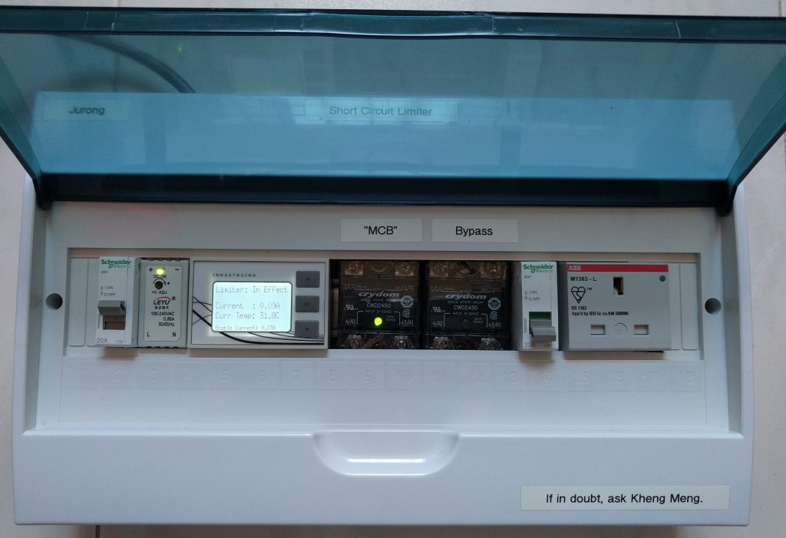](images/rk-equip2-scl-prod-front.jpg)

The clean case hides the complexity within.
<!--more-->

# Background

I'm a regular volunteer in the social initiative called Repair Kopitiam (RK) started by Sustainable Living Lab (SL2). On a monthly basis, we teach Singapore residents how to repair their household electrical appliances, fabrics and furniture. Our volunteers are also called repair coaches.

# My talk

I gave at [Hackware v3.4](https://www.facebook.com/events/261629434317053/) on Sept 6 about this subject. Video and slides below. The audio is quite bad due to the location.



# What is the problem?

I’m sure everyone of us have heard about [circuit breakers](https://en.wikipedia.org/wiki/Circuit_breaker) (CBs). They are basically automated switches that cut the circuit if they if they detect something dangerous like current overload or if earth leakage has been found. Breakers are installed everywhere in buildings, homes and even at void decks of HDB flats where RK operates.

## 2 types of Circuit Breakers

1. Residual Current Circuit Breaker[ (RCCB)](https://en.wikipedia.org/wiki/Residual-current_device) trips when there is an imbalance between the live and neutral lines. Also called earth leakage.
2. Miniature Circuit Breaker (MCB) trips when there is an current overload such as during a short circuit

Whenever an appliance trips your household circuit breaker, all you have to do is unplug the faulty device and reset the breaker.

Onsite circuit breaker at the void deck.

## Locked electrical room

Not so simple for RK, the electrical services in the void deck of HDBs are usually under the purview of an external company contracted by the town council. For the case of our Tampines location, it is by the Essential Maintenance Service Unit (EMSU). The EMSU does not allow us to have unaccompanied access to the electrical room holding the circuit breaker for security reasons.

[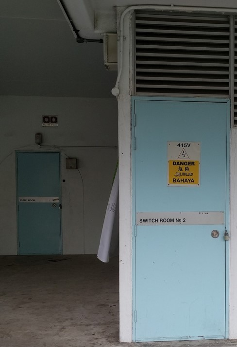](images/rk-equip2-switch-room.jpg)

The circuit breakers for the void deck are hiding behind this locked room. Whenever any breaker trips, we have to call EMSU and they have to send their personnel over to unlock the room to reset the breaker. This usually takes 30mins to an hour. In the meantime, there is no power.

# Solutions

## Solution to prevent RCCB trips

To prevent the onsite RCCB from tripping and yet still cut the power for safety reasons, I made this device.

Details are in my [previous post](/2016/05/repair-kopitiam-speciality-electrical-tools/) but basically how it works is that there is a 20K ohm resistor placed on the Earth line. The resistor holds down the earth-fault current to the level below the 30mA threshold of typical RCCBs. The RCCB (or RCBO) in my device is rated for 10mA which is more sensitive. Therefore, only my RCBO will trip and not the one in the room.

## Solution to prevent MCB trips

The previous solution I did more than a year back worked well but preventing MCB trips proved a harder nut to crack. After more than a year of design and iteration, I finally managed to partially solve the problem. Explanation will come in later. Enjoy the video.



### Things to look out for in the video:

1. 20 seconds startup time to let current measurement settle. Notice the left relay is kept off till startup is done.
2. Turn on a lamp: There is a 1 second delay between turning on the lamp and the second relay being turned on. Also notice the display backlight turns on and the buzzer buzzes once.
3. Turn off the lamp: The display backlight turns off immediately and the buzzer buzzes twice.
4. Repeat steps 2 and 3 for the hair dryer. Notice the motor sound is lower during the 1 second period.
5. Short circuit with a cable with its live and neutral pins shorted. The moment the switch is turned on, the device cuts off power to the outgoing socket. The buzzer also buzzes for a long 2 seconds. Notice the onsite MCB in the room did not trip as the device is still on.
6. Reset the device with just a simple button press.

# Design

## Design Goals

1. (Primary goal) Prevent onsite MCB trip yet cut power to maintain safety
2. Should not cause prolonged voltage drop to downstream appliances.
3. Portable. It is about 2.5kg which is light enough to be transported easily.
4. Idiot proof to use.
5. Safety protection on overheat (to be explained)

## Basic Design

To get started I googled for existing solutions, I found this concept of [Inrush current limiter](https://en.wikipedia.org/wiki/Inrush_current_limiter) which is pretty similar to what I'm trying to do. 2 solutions are recommended from online sources

### High-level design options

I shall quote Wikipedia on this:

1. Using a negative temperature coefficient (NTC) thermistor.
    
    > When the circuit is closed, the thermistor's resistance limits the initial current. After some time current flow heats the thermistor, and its resistance changes to a lower value, allowing current to flow uninterrupted.
    
2. Using a fixed resistor:
    
    > Fixed resistors are also widely used to limit inrush current. These are inherently less efficient, since the resistance never falls from the value required to limit the inrush current... They can be switched out of the circuit using a relay or MOSFET though, after inrush current is complete.
    

I decided to go with the fixed resistor route as it is more deterministic than the thermistor. In my case if I adopt Solution 1, I will use a Positive Temperature Coefficient (PTC) themistor instead which resistance will increase as it heats up due to overcurrent.

A PTC can take time to cool down after a short circuit for its resistance to go back down to the level suitable for typical operation. Furthermore, an actual short circuit will have a high probability of damaging the thermistor.

### Proposed high-level design

A microcontroller-controlled relay is connected in parallel to a high power resistor. A 10 ohm resistor is chosen to limit the fault current to at most 23 Amps if there is a short circuit.

1. At the start,  the MCB Relay is on and Bypass relay is off and all current must flow through the 10 ohm resistor
2. Once an appliance is turned on, the microcontroller will wait for a delay of 1 second. If there is no short circuit or excessive current flow during this period, the bypass relay will be turned on allowing full current flow to the device.
3. If there is an excessive current flow, the MCB relay will be turned off. It will remain off until the user has cleared the fault and tell the microcontroller to reset the MCB relay.

I'll also include a buzzer so that mode changes can be heard from afar without the repair coaches having to constantly look at the LCD screen.

# Implementation

## Innards

[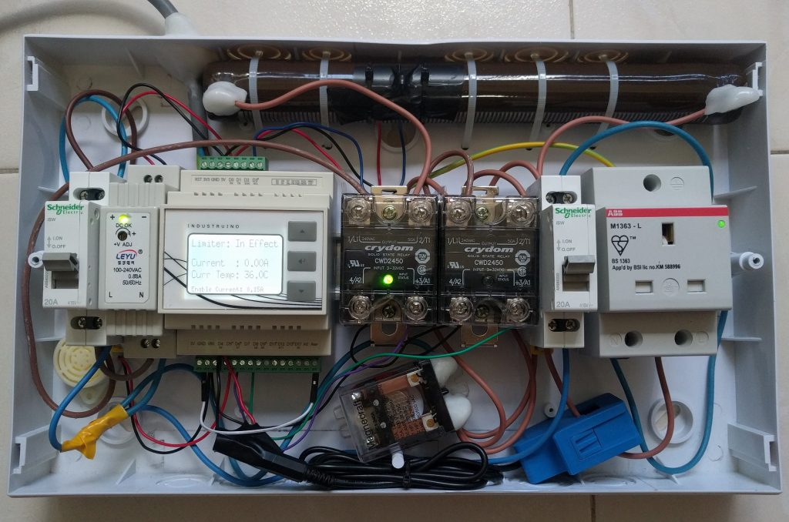](images/rk-equip2-scl-prod-internal-standby.jpg)

Scared by the eventual complexity? Upon project completion, I was surprised it came to this.

[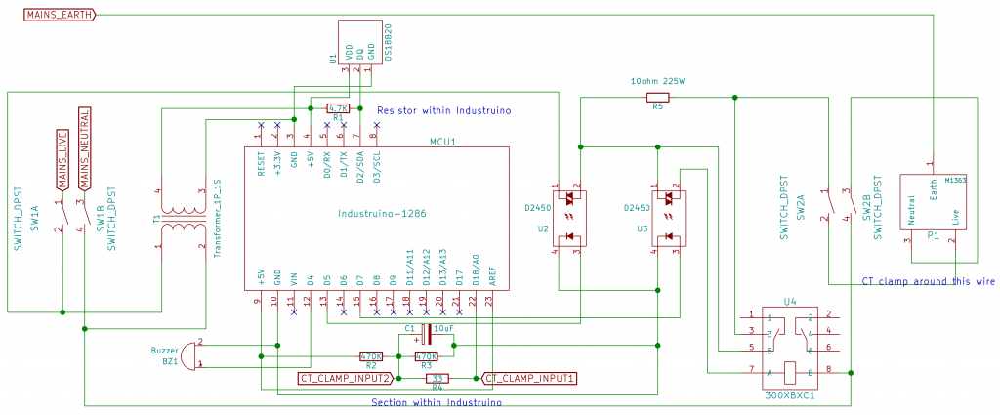](images/rk-equip2-schematic.png) The full schematic for reference purpose.

## The brain: Industruino-1286

I needed a microcontroller (MCU) to manage the relays as well as other features. As the circuit breakers use a [DIN rail](https://en.wikipedia.org/wiki/DIN_rail) for mounting, it would be great if the MCU can be mounted on this same rail as well. I searched and I found the [Industruino Proto Kit](https://industruino.com/shop/product/industruino-proto-kit-8).

[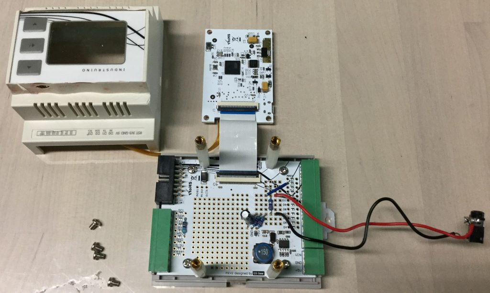](images/scl-industruino-internal.jpg)

It has these features which met my needs perfectly!

1. Arduino-compatible microcontroller
2. LCD screen to display status
3. Buttons for the user to reset the MCB
4. Internal prototyping area which I'll use for the current measurement circuit.

I chose the MCU based on the AT90USB1286 because of stock issues but the cheaper 32u4 option should also work.

## High-Power Resistor

[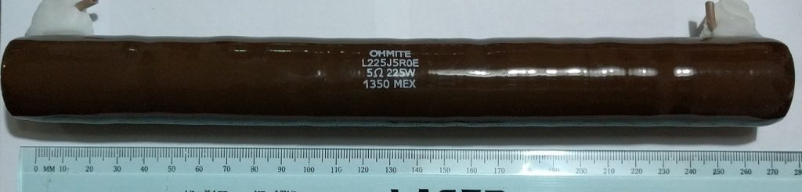](images/rk-equip2-10ohm-resistor.jpg)

This 5ohm resistor is the exact same size as the 10ohm one I used.

It is HUGE at about 27cm long and 2.5cm in diameter. The biggest I have handled in my life so far but necessary. It is rated at 10-ohm, 225 Watt so as to hold down the current to 23 Amps (below the onsite MCB threshold) if there is a short circuit.

The data sheet says it can withstand "10 times rated power for 5 seconds" which is about 2250W. In theory, by P=I2R, one would need 23 \* 23 \* 10 = 5290 Watt resistor to be able to dissipate the heat generated. However, this is mitigated by the fact that the MCU will react almost immediately to this extremely high current and cut the power before the heat becomes a serious problem.

## Current Measurement

In order to know whether an external appliance has been powered on or off, some form of current measurement is necessary. The current data is also required to know when an overcurrent/short-circuit condition has happened.

[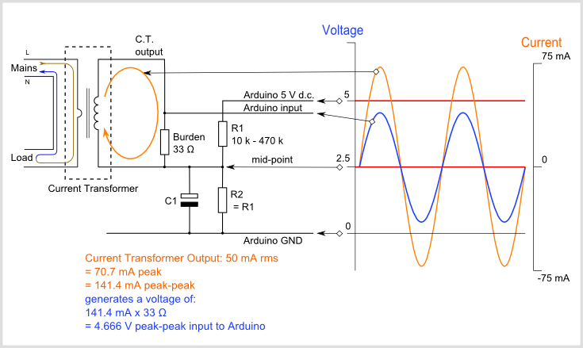](images/Arduino_AC_current_input_A.png)

This image is obtained from the [Open Energy Monitor site](https://learn.openenergymonitor.org/electricity-monitoring/ct-sensors/interface-with-arduino) which has an open-source schematic to show how current can be measured with an Arduino. How it works is that the +ve and -ve AC output of the CT clamp is converted into positive values and scaled into a voltage range so the ADC of the MCU can read it. Read more in the provided link.

The parts used in this schematic are placed inside prototyping area of the Industruino itself except for the audio jack. That is drawn out externally for the CT clamp to connect to.

### Current measurement settle time

In my tests with the above circuit, I found out that the measurements obtained initially are pretty unreliable. If I understand correctly, it is due to the example code I adapted from [Emonlib](https://github.com/openenergymonitor/EmonLib) where some of the existing measurement readings relies on data of the previous measurement due to the low-pass filter. This makes the initial measurements inaccurate.

[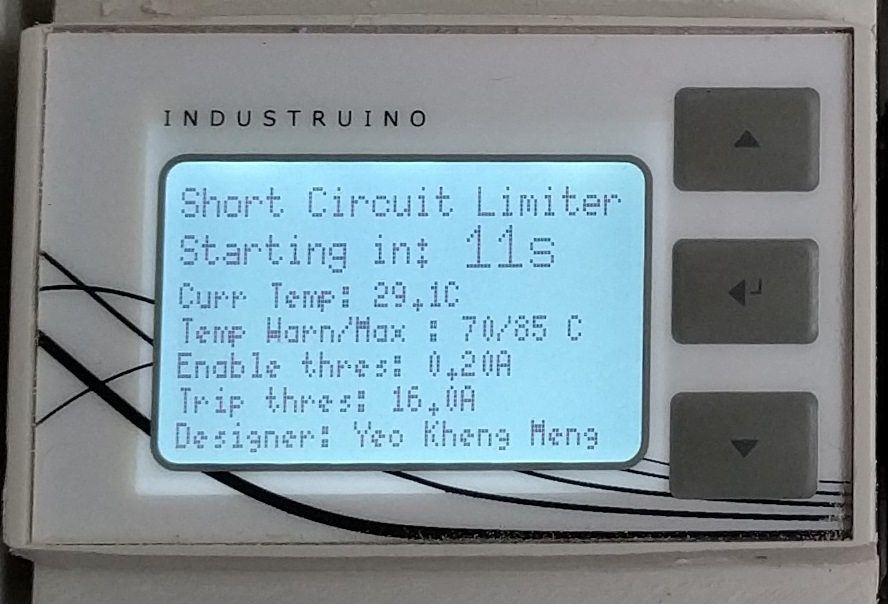](images/rk-equip2-scl-startup.jpg)

To mitigate this issue, I force a 20-second startup time at the beginning till the measurements stabilise. In the meantime, I thought it would be a good opportunity to show a "bootup screen" displaying the thresholds of the different operations.

## A tale of many relays

When I first started, I thought any el-cheapo [solid-state relay](https://en.wikipedia.org/wiki/Solid-state_relay) (SSR) will do. Turns out, this part cause me problems that took a significant amount of time to solve.

### How does an SSR work?

[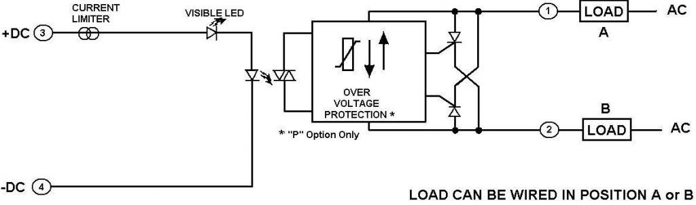](images/rk-equip2-ac-relay.png)

Picture from [Crydom's CW24 datasheet](http://www.crydom.com/en/products/catalog/3rd-generation/c_w24.pdf)

When one applies power to the primary coil, the LED within the opto-isolator lights up and is captured by a photodiode on the other side. The signal is then used to control a [Silicon controlled rectifier (SCR](https://en.wikipedia.org/wiki/Silicon_controlled_rectifier)) which is a semiconductor switching element. To add on the CWD2450 model I used is classfied as a zero-crossing model which means it only turns on or off when the voltage/current falls to zero to prevent surges.

### Problem: SSR does not turn off

Let's bring back our high-level design.

It turns out in the above configuration, both the relays do not seem to turn off even if the primary coil is de-energised.

After much Googling I actually found a possible explanation to this problem [here](http://www.omron-ap.com/service_support/FAQ/FAQ02155/index.asp). What it says:

> Reset Failure due to Solid-state Relay Leakage Current Even when there is no input signal to the Solid-state Relay there is a small Leakage Current (IL) from the Solid-state Relay output (LOAD). If this Leakage Current is larger than the load release current, the Solid-state Relay may fail to reset.

So it turns out there are actually several certain conditions when an SSR cannot turn off.

The 10-ohm resistor I used is connected in parallel to the Bypass SSR. When I disconnected the resistor, the problem went away! Suspecting it to be an issue, I googled further and it turns out it might be the cause. I found the following quote [here](http://www.resistorguide.com/inductance/).

> Helical wire wound resistors are especially prone to having significant parasitic inductances, because of their coil shape.

Although it is not obvious from the picture, this is 10-ohm resistor is indeed helical wire wound.

When the appliance is turned off, the connection to the Neutral line is cut off. Because this helical resistor is connected in parallel to the Bypass SSR, there is now a loop formed between the resistor and the Bypass relay. Although I have no proof, I speculate the inductance of this resistor now provides that small amount of current that keeps the SSR closed.

As for the MCB relay, I suspect it remains on as well since it is now part of the loop.

### Online Solution:

The [same site](http://www.omron-ap.com/service_support/FAQ/FAQ02155/index.asp) that explained the problem proposed the following solution:

[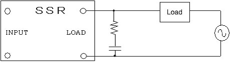](images/rk-equip2-ssr-bleeder.jpg)

Connect a resistor and capacitor of a specially chosen value that matches the load using the above configuration. Another name of such a setup is a "snubber" circuit. It suppresses any change in voltage caused by the load. In this case, the load is the resistor.

### Implemented Solution: Use a mechanical relay

I did consider the online solution but after some thought, I decided to use a mechanical relay (MR) which avoids the problem altogether. The reason being those online solutions assume that the output load is fixed. For RK's case, I never know what faulty device is connected on the output end to predict the bleeder resistor required on top of the inductance caused by the 10-ohm resistor.

[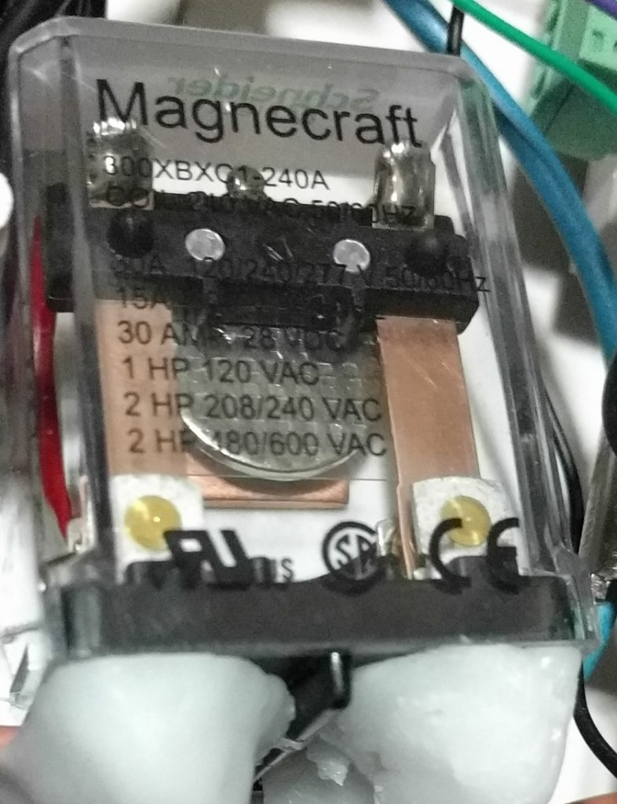](images/rk-equip2-mech-relay.jpg)

I covered the bottom pin headers with Polymorph to prevent accidental shorts. See the video of it in action below!



A MR works by using power from the primary coil to energise an electromagnet which is used to physically shift armature holding the contacts.

This MR from Schneider Electric requires 240VAC on the primary coil to energise. Therefore, I used the previous SSR to control it. A relay to control another relay LOL! There is another version of this MR that uses 24VDC instead but I guess it's more trouble to convert the 5V MCU logic level to 24V.

One key disadvantage of mechanical relays is their lifespan. The datasheet rates it at 5 million cycles so I should not have to worry about it. After all, I won't be using this device 24/7 every few seconds.

After the project in hindsight, I should have considered a SSR that has the random-turn-on characteristic. But if there is a short circuit at the moment of turn on, we could get a nasty surge instead of a smooth increase in current.

### Cheap SSRs vs branded SSRs

My initial plan was to use the typical relays one can get from the usual Chinese sites.

However, I soon realised a serious problem with those. Even when the primary coil is off and power is applied at the secondary circuit, those cheap SSRs will allow current through for a fraction of a second before turning off. This is just plain unacceptable in my application! I cannot risk having an uncontrolled closed circuit on the secondary side which might cause a short circuit which I want to avoid!

[   ](images/rk-equip2-other-relays.jp)[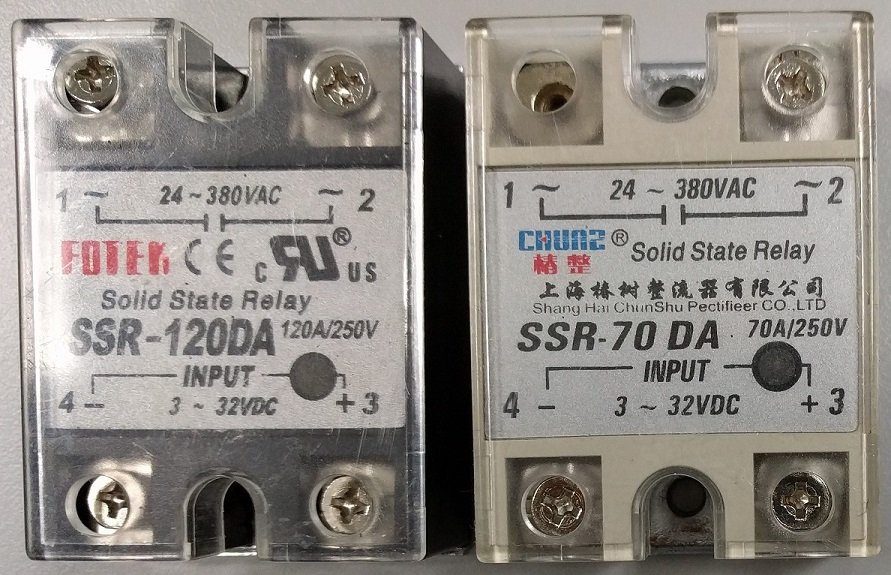      ](images/rk-equip2-other-relays.jp)[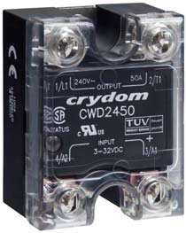](images/rk-equip2-cwd2450.jpg)

Chinese relays I tried before settling on the Crydom CWD2450 (picture from [Crydom's CW24 datasheet](http://www.crydom.com/en/products/catalog/3rd-generation/c_w24.pdf) )

I opted for the more expensive American branded Crydom relays which do not have this problem. They however cost SG$58 which is many times more than the cheaper Chinese ones but they work.

# Problems encountered during development

## Overheating of power resistor

I did not anticipate this issue during early development. However, as I simulated short circuits again and again during testing, I realised that the power resistor can heat up quite a bit. I could forsee the possibility the temperature might go up to dangerous levels.

I therefore decided to add a Maxim DS18B20+ 1-Wire digital temperature sensor to monitor how hot the resistor is. See the video below for the demonstration: 



### Things to look out for in the video:

1. Notice the temperature sensor placed behind the black tape on the resistor
2. I connect the hair dryer and aim the output towards the sensor to heat it up.
3. Once the temperature reaches 70°C, the buzzer will sound a warning of 5 buzzes and the display temperature reading will blink. The system will still work.
4. If the temperature hits 85°C, MCU will turn off the MCB relay ceasing operations.
5. Only when the temperature drops back below 70°C will the device will be able to resume operation.

## Short Circuit after Resistor has been bypassed

This is the greatest weakness of this system which I mentioned at the start that I can only "partially" solve this problem.

I can't get around this weakness and hope it rarely happens. Since this device might be in use by many downstream appliances at the same time, it requires the coaches to be alert to whether the device is in bypass mode or not before testing their appliances.

## Long development/iteration times

This device took more than a year from conception to the point where it can be used. It is very long by my personal standards. Chief among the issue is that RK happens only once a month which means my iteration speed is pretty much that.

Initial testing of this at my home caused problems for my family members as I caused plenty of blackouts to the point I was banned by my parents from further testing at home. I had to make regular trips to SL2's premises at United World College East in Tampines to do my tests.

# Conclusion

This is my most expensive and longest-running project so far. Each unit's bill-of-materials (BOM) is about SG$500 not factoring my personal time spent on this and other costs on trial-and-erroring components.

Never before have a single project of mine involved so many different types of components, microcontroller, power-resistor, buzzer, solid-state and mechanical relays, temperature sensor, CT clamp, DC, AC power concepts and literally hundreds of hours coding up all the logic.

I'm proud to say I'm nearing the closing of the chapter of this project after a span of 1.5 years on trying to solve this problem. In hindsight, the effort required to solve these issues might be too overkill and borders the line of a [Science Project](https://blogs.msdn.microsoft.com/oldnewthing/20130319-00/?p=4913). Nevertheless, the knowledge I have gained from this experience is priceless.

I still have a talk to give about this and training materials but those shouldn't be too difficult.
