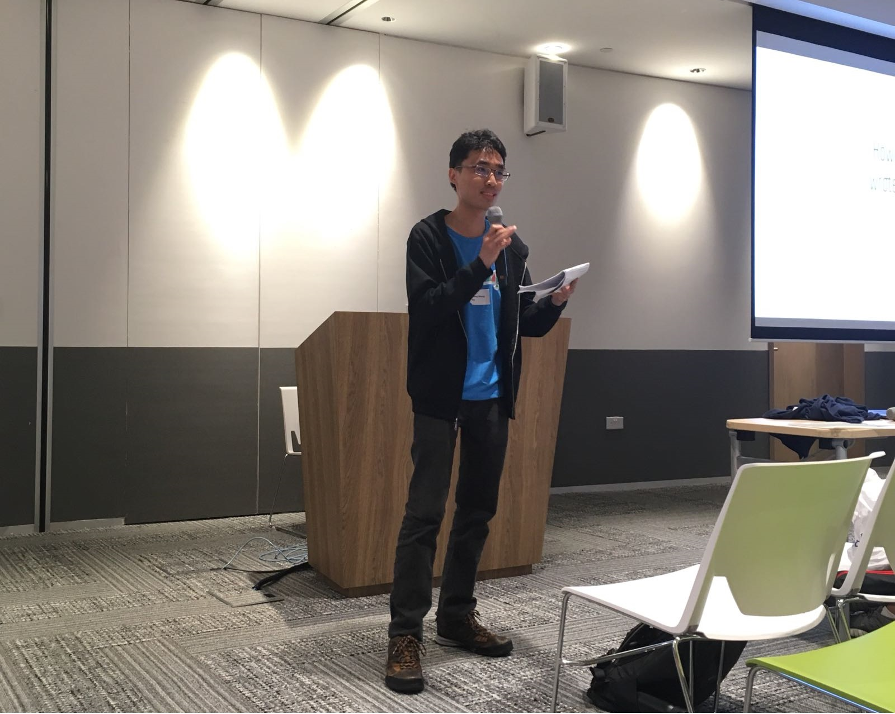

Yay, conference emcee achievement unlocked! Just completed my solo emcee role at [GeekcampSG 2017](http://geekcamp.sg/)!

With this I have completed the double trifecta of doing the roles of emcee, speaker and Engineers.SG recorder at both tech conferences and meetups.

Preparation for this role was quite a long time coming for me. I volunteered to be the [Hackware](https://www.facebook.com/groups/hackware/) meetup emcee for about 6 times to prepare for this. Even then, no amount of practice in small evening meetups can equal to emceeing for a conference 10 times the number of people that lasts the whole day.

Mandatory proof of doing the role.

Other than the sheer numbers and the usual task of introducing speakers, a conference emcee has extra challenges that I felt first-hand. But let me first mention the good stuff of being a conference emcee.
<!--more-->

# The good stuff

## Cut the queues

It is well known that tech conferences are male dominated so it represents one of the few times that a male has to queue for a significant amount of time before he can use the washroom. I just exercised my "emcee privilege" and cut to the front of the queue.

This situation is similar for the food queues. I just cut to the start of the line and everyone just gave way to me no questions asked.

After all, no one wants to delay their emcee right?

## Act like a boss

Similar to the above but more like control over the events proceedings. Although technically the conference chair and vice-chair outrank me in the decision-making process, they are almost never in the room with me to directly manage what I do and make that split-second decision to any issues that arise. They have other parts of the conference to worry about.

To the audience, I'm the one in charge and I represent the organising team. Of course with that power comes responsibility.

## Creativity in introducing/thanking the speakers

As with most emcees, I'm given full latitude in introducing and thanking the speakers. Due to the sheer number of speakers (12), I didn't have the personal resources to give treatment to all of them.

I did 2 memorable ones:

For [Sau Sheong](https://www.facebook.com/GeekcampSG/posts/1261036054001245): I just had to mention that [Codefather](https://www.techinasia.com/talk/road-singapore-codefather) nickname.

For [Huiren](https://www.facebook.com/GeekcampSG/posts/1261060713998779): Huiren is one of the youngest geeks I know that is very active in tech community. I used his haircut to draw attention to the fact that he is a Full-time National Serviceman. At the end, I asked the audience to give another round of applause "for his service to Singapore". That was not required but I felt it was the right thing to do considering the sacrifice of his limited free time.

## Get to actually watch all the talks

This is the only organiser role other than the timekeeper to have this privilege.

# The hard work

Now we have the good stuff out of the way. Let's get down to the trenches.

## Preparation before the conference

I had to figure out how to introduce the speakers. At the minimum, one just needs to say the speakers' names and their talk title. In practice, this will bore people very quickly. The advice I was given is to think of it as "trying to sell the speaker". Justify to the audience why they should listen to the speaker but at the same time not be too long-winded.

This meant asking/researching a bit more about their background to put them in the best possible light in a succinct manner.

## Confirm how to pronounce the speakers' names

I have to admit I have some difficult with "slightly less than Western, Chinese and Malay names". I have to confirm how to pronounce their names before their talks by repeating it back to them till it sounds right.

It may seem like a small thing but if the emcee says it wrongly, it is very likely the audience will use the wrong pronunciation when they approach the speaker for questions later. The speaker then has to end up correcting it every time giving him a bad day.

## Scheduling issues

### Starting late due to site issues

Geekcamp had a 15mins morning break followed by a 1.5 hours lunch break then a half hour afternoon break. Due to the unforeseen security bottlenecks at the ground floor, the event had to be pushed back by half hour. We had planned for this and we basically just shortened the lunch break to 1 hour.

In hindsight, I should have explained the schedule delay and issued an apology at the start to the audience even though technically it is not the fault of anyone in the organising team.

### Speakers underutilising their allocated time slot

Every speaker in Geekcamp had a half-hour slot. Some speakers finished with plenty of time to spare. One speaker even did his talk in 10mins. Typically, I just tell the speaker to field as many questions as they can. Even then, there is only so much this trick can help. I faced this issue after the afternoon break where 2 speakers gave very short talks and we ended up 15mins ahead of schedule.

Unlike meetups, conference scheduling is a fixed thing and if the speaker cannot use up his slot, there is nothing much one can do but find a way to fill in the time. And _whose_ job is it to fill the time? One cannot just ask the next speaker to go early as some of the audience may just turn up on time to specifically watch the talk of that next speaker.

I was informed to be prepared of this possibility by senior organisers. One way is to ask for announcements. The usual tactic is to entertain the audience is with jokes. Now I'm extremely poor in telling jokes so what I did was to prepare a list of geek and general knowledge questions. I actually used some of these questions to fill up that 15mins gap. The questions I used are available at the end of this post.

Thankfully I never encountered a speaker that overran his timeslot.

### Speakers missing in action (MIA)

Speakers MIA is one of the more scary things as an emcee. I have encountered MIA speakers in Hackware before but it is easy enough to skip them in meetups.

I had mentally prepared for this MIA possibility. What I would have done is just use my questions for about 10mins. If the speaker has not turned up by then, then give the audience a 20 mins break.

One of the speakers almost MIAed but turned up at the last moment. Thank goodness!

## Information overload

I'm pretty much on an information overload throughout the day. Once I'm not introducing the speakers or giving announcements, I have 2 major tasks.

1. Think about how to introduce the next speaker or the (lunch) break details. This is pretty much obvious.
2. Look out for new message requests from the other organisers. The challenging part is how to phrase them in a way that is "announce-able".

### Requests for announcements that I made

1. Location of food lines. Notify the audience that the ringing of a bell implies it's time to come back.
2. Taking pictures of slides is unnecessary as the event is recorded by [Engineers.SG](https://engineers.sg/).
3. The audience can submit speaker feedback via the mobile app.
4. Vegetarian food are in bento sets at a special location.
5. The lunch portion is limited. I spoke of it as "everyone should not take an excessive portion of food so everyone can eat" to the laughter of the audience.
6. The original request was for audience to check out the SP Group's booth as there are plenty of giveaways. I decided not to mention SP even though I work there myself as I felt there was enough references to SP as-is. I just said check out the sponsor booths.
7. A lady lost a bag and I was asked to announce if anyone had seen it. This request was rescinded before the next opportunity for me to speak.
8. Reminder no food and drinks in the room
9. A request came from personnel at SP's booth to use leftover swag like T-shirts and folders as quiz prizes.
10. Some members of the audience wanted an opportunity to make a wide announcement.
11. Someone lost the visitor pass and I had announce for everyone to check theirs.
12. Clear the trash before leaving the room

Notice many of the announcements are related to food? This is another difference between a meetup and a conference where meetups if food is provided, is only consumed before the event.  It is therefore a non-issue in meetups but quite important in a conference.

## High mental energy and focus required throughout

With all the above stuff going on, I could not afford to take much of a break other than lunch. As an emcee, I had to project a cheerful personality with an enthusiastic tone. After all, no one wants to listen to a tired-looking or monotonous emcee. It is tough enough to keep that up for just 2 hours in a meetup, imagine doing it for the whole day. It's not like I can be caught taking a quick power nap between talks.

## The loneliness

This may sound ironic but hear me out. Unlike the other organisers, I actually don't have much opportunity to interact with anyone else. When I speak, everyone is silent, when the speakers talk, I'm silent. I seldom even see the other organisers. Most of my contact with them is via online chat.

The organisers have a special room to do any administrative work. I remarked to one of them that I have only entered the room for the first and only time. I did that to see what the room was actually like.

Another organiser told me they do their jobs (behind the scenes) to enable me to do mine. Quite true actually, to the audience, everyone else is invisible.

# Final Thoughts

At the end of the event, I had a bad headache. I could barely interact with anyone by the time I reached the afterparty. This is the the price I pay for having my mental energy drained throughout the day.

If I knew it was this tough, I should have requested for a co-emcee to lighten the load. The 2 emcees can take turns introducing the speakers. Not only does that reduce speaking time, the emcees can take turns to manage the incoming announcement requests and word them easily for the other emcee to say.

Overall, this was a terrific experience for me. Of all the organiser roles, I still believe being the emcee is the most fun but is the most mentally tiring of all. If you are up for the challenge, go for it! GeekcampSG will still be held next year and all the roles are open!

I would like to thank the other organisers for advice and relieving as much duties as they can from me. Things like timekeeping, looking for speakers and ringing the bell were originally part of my role. Those may seem simple alone, but when added to my what I have to do, will probably overburden me.

# Quiz Questions

These are the questions I used for my quiz to help fill in the time till the schedule could get back on track. The answers are in white font so use your mouse to highlight them to reveal them.

**When was the first Geekcamp SG?**

\[22 August 2009, Yahoo! Asia, Suntec City Mall\]

**Difference in transmission speed between a Cat 5, Cat 5e and Cat 6 ethernet cable?**

\[100MBps, 1 Gigabit, 10 Gigabit\]

**What does MS-DOS stand for?**

\[Microsoft Disk Operating System\]

**Windows NT, NTFS. What does NT stand for?**

\[New Technology\]

**What is the maximum length of a USB 2.0 cable as allowed by the specification?**

\[5 meters. Due to propagation delay of the handshake packets.\]

**What is the furthest man-made object from Earth?**

\[Voyager 1 launch by NASA in 1977. 21 billion km. 19 hours for light to travel that distance.\]

**For IPv6, what is the theoretical maximum number of addresses?** \[2^128, 3.4×10^38\]

**Which aircraft is also known as the Queen of the Skies?**

\[Boeing 747\]

**Who is the person that came up with this term that Singaporeans have the "No U-Turn syndrome"?**

\[Sim Wong Hoo. Founder of Creative Technologies that made the Sound Blaster card. He wrote in his book Chaotic Thoughts from the Old Millennium where Singaporean drivers only U-Turn if a sign says so while foreign drivers only not U-Turn if there is a no U-turn sign. Basically Singaporeans like to follow the rules and are not innovative.\]

**More men than women have red-green colour blindness, why is this so?**

\[Colour sensing is on the X chromosome. Since men only have one and if that chromosome is defective, that man is affected. Women have 2 chromosomes so there is backup.\]

**In Star Wars, which character said, “So this is how liberty dies. With thunderous applause.”**

\[Senator Padmé Amidala\]

**What is the longest supported Windows version?**

\[Windows XP: Aug 2001 – April 2014: 12 years 8 months. (Common but wrong answer.)

Windows 1.0: Nov 1985 – Dec 2001: 16 years 1 month\]

**Who is considered the first computer programmer?**

\[Ada Lovelace. She wrote an Bernoulli Number algorithm to run on Charles Babbage theoretical Analytical Engine around 1842. A Programming language Ada was named after her.\]

**Which tech CEO once said "It’s ok to get an F"?**

\[Razer CEO, Tan Min-Liang. August 2013 to NUS Students. [https://www.techinasia.com/razer-ceo-tells-students-waste-time-f](https://www.techinasia.com/razer-ceo-tells-students-waste-time-f)\]

**What is the oldest x86 processor supported by the Linux kernel in present times?**

\[80486 released in 1989. 80386 stopped in early 2013 in Linux kernel 3.8.\]

**Who is the famous Singapore civil servant that said "life sciences graduates are only fit to wash test tubes"?**

\[Philip Yeo head of Astar in 2002\]

**What are the 3 Laws of Robotics coined by science-fiction writer Isaac Asimov?**

1. \[A robot may not injure a human being or, through inaction, allow a human being to come to harm.\]
2. \[A robot must obey the orders given it by human beings except where such orders would conflict with the First Law.\]
3. \[A robot must protect its own existence as long as such protection does not conflict with the First or Second Laws.\]

**What is the first iOS Device to have a 64-bit CPU?**

\[iPhone 5S released in September 2013. Because of this, it is also the oldest device to support iOS11.\]

**The origins of Mozilla Firefox can be traced back to which ancient web browser?**

\[Netscape Navigator\]

**Which MRT station is the only one built at ground level?**

\[Bishan MRT\]

**If you look at the North South line, the station code for Yew Tee is NS5 and the station beside it is Kranji NS7. What would an NS6 station be most likely called if it is built?**

\[Sungei Kadut\]

**Which company is affectionately known as Big Blue?**

\[IBM\]

**About 10 years ago, there was a high definition disc format war between Bluray and HDDVD where Blu-ray won. Before that 30 years ago, there was another format war for video cassette format, what were the competitors and which one won?**

\[JVC’s VHS vs Sony’s Betamax. 1970s to 1980s. VHS won\]

**What is name of an international treaty to phase out chemicals that will deplete the ozone layer?**

\[Montreal protocol signed in September 1987\]
