> What is the oldest x86 processor that is still supported by a modern Linux kernel in present time?

I asked the above quiz question during the [Geekcamp](https://geekcamp.sg/) tech conference in Nov 2017 during [my emcee role](/2017/11/my-first-conference-emcee-experience/). The theoretical answer as you can glean from the title of this post is the [486](https://en.wikipedia.org/wiki/Intel_80486) which was first released in 1989. I determined that fact from this article where [support for the 386 was dropped in Dec 2012](https://www.pcworld.com/article/2020196/linux-3-8-will-drop-support-for-intel-386-chips.html).

To get you interested, here is the result of my effort.

[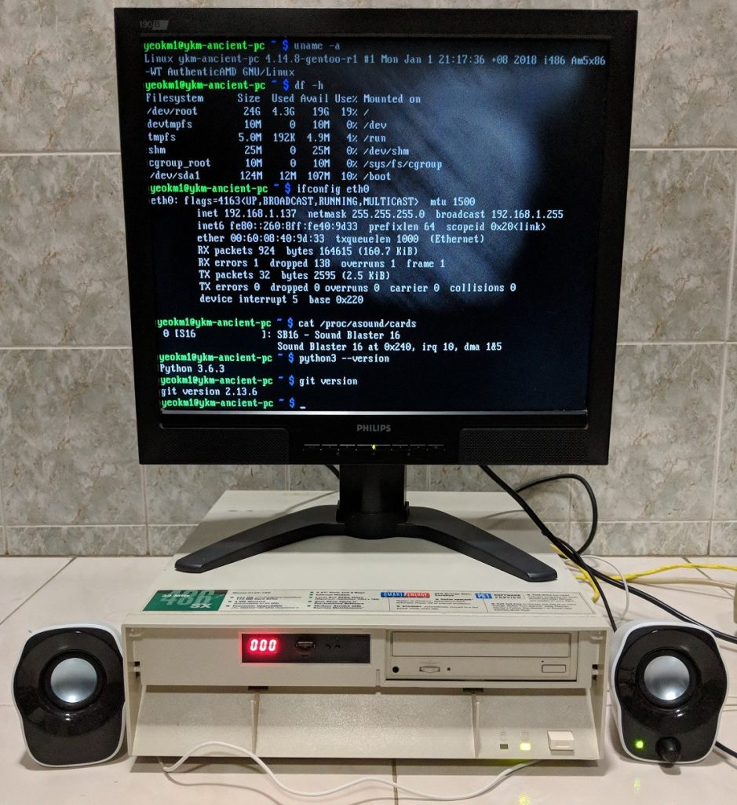](images/gentoo-486-capabilities.jpg)
<!--more-->

The white smudge on the screen is not the camera's fault, there is really a backlight problem with my old 19" monitor.



You can skip to 11:39 when the boot completes.

00:00 to 00:46 - BIOS

00:46 to 11:39 - Bootup. It takes almost 11mins to bootup!

11:39 to 13:14 - System specs, IP info and ALSA mixer

13:14 to 15:00 - Playing music via Sound Blaster 16

15:00 to 17:25 - SSH while playing (stuttering) music in the background. With AlsaMixer adjusting volume.

17:25 to 17:48 - Opening a webpage hosted by nginx.

18:10 to 20:13 - Git clone a repo.

20:13 to 21:13 - Using Python 3.6.3

21:13 to 21:43 - Cleanup and issue shutdown command

21:43 to End - Shutdown. It takes 5.5 mins to shutdown!

Interested in how I got a modern Linux kernel 4.14.8 (released in December 2017) to run on this ancient PC? Read on!

# Prior work and research

Last month, I took part in a [Super Silly Hackathon](https://supersillyhackathon.sg/) with my teammate [Hui Jing](https://www.chenhuijing.com/) where we installed Damn Small Linux (DSL) on that same 486 PC.

[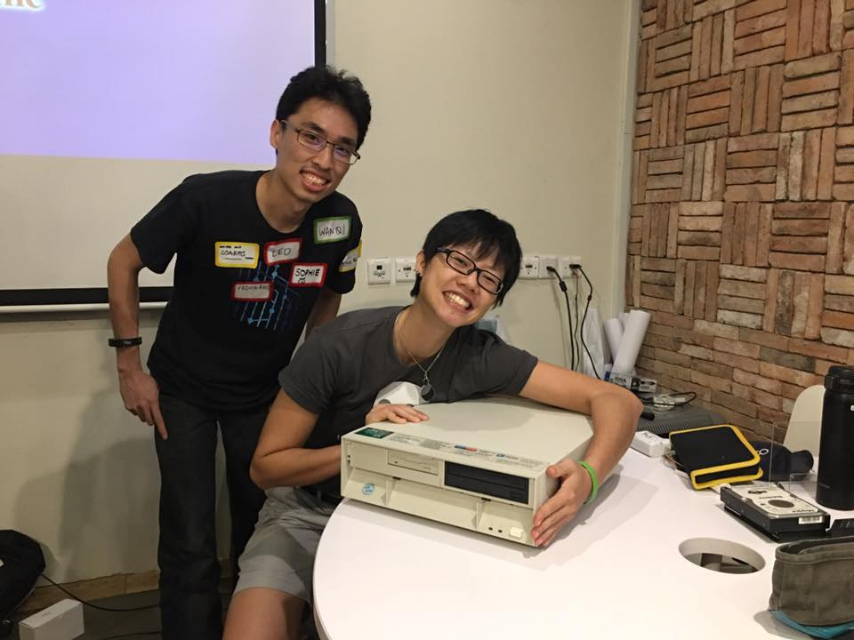](images/super-silly-hackathon-team486.jpg)

I bought this machine with the original intent to play old DOS games in their original glory. Anyway, we managed to play music and even host a webpage! See her fantastically detailed write-up [here](https://www.chenhuijing.com/blog/hardware-hacks-super-silly-hackathon/).

The version 4.4.10 of DSL we used was released in Nov 2008. It used the kernel version [2.4.31 that was released in June 2005](https://www.kernel.org/pub/linux/kernel/v2.4/) which is a dinosaur by today's standards.

Throughout the entire time, the question of whether the theoretical answer of 486 is actually true lingered in my head. I did some research and found out [someone actually installed Gentoo Linux with a modern kernel on a 486 PC](https://retrocomputing.stackexchange.com/a/4364). At least someone said it was possible although he did not give any hard evidence :( He advised that one should use a modern PC to do the source code compilation which I'll show later.

# What is Gentoo Linux and why?

[](images/gentoo-486-logo.png)

> Gentoo Linux is a Linux distribution built using the Portage package management system. Unlike a binary software distribution, the source code is compiled locally according to the user's preferences and is often optimized for the specific type of computer.
> 
> From [Gentoo's Wikipedia page](https://en.wikipedia.org/wiki/Gentoo_Linux)

The issue with modern Linux distributions like Debian/Ubuntu/Arch is that they distribute compiled binary packages. Typically this is good enough as compiling every single package you want from scratch is time consuming and most people ain't got the time for that.

Although the 486 is theoretically supported by the modern Linux kernel, this is not true on the distribution and package level.  For example, Debian has [dropped support for older 586 32-bit CPUs as of 2016](https://distrowatch.com/dwres.php?resource=showheadline&story=406). Thus, the oldest supported x86 CPU by Debian is the 686. The 6th-generation x86 started with the Pentium Pro released in 1995 or its more commonly known variant Pentium 2 was released in 1997.

Therefore, it is no longer possible to directly use a typical modern distribution on a 486 PC. But on an atypical distribution like Gentoo which requires you to compile every package, this might still be possible.

# The hardware

## The ancient 486 PC: [IBM PS/1 Consultant 2133 19C](https://en.wikipedia.org/wiki/IBM_PS/1) (released in 1993)

[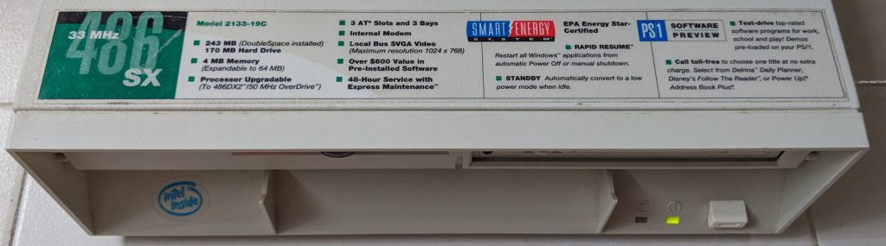](images/gentoo-486-original-spec.jpg)

Marvel at the original specs of this machine. The CPU and RAM were fully upgraded by the seller before I bought it.

### Specifications:

- [AMD 5X86 486-clone](https://en.wikichip.org/wiki/amd/am5x86) running at 133mhz
    - Similar performance to Pentium 75Mhz
    - The AMD 5X86 series were the fastest 486 clones ever made
- Cirrus Logic VLB CL-GD5424 Graphics 512KiB VRAM
- 64MB [SIMM-72](https://en.wikipedia.org/wiki/SIMM#72-pin_SIMMs) RAM
- 48x IDE CD ROM Drive
- [Gotek 1.44MB floppy emulator](https://www.philscomputerlab.com/gotek-floppy-emulator.html)
- CompactFlash-IDE adapter + 32GB Sandisk Extreme CF card
- 10Mbps 3Com Etherlink III [3c509B](https://en.wikipedia.org/wiki/3Com_3c509) (ISA)
- [Sound Blaster 16](https://en.wikipedia.org/wiki/Sound_Blaster_16) CT2950 PnP (ISA)

### Front panel

[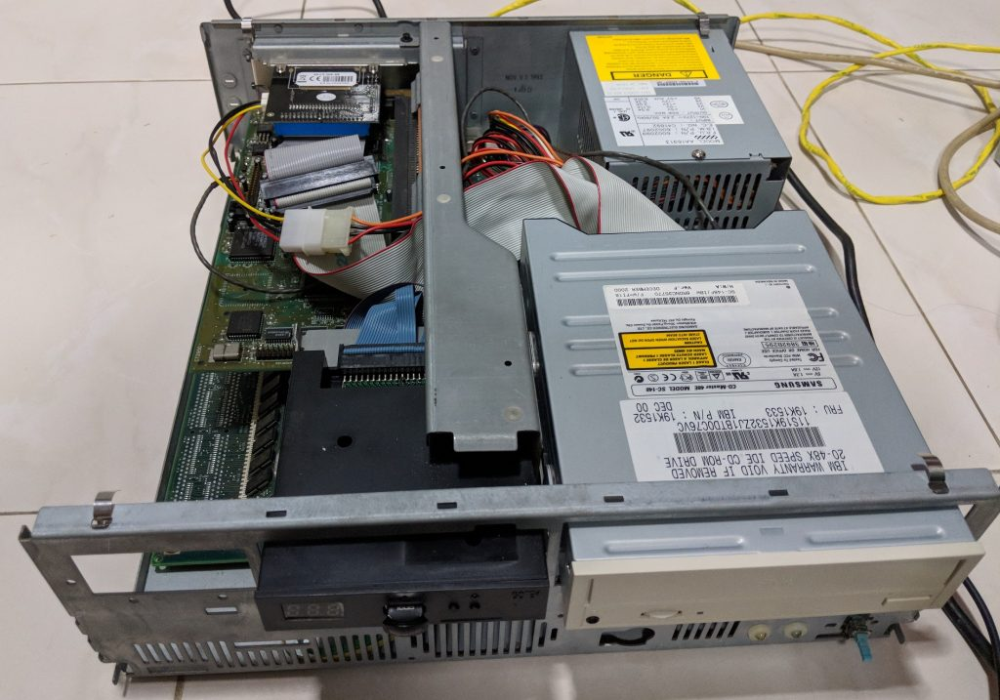](gentoo-486-innards-front.jpg)

The 48x PATA CD-ROM drive came with the PC. I replaced the original 3.5" floppy drive with the [Gotek 1.44MB floppy emulator](https://www.philscomputerlab.com/gotek-floppy-emulator.html). This cool device enables one to emulate up to 100 floppy disks based on images stored in the connected USB Flash drive! I no longer need to write to mechanically-failure-prone floppy disks whenever I want to transfer data.

### Expansion slots

[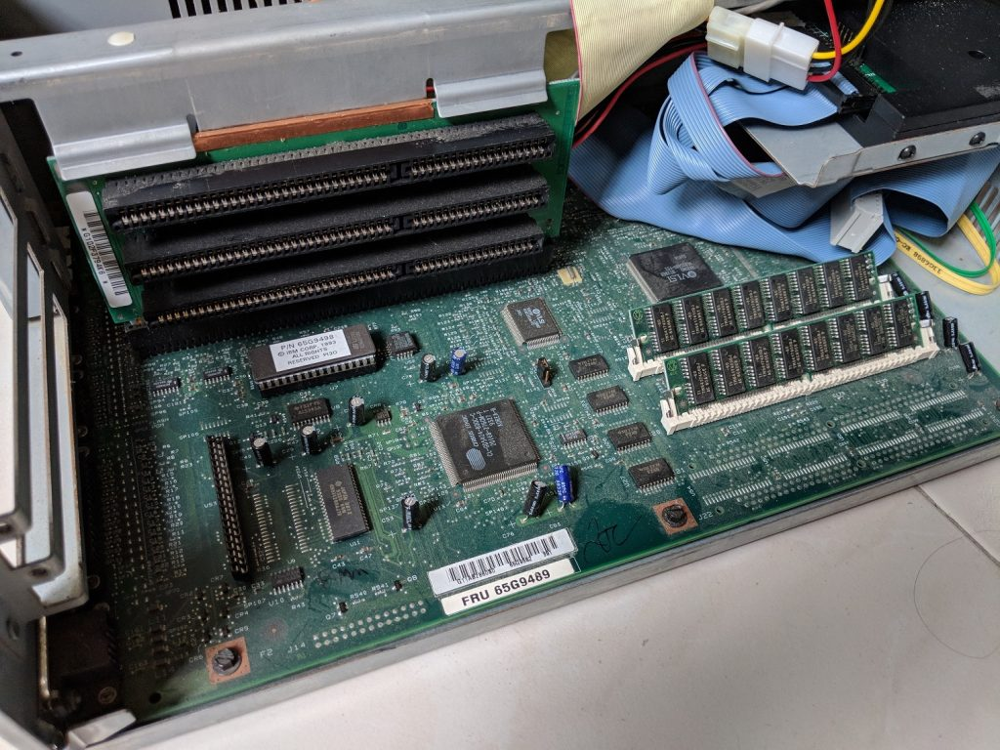](images/gentoo-486-isa-slots.jpg)

There are only 3 16-bit [ISA slots](https://en.wikipedia.org/wiki/Industry_Standard_Architecture) placed on the riser card in this PC. It does not even have the newer but also legacy [PCI slots](https://en.wikipedia.org/wiki/Conventional_PCI). This PC is filled with 2x 32MB SIMM-72 RAM sticks. I have to admit 64MB RAM is unheard of for a 486-era PC. Some people [online managed to go up to 128MB RAM](http://www.vogons.org/viewtopic.php?t=28748).

### Expansion cards

The 3 ISA slots are fully filled with the following

[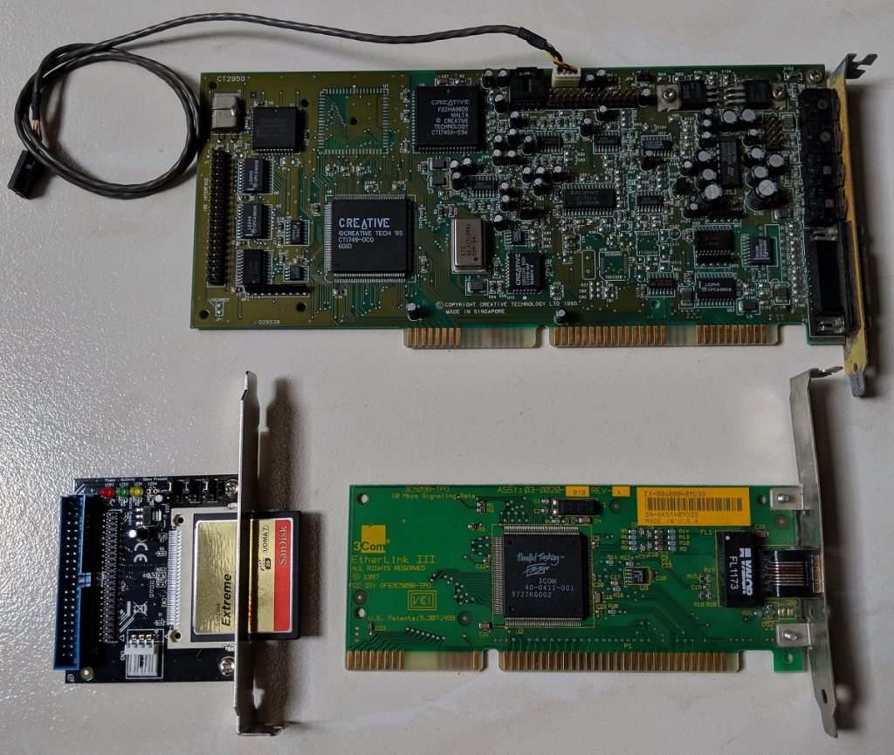](images/gentoo-486-isa-cards.jpg)

A [Sound Blaster 16](https://en.wikipedia.org/wiki/Sound_Blaster_16) CT2950 PnP, 10Mbps 3Com Etherlink III [3c509B](https://en.wikipedia.org/wiki/3Com_3c509),and a CompactFlash-IDE (CF-IDE) adapter. Technically the CF-IDE adapter is not an ISA card. It is mounted in the expansion slot to enable me to easily swap out the CF card without the hassle of opening up the case. To the motherboard, the CF card is just like any other hard disk.

### Expansion cards mounted in slots

[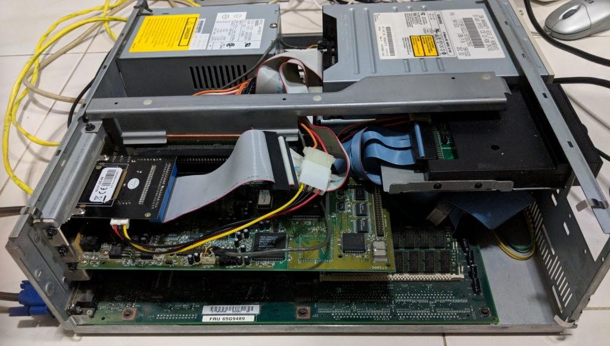](images/gentoo-486-innards.jpg)

[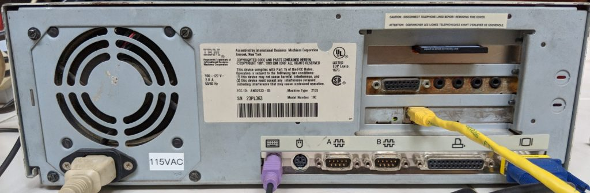](images/gentoo-486-back.jpg)

Legacy ports galore! Note the power supply which only accepts ~115VAC. I had to buy a transformer to step down the 230VAC mains in Singapore to suit this PC. The CF card is conveniently replaceable at the back.

## Compilation machine: [Thinkpad T430](http://www.thinkwiki.org/wiki/Category:T430) (released in 2012)

Compilation is a CPU-heavy process and the 486 will definitely take ages to do so. To avoid this issue, we shall do the compilation on a modern PC using a USB card reader then move the CF card over to the ancient PC.

[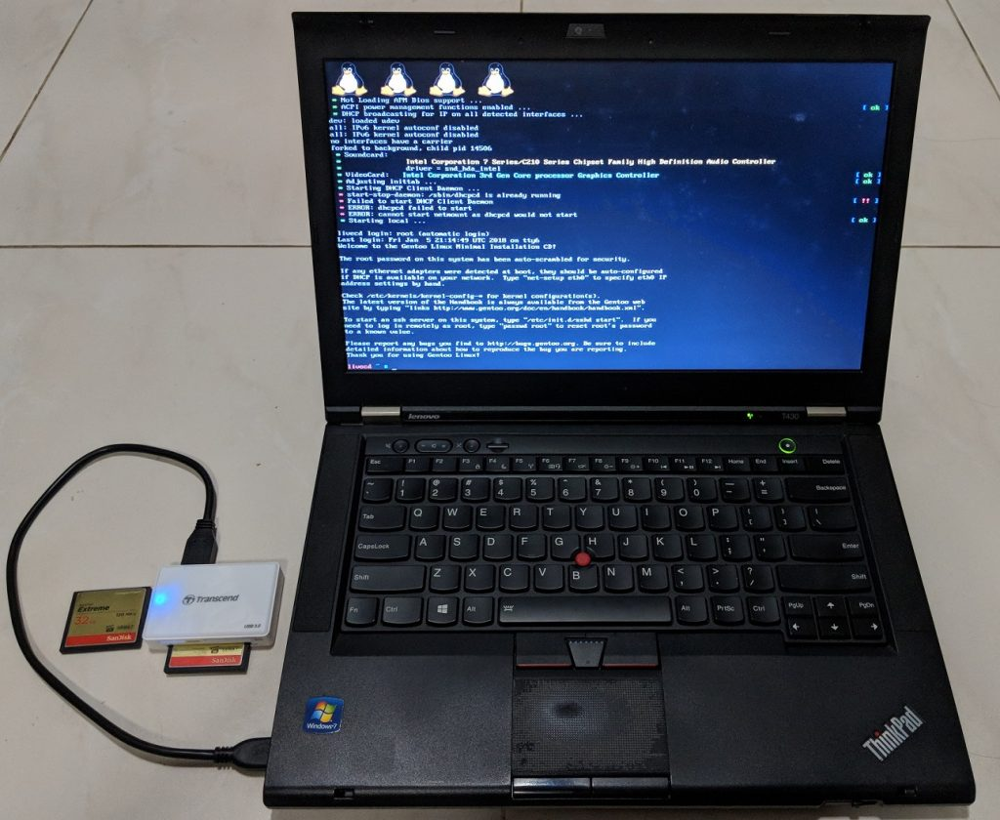](images/gentoo-486-t430.jpg))

### Specifications:

- Intel Core i7-3520M (3.50 GHz, 4MB L3, 1333MHz FSB)
- Intel HD Graphics 4000
- 16GB DDR3 - 1600MHz
- Gigabit Ethernet
- Ultrabay DVD-RW
- 2x USB 3.0, 2x USB 2.0
- USB-CF adapter to compile on CF card
- SSD removed to avoid corrupting it by accident during install

This Thinkpad T430 is a 6-year-old model by today's standards but is still fast enough to do the compilation of everything in a reasonable amount of time (like a few hours).

# Linux Installation

I've documented a [detailed list of instructions here](https://github.com/yeokm1/gentoo-on-486) on what commands to use to install Gentoo on this ancient PC. This post will just focus on the key steps and issues I faced.

## Step 1: Getting the install media and initial attempt {#step1}

The Gentoo x86 minimal installation CD can be [downloaded here](https://www.gentoo.org/downloads/) still supports the 486 architecture. Out of curiosity, I booted my ancient PC with it to see if it is possible.

[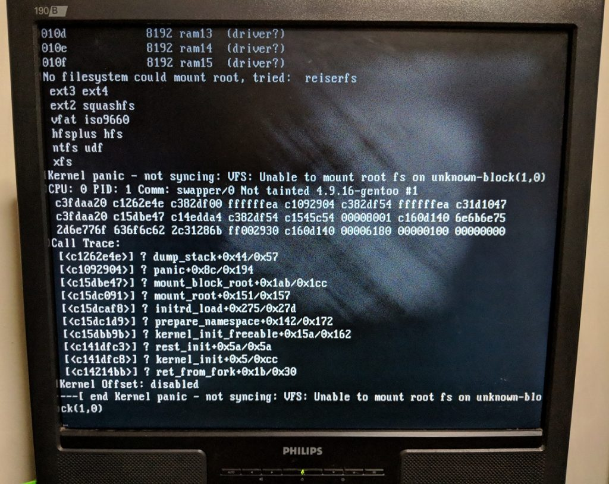](images/gentoo-486-livecd-boot.jpg)

Turns out I'll get a kernel panic. It is very likely this LiveCD kernel does not have the drivers needed to properly access the CD drive. Anyway, I got the CD started with my modern T430.

## Step 2: Disk partitioning {#step2}

These steps below are all done on the modern compilation PC except the last step.

### Gentoo's proposed partitioning scheme

[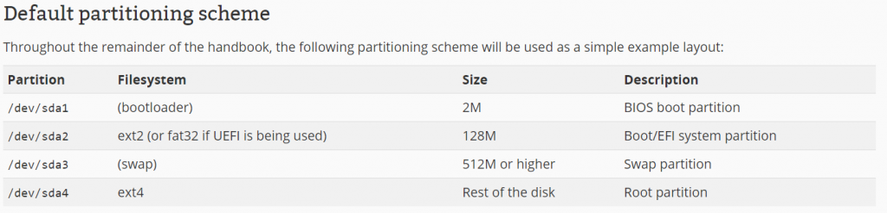](images/gentoo-486-gentoo-default-partitioning.png)

This is what Gentoo recommends. Since this is an ancient PC, it does not use UEFI therefore there is no need for the bootloader partition. Ancient PCs also have a BIOS 504MiB barrier which means they can only access the first 504MiB in the disk. This can be seen in the BIOS setup below:

[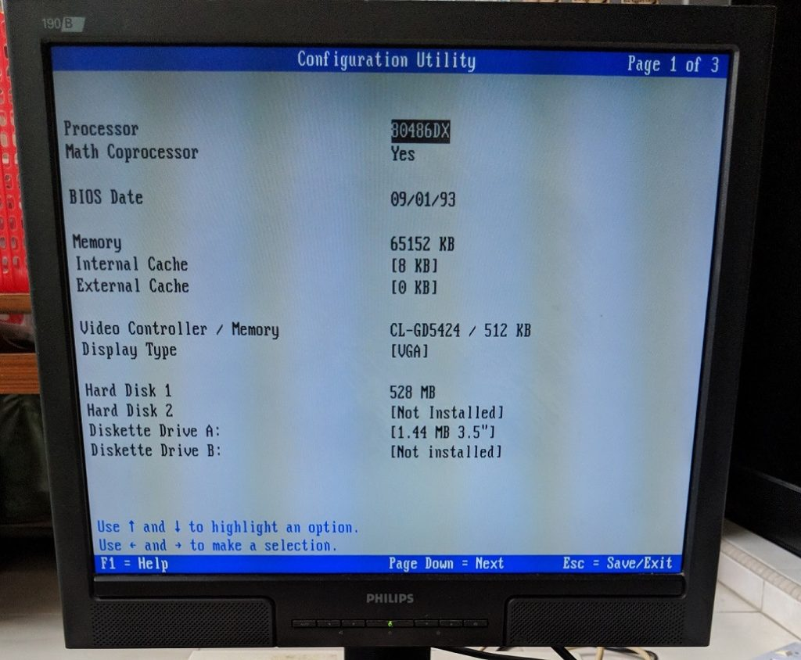](images/gentoo-486-bios.jpg)

Linux can recognise the full 32GB capacity of my CF card only after the kernel and necessary drivers are loaded.

### Actual partitioning scheme

[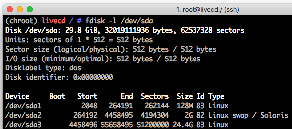](images/gentoo-486-disk-layout.png)

Modern Linux distributions don't always have a boot partition by default as its contents are now placed in the root partition. Since we have a 504MiB limit, we will need a small 128MB boot partition as the first primary partition to store the Linux kernel and other boot files.

## Step 3: Install Gentoo Stage 3 {#step3}

Stage3 is a step unique only to the Gentoo distribution. Basically you have to download a tarball containing a bare minimal binaries and system directories.

[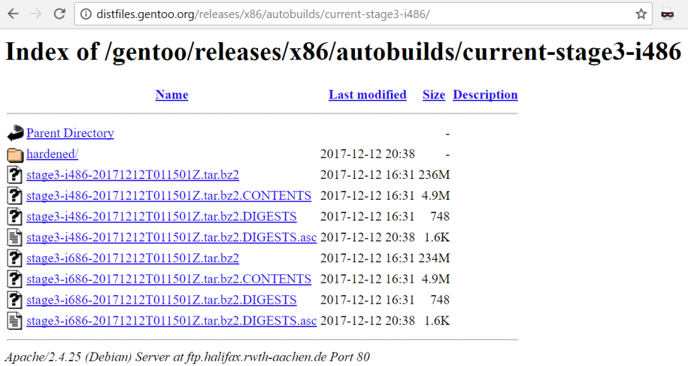](images/gentoo-486-stage3.png)

You have to make sure to download the one that is named "i486". Then uncompress it to form the base system.

For more information about the Gentoo Stages, you can take a look [here](https://wiki.gentoo.org/wiki/Stage_tarball).

## Step 4: Verify compilation parameters {#step4}

Portage is the package manager used in Gentoo and we have to make sure that its configuration will invoke the GCC compiler to emit packages that are 486 compatible. Ensure `/etc/portage/make.conf` has the following 486-specific options:

```plaintext
CFLAGS="-O2 -march=i486 -pipe" 
CHOST="i486-pc-linux-gnu" 
MAKEOPTS="-j5" # A good choice is the number of CPU cores in the system plus 1 
USE="-kde -qt4 -qt5 ffmpeg mp3 alsa"
```

The USE flags are for any new packages not to include GUI support and add sound support (for my demo).

## Step 5: Configure Linux kernel {#step5}

This was a tough nut to crack and I needed countless tries to get it to a workable state.  To minimise kernel size, the default menu options may not enable support for ancient hardware components. However, support for them are still there.

The actual list of options I chose were very long so I'll only show the key ones I selected.

[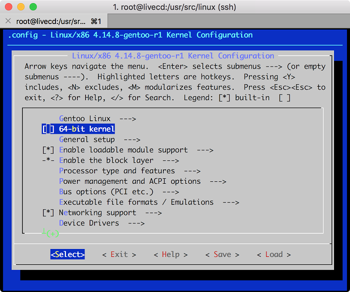](images/gentoo-486-kernel-64bit.png)

Must disable 64-bit kernel for obvious reasons!

[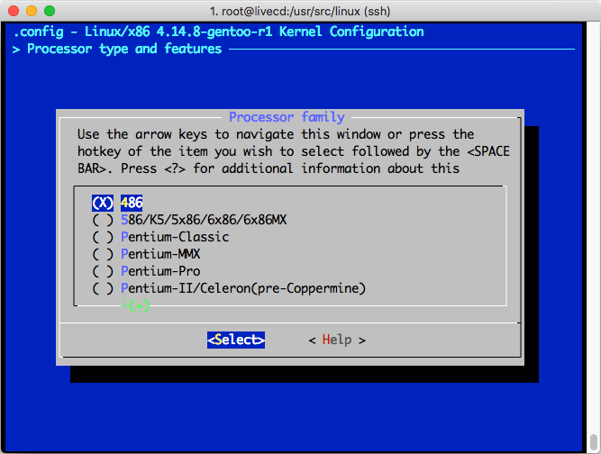](images/gentoo-486-kernel-486.png)

486 is the oldest option in this list!

[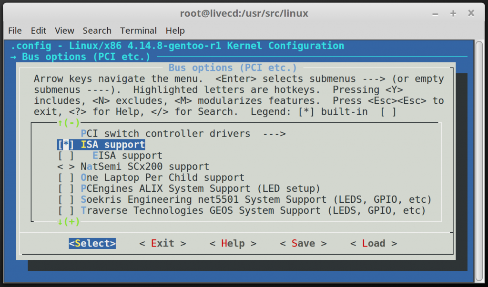](images/gentoo-486-kernel-isa.png)

ISA support has to be enabled to use the expansion cards.

[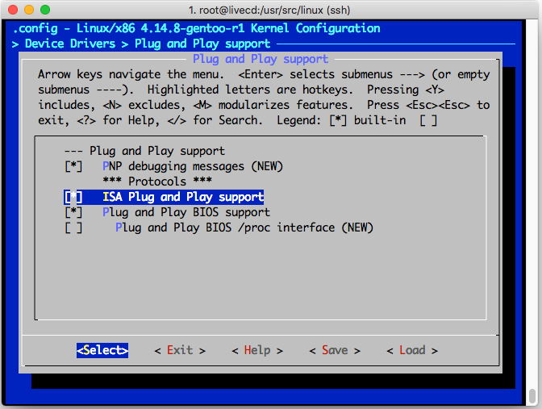](images/gentoo-486-isa-pnp.png)

ISA Plug and Play is required for autodetecting my SB16 and 3Com NIC as they are late generation ISA PnP cards.

[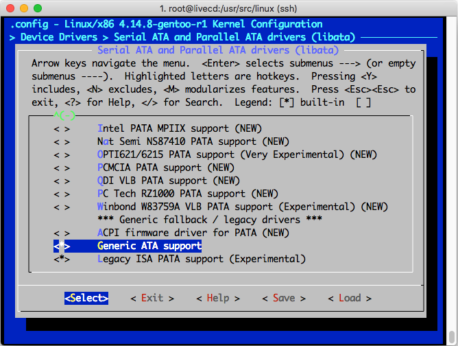](images/gentoo-486-kernel-isa-ata.png)

Enable both Generic ATA support and Legacy ISA PATA support

[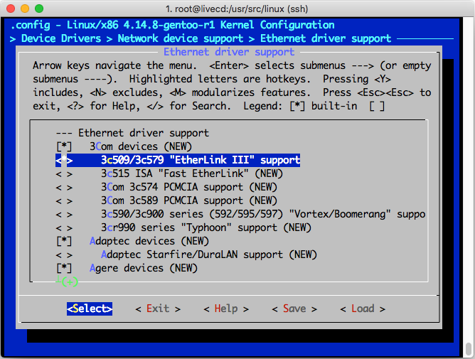](images/gentoo-486-kernel-3com-support.png)

My 3Com 3C509 NIC card is still supported!

[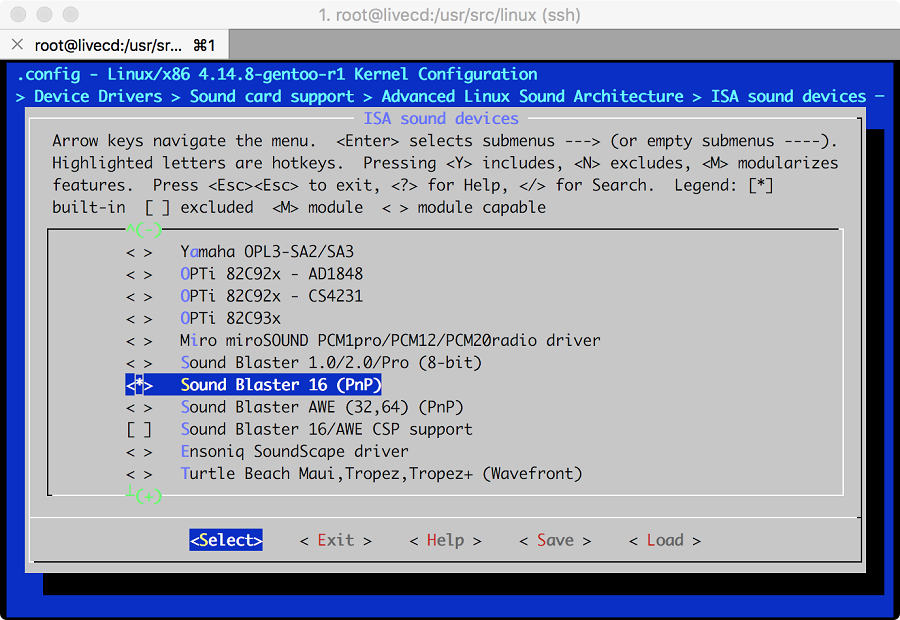](images/gentoo-486-kernel-sb16.png)

Once done we just compile the Linux kernel!

## Step 6: Install Bootloader {#step6}

The usual bootloader used by Linux today is [Grub2](https://wiki.gentoo.org/wiki/GRUB2). I tried that but it did a reboot loop whenever I tried to start the system. Online research say I should use the older [LILO bootloader](https://en.wikipedia.org/wiki/LILO_(boot_loader)) instead. LILO is unsupported as of December 2015 but it is still able to load modern Linux kernels.

This a snippet of the_ /etc/lilo.conf_ Lilo configuration file:

```plaintext
image=/boot/vmlinuz-4.14.8-gentoo-r1 
    label=gentoo 
    read-only 
    root=/dev/sda3 
    vga=4 # This will set the VGA mode to 80x30

image=/boot/vmlinuz-4.14.8-gentoo-r1 
    label=gentoo-ask-vga 
    read-only 
    root=/dev/sda3 
    vga=ask # Linux will ask you to pick the VGA mode on startup
```

I didn't install a GUI for obvious performance reasons so I have to rely solely on text mode. I set the mode vga=4 to increase "text resolution" to 80 columns x 30 rows of text. I also include a vga=ask in case the first option fails.

## Step 7: Install additional software {#step7}

Though not strictly necessary to do it right now, I felt it was better to leverage on the performance of the compilation machine before moving the CF card over.

If you have seen the video, I installed the latest versions (available in the Portage repository) of Git, Python, nginx, ALSA and MOC (console music player).

## Step 8: Initial bootup! {#step8}

Now we power down the compilation PC and move the CF card to the ancient PC for booting. Just pray and hope it works! :)

# Problems Faced

There were several expected and unexpected problems I faced that made this project more time-consuming that it already was.

## Cannot boot from CD

Due to the age of the PC, the BIOS only supports booting from the floppy drive or internal HDD. To boot from the CD, I used the [Plop Boot Manager](https://www.plop.at/en/bootmanager/intro.html) that booted off a floppy disk. This added extra inconveniences when it came to using CD-ROM based utilities.

To prevent wear on the already ancient mechanical floppy drive, I used the floppy disk emulator.

## Cannot use 80-pin PATA cable

This problem caused me a huge amount of unexpected pain!!!

[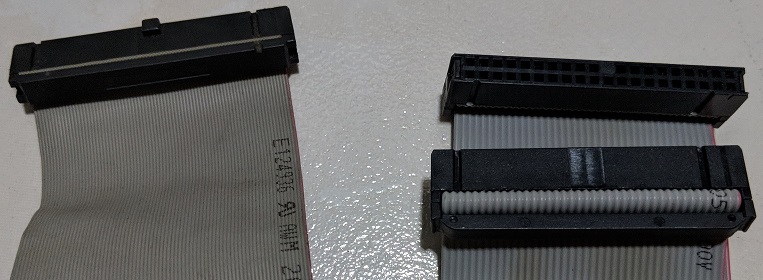](images/gentoo-486-ide.jpg)
Left: 80-conductor PATA cable, Right: 40-conductor PATA cable

The 80-pin cable on the left is a more modern PATA cable with extra ground lines compared to the 40-pin ones. It supposedly allows the bus to transmit at higher speed by eliminating crosstalk while remaining backward compatible. Read [this](http://www.pcguide.com/ref/hdd/if/ide/confCable80-c.html) for more info.

When I assembled the PC, I initially started with the 80-conductor cable for the drives. I faced occasional intermittent problems. From the BIOS not being able to detect the drive, to Linux halfway getting disk access errors to outright disk corruption. It was hard to tell then was it a software fault or hardware fault?

Here are the list of steps I did to troubleshoot:

1. Disconnect CD-ROM drive as primary slave
2. Replace the CF card as I thought it was faulty
3. Trying different 80-pin conductor cables
4. Recompiling the Linux kernel many times with different SATA/PATA options in case I chose the incorrect one. This took hell a lot of time.

Finally, I swapped back to the original 40-pin PATA cable that came with the PC and the problems never came up. To double check my assumption, I tried the other 40-pin PATA cables I have in my personal stash and had no issue too.

Like WHAT THE HELL? I don't think it is a fault of the cables themselves. I have dealt with many older PCs and none of them ever had problems when I switched to 80-pin cables so I assumed it should not be an issue at first. Probably the motherboard of this PC just does not like the 80-pin cable.

## Tough Gentoo installation procedure

Installing Gentoo is tough and time-consuming under the best of times even for modern PCs. Doing it for an ancient PC like this further adds to the complexity.

To put things into perspective, this is how I would rate the relative difficulty in installing the different Linux distributions

[Linux From Scratch](http://www.linuxfromscratch.org/) > Gentoo > [Arch Linux](https://www.archlinux.org/) > Fedora/Debian/Ubuntu

- Linux From Scratch: Compile every single thing from scratch. I have not tried this before.
- Gentoo: Base system is ready. Just compile kernel, bootloader and extra packages. Then configure everything manually.
- Arch Linux: Same as Gentoo just that everything already exists in precompiled binaries.
- Fedora/Debian/Ubuntu: Distributions are based on point releases. Configuration is largely taken care off, just configure personal preferences.

This is compounded by the fact that this was the first time I installed Gentoo Linux and was unfamiliar with the install steps.

## Long iteration cycle

Saying the ancient PC is slow is a huge understatement. It takes 11 minutes to boot up to the login prompt and 5.5 mins to shutdown. During the lengthy startup especially, I had to dutifully observe the status messages to ensure there are no issues.

If there were any issues, I have to move the CF card back to the compilation PC to modify the installation or worse start the installation from scratch. I did this countless times and spent many hours.

## Faulty Power Supply Unit (PSU)

The PSU failed about 2 weeks after I wrote this post. Not unexpected for an old piece of hardware. For a typical modern PC, we just get a replacement! However, this PC uses the legacy [LPX form factor](http://www.pcguide.com/ref/power/sup/formLPX-c.html) for its PSU. Not only that, it does not use the modern ATX power connector. It uses the [AT style P8/P9 connector](https://www.computerhope.com/jargon/p/p8.htm).

LPX power supplies are not easily available this days and the ones that are being sold are decades old as well.

[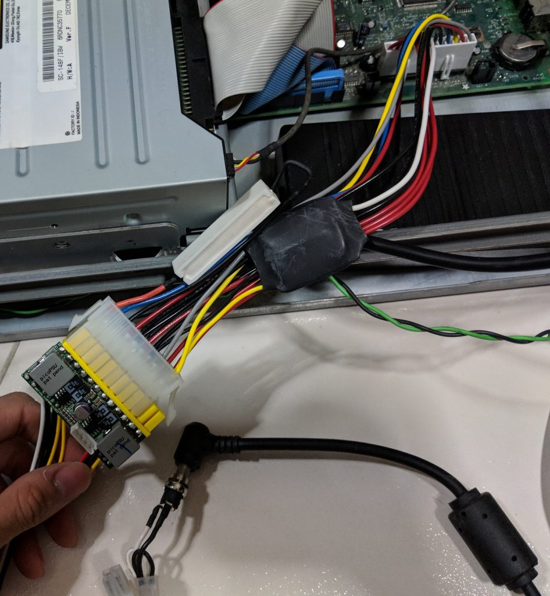](images/gentoo-486-pico-psu-at-converter.jpg)

picoPSU with ATX-AT Converter

I used 2 products to replace the LPX PSU

1. [ATX-AT P8/P9 converter with -5V output I bought on Ebay](http://www.ebay.com.sg/itm/ATX-20-PIN-to-AT-P8-P9-CONVERTER-WITH-5V-ON-OFF-SWITCH-DUMMY-LOAD-USA-MADE/251025150787)
2. [picoPSU-150-XT with 12V AC-DC power adapter](http://www.mini-box.com/picoPSU-150-XT)

[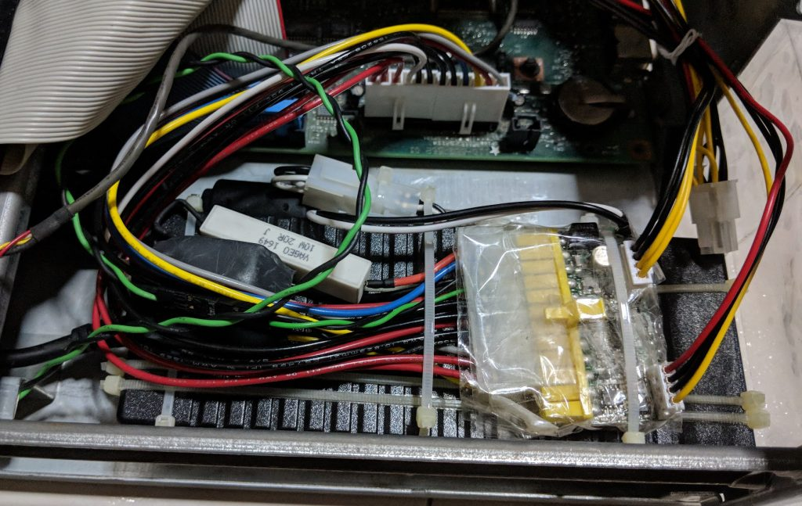](images/gentoo-486-pico-psu-at-converter-assembled.jpg)

Everything is tied down to the case.

[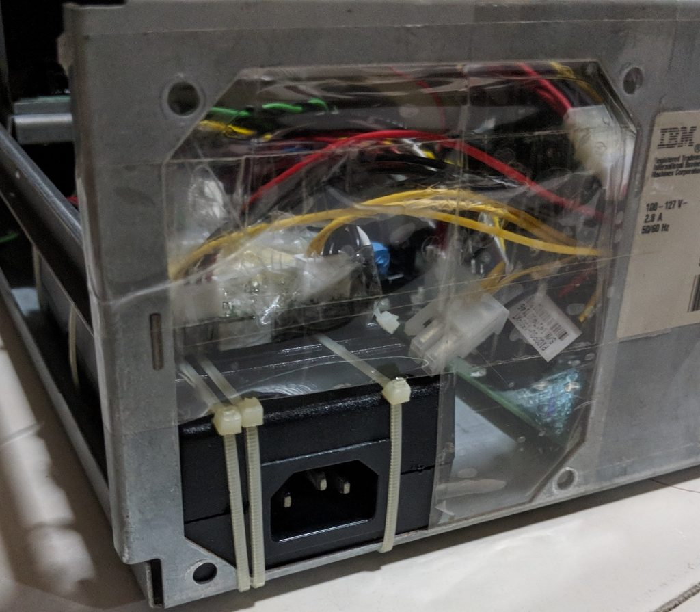](images/gentoo-486-pico-psu-brick.jpg)

Small and neat and this power brick is 230V compatible too!\[/caption\]

A cool LPX PSU replacement don't you think?

# Spectre and Meltdown

Given the age of the 486 (1989 technology), it does not support branch prediction.

> The 486 does not implement any form of branch prediction.
> 
> [Source 1: Pentium Pro and Pentium II System Architecture](https://books.google.com.sg/books?id=MLJClvCYh34C&pg=PA122&lpg=PA122&dq=486+branch+prediction&source=bl&ots=gcMvZFz2Pz&sig=FJ9fEmH426N7eoHxLupu5x2ZrdQ&hl=en&sa=X&ved=0ahUKEwi7k5aCucXYAhUHQY8KHcgACkUQ6AEILjAB#v=onepage&q=486%20branch%20prediction&f=false) from Google Books
> 
> When the 486 microprocessor makes a decision that results in a jump to a different part of your program, there is often a delay as it gathers the instructions from the new area of memory. Pentium seeks to avoid this with a Branch Target Buffer (BTB). The BTB predicts the results of the decision-making instructions... [Source 2: Info World July 1993](https://books.google.com.sg/books?id=QzsEAAAAMBAJ&pg=PA59&lpg=PA59&dq=486+branch+prediction&source=bl&ots=LCXnhUpS83&sig=g59BBBuiCx-qM6bOjRW5mkq1Nug&hl=en&sa=X&ved=0ahUKEwi7k5aCucXYAhUHQY8KHcgACkUQ6AEIPDAD#v=onepage&q=486%20branch%20prediction&f=false)

Ironically this makes it safe from the [Meltdown and Spectre](https://meltdownattack.com/) attacks. If you want to be safe from those attacks, you can run your modern software on the 486! Of course this is not looking at the big picture, many other security features have been implemented on modern processors since then.

# Concluding Remarks

Despite the many roadblocks I faced, I was impressed by the level of support Linux has for ancient hardware like this. I'll not be surprised if somewhere out there, there is a tester making sure that stuff still works for old hardware.

Even though this involves ancient hardware, I have to admit I learned quite a lot about the components used in Linux by virtue of setting up Gentoo so I have some useful takeaways from this project.

You may wonder why did I title this post “A Science Project”. This was coined in a [blog post](https://blogs.msdn.microsoft.com/oldnewthing/20130319-00/?p=4913) by a Microsoft software engineer Raymond Chen to describe projects that fall into any of the following categories:

1. A feature that is really cool and challenging from a technological standpoint but is overkill for the user-scenario.
2. Requires hardware few people have.
3. Trying to solve a problem that nobody really considers to be a problem. You’re doing it just for the Gee Whiz factor.

I believe my projects has all of these qualities.

1. I went through a difficult process to give an ancient PC modern Linux and software features. It is overkill as no way one can do any useful work on this slow PC. It is much more appropriate to install a period-correct operating system like DOS and/or Win 3.x.
2. How many people have a 486 PC today?
3. Who has a problem of needing a modern OS on this ancient PC?

As mentioned earlier, if you want to replicate this project, you can consult the [low-level detailed instructions I have documented on Github](https://github.com/yeokm1/gentoo-on-486/).

I have related projects as well, [Windows 3.1 on a modern PC](/2016/09/windows-for-workgroups-3-11-on-vintage-and-modern-hardware-in-2016/), [Windows XP on a modern PC](/2016/04/installing-windows-xp-on-a-modern-unsupported-haswell-system-in-2016/) and the [using the Covox Speech Thing with a modern pc](/2017/01/a-science-project-bringing-the-covox-speech-thing-to-2017/). Everything so far involves getting old stuff to to work on a modern PC, this is my first blog post that does the opposite. Look out for more projects from me!

# Clarification:

In response to questions or comments made by readers, here are some additional points I want to make

1.  I did not show it in the video but the 486 is not powerful enough to play MP3 files in real time. It'll stutter like crazy hence I stayed with WAV files.
2. This machine has no slot for me to add any L2 cache memory. :(
3. I have rebooted this machine several times before taking this video. So the boot times have stabilised.
4. I did try to boot the Tiny Core Linux CD but it never fully loaded before rebooting.
5. Given more time,  I could have optimised the bootup time or installed a GUI. However, the objective of this project is to explore the possibility of modern Linux in a 486 PC. Those are nice to have but given the time (many sleepless nights and weekends worth) and effort I had already spent on this project, I felt it was time to stop and document my work.
6. 64MB RAM is not representative of 486-machines of that era. Sure I agree, but this machine came with this much and I don't see any benefit of reducing the RAM other than to make it "more representative".
7. I did not go with the systemd as Gentoo by default uses init. Since this is the first time I'm actually installing Gentoo, I just went with the default instructions.
8. Ext4 is used as the main filesystem to see if it is usable on this old system. I wanted as much modern features as I could. When I installed Damn Small Linux during the hackathon, the installer already warned us that the non-journaling Ext2 is more suitable for older CPUs.
9. Why Linux and not BSD-based OSes? The point was to test if Linux and modern software still works on the 486 as claimed. Not really to make a usable PC out of it for day-to-day work. Besides, according to the [FreeBSD's website](https://www.freebsd.org/doc/handbook/bsdinstall-hardware.html), the minimum requirement is 96MB of RAM. So although FreeBSD may support 486 CPUs, I really wonder what 486-era motherboard can take that amount of RAM?
10. Why was PCI/USB/X option enabled in the kernel configuration (thus slightly slowing down boot time) even though the ancient PC does not have any PCI/USB/X? This was because I had a plan of making the same disk bootable and usable on my modern T430 as well should I need to compile and install additional packages. Disabling PCI might cause problems on my modern PC. I might just need USB on my compilation PC, who knows?

# Presentation

I gave a talk about my project at the [Hackware v3.8](https://www.facebook.com/events/200105140541056/) meetup. Here is the video and the slides.


