> The last primary keyboard I'll use in my life might be the IBM Model M. It'll probably last me the decades to the day that keyboards should become obsolete. - Kheng Meng, 2018

I just had to start my blog post with that self quote ^^^ but I'm pretty confident it'll hold true for me. I have owned several keyboards so far and I have to say the Model M with its legendary buckling-spring switch is the one that fits my needs perfectly for the foreseeable future. This blog post was indeed also written on the Model M.

[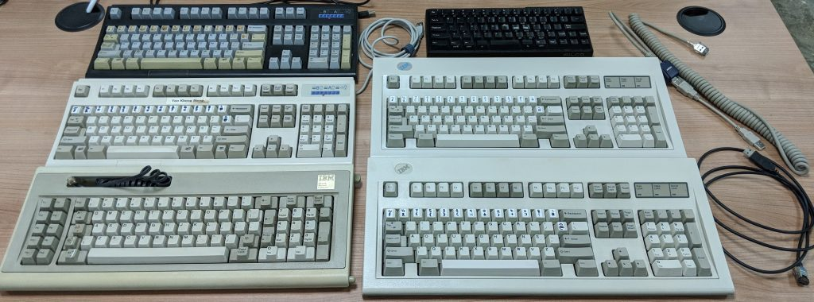](images/keyb-all.jpg) 

All the mechanical keyboards I have owned so far
<!--more-->
From top-left anti-clockwise:

| Manufacturer | Model                                      | Manufacturing Date | Keyswitch                  |
|--------------|--------------------------------------------|--------------------|----------------------------|
| Unicomp      | Spacesaver 104 Black                       | 20 July 2011       | Membrane Buckling Spring   |
| Unicomp      | Spacesaver 104 White                       | 8 June 2016        | Membrane Buckling Spring   |
| IBM          | Model F XT (variant for IBM 5155 Portable) | Some time in 1984  | Capacitive Buckling Spring |
| IBM          | Model M                                    | 19 May 1987        | Membrane Buckling Spring   |
| Lexmark      | Model M                                    | 3 Feb 1994         | Membrane Buckling Spring   |
| Filco        | Majestouch MINILA Air                      | Some time in 2014  | Cherry MX Brown            |

Note that Unicomp has renamed the "Spacesaver" product line to "Ultra Classic".

# History of my keyboard purchases

## 2006 - 2011: Logitech G15 (2005)

The first keyboard I purchased for myself wasn't even a mechanical one. It was the first edition of the Logitech G15 (2005) such as the one below which uses the rubber dome switch.

[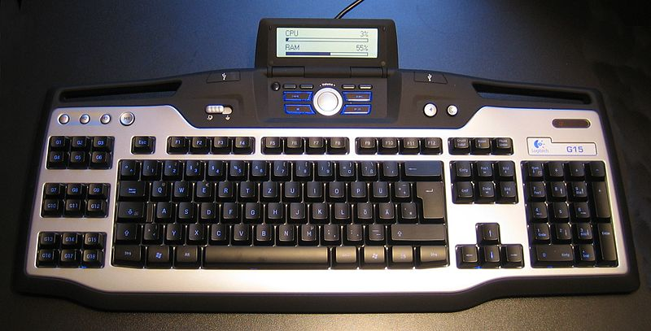](images/keyb-800px-Logitech_Gaming-Keyboard_G15.jpg) 
Source: https://upload.wikimedia.org/wikipedia/commons/thumb/5/54/Logitech_Gaming-Keyboard_G15.jpg/800px-Logitech_Gaming-Keyboard_G15.jpg

I needed a keyboard around 2006 when I was 16 as my previous one was breaking down. When I was researching on what to buy, I saw this model and was immediately taken in by the blue backlight and that was "so cool". What was the killer feature was that it integrated an LCD panel which one can download plugins to customise what you want to show.

After about 5 years of usage, the LCD panel broke down and the keyboard started showing signs of aging like less responsive keys and the rubber dome "feel" was different.

I decided to look up on another keyboard. Was there anything better? That was when I stumbled upon the concept of mechanical keyboards. After I got my next keyboard, I threw the G15 away due to space issues at home.

## 2011 - 2018: Unicomp Spacesaver 104 Black

The first hits on Google were the typical Cherry MX Switches. But on further research, I found out that people were saying the [IBM Model M](https://en.wikipedia.org/wiki/Model_M_keyboard) was one of the best mechanical keyboards in the world with its legendary buckling springs. However, it was already out of production for many years. The prices of Model Ms in the second-hand market were too far out of reach for me as a student then.

There is one company called [Unicomp](https://www.pckeyboard.com/) that bought the tooling of the Model M and continues to manufacture these keyboards till this day. So off I went to make an online purchase in late 2011. Even then, it still cost me a significant chunk of my savings.

[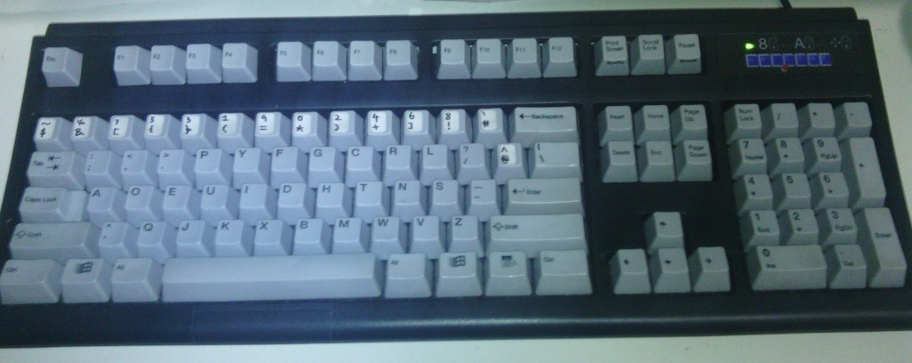](images/Unicomp-Spacesaver-104.jpg)

Photo of my Unicomp Spacesaver 104 Black taken in Dec 2012

This is an early photo of the Spacesaver 104 Black when it was just over a year old. Notice the consistent grey colours of all the keycaps then. I use the Programmer Dvorak layout which you can read more about it [here](/2013/02/programmer-dvorak-layout/).

So my first mechanical keyboard was already using buckling springs! Talk about getting almost the best from the start and indeed I was hooked. The tactile feedback was great. The keyboard was so heavy and stable!

## 2014 - 2016: Filco Majestouch MINILA Air \[US67key / Brown switch\]

The period of 2011 - 2015 was when I was studying for my Computer Science bachelor degree at NUS. During my final years in university, I needed to do a lot of typing in school and I was taking up part time jobs as well.

I was using a Thinkpad T410 which had a really good keyboard for a laptop however I knew it could never match up to that typing experience of a mechanical keyboard.

I obviously could not bring the heavy Spacesaver 104 keyboard around so I wanted a keyboard which was light and portable but still mechanical. That was when I settled on the [Bluetooth Minila Air with Cherry MX Brown](http://www.diatec.co.jp/en/det.php?prod_c=1468) switches.

[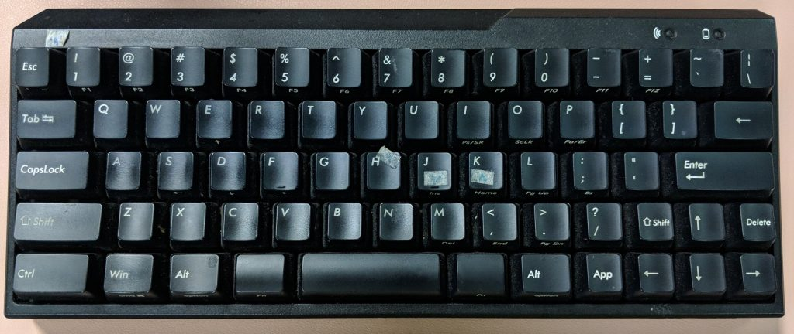](images/keyb-minila-air-front.jpg)

[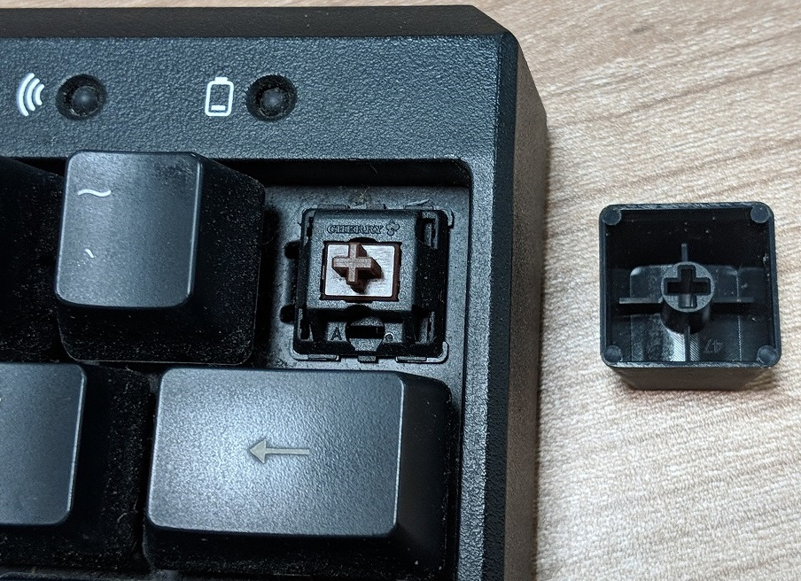](images/keyb-minila-air-brown.jpg)

I chose the Brown switches as I did not want it to be too noisy and annoy other people beside me in school and in the workplace.

When I switched to my next keyboard, I gave this away to my colleague. In fact I had to borrow my old keyboard back from her to take the photos required for this blog post.

## 2016 - 2018: Unicomp Spacesaver 104 White

I was using the Spacesaver 104 Black at home and I was feeling uneasy about differing typing experience. So I got a second one but this time in white!

[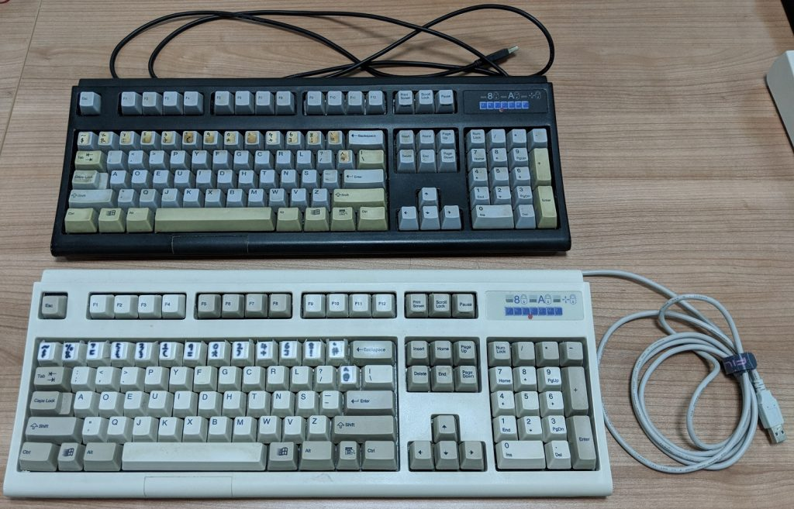](images/keyb-unicomp-spacesaver-front.jpg)

This is a recent photo. Notice how the colours of the keycaps have changed over the years for my now 7-year-old Spacesaver 104 Black.  Other than the aesthetics, even after 7 years of operation, it still shows no signs of failing.

[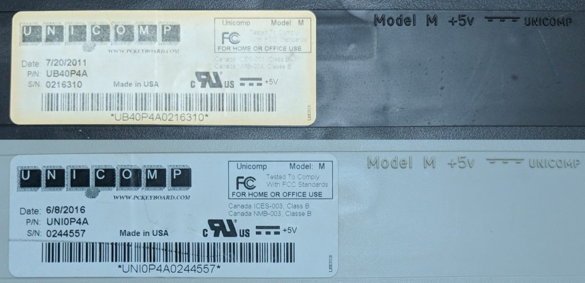](images/keyb-unicomp-spacesaver-labels.jpg) 

The label for my older Unicomp keyboard has faded away so much.

## 2018 - ... : IBM/Lexmark Model M

I was happily using my Unicomp models for years when about a month back some of my colleagues wanted to interview people in our office on the types of mechanical keyboards we use. I was one of the participants in this.

After the interview was over, I realised I haven't revisited this topic in ages. Of all the years I was using mechanical keyboards, I have never actually tried the original IBM Model M which inspired my mechanical keyboard journey in the first place.

So now with a "proper job" and having just got my bonus, I decided to indulge myself in not one but TWO Model Ms!

[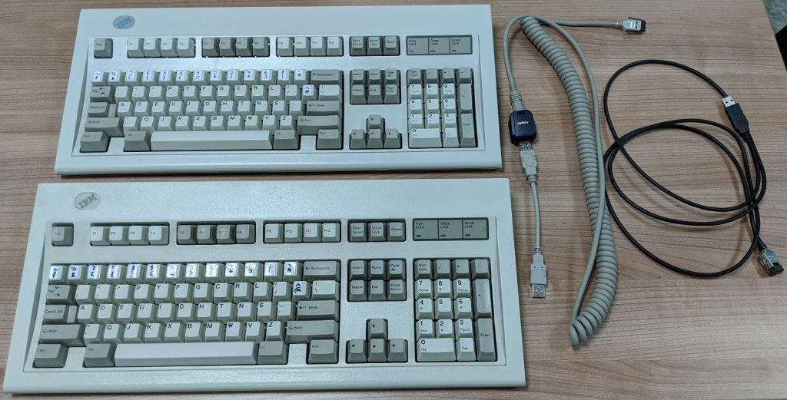](images/keyb-model-m-both-front.jpg) 

Top: Blue label model made by Lexmark. Bottom: White label model made by IBM. Both support external shielded data-link (SDL) cables.

One for home and one for the office to replace my 2 Unicomp keyboards at one go.

I deliberately got 2 different generations of Model M made by different companies so I could make a comparison between them.

I got the Lexmark Blue-label model from Ebay that was new old stock that had not been used before. The IBM White-label model was bought from [Clicky Keyboards](https://clickykeyboards.com/) a company specialising in the restoration and collection of Model M keyboards. Every keyboard sold there has it's own individual profile page and you can see mine [here](https://clickykeyboards.com/product/1987-ibm-model-m-1391401-made-by-ibm-19-may-87/)!

[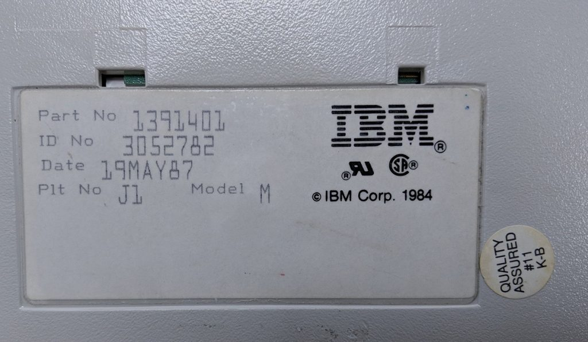](images/keyb-ibm-model-m-label.jpg)

IBM Model M label

[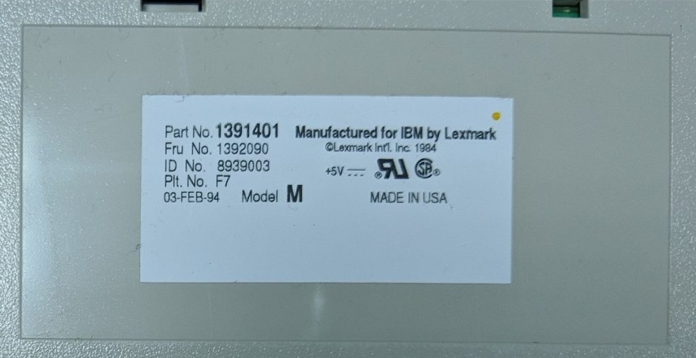](images/keyb-lexmark-model-m-label.jpg)

Lexmark Model M label

I'll go through in more detail the differences in a later part of this blog post.

## Experimental: IBM Portable 5155 with Model F XT

[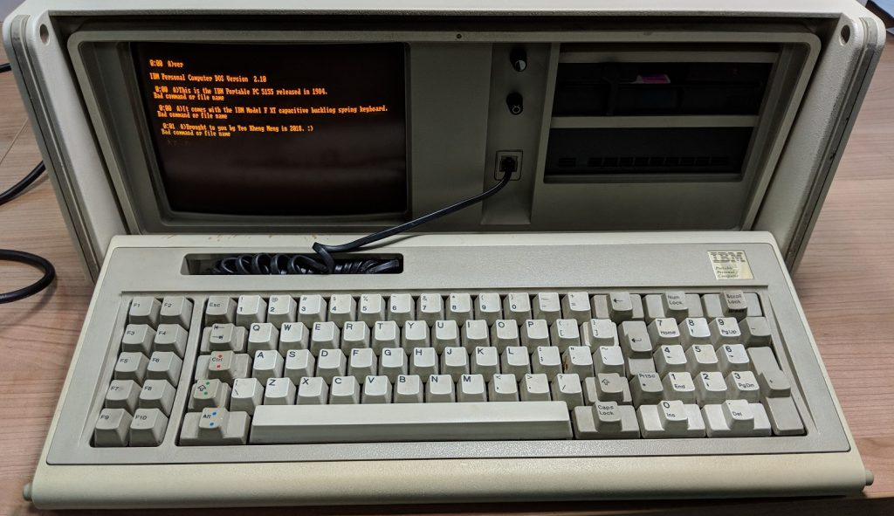](images/keyb-model-f.jpg)

I bought this IBM Portal 5155 computer in Jan 2018 to have some fun with extremely early IBM PCs. I knew it came with a built-in keyboard but I did not realise until recently it was actually a Model F! The better predecessor of the Model M.

# So what is this IBM Model M and why is it so great?

The IBM Model M was a keyboard was first released in 1985 as a cheaper successor to the Model F. It's hard to imagine a keyboard more expensive as Model M keyboards cost a bomb even in those days but it's true.

The [Model F](https://en.wikipedia.org/wiki/Model_F_keyboard) was based on a very durable capacitive buckling spring but was expensive to produce hence IBM made the Model M with a lower-cost membrane buckling spring model. At the same time, the Model M pioneered the ANSI 101-key layout that is still in use today. This keyboard was also the first one to utilise the PS/2 connector which would go on to be in service for decades.

[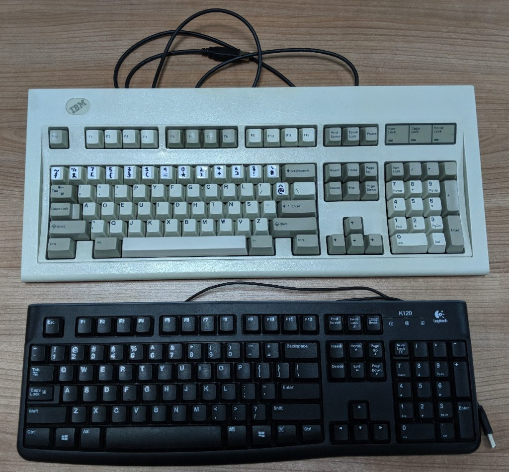](images/keyb-model-m-and-normal.jpg) 

Model M vs a typical modern keyboard like the Logitech K120.

So one wouldn't be wrong to say that most of the modern keyboards we see today were influenced by this 30+ year old keyboard. Comparing the keyboards in the picture above, there is hardly a difference in layout except the Windows and Menu keys.

In March 1991, IBM divested its keyboard manufacturing arm to Lexmark which continued to manufacture the Model Ms under the IBM name.

5 years later in 1996, some Lexmark employees purchased the rights and tooling to manufacture these keyboards and formed a company called Unicomp. According to some online sources, the construction quality of the keyboards may have degraded over the years due to cost-cutting measures. I don't have a large enough sample size to confirm.

# Okay so what is this Buckling Spring thingy?

So now what makes the Model M so great compared to other mechanical keyboards? It's this legendary Buckling Spring switch that lies behind each key.

[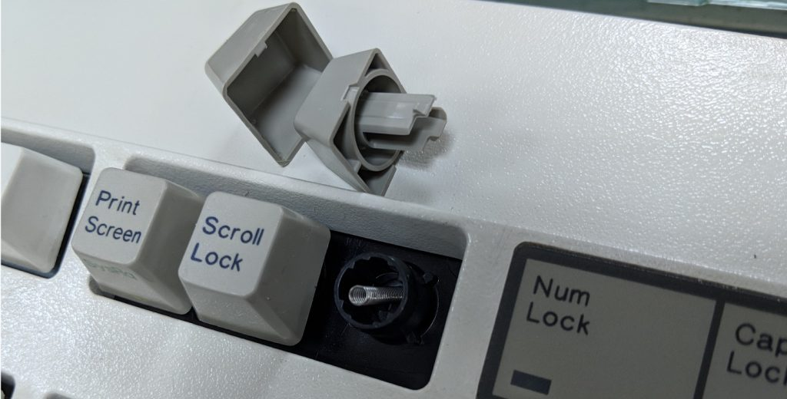](images/keyb-model-m-buckling-spring.jpg)

A keycap under a keycap! Makes for ease of swapping keys. It can't be seen from this photo but the keycap is thick and sturdy.

Notice the spring? It's like the tip of the iceberg of this switch.

[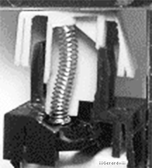](images/keyb-buckling-spring-animation.gif)

Source: https://imgur.com/r/mechanicalkeyboards/pPQTlu6

The basic idea is that when you press on the keycap, it will start to compress a spring. Up to a certain point, the spring will collapse/buckle pivoting the hammer forward which strikes an electrical contact.

I'll quote this [link](https://deskthority.net/wiki/IBM_buckling_spring) for the differences between the Model F vs Model M buckling springs.

## Model F Capacitive Buckling Spring

> The hammer was made of the same material as the fly plate in the beam spring switch, and in terms of how they register key presses, they are somewhat similar – at rest, the hammer is raised over two capacitive contacts. When the key is pressed, the spring buckles forward, pushing the hammer onto the plates, and causing a change in capacitance which is recognized as a key press.

## Model M Membrane Buckling Spring

> From a technical viewpoint, there is not much to be said for them in terms of how they work – they are exactly the same as the capacitive type buckling spring, except instead of the hammer hitting capacitive plates to actuate the key, the hammer strikes down on contacts on a plastic [membrane](https://deskthority.net/wiki/Membrane "Membrane") assembly, which completes a circuit. In this regard, they operate similarly to a rubber dome keyboard.
> 
> Multiple sources outline the motivation for changing from capacitive switching to electrical switching using a membrane: cost. The patent for the mechanism claims that the cost of producing a buckling spring keyboard with membrane contacts to be half of producing a capacitive one. The large reduction in cost was done at the expense of durability and reliability – the membrane buckling spring mechanism was rated by IBM for 25 million key presses. The membrane is far more susceptible to contamination than the capacitive PCB. Failing membrane traces are not an uncommon problem with old Model Ms.

Hard to imagine the Model M is considered inferior but it was being compared to a high bar of the Model F.

# Typing Experience

I made a video of to show clicky sound difference between the keyboards.

## Membrane Buckling Springs



It is supposed to be "The **quick** brown fox jumps over the lazy dog." but oh well....

Differences from older to newer models:

1. The sounds get progressively louder and higher-pitch
2. It can't be discerned but the actuation forces seem to reduce but it could be due to the different condition of the keyboards

Nevertheless, it was a great typing experience for all of them.

## Capacitive Buckling Springs



I start major typing from 01:32 of the video. Note that the Model F that comes with the IBM 5155 Portable PC is not a true Model F keyboard as it does not come with a metal baseplate to reduce weight. It uses thick plastic as a replacement.

The actuation force is lesser than the Model M and I actually prefer this.

The Model F really lives up to its legend! It feels and sounds better than the Model M. On top of that, it is more durable as well. The only downside to me is the odd layout which makes it difficult to use in modern times.

# Weight

Mechanical keyboards are known to be heavier than their typical rubber-dome counter parts. The buckling-spring keyboards are another class altogether!

All the weights below include the cables. Minus about 0.2kg to get the weight of the keyboard alone.

## Unicomp Spacesaver 104 tips the scale at 1.55kg

[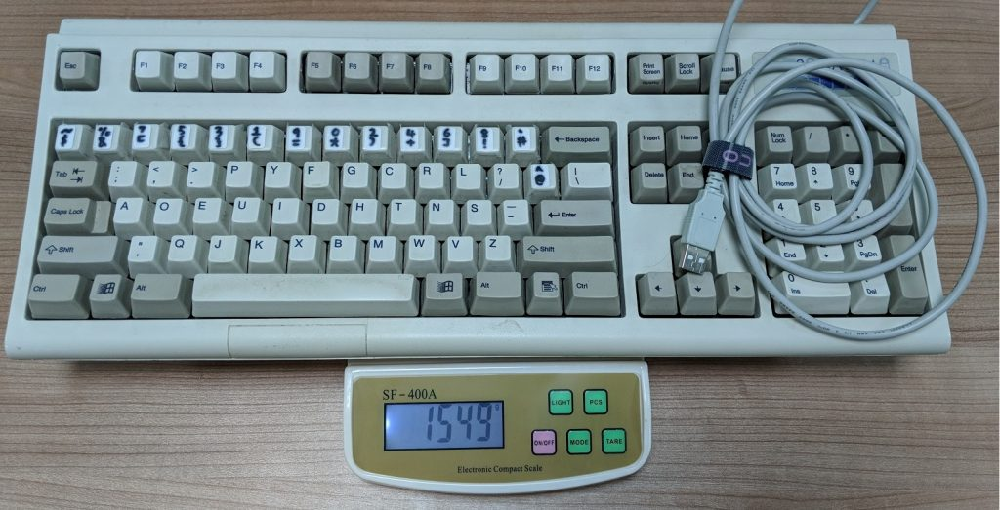](images/keyb-unicomp-weight.jpg)

## Lexmark Model M (1994) weighs more at 2.16kg

[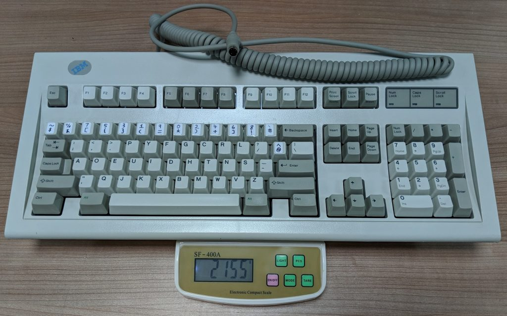](images/keyb-model-m-lexmark-weight.jpg)

## IBM Model M (1987) is the heavyweight champion at 2.43kg

[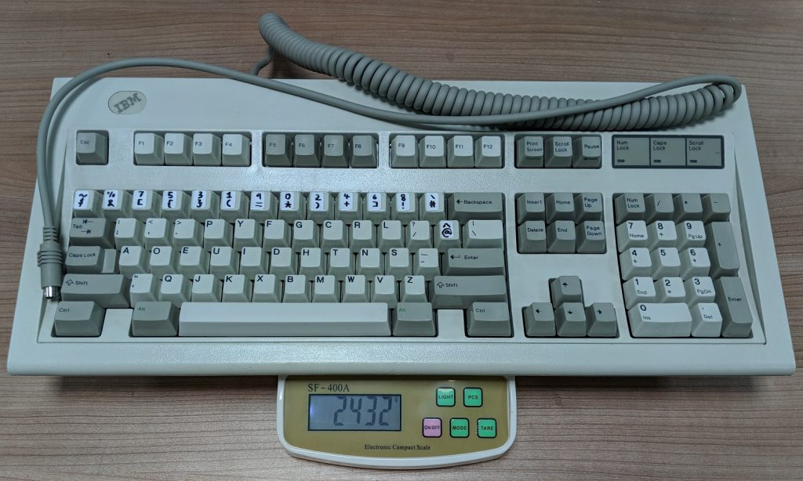](images/keyb-model-m-ibm-weight.jpg)

Really can use this as a weapon.

The point of these is to show that not all Model Ms are created equal. The primary cause of the weight difference between them is the thickness of the metal plate within the keyboard. Due to cost-cutting measures over the years, its thickness was gradually reduced.

## IBM Model F XT 5155 Portable at a respectable 1.87kg

[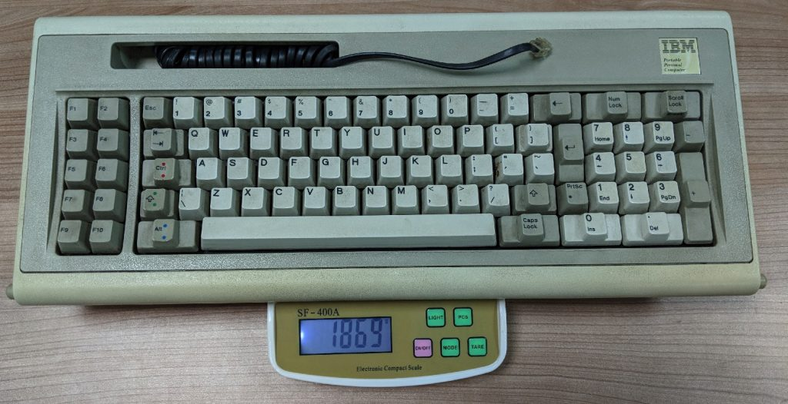](images/keyb-model-f-weight.jpg)

Despite not being a true Model F and with fewer special function keys, it weighs almost 2 kilos which is already more than the Unicomp!

# Teardown

I decided to open up the keyboards to take a sneak peek at what is going on behind the scenes.  All the Model Ms' casings are secured by a 5.5mm hex screw.

[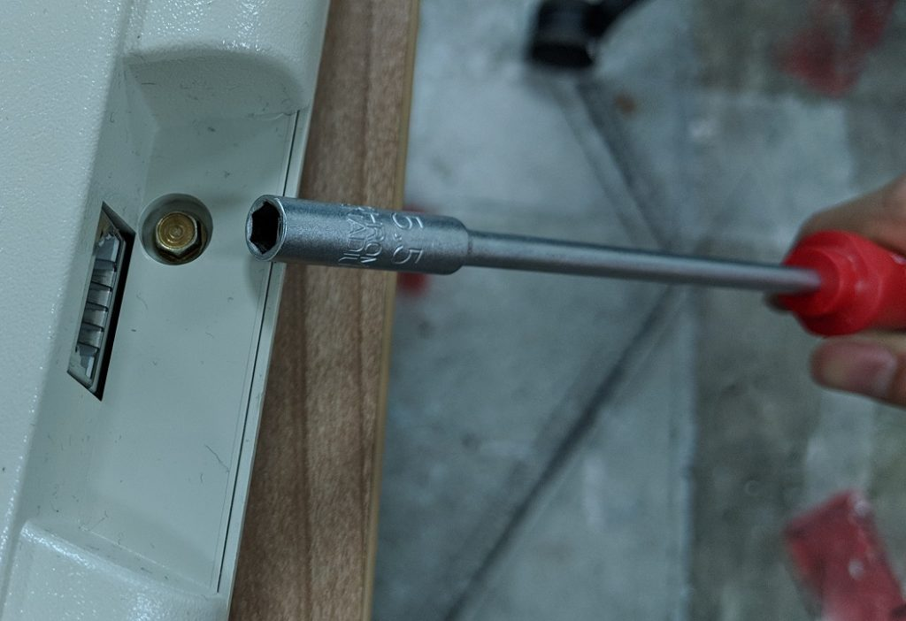](images/keyb-model-m-5.5mm-nut-driver.jpg)

To open them, I had to procure a 5.5mm hex nut driver as my multi-tool set did not come with one.

## Teardown of the Lexmark Model M (1994)

I'm starting with Lexmark model first as this keyboard has not been modified.

[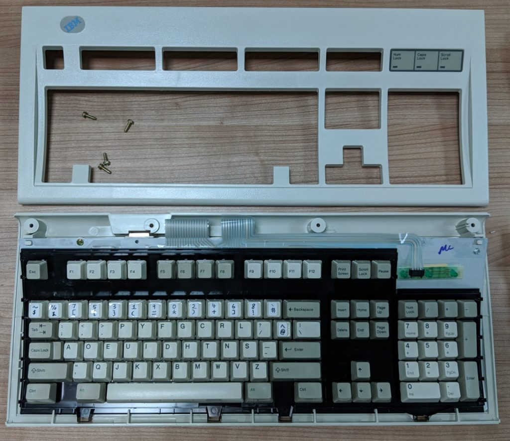](images/keyb-model-m-lexmark-innards-top.jpg)

4 screws and everything is accessible! Plus marks for ease of repair! Everything looks clean for a new old stocked keyboard.

[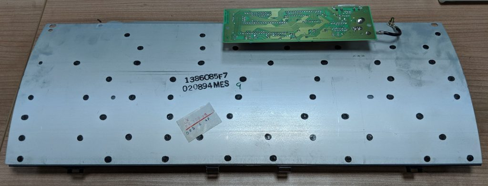](images/keyb-model-m-lexmark-innards-back.jpg)

Notice all the black spots. Those are actually melted plastic rivets used to secure the key assembly against the steel plate. Online reports that due to age, these rivets can deteriorate to the point that they break off. If enough of them break off, the keys might not work.

Thankfully this keyboard has all its rivets intact.

[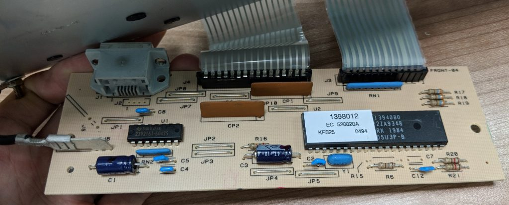](images/keyb-model-m-lexmark-circuit-board.jpg)

Board looks clean to me although I did not have time to find out what every part here is doing.

## Teardown of IBM Model M (1987)

[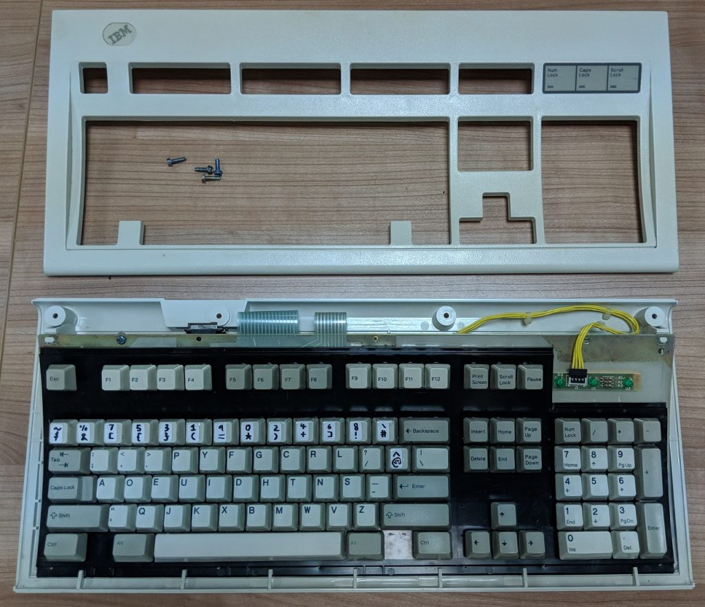](images/keyb-model-m-ibm-innards-top.jpg)

Same 4 screws to open.

[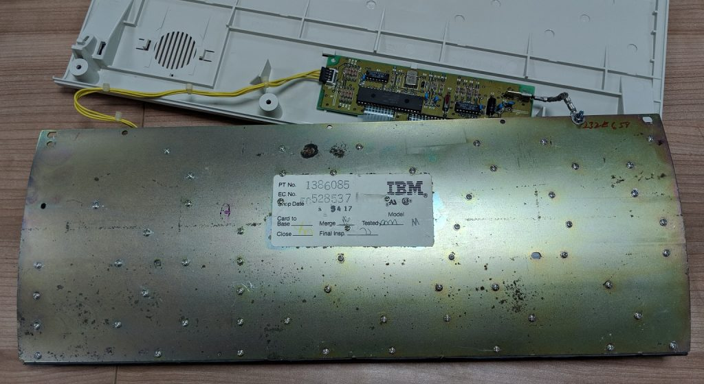](images/keyb-model-m-ibm-innards-back.jpg)

This Model M has the [bolt and nut modification](http://wiki.geekhack.org/index.php?title=Modifications%3AIBM_Model_M%3ANut_and_Bolt_Mod) made to replace all the rivets with bolts. With this modification, the keyboard should last for decades more.

[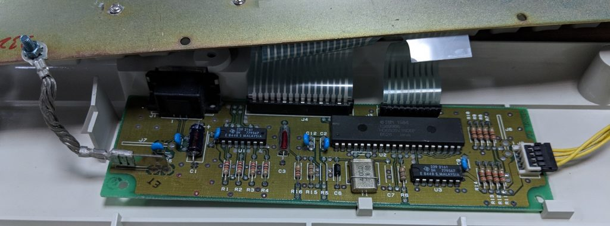](images/keyb-model-m-ibm-circuit-board.jpg)

An older looking but still functional circuit board.

## Teardown of Unicomp Spacesaver 104

[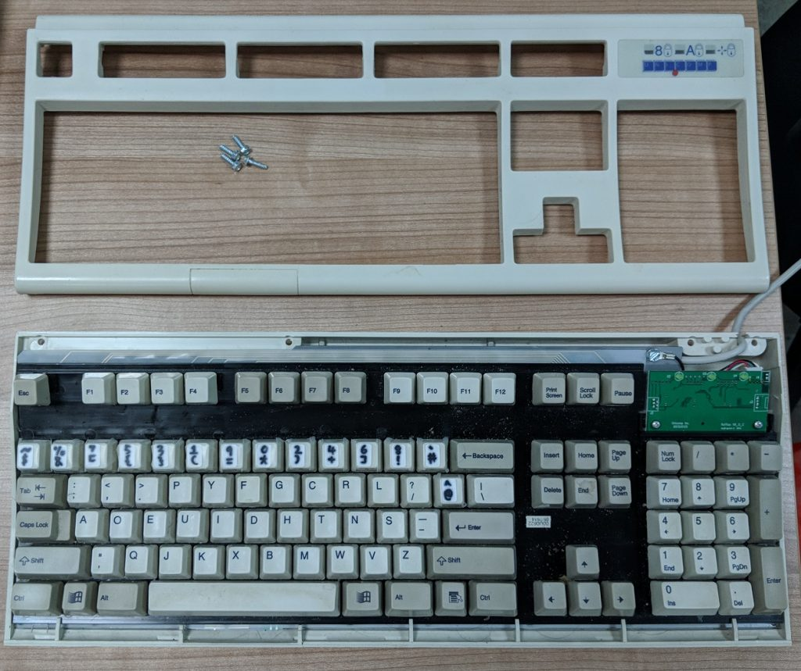](images/keyb-unicomp-innards-top.jpg)

Decades has separated this Unicomp keyboard and the 1987 Model M and things look similar. Same 4 screws to open and layout is the same. I did not manage to lift the keyboard assembly from the bottom case and did not want to force things so I left it be.

[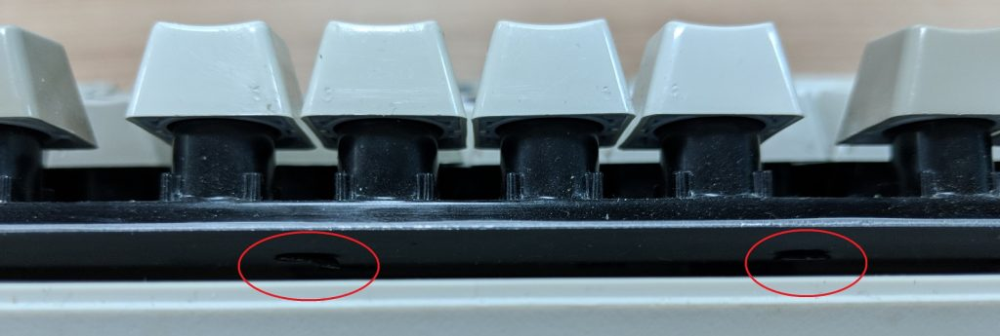](images/keyb-unicomp-plastic-rivets.jpg)

Unicomp still uses the same plastic rivet technique. Why can't they just use more modern secure techniques since they have the benefit of knowledge from the aging Model Ms confounds me.

# Getting the Model M to work in modern times

The original cables the Model M came with are the either the PS/2 or large AT pins. Neither which are particularly suitable to work with modern USB-based computers. The absence of the Windows (or Mac Command) key also affects the keyboard shortcuts that can be used.

[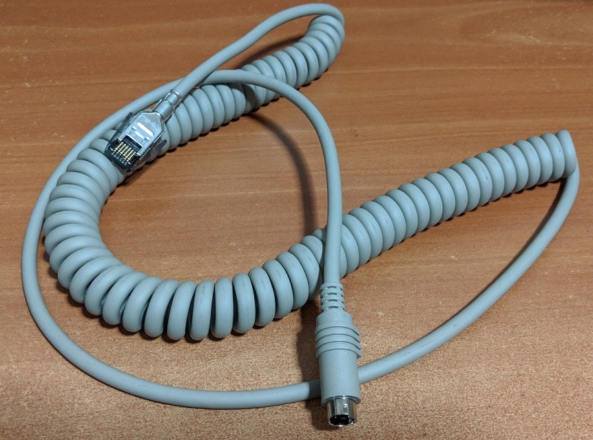](images/keyb-sdl-to-ps2.jpg)

A typical coiled SDL-to-PS/2 cable that came with the Model M

## Active PS/2 to USB Converter

To let the Model M work with modern computers, we have to convert the PS/2 interface to USB. We cannot just use any PS/2 to USB converter. Most converters in the market are passive converters designed to work with PS/2 devices which can sense a USB-PS/2 converter and adjust themselves accordingly.

However the Model M is a pure PS/2 device created before USB was born.

[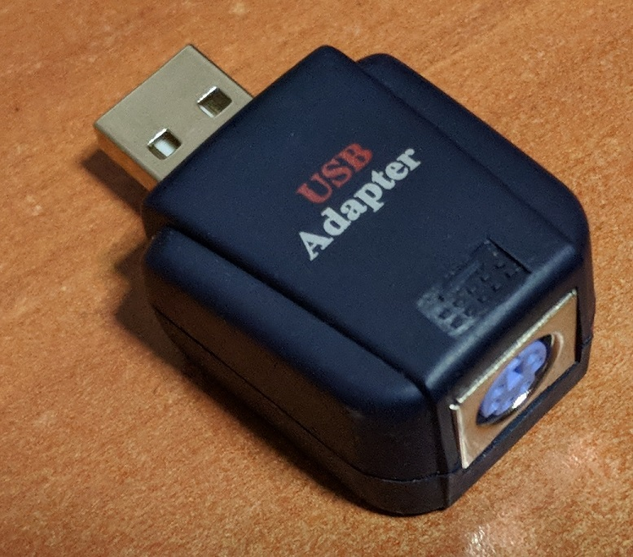](images/keyb-active-ps2-to-usb.jpg)

This is where active converters like the fatter one above comes in. It actually does an electrical and protocol conversion between the 2 connection types.

## Soarer's Converter Cable

An alternative is to replace the coiled cable entirely and get a [Soarer's Converter cable](https://geekhack.org/index.php?topic=17458.0).

[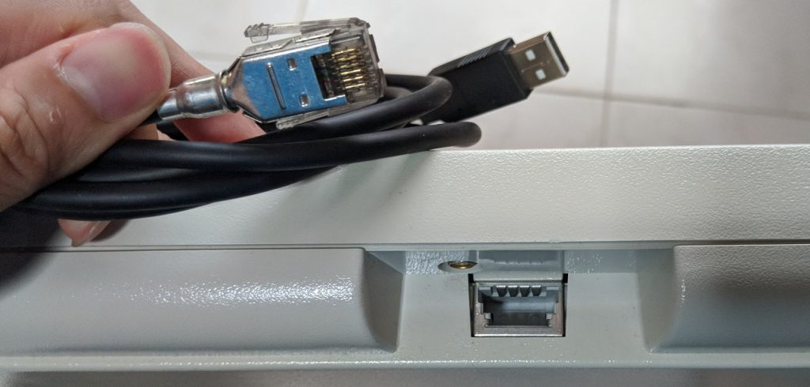](images/keyb-soarer-cable-sdl-connector.jpg)

The schematic design of this cable is open source but I was lazy in this aspect and opted to buy pre-made cables.

The forward-thinking IBM engineers catered for the possibility that the keyboard interface connector that shipped with the Model M would one day become obsolete. Supporting a newer interface like USB is just a cable change away.

### Remapping the Windows/Mac Command key

Due to the age of the Model M, it does not come with the Windows key or Mac Command key. This is not much of an issue in Windows but many shortcuts in Mac depends on this key.

[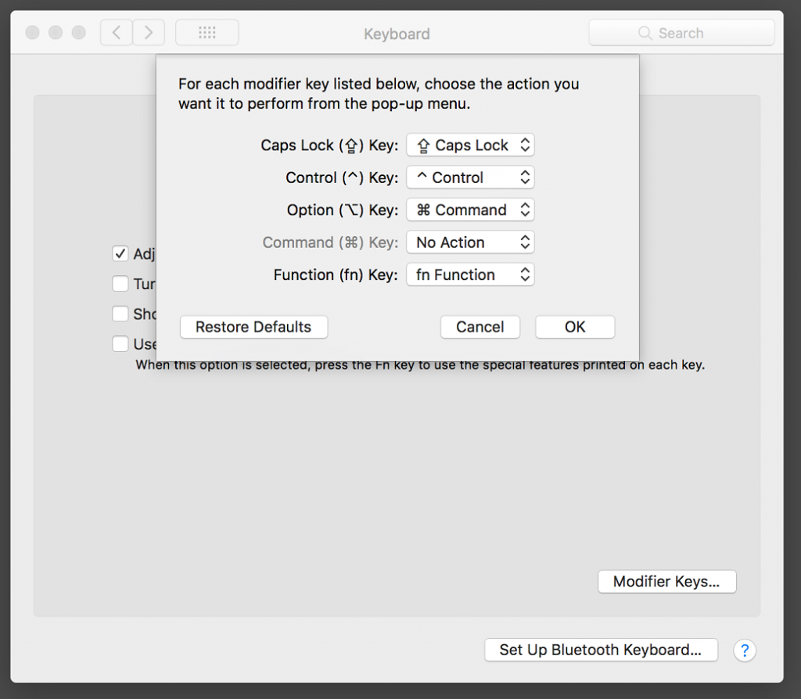](images/keyb-mac-modifier.png)

A possible way is to remap the Alt/Option key to the Command key. However this will cause BOTH Option keys to be remapped at once where I only want the Left-Alt key to be remapped.

Thankfully the Soarer's converter cable has the ability to be configured with your own custom remap.

For the record, I just use this simple configuration file to remap the only the Left-Alt key to the Windows/Mac Command key.

\[sourcecode language="plain"\] # Left Alternate becomes Command Key key remapblock LALT LGUI endblock \[/sourcecode\]

# Conclusion

If you have not used the Model M or buckling spring switches before, it is hard to describe to you why it makes the typing experience so great. Just give this keyboard a test drive for a couple of days if you have access to one.

**If you like it and you want to buy one, you should get one as soon as possible. Being out of production for decades, the cost of purchasing the Model M especially those in good condition will only go up with time.**

It is sad that with all the advancements in computing, the one piece of equipment that we use the most to interact with our computers has regressed technologically in the name of costs. We don't usually expect to be using 30-year-old hardware on a daily productive basis but the IBM Model M keyboard is that exception.

Today, I don't really care about fancy features like great aesthetics, RGB backlights, media keys and extra USB ports. I just need something that gives me great tactile feedback, be durable, enable me to easily swap keys to fit my Programmer Dvorak layout. The Model M fits my needs perfectly.

**If the Model M is too expensive or exotic for you, the modern ones made by Unicomp are worthy alternatives**. I would go as far as to say if you conduct a blind test on me, I might not be able to tell the difference between the Model M and Unicomp.

If I can build an ultimate keyboard, I would say a combination of the capacitive buckling spring of the Model F + the modern layout of the Model M + Windows/Command key. Alas, no such product exists and I think the benefits of the modern Model M layout supersedes the slight benefit of the capacitive buckling spring.

A small fun fact is that a guy is intending to remake the Model F keyboards, you can check out his site [here](https://www.modelfkeyboards.com/). Hope you look at your keyboards differently from now!
