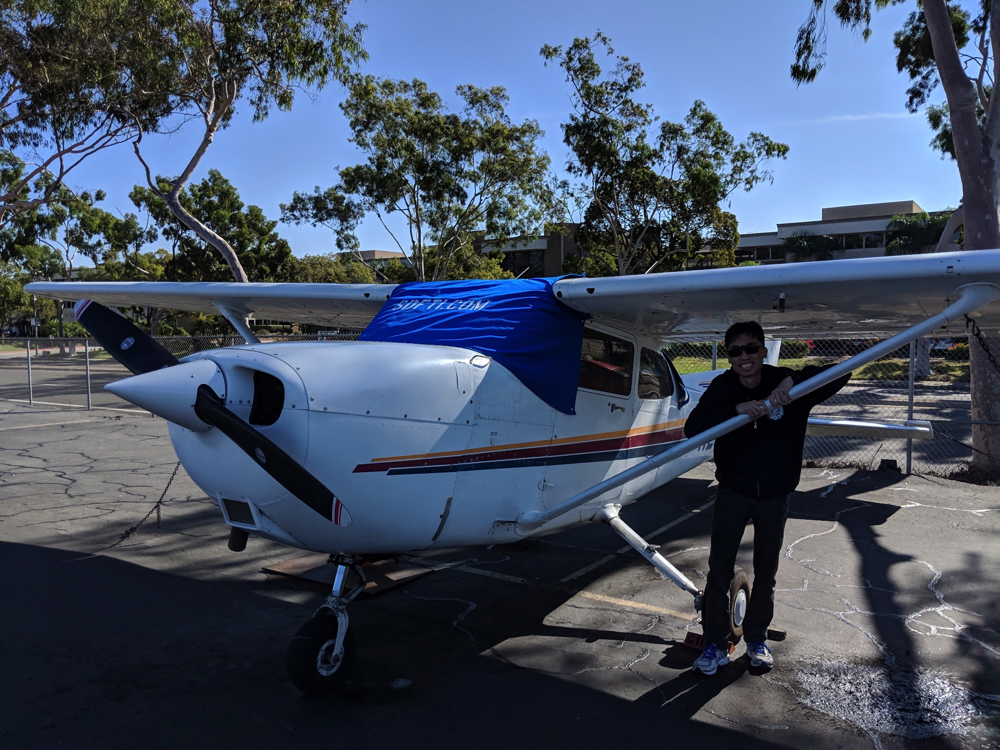

2 weeks ago, I put my life on hold in Singapore to come over to the birthplace of aviation to achieve a life-long dream to fly a plane.

As expected, learning to fly a plane is nowhere near as simple as just taking up car driving lessons for example. Behind the videos I have posted on social media so far of my practical lessons, hides the countless hours of mundane but very important theory lessons I have to attend.

In just 2 weeks, I feel like a lifetime has just passed with the daily information overload I face. I have to absorb how every single system works in the Cessna 172, from fuel, pumps, electrical, engine, control surfaces, instruments, specifications, you name it I have to be able to recite from memory.

<!--more-->

## I study everything

To give a car analogy, I have to go as deep as knowing how the speedometer and tachometer works. Every single switch and instrument in the cockpit I have to know the workings behind it and how it can fail.

And that’s just the aircraft portion. I have all that aviation regulations, Physics, Maths, Engineering, Geography knowledge to commit to my brain. Basically, I study everything. If you ask me, it is one of the best ways to put to practical use all that academic knowledge one would deem to be useless theory back in school.

Where most people see pilots flying the plane on videos, that is the easy part. It is all the unseen parts that pilots learn and do behind the scenes before getting to the flying portion that is difficult to appreciate by most people not familiar with the field.

The instructors here say a typical full-time student usually takes 4 months to complete and pass a PPL. Here I am trying to do it in one and a half. Although I have the benefit of simulator time and theory lessons back in SG by [flightschool.sg](http://flightschool.sg/), it is still a rush as there will be gaps in my knowledge given the length of time passed since I first learned it.

## **I AM that hungry and hardworking foreign student with no life**

Having studied in Singapore all my life, this is my first time being a foreign student in another country. Back in Uni, people including myself would say foreign students are so hungry and hardworking with no life. Now I AM that hungry and hardworking foreign student with no life**.** I empathise with them that the conditions where time is short, money is finite and distractions are few. Every single day I stay here and lesson I take is money draining from my bank account and one less day of leave left in my job.

Student ratio in classes of just one instructor to 2-3 students really works wonders with the amount of individual attention we receive. Having been used to the typical class size in Singapore of like 10-40, it’s an eye-opener how fast I can learn and have my doubts cleared quickly.

## Being more independent

Living independently far from home away from friends and family is double-edged sword. It means I get a distraction free time to learn myself. It also means a certain measure of loneliness and loss of the creature comforts of home. I have to admit that I depended on my parents a little too much on household matters. Now having to handle everything by myself forces me to grow up a bit later but better than never.

## Some interesting learnings from living here:

- The Americans like to call people by surnames/last names like “Yeo” instead of KM.
- I need to get used to using imperial units like miles, pounds, inches and Farenheit. Where are my meters, kilograms and Celsius???
- Their cars and parking lots are so huge.
- Plastic bags are chargeable.
- Doing simple stuff like getting food and groceries involves travelling long distances. Densely-packed Singapore at least has some benefits. As I’m not renting a car to save money, it’s either Uber or taking long walks. Walking to school takes about 20mins one way every day. Serves as a useful daily exercise with all that heavy books to lug.
- Places like food courts for cheap food don’t really exist so eating out usually costs about US$8-15
- Amazon delivery is free yay!
- Daytime temperatures of high-10s or low-20s Celsius is quite nice actually. I'm afraid I'll get too used to it that I'll "overheat" when I return to SG.

Even now, I feel my journey has still barely begun. I’m still taking the baby steps with best parts of my training yet to be completed. If you asked me just one year ago, I wouldn't have been able to imagine myself in this position, but here I am! Reasons for that is better reserved for another blog post. May the heavens smile upon me for the rest of my learning journey.

## Video of some of my lessons so far:



No audio until 3:07 when we start using the headsets.

My first time behind the controls of a real plane! (Although the instructor did 99% of the work.) The moment the instructor allowed me to put the throttle to full and the plane lifts off the runway, truly exhilarating!

Gopro died after 15mins but at least it shows the full procedure to start a plane, talk to ATC, taxi the plane to the runway then finally can takeoff.



Sound starts from 4:06.

The instructor finally let me have the controls for about 30% of the lesson. Along the way, I got to admire breathtaking views of the beautiful California coastline from 5000 feet (1.5 km) altitude.

Taking off into the sun is so thrilling!

If you are lazy to watch the full hour long video, just watch first and last 15 mins which has the takeoff and landing.



Sound starts from 3:28. Basic instrument flying with the view-limiting visor.
