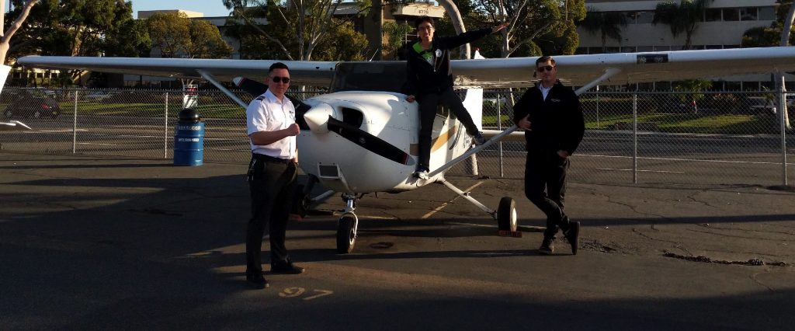
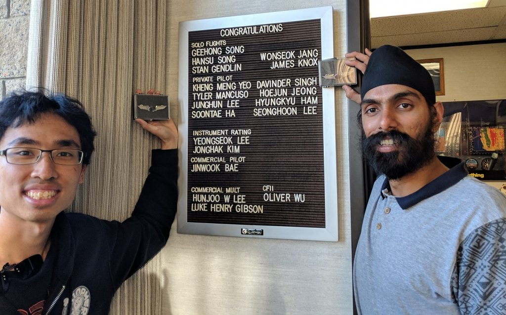
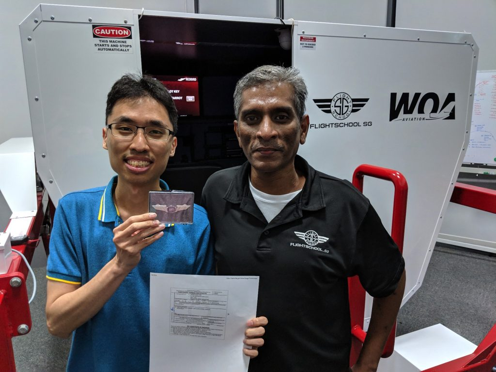
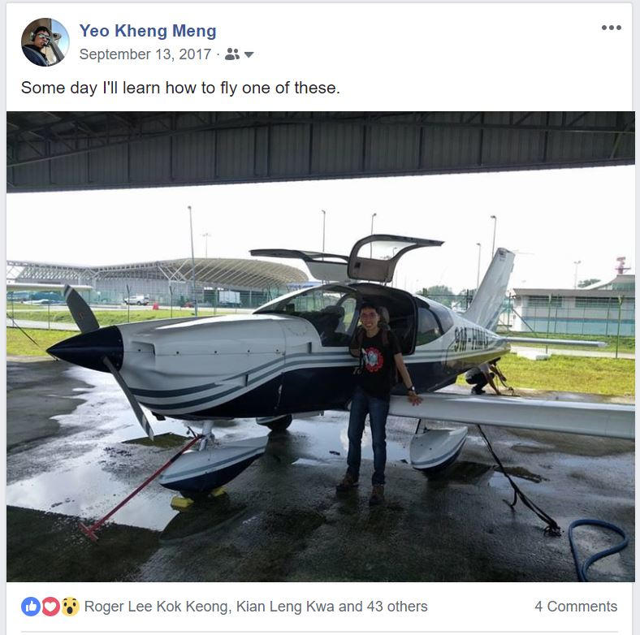
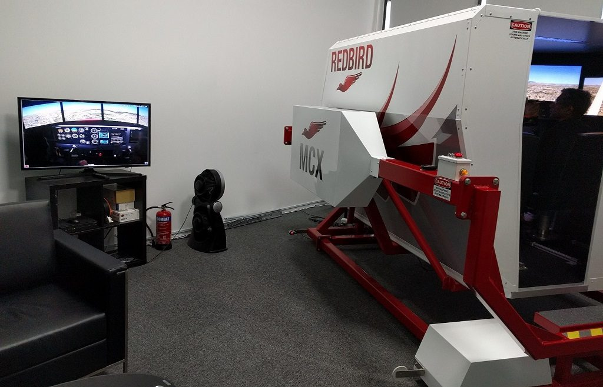
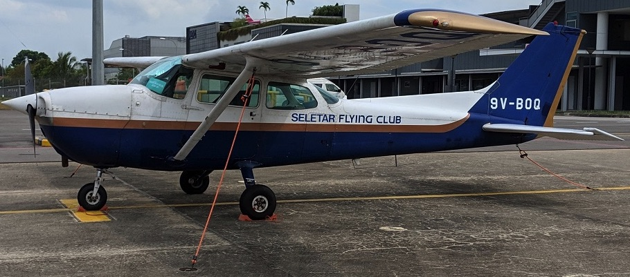
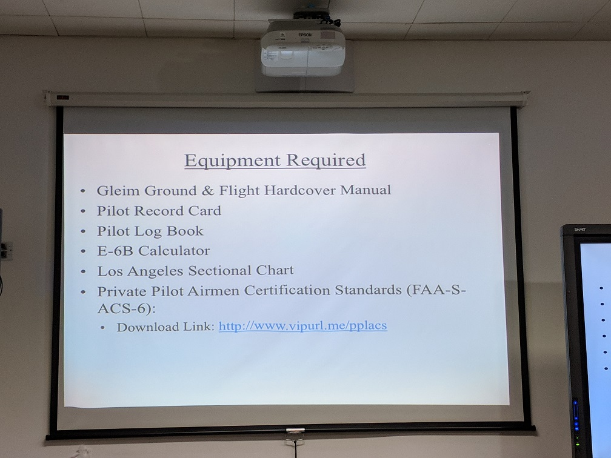
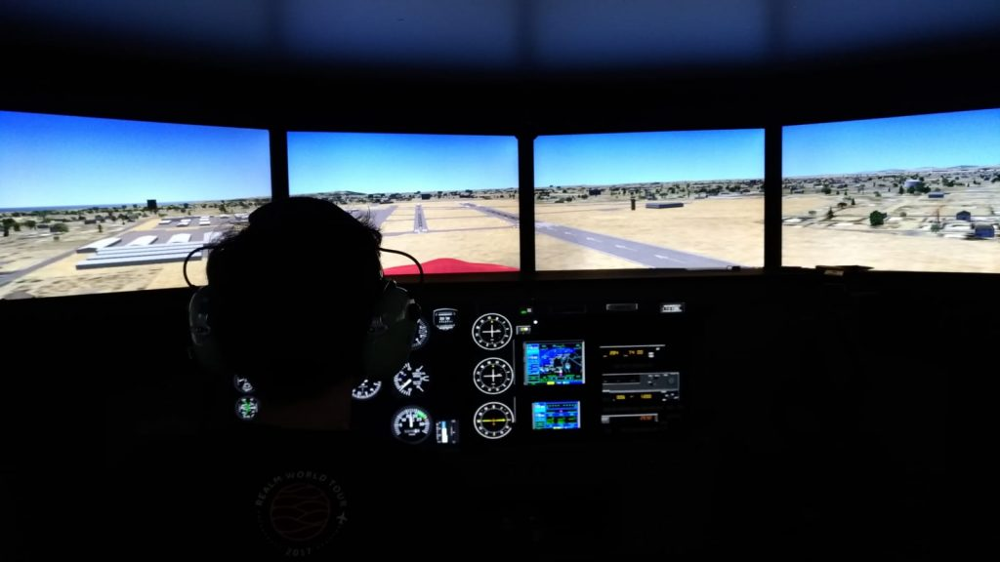
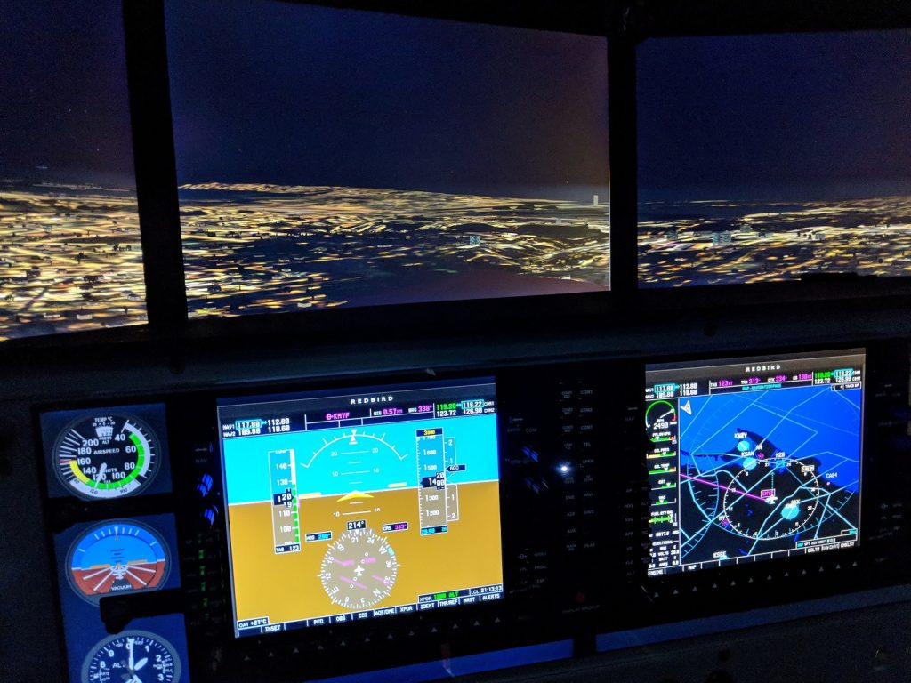
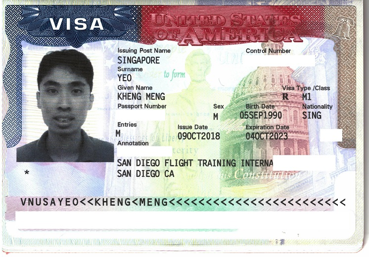

I finally got my Federal Aviation Administration (FAA) Private Pilot Certificate or Private Pilot License (PPL)! It seems so surreal, but I can actually fly a plane with my family and friends. This journey was almost a year in the making which I made immense sacrifices in time, money and much more. 

With my [San Diego Flying Training International](http://sdfti.com/) (SDFTI) instructors Charles and Luke on the Cessna 172R (N2441E) which I did my first lesson, solo and checkride on.

With my training buddy Davinder

Capt Kumeran from Flightschool.SG who gave me foundation training in the Redbird MCX simulator.

My journey is so long that I have to break it into 2 different blog posts:

- Part 1: Preparation in Singapore
    - [Motivation](#motivation)
    - [Weighing my options](#weighing-my-options)
    - [Training at FlightSchool.SG](#training-at-flightschoolsg)
    - [Medical](#medical)
    - [Visa Preparation](#visa-preparation)
- Part 2: [Practical training at San Diego](/2019/02/i-became-a-private-pilot-and-this-is-my-story-part-2-2-in-san-diego/)
    - Arrival in San Diego
    - Waiting for TSA clearance
    - Exploring Montgomery
    - Stage 1: Train for Solo
    - Stage 2: Train for Cross-Country Solo
    - Stage 3: Prepare for Check ride
    - Final Checkride
    - Conclusion
    - What's next

<!--more-->

# Motivation {#motivation}

The first time I stepped on an airplane, I was 10 and was going to Australia with my family for a holiday. From then on, I always wondered what it was like to one day be the person flying the plane instead of being a passenger. It is something that I knew I could feel in my blood.

Due to several decisions which I regret today like not joining the Youth Flying Club when I was younger, I never got the chance to do. I did join the NCC (Air) uniformed group when I was in secondary school though. I put that thought aside and just concentrated on studying my way through the typical Singapore education system all the way to my Computer Science degree.

## First time in a light plane: (Sept 2017)

In Sept 2017, my friend Joyce told me her private pilot friend Roger will be going up to the skies with his Socata TB-10 at Senai Airport in Malaysia, I jumped at the opportunity! I wrote about my experience of this joy ride in this [post](/2017/09/first-flight-experience-in-a-light-plane-socata-tb10/).

From left, me, Joyce and Roger.

It was then that I decided to set the serious goal of attaining my PPL at least while I'm still in my youth. One of my colleagues told me, "You want to do anything, do it while you are still young when commitments are few. If you wait longer till you are in your 30s or later, you may not have the time". Neat advice.

16 months after setting that goal, I'm proud to say I achieved it! 

## First time in a realistic simulator (Aug 2017)

Shortly before the joyride, I took a simulator experience at [Flightschool.SG](http://flightschool.sg/).

I first came across them online while Googling for flight schools. What caught my attention was they offered a programme for students to take some foundation lessons in Singapore to assess one's flying aptitude and equip us with basic knowledge.

If we do good in the lessons, we have the option to choose to go to [San Diego Flying Training International](http://sdfti.com/) (SDFTI) for practical training and obtain the FAA PPL.

Apparently it is so good that it can be used for recurrent training so I don't always have to use a real plane to maintain my skills.

# Weighing my options {#weighing-my-options}

A more detailed version of this section can be found in my subsequent blog post: [Considerations on picking a Flight school for PPL - A Singaporean perspective](/2019/09/considerations-on-picking-a-flight-school-for-ppl-a-singaporean-perspective/).

| Aviation Authority                        | Civil Aviation Authority of Singapore (CAAS)                                                                         | Civil Aviation Authority of Malaysia (CAAM)                                                     | Federal Aviation Administration (FAA) of USA                               |
|-------------------------------------------|----------------------------------------------------------------------------------------------------------------------|-------------------------------------------------------------------------------------------------|----------------------------------------------------------------------------|
| Planes that can be flown with the license | 9V-registered                                                                                                        | 9M-registered                                                                                   | N-registered                                                               |
| Travel                                    | Negligible                                                                                                           | 1.5 hour commute to/from Johor Senai Airport                                                    | One-off travel to the US                                                   |
| Time Taken                                | 1-2 years weekly part time                                                                                           | 1-2 years weekly part time                                                                      | A few months full-time                                                     |
| Maintenance                               | 3 + 2 instructor review hours every year                                                                             | Annual Flight Test with Examiner                                    | Biennial review with FAA Certified Flying Instructor (CFI)                 |
| Remarks                                   | Restricted PPL only allows flying within SG (requires cross-country flight in another country to remove restriction) | Min 30 years old for foreign student pilots. Training visas I heard is a long process to obtain | Number of N-registered GA planes > 2x 9V-registered GA planes in Singapore |

Consult [this other blog post on considerations on picking a flight school](/2019/09/considerations-on-picking-a-flight-school-for-ppl-a-singaporean-perspective/) for more details.

CAAS was definitely attractive as I can just stay right at home but the idea of having to spread out part-time training over about 1-2 years is rather time consuming and bad in terms of knowledge retention. Weather in hot, tropical Singapore and Malaysia ain't always conducive for flight training. It's also expensive given the cost of aircraft rental and landing fees in Singapore.

CAAM is cheaper but it seems Malaysia has a foreigner age restriction of 30 which I still have yet to hit. Besides, travelling regularly every weekend across the Causeway for months or years wasn't something that appealed to me.

I was quite sold on the idea of getting an US-based FAA PPL as it would allow me to fly the much more numerous US/N-registered aircraft worldwide if need be.

Note that **an N-reg aircraft can also be flown by a CAAS PPL (restricted or unrestricted) but only within Singapore**. 

>"When operating an aircraft within a foreign country, a pilot license issued by that country may be used."  
>([FAR 61.3, a, v](https://www.ecfr.gov/cgi-bin/text-idx?pitd=20170501&node=se14.1.61_13&rgn=div8)) 

However flight hours on the N-reg cannot be used to fulfill annual validity requirements of the CAAS PPL.

The US license does not expire too and is cheaper to maintain as one only theoretically needs to take a biennial flight review to keep Pilot-in-Command (PIC) privileges.

Just a side note, **if one has a Singapore PPL, it is trivial to convert them to the FAA PPL. However the validity and restrictions of the FAA PPL will become contingent on the validity and restrictions of the foreign license.**

>"A person who holds a foreign pilot license at the private pilot level or higher that was issued by a contracting State to the Convention on International Civil Aviation may apply for and be issued a U.S. private pilot certificate with the appropriate ratings if the foreign pilot license meets the requirements of this section.
>
>Is subject to the limitations and restrictions on the person's U.S. certificate and foreign pilot license when exercising the privileges of that U.S. pilot certificate in an aircraft of U.S. registry operating within or outside the United States;"  
>([FAR 61.75](https://www.ecfr.gov/cgi-bin/retrieveECFR?gp=&SID=8f9af645dafc60cbf57fc6127e8ded11&pitd=20170501&n=pt14.2.61&r=PART&ty=HTML#se14.2.61_175))

I just missed the second batch of students so I waited till April 2018 to join the third batch of students.

# Training at FlightSchool.SG (April 2018) {#training-at-flightschoolsg}

The training comprised of weekly part-time classes of ground and simulator sessions over a span of 3 months. 

I learned from our first ground lesson that the simulation work will orientate us to the area around Montgomery Field (KMYF). If we can complete this local program, the eventual goal will be for us to complete our practical training at [San Diego Flying Training International](http://sdfti.com/) (SDFTI) which uses KMYF as its home base airport.

(10 June 2018) My first solo landing on the simulated Montgomery Field. 

Simulating a Garmin G1000 avionics suite. Really fun to use!

A simulator can never fully replace a real plane but it does have many strengths and it is quite close with many aspects to the real plane. My instructor Capt Kumeran really exploited those strengths well. 

It is a very good tool to train procedures and use of the cockpit instruments in a comfortable environment. I learned the flight controls as well as certain manoeuvres.

If we make mistakes, we can restart the simulation again quickly and practice. Emergency procedures are great to practice in a simulator as in the real plane, we can only call out and touch the controls but not engage them. In the simulator, we can actually do things like turn off the engine.

# Medical {#medical}

The FAA requires that pilots have their medical checked out by an FAA-designated Aviation Medical Examiners (AMEs). As stated [here](https://www.faa.gov/about/office_org/headquarters_offices/avs/offices/aam/ame/guide/standards/), for a Private Pilot, a minimum of a Third Class is required. Logically one should get the medical checked out early right here in Singapore if possible so if there are any problems, you don't have to only find out only after you arrange or worst make the expensive trip to the US.

There are only a few FAA-designated AMEs in Singapore but the easiest to schedule with is with [Dr Firdos Medora at his Paya Lebar Clinic](https://www.practo.com/singapore/doctor/dr-medora-firdos-cosmetic-plastic-surgeon). Even then, an appointment at least for me needed to be scheduled about 1 week plus in advance.

In hindsight, I did it rather late and almost on the verge of coming to the US. Thankfully I had no medical issues and could proceed but **I would advise people to take the medical checkup as early as possible to suss out potential issues**. A Class 3 Medical is valid for 60 calendar months for those under 40 so there is plenty of valid time.

# Visa Preparation {#visa-preparation}

This process took about 1.5 months for me so in hindsight I should have started this earlier but fortunately there were no delays.

Singapore is part of the US's Visa Waiver Program. So if we head to the US just for business or pleasure, we only have to apply for [ESTA](https://esta.cbp.dhs.gov/esta/) and we should be good to go. However, since I'm technically studying in the US, I have to apply for a visa. Flight training is considered a vocational education hence I need an M-1 visa.

The process to get this addition to my passport was quite tedious.

This was my first time applying for a Visa so I was quite unsure about the process. Singaporeans are really lucky to have visa-free travel privileges to many countries until a scenario like this pops up.

FlightSchool.SG helped with my application. Basically, SDFTI has to issue me an I-20 form to accept me to the school, then I need to apply to the US Embassy with the Visa. There were many steps to follow, documents to file, fees to pay then finally leading up to an interview at the Embassy itself.

I screwed up the interview by forgetting to bring my bank statement to prove that I have enough funds to pay for my training. I could not show using my phone as I had to surrender that at the guardhouse. Without that document during the interview, I was sent away to come back another time. To avoid making another trip, Davinder quickly sent me  to Tanglin Mall where I had to beg shopkeepers there to print my bank statement and rush back to the Embassy. Thankfully all went well the second time! Taught me a valuable lesson about how to have all my documents in order.

I did all I can in my home country. Now off I go to the USA in [Part 2](/2019/02/i-became-a-private-pilot-and-this-is-my-story-part-2-2-in-san-diego/).
