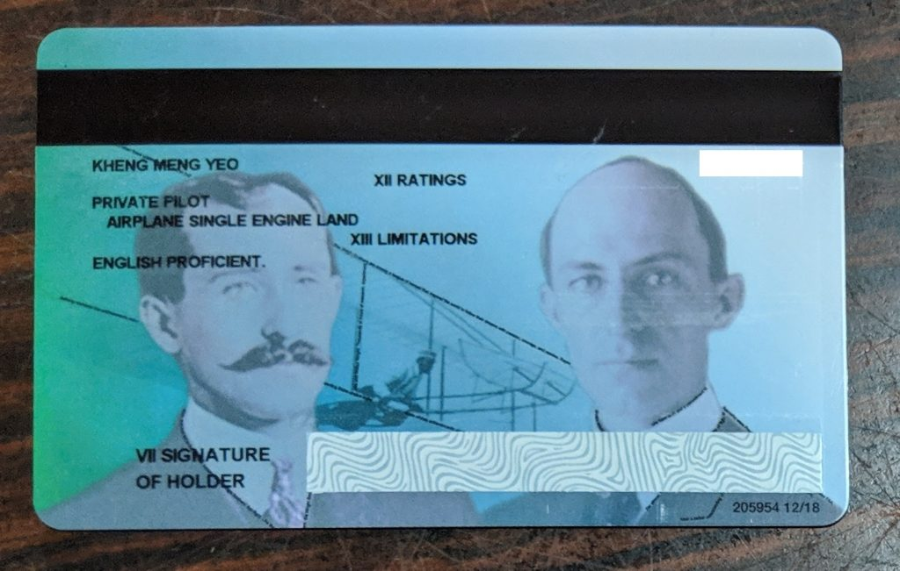

This post continues from [Part 1](/2019/02/i-became-a-private-pilot-and-this-is-my-story-part-1-2-in-singapore/) of my Private Pilot training journey. This part details the flying portion I did in San Diego, USA. It's divided into the following sections:

- [Arrival in San Diego](#arrival-in-san-diego)
- [Waiting for TSA clearance](#waiting-for-tsa-clearance)
- [Exploring Montgomery](#exploring-montgomery)
- [Stage 1: Train for Solo](#stage1)
- [Stage 2: Train for Cross-Country Solo](#stage2)
- [Stage 3: Prepare for Check ride](#stage3)
- [Final Checkride](#final-checkride)
- [Conclusion](#conclusion)
- [What's next](#whats-next)

<!--more-->

So let's begin my journey!

# Arrival in San Diego (14 Nov 2018) {#arrival-in-san-diego}

Davinder and I managed to complete the local program so we took the plunge and made our way to San Diego.

Montgomery Gibbs Executive Airport (KMYF) as seen in our incoming flight to San Diego International Airport.

We finally set eyes on the airport that we will train at for the next 2.5 months!

# Waiting for TSA clearance {#waiting-for-tsa-clearance}

This was one of the more painful waits we had to do. Every foreign student pilot has to have their background checked out by the Transportation Security Administration (TSA). We had to submit our fingerprints and hope for the best. In the meantime, we CANNOT commence our flight lessons EVEN the simulator. We were stuck on the ground for about 1.5 weeks while every day watching planes take off and land.

Here we see uncommon aircrafts like this trike landing. I don't think Singapore has any trikes.

In the 1.5 weeks while we were grounded, we had to absorb as much theoretical knowledge as we can. I wrote about it in an [earlier blog post](/2018/12/reflections-after-2-weeks-of-ppl-training-in-the-us/) but here is the gist of it.

In that time, I felt like a lifetime has just passed with the daily information overload I face. I have to absorb how every single system works in the Cessna 172, from fuel, pumps, electrical, engine, control surfaces, instruments, specifications, you name it I have to be able to recite from memory. On top of that, there are the aviation regulations, Physics, Maths, Engineering, Geography (especially Weather) knowledge to commit to my brain.

Objective here was to pass the 60 question MCQ theory test as well as the oral exam portion of the checkride.

# Exploring Montgomery {#exploring-montgomery}

Since our home base is in Montgomery, I should get to know more about it. And what a rich history it has based on the photos posted up there.

Now I come to know why is this airport called Montgomery.

Montgomery today has the parallel runways 10R-28L and 10L-28R. So it seems this was not always the case with only 10-28 in the past.

This a photo of the transient area. Montgomery is one of the busiest general aviation airports in the US. See my first solo video to get an idea.

I'll never get to see such rare experimental planes in SG. It's that strange top mounted propeller that first caught my attention. It's an amphibious plane [Seawind 3000](https://en.wikipedia.org/wiki/Seawind_International_Seawind). Only 80 of such aircraft in the world.

## Programme Outline

During this time, we would learn what would be our lesson plan throughout the course.

We were under the Part 141 program which is known to be more stringent and rigorous than the alternative Part 61. Under Part 141, we have to take stage checks to track our progress before we can proceed to the final checkride. This is the rough plan on what we'll learn and be evaluated during each stage.

1. Stage 1 is to evaluate a student if he is ready for a solo:
    - Power-on and Power-off Stalls
    - Slow Flight
    - Emergencies
2. Stage 2 is to evaluate if a student is ready for a cross-country solo:
    - Flight Plan
    - Pilotage
    - Diversion
    - Soft/Short field takeoff and landings
3. Stage 3 is to evaluate if a student is ready for final checkride:
    - Everything from Stage 1 + 2
    - Steep Turns
    - Ground reference manoeuvres: Turns around a point and S-turns
4. Final checkride

At the start of each Stage Check is an oral exam with the stage check instructor. Failure of the oral exam will preclude you taking the practical portion. Failure of any portion will require remedial lessons of the portion you failed and retaking the test again. Thankfully one only just needs to retake the portion you are deficient in!

One can think of it as taking 3 mini-checkrides before the final checkride.

## Student Pilot Certificate

I received my student pilot card from the FAA and it came with this letter. I felt it was very inspirational especially to encourage student pilots like me to continue our training to completion. So much symbolism and thought went into this card design.

# Stage 1: Train for Solo {#stage1}

Finally after 1.5 weeks of waiting and pure ground training, we could touch the real plane on 24 Nov 2018! Stage 1 is the longest of all the stages as the instructor has to bring the student up from zero to be able to fly a plane by themselves.

Charles showing us the preflight checks. These are checks to ensure that the plane is airworthy before we takeoff.

Wheels have to be checked as part of preflight. This is an example of a wheel that is definitely unsafe to use. The bald patch indicates some heavy sideloading (landing sideways) or skidding due to heavy braking.

Planes are extreme fuel guzzlers hence partially contributing to the high cost of pilot training. My first flight lesson would be on this plane N2441E and it would be the plane that most of my best memories would be made. I have more N2441E logbook entries and flight hours than the other 2 SDFTI C172R planes N7257T and N24780 combined.

First look at a real instrument panel in the cockpit

After every flight, we have to push the plane to its parking spot. The plane when fully loaded can be up to 2450 lbs which is more than one ton! Even when empty, its mass is still about the same as that of a car. I can swear pushing the plane every day twice a day at times makes for a good workout.



No audio until 3:07 when we start using the headsets. Gopro died after 15mins but at least it shows the full procedure to start a plane, talk to ATC, taxi the plane to the runway then finally can takeoff.

This was my my first time behind the controls of a real plane! (Although Charles did 99% of the work.)

Looking back at this video, I realised I have come so far since then.

Luke was also our instructor. In this picture, I was getting some "hood" time. Which means I cannot look outside and have to fly the plane solely by the instruments alone. It's not a replacement of an instrument rating, it is just to get basic private pilots out of trouble should they make an [Inadvertent entry into Instrument Meteorological Conditions](https://www.skybrary.aero/index.php/Inadvertent_VFR_Flight_Into_IMC) (aka poor/no visibility).

N7257T is another SDFTI-owned Cessna 172R that I used

Nice fog rolling inland above Escondido county in San Diego.

This is one of the amazing offshore views that I see very regularly whenever I return to Montgomery from the coastal training area. This is off the coast of [Mount Soledad](https://en.wikipedia.org/wiki/Mount_Soledad).

.

I even visited Mount Soledad itself to get this amazing view of the San Diego coastline.

Anyway, back to serious stuff..

## Stage 1 Check (15 and 16 Dec 2018)

After taking the necessary lessons, I went for the Stage Check. Here was when I experienced my first setback when I failed the stage check as I busted the Bravo airspace. Nevertheless, I took a remedial lesson then the check again and I passed!

## First solo (19 Dec 2018)

My FIRST SOLO Flight was the most memorable and scariest 1 hour of my life! And every moment of it was captured. Here I was entirely on my own with no instructor to help me.



I'll only be able to use the words "student pilot, first solo" once in my life.

_"Montgomery Ground, Cessna 2441E, at Gibbs, information Uniform, request taxi for 28L, closed traffic full stop, student pilot FIRST SOLO."_

Every pilot will always remember the day of their first solo flight. Your life is literally in your hands knowing you are the sole person at the controls to bring yourself up and down safely. In this solo, I made a couple of successful takeoff and landings although the first landing was a bouncing screwup so I had to do a go around.

As they say, "A good landing is one from which you can walk away. A great landing is one after which they can use the plane again."

As you can hear, the Montgomery frequencies especially Tower are active almost non-stop thus showing how busy this airfield is. It has its pros and cons, it means sometimes there are delays in takeoffs/landings. It also means there is more varied ATC communication and a great opportunity for students pilots to get thrown quickly into the deep end of the pool.

Notable moments:

- 02:48 - My first solo takeoff!
- 10:40 - My bouncy first landing that needed a go around
- 15:13 - My first solo proper landing
- 20:11 and 22:22 - Watch for a helicopter on takeoff
- 31:14 - Line up and wait on a runway. 3,2,1 and go!
- 59:05 - First time ever in my training I go to the end of the runway
- 01:00:46 - ATC controller scolding another pilot for stepping on his comms

With that flight, my name goes up to the board!

It looks all rosy but I had to wait 3 days for my first solo as the weather has to be almost perfect. SDFTI's requirement is 10sm visibility, 10 knots max wind, 5 knots max crosswind and > 5000 foot ceiling. So it was quite a wait and considering the short time I can spend there. In the meantime, I took extra lessons to maintain my proficiency and to prepare "just in case" the weather turns good.

## Local Area Solo (21 Dec 2018)

2 days later, I would make a local area solo flight to the western coastal training area. This was done in a very quiet and calm morning. 



Just putting the video here in case you are interested. Here are some key moments.

- 00:00 - Listen to ATIS
- 00:34 - Ask Ground for taxi clearance
- 04:00 - Ask Tower for takeoff clearance
- 09:20 - Position report at Mount Soledad
- 12:16 - Other aircraft reporting
- 13:40 - Other aircraft reporting then I report
- 20:08 - Get KMYF ATIS
- 21:30 - Other aircraft request takeoff clearance
- 21:58 - Request full-stop landing
- 27:07 - Clear to land 28L
- 31:30 - Landing
- 32:52 - Request Ground Taxi

This was a very nice precursor to the solo country I would make later.

# Stage 2: Train for Cross-Country Solo {#stage2}

After the solos, we have to train to make cross country flights which by definition means to another airport. We have to make flight plans to areas far away then execute the plans.

A table full of maps and the plotter. Making flight plans this manual way takes hours with many considerations, route, altitude, terrain etc.

Making longer distance flights entails more personal equipment. Here is my kneeboard and the other stuff I have to bring along while flying to help me navigate.

(22 Dec 2018) We made one such flight to Hemit airport (KHMT) 50nm away from Montgomery. Here there are heavy glider activities in the area.

Preflight checking of the external lights are even more important for night flights. N24780 is another SDFTI-owned Cessna 172R that I used.

(24 Dec 2018) On one of our training flights, we overflew the [Miramar naval air station(KNKX)](https://en.wikipedia.org/wiki/Marine_Corps_Air_Station_Miramar) that was featured in the 1986 Top Gun movie from the air. KNKX is in fact just beside Montgomery! What a terrific irony that the first time I see an V-22 Osprey would be so many of them on the ground and while I was in the air.

(26 Dec 2018) We also made a night flight to Torrance (KTOA) in Los Angeles at night. It was my first and shortest trip to Los Angeles for night cross country for all of a few minutes. Never imagined my first trip to LA would be on a Cessna 172 at night. If I come back to LA next time, I'll definitely make sure it is a longer holiday!

## Stage 2 Check (30 Dec 2018 and 5 Jan 2019)

After doing all the required lessons, it was time for my second stage check. This time it was very difficult as soft and short field landings were my weakest points.

Ironically I failed the stage check not because of landings but because of diversion. I did not maintain my position correctly while doing a circling descent. So when I was at the correct altitude to divert to another airport, I was no longer where I assumed to be as I have drifted in the descent but I still used my previous diversion angle which was wrong already.

Anyway, the same drill, remedial lesson then make a significant wait for my recheck before retaking it and passing it.

After passing, then I could do the cross country solo!

## First cross-country solo (8 Jan 2019)

As a general rule before any solos, our instructors will make us fly that route with them to ensure we can do it with minimal instructor intervention. One of the airports we go to is Zamperini Field (Torrance) Airport (KTOA) in Los Angeles about 80+nm away from Montgomery.

On one such a flight to KTOA, we entered a store. All the airplane parts laid out for sale like those in an electronics or hardware store.

A selfie at KTOA is in order here for my first cross-country solo. What a nice green field behind...



I made a solo flight all the way to Torrance, Los Angeles after enduring a wait of many bad-weather days!

My 1 hour flight along the beautiful California coast from San Diego to LA condensed into 24 minutes containing the key moments of my journey.

It's a privilege to use the Flight Following service of one of the busiest air traffic control facilities ([SoCal Tracon](https://en.wikipedia.org/wiki/Southern_California_TRACON)) in the world. Thanks to the friendly anonymous controllers for taking their time to keep a lowly student pilot in a tiny Cessna out of harm's way!

Notable moments and mistakes I made:

- 00:00 - Provided wrong cruising altitude and take too long to ask for taxi request
- 01:25 - Takeoff from Montgomery!
- 02:55 - Initial contact with Socal and unable to comply with Bravo clearance
- 04:55 - Cannot find the traffic that Socal alerted me
- 11:40 - Alert to Boeing 737 below me
- 12:20 - Starting descent to Torrance
- 13:15 - Contact Torrance tower for landing request
- 14:36 - Cleared to land at Torrance!
- 18:47 - Wrongly request flight following from Tower instead of Ground
- 20:44 - Cleared for takeoff from Torrance! Gopro battery ran out shortly after this.

After that, I would make 2 more cross country solos! Weather wasn't that forgiving especially for my last one which I had to land at 3 airports. In fact I had to wait 5 days for perfect weather which was an eternity considering the amount of time I had.

I took this on my last 3-airport solo on 13 Jan 2019. Finally saw beautiful crepuscular rays for real from the "captain seat".

# Stage 3: Prepare for Check ride (21 and 27 Jan 2019) {#stage3}

Stage 3 is meant to consolidate all of our learning so far to prepare us for this moment. Here is when the Stage Check became rather rigorous. Unsurprisingly I failed several items. So again more retraining before I could take the final test exactly a week later. Here was when I clocked many hours of pattern training just to improve on my soft/short-field landings. Even then, I wasn't still that confident when I went for the checkride.

# Final Checkride (29 Jan 2019) {#final-checkride}

I was nervous and stressed as well but my instructor Charles suggested to approach things like a robot, suppress all emotions as much as possible and do as you are told or asked. Great advice!

The first part of the checkride is an oral exam which lasted 3 hours for me. Everything a private pilot should know was on the table.

All the sticker labels attached to increase the speed of information lookup. Never been so hardworking in my life. I actually felt studying wasn't a problem for me but it was the practical test that I feared more. Nevertheless, I passed!

SDFTI's Chief Instructor and Examiner Bob giving me my wings.

77 days after I touched down in San Diego, I got my wings. Looks so cool right? :)

This is Phil, SDFTI's stage check instructor. One of the most objective and fair accessors I know. I failed all his practical stage checks on my first try. However it was because of my failures that I could improve and be a better pilot.

Grant is one of the friendly front desk personnel who helped us handle the admin details. They have another lady Kathy who is super friendly but she sadly wasn't around at that time :(

With a plane, I'm like a bird now!

My temporary license before my actual licence card arrived in 2 months later below!

Looks so cool!

# Conclusion {#conclusion}

Thanks to my instructors Luke Gibson and Charlie Platt for the extensive training I received. I heard it usually takes take 4-6 months to complete the program. I would like to thank my awesome training buddy Davinder Singh too for the mutual support.

This plane N2441E was part of all my best memories too. It was the plane I used on my first lesson, made my first solo flight in and I did my check ride on it. For the check ride, I had to study the maintenance logs of this plane to know this baby inside and out too. Nice start and end of my PPL learning journey.

I had to face delays from bad weather, aircraft going down for maintenance and myself too with failed stage checks. But those are understandable, as they say, aviation is filled with delays. Despite those delays, the school SDFTI still did their utmost to give the best training they could in this short time.

FlightSchool.SG's arrangement with SDFTI really works but as with all new programs, there are kinks to be ironed out and processes to be improved. Stuff which I have already given feedback so it'll only be better than what I have experienced! Capt Kumeran's training was superb! If my fellow Singaporeans want to take this route, ask FlightSchool.SG, SDFTI or even me!

Some people have commented why have I taken up this expensive endeavour when there is no clear return of investment unless I become a full-fledged commercial pilot (That is not entirely off the cards though). It's not as if I will get promoted in my current job or get a larger bonus because I know how to fly planes now. Well I felt was a real lifetime of learning crammed in this course which leads to what I gained.

## What I gained

The vast array of knowledge I have absorbed and getting literally a bird's eye view of things has given me a greater appreciation of the world around me and the harsh demands of pilot training. I feel I know myself better now that I have literally pushed myself to heights I never knew possible.

Aviation is full of acronyms to aid in remembering stuff, IMSAFE, SAFETY, DECIDE, 4Ps, NWKRAFT, ATOMATO FLAMES FLAPS, AVIATED, ARROW, LHAND, Lights Camera Action etc. I think I should try that if want to try to memorise something.

Through ATC radio communication, I have become a better listener and communicate with intent and confidence. I'm the type of person that tends to blurt out words without thinking. Talking on the radio has trained me to always think of what I want to say exactly before I press the PTT if not I'll actually tie up the precious frequency time.

I feel my multitasking abilities have improved. As I was starting out, I had very little responsibilities as my instructors did most of the work. As time went on, I had to handle more tasks, fly the plane, look outside, look at instruments, manipulate the avionics, handle ATC communications or to other pilots, navigate with a paper map, do calculations oftentimes doing everything together. Having done all those now, I feel I have a better understanding on my personal capabilities.

Heavy use of checklists has made me very systematic in doing things and not just blunder my way through or wing it.  The act of making numerous flight plans has made me more prepared for contingencies in other aspects of my life.

Despite the points ^^^, it still appears kinda sketchy description I know but I feel like I'm a different person now. A better, more mature decision maker with a polymath set of skills. And that I believe is the best investment in myself so far.

# What's next? {#whats-next}

On an emotional level, it was a great feeling to be walking behind the steps and fly on the shoulders of the aviation pioneers. With my PPL, it's my turn now to contribute back to the aviation community :)

It'll be sometime also before I'll fly again owing to the sky-high (pun intended) cost of aircraft rental in Singapore. But nevertheless, I'll eventually definitely bring my family and close friends on joyrides in the near future.

Right now my PPL limits me to only fly in good visibility conditions. I intend to get my instrument rating sometime in the mid term years from now so I can really fly among the clouds.

It is said a PPL is a license to learn. It is the stepping stone to get more ratings like the following to improve one's skills as a pilot

Certifications I hope to get in my lifetime over the very long term.

- Instrument
- Helicopter
- Commercial
- Complex
- Tailwheel
- High Performance
- Multi Engine

Bucket list items:

- See Northern Lights from a plane
- Fly warbirds like Spitfire, P-51
- Experience flying a jet at least once
- Fly into and visit EAA Oshkosh

In the meantime, back to my job!
