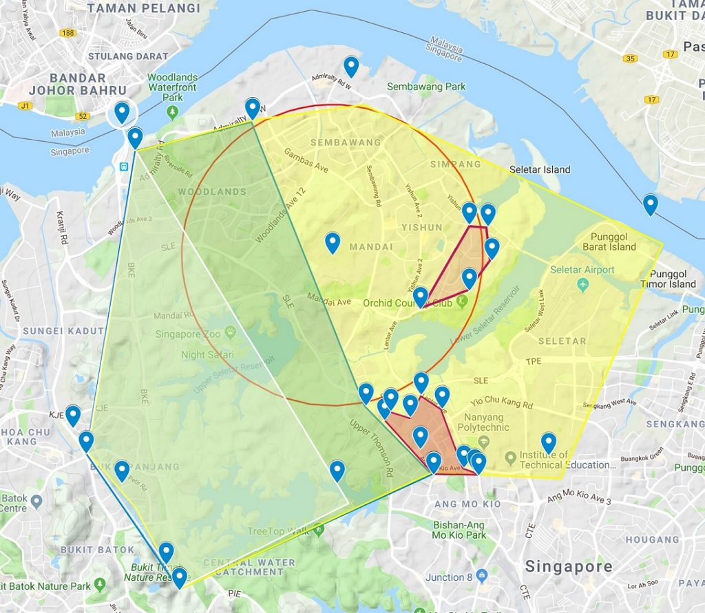
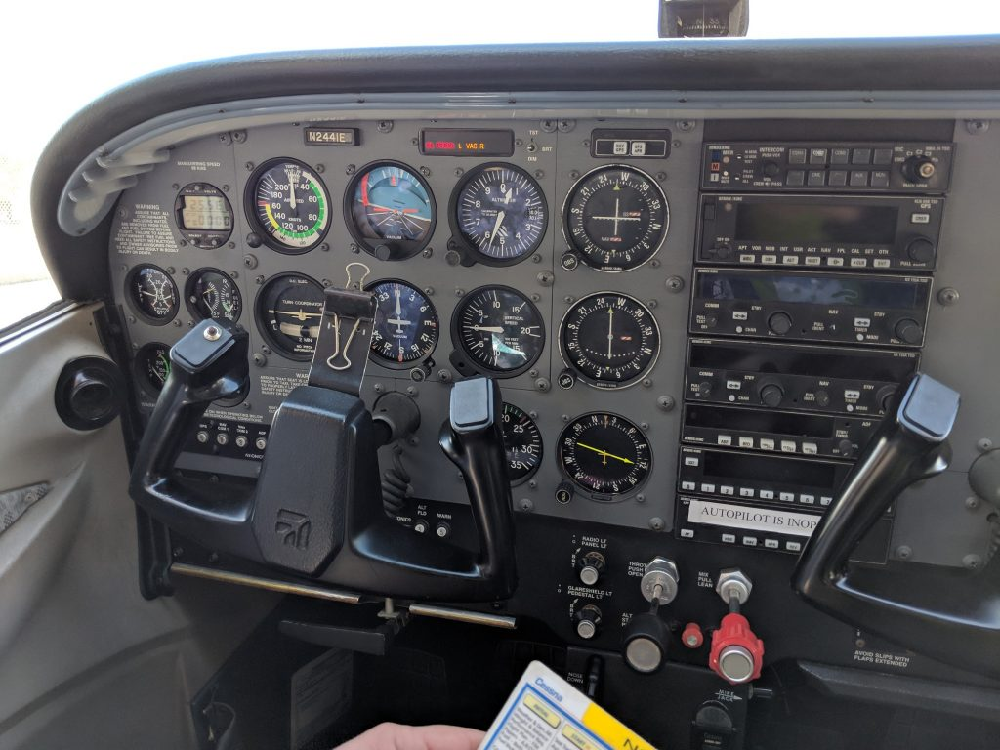
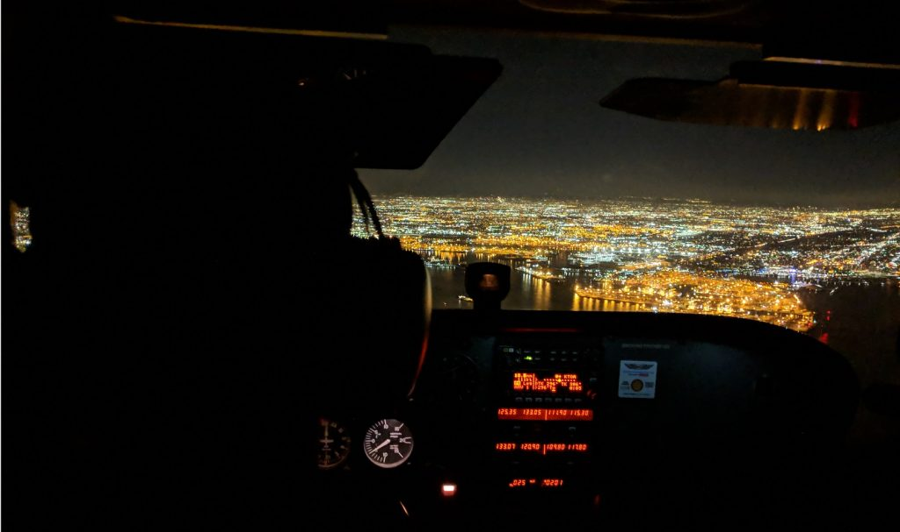
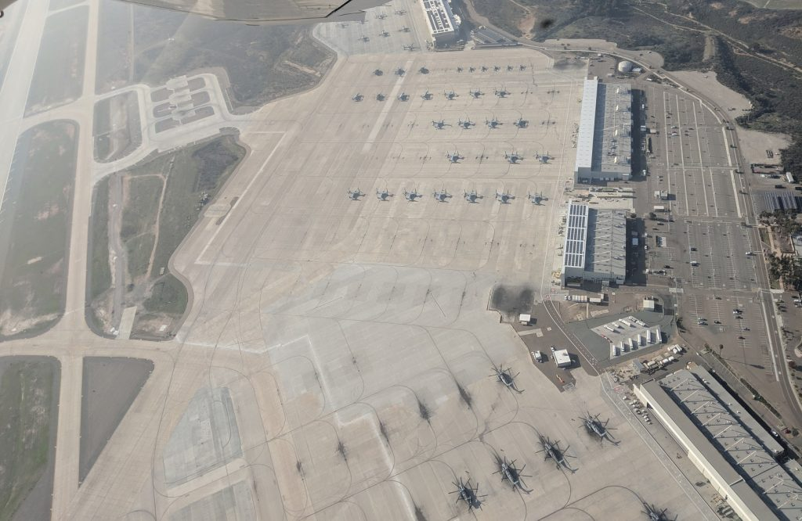

Ever since [I got my Private Pilot's License (PPL)](/2019/02/i-became-a-private-pilot-and-this-is-my-story-part-1-2-in-singapore/), my friends have inundated me with many aviation questions. So I decided, why not compile everything into a blog post?

With my PPL, I only have the lowest-rated license among the many others higher up the chain, instrument, commercial, airline etc so I'm actually least qualified to answer them but I'll try the best I can.

Many people's experience with aviation this days especially in Singapore are only as passengers on commercial airliners. Especially since exposure to General Aviation (GA) in SG is extremely limited relative to the US or Europe. Or worse, shaped through the media and military movies with those fancy CGI aerobatics.

Aviation does not seem to be seen much as a possible hobby thing in this side of the world. So no surprise many questions and misconceptions have surfaced to me.

<!--more-->

1. [Can I fly in Singapore with my American FAA license? Do I need to do a conversion?](#q1)
2. [Singapore is so small, where can one possibly fly at?](#q2)
3. [Why did I learn in the US? Why not Singapore or Malaysia?](#q3)
4. [So since you are a Private Pilot, can you fly a Private Jet and earn money too?](#q4)
5. [What’s up with those pilot shades? Trying to look cool?](#q5)
6. [If you take me as a passenger, you better have parachutes in case the engine fails.](#q6)
7. [What are the steps to take when gliding the Cessna to a landing in an engine failure?](#q7)
8. [I'll only be your passenger if you take me up in a multi-engine plane. At least will still have one extra engine if one fails](#q8)
9. [What do I need to do to maintain my license?](#q9)
10. [Tell me what you think caused these accidents. Crashes, missing planes etc?](#q10)
11. [I've watched some of your videos and pictures. How come your aircraft instruments look so primitive and analog? Where are the modern LCD displays like in my favourite Airbus/Boeing?](#q11)
12. [Can you fly a helicopter?](#q12)
13. [Why don’t you use Instrument Landing System (ILS)? You mean you land the aircraft by sight only? Bad weather how?](#q13)
14. [Why are pilots are still needed when modern planes can takeoff, cruise and land by themselves?](#q14)
15. [Do pilots have to learn many languages when flying to other countries?](#q15)
16. [If/when the plane suddenly drops/dips, is there anything you can do to counteract the sinking feeling in your stomach?](#q16)
17. [Will I do loops and barrel rolls if I take passengers?](#q17)
18. [Can you navigate using the stars at night, in an emergency-why/why not?](#q18)
19. [How do you tell if air traffic control is trying to talk to you? Is there a lot of air traffic noise up there while flying? Do you use codenames while communicating with ground or other airplanes?](#q19)
20. [What are some codenames for dangerous situations? If any.](#q20)
21. [Can you fly to Changi Airport? Emergency can? What about other airports in Singapore other than Seletar?](#q21)
22. [Where are the nearby international airports I can fly to?](#q22)
23. [Why does aviation use imperial units like feet, miles, knots, inches of mercury instead of metric?](#q23)
24. [What is the most memorable moment in your training?](#q24)
25. [How did you manage to take 2.5 months of leave from work? Your company SP so generous ah? Did you take no-pay leave? ](#q25)
26. [So has dropping tens of thousands of dollars on this course earned you any return on your job or better prospects? Are you broke now? Why didn't you take up something more practical like a master degree or many tech courses?](#q26)
27. [When will you offer rides to your friends?](#q27)
28. [What's next, will you continue with jet engine pilot license?](#q28)
29. [Why do pilots say "niner" for nine? Why say "roger"? What does 12 o'clock when a controller say it, whose's 12?](#q29)
30. [Is it hard to visually track aircraft in the sky?](#q30)
31. [How do you find communicating with Controllers? Is our accent a challenge to the Americans? Conversely, the US Controllers speak really fast. Did any of that pose a difficulty?](#q31)
32. [Do you need perfect eyesight to be a pilot?](#q32)
33. [The instructors trust you enough to fly solo during training?](#q33)
34. [Isn't it dangerous to fly planes that are almost half-century old?](#q34)
35. [If you can fly one dream plane in the world, what would it be?](#q35)

Anyway, this will be an evergreen post, as and when I get questions, I'll update this!

## **1\. Can I fly in Singapore with my American FAA license? Do I need to do a conversion?** {#q1}

Generally speaking, having a pilot's license from a certain country will allow one to fly planes registered in that country.

With my American license, I can only fly US-registered planes with the N-prefix anywhere in the world subject to the limitations of my license. So for me it's just currently single-engine land with the engine power not exceeding 200hp and have to be a "relatively simple" plane.

Nevertheless, being legally allowed to does not mean I'll jump direct into an N-plane at Seletar Airport and takeoff immediately. It's best to fly with an instructor for a few hours to learn about the different procedures and regulations used in Singapore before going alone. I'll have to familarise myself with different plane models compared to the Cessna 172R I trained in.

N2441E is the Cessna 172R I used the most in my training at San Diego. My first training flight, solo and checkride were on it.

I can legally fly this N-registered Piper Warrior under Seletar Flying Club (SFC) but better to get more training first.

There is an exception specifically for N-reg planes. **An N-reg aircraft can also be flown by a CAAS PPL (restricted or unrestricted) but only within Singapore**. _“When operating an aircraft within a foreign country, a pilot license issued by that country may be used.” ([FAR 61.3, a, v](https://www.ecfr.gov/cgi-bin/text-idx?pitd=20170501&node=se14.1.61_13&rgn=div8))_ However flight hours on the N-reg cannot be used to fulfill annual validity requirements of the CAAS PPL.

There is one extra thing that the instructor at SFC said I need to do which is to apply for an FCC "Restricted Radio Telephone Operator Permit" license since I'm flying outside the US. That registration can be trivially [applied online on the FCC website](https://www.fcc.gov/wireless/systems-utilities/universal-licensing-system) and approval obtained within days.

Fun fact, there are more US-registered general aviation N-planes in Singapore than there are Singapore-registered general aviation 9V-planes.

## 2\. Singapore is so small, where can one possibly fly at? {#q2}

There are indeed training areas for general aviation pilots to train/use. I got the following information from Seletar Flying Club.

Singapore is small enough. Imagine 1/6 of that!

Zooming in, you can see the training area is bounded mostly by the Central Water Catchment area and Sembawang airbase in the North. Believe it or not, it is just large enough for training purposes.

This was the flight path I made during my trial flight with Seletar Flying Club. After every maneuver I did, I had to make a 180° turn to stay within the boundary of the training area.

Nevertheless one can still get scenic view and see landmarks like Bukit Timah Hill, reservoirs, turf club, power station, Jurong Island and even parts of Johore!

Seletar Airport

Central Catchment Area

Altimeter shows I'm about 5400 feet (1.6km) above sea level above Singapore.

## 3\. Why did I learn in the US? Why not Singapore or Malaysia? {#q3}

I made a table to weigh the options between getting a pilot's license from different countries in a [previous blog post](/2019/02/i-became-a-private-pilot-and-this-is-my-story-part-1-2-in-singapore/#weighing-my-options). In summary, cheaper training than Singapore, access to more planes to fly worldwide, better training and cheapest to maintain.

## **4\. So since you are a Private Pilot, can you fly a Private Jet and earn money too?** {#q4}

The word "Private" means differently for both phrases. A Private Pilot means I cannot earn money from flying. In fact, I have to at minimum fork out money no less than what other passengers are paying for the flight.

A Private Jet usually means that the jet plane is owned by some individual or company that is not an airline. A Private Pilot can in theory fly a Private Jet or even a privately-owned Airbus A380 provided he/she gets the necessary qualifications which are too numerous to say here.

## **5\. What’s up with those pilot shades? Trying to look cool?** {#q5}

Those shades are really a necessity as the glare can be quite strong especially at altitude. I have personally experienced staring towards the sun while landing as the runway heading is directly towards the west. Without the shades, no way I could have landed safely.

I actually wear a clip-on flippable pair of shades (got from [here](https://www.amazon.com/gp/product/B00O7ENMU0/)) on top of my glasses as I don't have perfect eyesight. Really useful if the glare has suddenly changed during a flight, I can just flip up and down accordingly without struggling with my headset.

## **6\. If you take me as a passenger, you better have parachutes in case the engine fails.** {#q6}

Engines very rarely fail in the well-maintained planes of today. Private pilots are also trained to execute emergency procedures and attempt a landing someplace if the engine does fail. (More in the next question) A plane with a failed engine does not just fall out of the sky. It can still glide for some distance.

Besides, parachutes need special training to use them. You can die just as badly if you don't know how to use a parachute. In an emergency without parachute training, your best bet is to trust the trained pilot and go down safely with the plane instead of die jumping with the parachute.

## 7\. What are the steps to take when gliding the Cessna to a landing in an engine failure? {#q7}

I shall refer to the all-important checklist for that!

Source: [http://wayman.net/files/Cessna-172-R.pdf](http://wayman.net/files/Cessna-172-R.pdf)

These are summarised steps of the key points mentioned in the checklist

1. Go to best glide speed to ensure furthest gliding distance
2. Aim for emergency landing spot
3. Attempt engine restart
4. If restart fails, shut off everything related to fuel and engine
5. Set transponder to emergency code 7700
6. Set radio to 121.5 Mhz and make an emergency call like as follows _"Mayday Mayday Mayday, White Cessna N7257T, engine failure along San Diego Coast 3500 feet, 2 persons on board, making emergency landing at Delmar Racetrack."_
7. As I approach the landing spot, ensure everybody's seat belts are on, unlatch doors to prevent door jam on landing

The video has a simulated emergency given by my instructor.



- Simulated engine out: 21:20
- Simulated engine fire lesson: 25:55 and 29:45. Here was when I banked as much as 60° during an emergency descent to extinguish the fire

## 8\. I'll only be your passenger if you take me up in a multi-engine plane. At least will still have one extra engine if one fails {#q8}

An extra engine does add to safety but only if the pilot can use it properly in an emergency. I'm not trained to fly a multi-engine aircraft but I roughly know that when an engine fails, the pilot has to quickly use the rudder to counter the yawing effects due to asymmetric thrust. The speed can't get too low also if not there is insufficient rudder authority to counter the yaw.

I can easily venture to say it is not that straightforward to learn to fly a multi-engine plane. People have died when pilots could not deal properly with an engine failure in a multi-engine plane.

Almost all pilots in the world start their training in tiny single-engine piston planes like the Cessna 172 I was trained in. If it is that unsafe, governments will have banned that long time ago.

## 9\. What do I need to do to maintain my license? {#q9}

It depends on the country where the license is taken from.

For my US FAA license, I need a **flight review with an instructor once every 2 years**.

For a Singapore license, at least 5 flight hours every year with 2 of them being with an instructor.

For Malaysia, a test with an examiner every 6 months.

The key difference is that the FAA license is for life whereas the others actually expire. Should I forget to take the flight review, I can theoretically take it any time after that and if the instructor clears me, I'll be fit to fly again. Nevertheless, I would also try to bring family and friends up as regularly as I can manage to maintain my proficiency.

For all 3 licenses to carry passengers in the day, I need **3 takeoffs and landings in the last 90 days**.

## **10\. Tell me what you think caused these accidents. Crashes, missing planes etc?** {#q10}

I think it is better to let the investigators do their work and come to their conclusions. I have my opinions and am happy to explain what I have understood but don’t treat what I say as expert opinion. It's so easy to be an armchair critic or pilot that I'll try to avoid that nowadays. Better to let the experts do their job.

## 11\. I've watched some of your videos and pictures. How come your aircraft instruments look so primitive and analog? Where are the modern LCD displays like in my favourite Airbus/Boeing? {#q11}

Those dial-instruments are also called steam gauges although they don't actually run on steam! They are cheaper and easier to maintain than the modern glass-cockpits. It may even be more reliable as they are less complex. Even on some modern Cessnas with glass cockpits, they still retain some analog gauges as backup.

As a student pilot, I would actually prefer to learn from the simpler and less complex instruments then move on the feature-rich glass cockpits after I have more flight experience. There is also something deeply nostalgic about those dials, flying with the same instruments as the early aviation pioneers. The exotic steam-punk feel to them certainly helps too!

The trend today is moving towards glass cockpits for GA aircraft as 90% of new GA aircraft come with them. Modern jetliners now almost always use glass cockpits too. The days of analog instruments are numbered. If I start my flight training say a decade or 2 from now, it is highly unlikely I'll train with analog instruments anymore.

## 12\. Can you fly a helicopter? {#q12}

A helicopter is a fundamentally different flying machine so I cannot fly one. I would even venture to say learning a helicopter is actually harder than a plane.

I might want to learn to fly helis one day and I'll have to start pretty much from scratch although there are some reusable skills like Air Traffic Controller (ATC) communication, regulations and airspaces.

## **13\. Why don’t you use Instrument Landing System (ILS)? You mean you land the aircraft by sight only? Bad weather how?** {#q13}

Using ILS is not taught for the Private Pilot Course. It is only taught in the Instrument Rating course which is generally the next step up above Private Pilot. Yeah, I really land the aircraft by sight and it is actually good enough. The thing about bad weather is to make sure I don’t encounter the situation in the first place. Private Pilots like myself are trained to check the weather (forecasts) before the flight.

If there is bad weather or poor visibility, we'll just stay on the ground. As they say, _"Better to be on the ground wishing you are in the air than being in the air and wishing you are on the ground."_

## **14\. Why are pilots are still needed when modern planes can takeoff, cruise and land by themselves?** {#q14}

In actual fact, 100% of takeoffs and 99% of landings are done manually. The 1% of automatic landings are actually to test whether the autoland system is still working. Autolands are also only supported at certain airports with special equipment. Cruising on modern jetliners are mostly automatic correct.

Computers cannot be programmed for every unforeseen emergency. Computers can fail as well so humans are still kept in the loop. Talking over to the radio to ATC is still done by human voice. Taxing the aircraft on the ground is still manual. The high level decisions like making course corrections to avoid bad weather and turbulence are still largely made by humans.

However, just like driverless cars, I’m not surprised that the pilot jobs will be fully taken over by computers just like any other job. To all those that say computers have crashed planes too. Well computers like humans are not perfect, but they just need to be safer than the human. One day, piloting skills may just be a hobby activity like horse riding.

## **15\. Do pilots have to learn many languages when flying to other countries?** {#q15}

English is the de facto international language of civil aviation. It was recommended in the ICAO Chicago convention in 1951 but recently [ratified in 2003](https://www.icao.int/SAM/Documents/2003/RAAC8/RAAC8IP18.pdf). So all pilots and Air Traffic Controllers are now required to use English.

Even in maritime, English is also used as a standard language. Nevertheless, there are some terminology differences between Aviation English used by the FAA vs ICAO but that is another story.

## 16\. If/when the plane suddenly drops/dips, is there anything you can do to counteract the sinking feeling in your stomach? {#q16}

I think it comes with the experience. When I first started my flight training, I used to feel those sinking feelings as well. It was even more pronounced when I did maneuvers like [stalls](https://en.wikipedia.org/wiki/Stall_(fluid_dynamics)). Near the end of my training, I was more used to it already.

## 17\. Will I do loops and barrel rolls if I take passengers? {#q17}

Most GA planes are not rated for aerobatic uses. And even if I'm in such a plane, I won't do those maneuvers as I'm not trained for them. The greatest angle I have ever banked at during training is 45° (1.5Gs) for a steep turn and up to 60° (2Gs) for an emergency descent for situations like engine fire. But I don't think I'll want to do those every time I fly with passengers.

Aerobatic planes have to be specially certified for such use and are tested and rated to handle more extreme positive and negative G-Forces compared to a normal plane.

## 18\. Can you navigate using the stars at night, in an emergency-why/why not? {#q18}

I'm not taught celestial navigation and I don't think such a thing has been taught in a long time in the civil aviation world. However Wikipedia shows that the [US Navy still teaches it](https://en.wikipedia.org/wiki/Celestial_navigation#Modern_celestial_navigation).

On a night flight to Torrance, Los Angeles. The bright landmarks can still allow one to navigate.

Most modern aircrafts even the tiny Cessna are equipped with GPS. If the GPS fails, we still have the VOR navigation from ground stations. If the VOR radio fails, the transponder can show to ATC radar where I am. I can put myself on the emergency frequency 121.5 Mhz (which is monitored by almost every station) and broadcast my predicament and hope someone can help and give me vectors to follow.

If there is an engine or alternator failure, the electrical system won't die immediately. The onboard battery can still keep the avionics alive for some 30mins or so, enough to do an emergency landing somewhere.

If let's say there is really a total electrical failure at night, that's really bad. I can possibly fly to a towered airport and "buzz" them so they can notice me and give me light signals to land. That's why a pilot should always know where he/she is and always be on the lookout for the nearest emergency landing spot.

Back to stars, I can totally see why stars are not used in favour of electronic methods. It's hard enough to fly a plane at night, now add on staring at the stars hoping to get a fix is close to impossible for a single pilot. Even more difficult considering how fast planes go compared to say a ship which can remain stationery.

## 19\. How do you tell if air traffic control is trying to talk to you? Is there a lot of air traffic noise up there while flying? Do you use codenames while communicating with ground or other airplanes? {#q19}

Communication is almost always initiated by the pilot to the associated ATC station. The pilot will provide the callsign which is usually the registration number of the plane. Then after that, the ATC will know who are we and address us with our callsign when they want to talk to us.

A very good example is the video of a flight I made from San Diego to Torrance, Los Angeles using Flight Following. Flight Following means the controllers will help in issuing traffic advisories and alert to potential dangers.



- 00:00 - Provided wrong cruising altitude and take too long to ask for taxi request
- 01:25 - Takeoff from Montgomery!
- 02:55 - Initial contact with Socal and unable to comply with Bravo clearance
- 12:20 - Starting descent to Torrance
- 13:15 - Contact Torrance tower for landing request
- 14:36 - Cleared to land at Torrance!

The typical phraseology is usually in this format, **"Who you want to talk to, who you are, where are you, what you have, what you want"**. You'll see that throughout the video even right at the start when I talk to the Ground Controller. And you'll also see me being handed from one controller to another as I moved from an area of a controller's responsibility to another.

There are only 3 main groups of people I talk to, Ground Controller, Tower Controller and an Approach (en-route) controller. In some cases, I can even talk to other pilots on the air to air frequency when I broadcast my intentions like this video of a solo flight I made to a local training area before returning.



- 09:20 - Position report at Mount Soledad
- 12:16 - Other aircraft reporting
- 13:40 - Other aircraft reporting then I report climbing
- 15:06 - Other aircraft reporting
- 19:44 - Position report at Delmar Racetrack when I was coming back

In terms air traffic noise, it depends on the location. If near a busy airport, the frequency can be constantly active. I ever encountered a situation that the winds were very strong and many aircrafts have to do go-arounds. Therefore there were many planes in the traffic pattern above the airport and the busy controller was continuously issuing instructions to everybody to prevent any collisions.

## 20\. What are some codenames for dangerous situations? If any. {#q20}

So far I have gotten "Traffic Alert" from a Tower Controller just after takeoff of an aircraft coming a little bit too close on my left for her comfort. Thankfully, I had the traffic in sight and I could see the course of the other aircraft and mine will not intersect. I reported to the controller that it was a non-issue.

Usually, the controllers will route my aircraft away from other traffic before it can become a serious concern. If another aircraft is too close and we are not in controlled airspace, I can actually communicate with the other aircraft on the air-to-air frequency.

There are others like "Terrain alert", "Turn heading XXX to avoid entering Bravo airspace" but none have been issued to me.

## 21\. Can you fly to Changi Airport? Emergency can? What about other airports in Singapore other than Seletar? {#q21}

As much as I would like to try, slow single-engine piston GA planes like the Cessna 172 and Piper PA-28 are not allowed to land at Changi. Changi Airport is reserved for fast-moving jet aircraft. If a slow-moving Cessna tries to takeoff/land from there, it will cause problems for the controllers to space out the aircraft.

Unfortunately, Seletar is the only GA airport in Singapore. Other than Changi, the other airports are all military airbases which cannot be used for obvious reasons.

If there is any emergency, the pilot-in-command of the plane is entitled to break any rule deemed necessary for the safety of the plane/passengers and people on the ground.

_"In an in-flight emergency requiring immediate action, the pilot in command **may deviate from any rule** of this part to the extent required to meet that emergency."_ ([FAR 91.3 Responsibility and authority of the pilot in command.](https://www.ecfr.gov/cgi-bin/text-idx?rgn=div5&node=14:2.0.1.3.10#se14.2.91_13))

Of course there'll probably be lots of paperwork and investigation after that as to why Changi Airport or a military airbase is chosen vs Seletar Airport.

## 22\. Where are the nearby international airports I can fly to? {#q22}

I need to qualify the question, only airports which accept GA traffic. The nearest is Senai Airport in Johore. Other common destinations I heard are in Malacca and Tioman Island. I have not verified but Indonesian airports are supposedly avoided due to exorbitant landing fees for GA aircraft.

## 23\. Why does aviation use imperial units like feet, miles, knots, inches of mercury instead of metric? {#q23}

It's because of strong American influence in the early days of aviation. Aviation is also influenced from maritime which used nautical miles and knots for distance and speed measurement.

Nevertheless, some metric units are used outside the US like runway lengths and visibility are measured in meters, pressure is given in hectopascals. Altitude in countries like China, North Korea, Russia and the CIS countries are in meters.

There is one notable exception in the US, temperature in aviation is measured in Celsius instead of Fahrenheit.

## 24\. What is the most memorable moment in your training? {#q24}

No doubt it was my FIRST SOLO flight on 19 Dec 2018! My first training flight, cross-country solo and the day I passed my checkride were important but nothing beats the feeling of being in control of the plane by yourself for the first time. I believe many other pilots can agree with me with this.



- 00:00 - My solo taxi request
- 02:48 - My first solo takeoff!
- 10:40 - My bouncy first landing that needed a go around
- 15:13 - My first solo proper landing
- 37:45 - My best landing in this solo
- 01:00:46 - ATC controller scolding another pilot for stepping on his comms

## 25\. How did you manage to take 2.5 months of leave from work? Your company SP so generous ah? Did you take no-pay leave? {#q25}

I was away from **14 Nov 2018 to 3 Feb 2019** and I didn't take a single day of no-pay leave. SP allows one year of leave to be carried over to the next year. When you come to a new year, the entire year of leave is available.

- 14 Nov to 31 Dec 2018: 2017 carried over leave + 2018 leave
- 1 Jan to 3 Feb 2019: 2019 leave

So in essence, I actually took 3 years worth of leave in this short window. I must be the first or only one of few to push SP's leave system to such a limit. Of course whether I can pull this stunt again is another matter. Even if I can, it'll only be in the end of 2021 before I can do this again, almost 3 years later.

Nevertheless, I was so close to running out of leave that the consequences would have been graver if I was delayed by just one more week.

## 26\. So has dropping tens of thousands of dollars on this course earned you any return on your job or better prospects? Are you broke now? Why didn't you take up something more practical like a master degree or many tech courses? {#q26}

If you ask me honestly based on contribution to my job, no tangible returns. Not only that, being out of work for almost 3 months will no doubt have an impact on my performance evaluation and bonus I'll be getting.

But what about the intangible returns? There is a sense of achievement in having a flying privilege that very few people in this world can claim to have.

As for money, my savings have no doubt taken a hit but I'm in an entirely solvent position and did not borrow any money. But let's just say I won't be spending much or travel for quite some time.

If I take a master degree, yeah it's useful and all, but I'll probably be just another person with a master degree.

I have learned to multitask better, be more careful and plan out things ahead of time and try to anticipate things that can go wrong. Stuff like this are hard to quantify but over the long term, I still think despite the sacrifices, this is one of the best investments I've made for myself. Money can be earned back, but the skills and experiences I have gained are priceless.

Learning to fly is an intense time and mental commitment and I felt the window for me to pursue such an endeavour is rapidly closing. So I thought, why not just do it now already since I still have my reflexes and memory to absorb new things easily. Besides, a commercial route for me is not totally out of the question, I'm still weighing my options in life.

## 27\. When will you offer rides to your friends? {#q27}

Right now I'm busy with many life's matters. After I get them settled, I'll still need to fly some training lessons locally before I feel proficient to take passengers. Probably some time in July 2019 onwards. I'll initially open to my family, then some of my closer friends or people I want to reward for being a significant part/influence of my life then "expand outwards".

## 28\. What's next, will you continue with jet engine pilot license? {#q28}

Not anytime soon. Before one can fly jets, there are several steps. I'll need to get my instrument rating, commercial, commercial multi-engine, then the jet rating. Each jet aircraft model needs specific training before one can fly them.

I can technically skip the commercial and go straight to private pilot multi-engine but I rather not do that. Prefer to get "money-earning" privileges first.

## 29\. Why do pilots say "niner" for nine? Why say "roger"? What does 12 o'clock mean when a controller say it, whose's 12? {#q29}

### Story of "Niner"

I had those questions a long time ago as well and I Googled! For "niner", just look [here](https://aviation.stackexchange.com/questions/14875/why-do-english-speaking-pilots-and-atc-say-niner-instead-of-nine) which quoted from [Wikipedia](https://en.wikipedia.org/wiki/NATO_phonetic_alphabet#Pronunciation). Simply put, "nein" is the German word for "no", so to avoid confusion with German speakers, it was decided to use pronounce "nine" slightly differently.

### Story of "Roger"

"Roger" means message received and understood. It does not mean that I'll action on it. Usually I'll say roger to something benign like a weather report. To give a more precise reply to an instruction, I'll either say "Affirmative" or Unable" and give the reason why unable or just repeat back the entire instruction to the controller.  [Here is the only time I ever used "unable".](https://youtu.be/lWO_JKjT7YM?t=195)

Now to origins of "Roger", Google comes to the rescue with [this link](https://aviation.stackexchange.com/questions/23749/what-is-the-true-meaning-of-the-word-roger-when-used-on-the-radio-what-is-its). Basically, we want to say message "received" and "roger" was the phonetic pronunciation for the letter "r" at that time so it was used. Nowadays, the letter "r" is pronounced as "Romeo" but "roger still stuck.

### What is this clock face 12 o'clock?

12 o'clock is just short hand for the direction to look out with respect to the plane's current direction. So 12 o'clock means right in front of me. 3 o'clock means on my right. 10 o'clock means somewhere on my front left.

**BUT, that the above ^^^ is not always true.**

To be precise, the clock position is with respect to ground track of the aircraft or the path of the aircraft with respect to the ground as that is the only thing the controller can see. For easier explanation take a look at this picture.

The pilot wants to head straight up but the wind is blowing from the left. To compensate for the effects of wind, he has to aim the plane's heading slightly to the left to avoid drifting off course. However, the controller does not know that, all the controller sees from the radar is that the plane is going straight up.

So when the controller tells the pilot say there is a traffic on the 12 o'clock, it is with respect to the ground track. The pilot has to realise that he is actually pointing his aircraft slightly to the left and compensate by looking somewhere to his right around 3 o'clock.

### Bringing them all in

Back to my solo cross country example when all these happened:



- 04:53: 12 o'clock being used to indicate that an aircraft is somewhere in front of me.
- 05:45: 10 o'clock being used and I look to my front left
- 06:19: 9 o'clock being used and I look directly left
- 11:39 - 12:06 : 11 o'clock to warn a Boeing 737 about me. 1-2 o'clock being used to warn me about the Boeing 737.
- 14:02: "Niner" being used. Since the Tower controller did not tell me which runway (29L or 29R) to use in 13:33, I need to ask early as I have to line up with the correct runway ahead of time.
- 18:47 - 19:05: "Roger" used when Tower told me to contact Ground when I asked the wrong party for Flight Following. I could also have said "affirmative" or "wilco".

## 30\. Is it hard to visually track aircraft in the sky? {#q30}

It can be difficult usually under these 2 conditions for me:

### Distance

In the video of the previous question, the Socal Approach controller was telling me (04:53) that the traffic is 7 nautical miles (13 km) at 12 o'clock. At that kind of distance, it is really hard to spot an aircraft especially if it's a small one. I replied that I was looking for the plane so the controller vectored me to the right so the aircraft can pass me on my left.

Since the Cessna 172 is a high-wing plane and the traffic at 1700 feet is above my 1500 feet, it can be hard to see the aircraft on my left. I never spot the plane even once till the controller told me "traffic is no factor". In hindsight, I should have checked the blind spot by banking slightly to the right to lift the left wing up to see.

### Ground clutter

This tends to happens more in the [traffic pattern](https://en.wikipedia.org/wiki/Airfield_traffic_pattern). Many a times the controller will say "follow aircraft in downwind". But because of all the ground clutter like buildings and vegetation, I can spot the aircraft in one moment and lose it when I turn to look at my instruments and look up again.

If that happens, I can sometimes honestly tell the controller to "call my base" to tell me when to turn.

## 31\. How do you find communicating with Controllers? Is our accent a challenge to the Americans? Conversely, the US Controllers speak really fast. Did any of that pose a difficulty? {#q31}

It was an issue at the start as I wasn't so used to the Aviation English jargon being used and the speed which ATC is rattling off instructions. They have to speak fast to minimise frequency congestion. But after some time, I roughly knew what is going on. The key thing as taught by my instructors, is to **predict what the (format of the) reply is and just listen to the key parts accordingly**.

Let's use this local area solo video again as it has a great example of a super fast-speaking controller.



- 00:06 - 00:11: ATIS tells me runway 28L and 28R are in use.
- 00:34 - 00:43: Asking Ground Controller for taxi clearance for western departure.
- 00:44 - 00:48: Ground controller gives me super fast clearance: _"Cessna 2441E, Montgomery Ground, Runway 28R, taxi via J,H,A."_
- 00:48 - 00:53: I correctly reply as I was told

Here is my thought process when I ask for the taxi clearance,

1. ATIS tells me in advance only runways 28L and 28R are in use
2. I already have the [airport map](http://www.airnav.com/airport/KMYF) in memory that going to 28L from my current position at Gibbs requires taking the taxiways J, H, B and 28R means J, H, A.
3. Then I ask for taxi clearance
4. I just need to hear one word from the controller that is the runway assignment **28R** and expect J, H, A
5. I just repeat back 28R plus J, H, A from memory. Of course, if it's not J, H, A, I need to be alert to that also.

In reality, there could by more stuff like the following I have gotten which requires more careful listening which are slightly harder to prepare for but not totally unexpected.

- Give way for 2 Cessnas inbound on J
- Hold short on J for Pilatus left to right on H.
- Turn left taxiway M and hold short runway 28L.

If we have problems understanding, we can always ask the controllers to "say again" and they'll repeat. Usually if on a solo, I'll try not to forget telling the controller I'm a student pilot so they'll be more understanding and speak slower.

Accent wise, the American controllers don't seem to have a problem understanding me. Perhaps because there are many foreign student pilots in San Diego so the controllers there are used to varying accents. Not sure about other parts of US though.

My instructors say I speak really good English compared to the other foreign students but it's because (British) English is our first language so it's easier for me as I just need to pick up Aviation English and the voice procedures. I just have to be careful not to slip Singlish words in.

## 32\. Do you need perfect eyesight to be a pilot? {#q32}

Well I don't have perfect eyesight for one :) .

The more precise answer depends on the type of pilot license and the country it is taken from. I'm only familiar with the FAA standards and here is the [link with all the requirements](https://www.faa.gov/about/office_org/headquarters_offices/avs/offices/aam/ame/guide/standards/). The medical requirement is more than just eyesight, there is also a hearing and urine test.

For the FAA medical standards at least, uncorrected eyesight does not matter as long as you can correct it with lenses. For my medical certificate, it includes the limitations "Must wear corrective lenses"

For an FAA PPL, you need a minimum third class medical, perfect corrected eyesight is in fact not even required, just 20/40. If you decide to get higher qualifications like commercial, airline etc, the medical requirements increase and the higher medical classes demand a perfect corrected eyesight among other stricter requirements.

## 33\. The instructors trust you enough to fly solo during training? {#q33}

It may seem unthinkable as one does not drive a car solo until one passes the driving test and is properly licensed. But aviation is different, the objective of solo flights is to help student pilots gain confidence. Making solo flights is actually a requirement as part of the private pilot training.

In my training, I made the following 6 solo flights to clock the mandated solo flight hours and satisfy the training requirements.

1. [First Traffic Pattern solo](https://www.youtube.com/watch?v=ZfQU0cAishc): Takeoff, circle and land around my home airport a few times.
2. Repeat of 1.
3. [Local Area solo](https://www.youtube.com/watch?v=c3hIssWr7BM): Go to a nearby training area and land back at my home airport.
4. [Make a cross-country flight to land at another airport then come back](https://www.youtube.com/watch?v=lWO_JKjT7YM).
5. Repeat of 4.
6. 3-airport solo: At least 150nm total distance with one leg at least 50nm apart.
    1. Takeoff at home airport, land at first airport
    2. Takeoff from first airport, land at second airport
    3. Takeoff from second airport, come back to home airport

Before every solo flight, I'll actually brief my instructor about my flight plan as well as explain the weather report to make sure it is safe and within my school's requirements. Only if my instructor is satisfied will I be endorsed to fly solo for that particular mission profile. So it's not as if I just fly the plane as and when I'm happy.

## 34\. Isn't it dangerous to fly planes that are almost half-century old? {#q34}

I won't dispute the fact that many GA planes are that old. Due to the cost of certifying new aircraft, many plane models are really old. Regulations that have piled upon the decades also adds to the price of new aircraft so many people choose to keep their older models.

Nevertheless, the age of the aircraft does not have a direct bearing of its airworthiness. Planes are legally subject to strict maintenance regimes like the annual and 100-hour inspection for commercial use. Every few years and depending on usage, key parts like the engine has to be overhauled.

Bottom-line, a plane even from the WWII era can still be considered fit to fly if they are well-maintained and inspected.

## 35\. If you can fly one dream plane in the world, what would it be? {#q35}

My answer is surprisingly not a fighter jet or luxury aircraft. It is the [Bell Boeing V-22 Osprey](https://en.wikipedia.org/wiki/Bell_Boeing_V-22_Osprey) or any of those hybrid helicopter-plane VTOL aircrafts. The short takeoff and vertical landing (SVTOL) [F-35B](https://en.wikipedia.org/wiki/Lockheed_Martin_F-35_Lightning_II#F-35B) or [Harrier Jump Jets](https://en.wikipedia.org/wiki/Harrier_Jump_Jet) are close seconds.

Source: [https://en.wikipedia.org/wiki/Bell_Boeing_V-22_Osprey#/media/File:MV-22_mcas_Miramar_2014.JPG](https://en.wikipedia.org/wiki/Bell_Boeing_V-22_Osprey#/media/File:MV-22_mcas_Miramar_2014.JPG)

Many V-22 aircraft at [Miramar Naval Air station](https://en.wikipedia.org/wiki/Marine_Corps_Air_Station_Miramar) just north of Montgomery Field, my training airport in the US.

The ability to takeoff/land vertically like a helicopter and fly like a plane fascinates me so damn much. I'm guessing I must be influenced by those sci-fi TV shows and movies which depict those type of air vehicles.



Sadly, being a military aircraft that is only flown by the US, I don't think I'll ever get a chance to get behind the controls of such an amazing plane in my lifetime. So that's why it's my dream plane.

## That's all for now

A spiritual continuation of this blog post is [Considerations on picking a Flight school for PPL - A Singaporean perspective](/2019/09/considerations-on-picking-a-flight-school-for-ppl-a-singaporean-perspective/).
