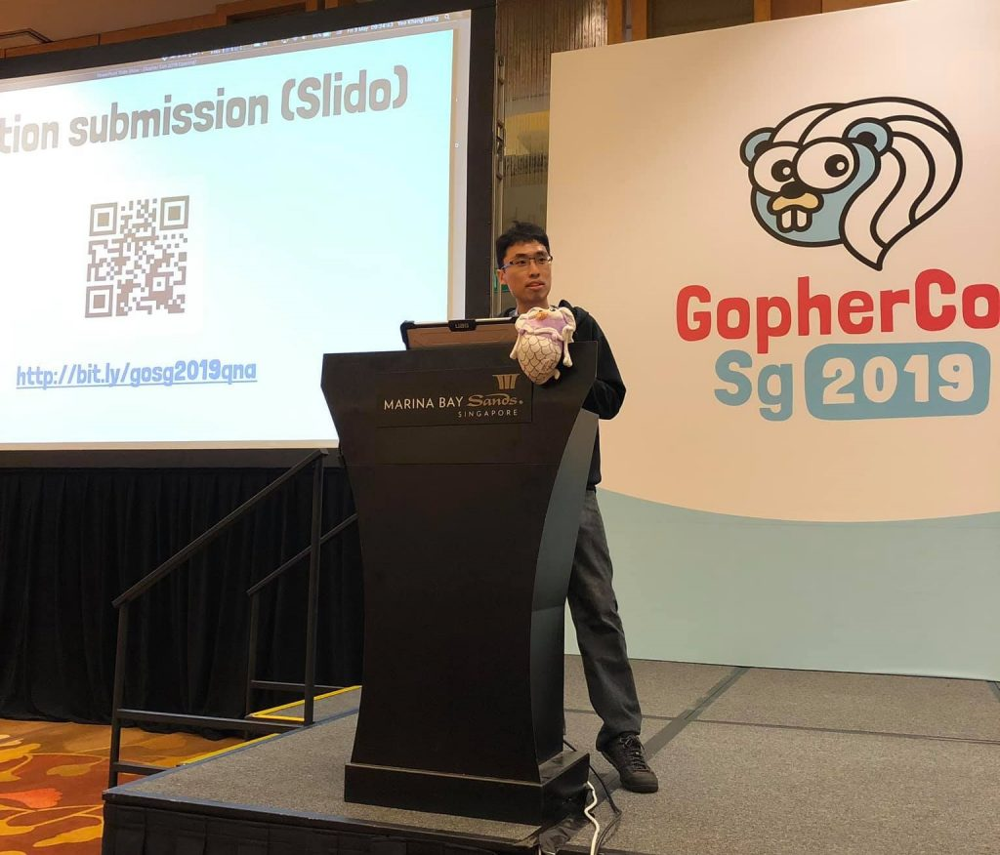
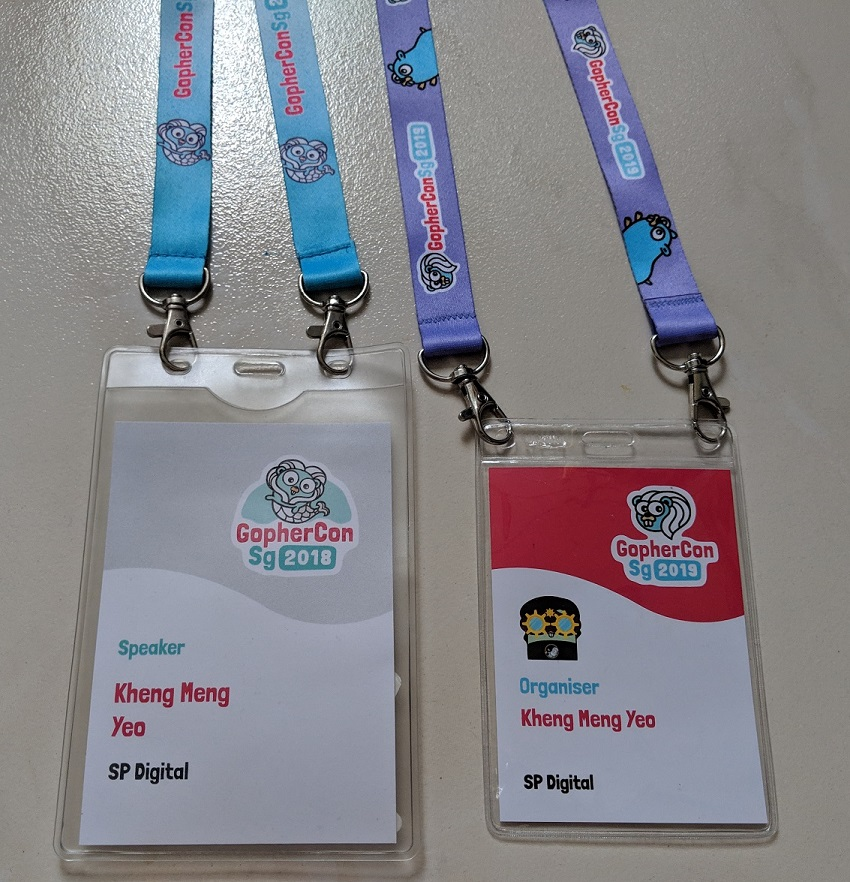
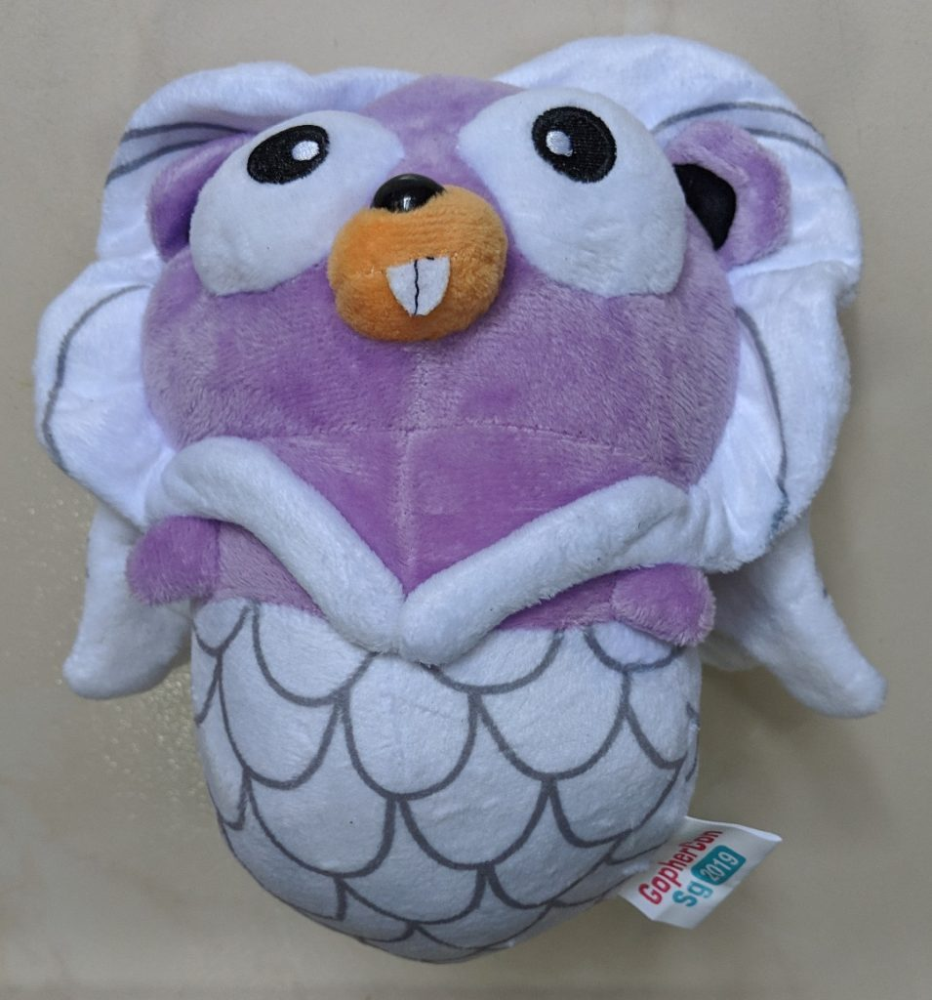
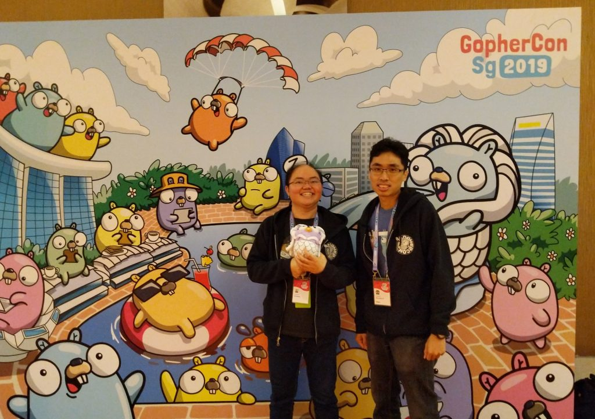
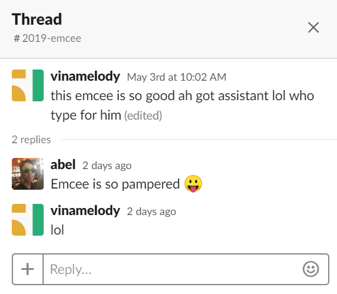
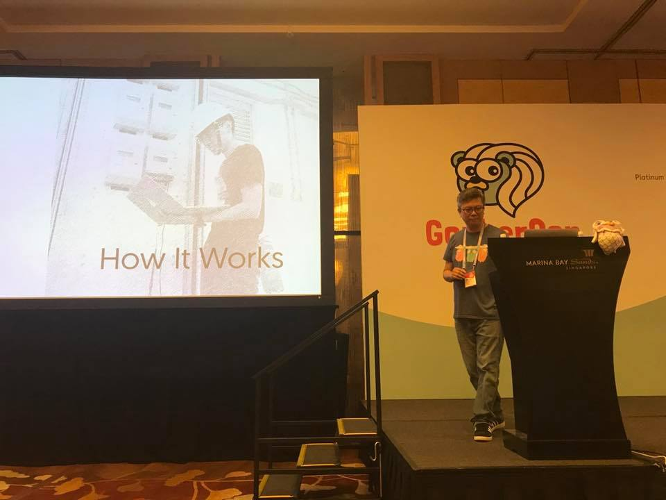
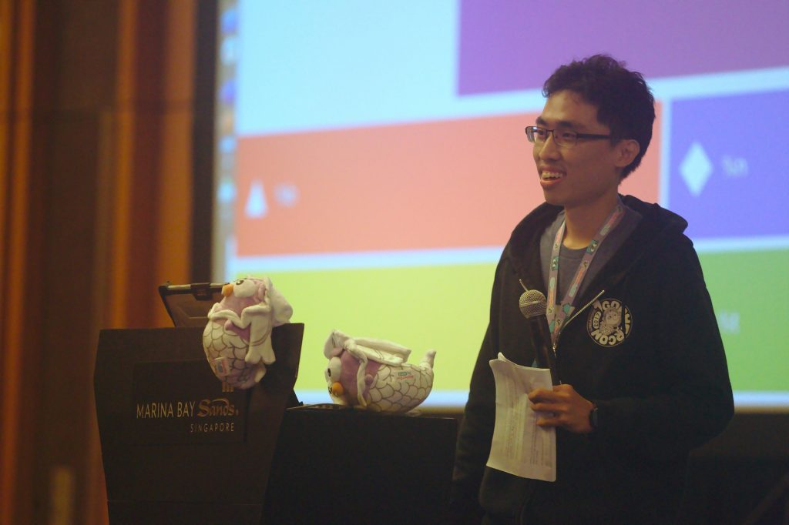

If you asked me 2 months ago whether I would be a conference emcee, the answer would be a clear no. But here 2 months later, I managed to pull off being the conference emcee at [GopherconSG 2019](https://2019.gophercon.sg/).

Making the initial welcome address to the audience before passing over to the Conference Chairperson Sau Sheong.

<!--more-->

I actually [was a speaker in last year GopherconSG 2018](https://www.youtube.com/watch?v=T82JttlJf60). I was also the [Engineers.SG](https://engineers.sg/) recorder for [GopherconSG 2017](https://2017.gophercon.sg/). So I've now completed the hat trick of being a recorder, speaker and emcee.

This is actually my second time performing the role as a conference emcee. You can read about my [first conference emcee experience at GeekcampSG 2017](/2017/11/my-first-conference-emcee-experience/) 1.5 years ago. That's a very long time ago and I felt actually quite rusty now. This time the stakes are higher, GopherconSG is a paid conference with higher expectations compared to the free Geekcamp.

# How I got involved?

2 months ago, I attended [March 2019 Hack && Tell meetup](https://www.meetup.com/Hack-Tell-Singapore/events/259328715/) where I met one of the key organisers of Gophercon, [Valentine](https://twitter.com/ValentineChua). A quick conversation somehow ended up with me agreeing to take up the emcee role as they still had yet to fill that position.

When I headed home that night, I was thinking to myself, "what did I just get myself into"? I already know from experience a conference emcee role is not a position that can be taken lightly. It is the most visible position of all the organising roles where any tiny thing you do or say wrong can be tightly scrutinised, misunderstood or blown out of proportion by any speaker or audience member who is zealous enough.

Anyway, another motivating factor for me to accept that role was that I could get FREE entry into the conference. The emcee is one of the few organiser positions where one can listen to all the talks.

# Preconference Preparation

Some people have the misconception that the emcee just has to turn up on the actual day itself, make the opening and closing speeches, do a couple of speaker introductions, maybe make a few announcements, then call it a day. So how hard can it be right?

Honestly, there are so many things that an emcee has to do beyond just going on stage and yakking away. In fact, I would venture to say a significant portion of the work to be an emcee starts off-stage way before the work on-stage.

## Attending organiser meetings

Not so much that I have to do much in those meetings. It's to listen out to key conference details that may come useful later. It's also helpful to know the origins of certain decisions that were made.

## Speaker introduction

I scripted each talk description to try to portray the speaker and the talk in the best light in the succinct manner. It's not just a matter of copying their talk description and personal profile from their talk proposals. Often times, such description were not made in a manner that is "announceable".

After that, I would attend the Speaker's Dinner the day before and go through with them individually if I can use those exact words to describe them and their talk. In fact, I had to make some corrections as there were some factual errors I made. Some speakers also have preferred words for their background description. One of the speakers also insisted that I mention "he has nice hair" :P

I also have to clarify the pronouncements of their names. If some of their last names are difficult for me to pronounce, I confirmed with them if I can just use their first names. Thankfully they were gracious enough to let me use this option.

## Time fillers

Technical problems, missing speakers, speaker underutilising their speaking slot are some reasons an emcee has to fill time. One can tell jokes, give extra background on the talks/speakers or quizzes. I personally prefer quizzes as one does not have to be funny. Regardless of the method chosen, everything has to be prepared beforehand.

Given the stress of the situation and my inexperience, I'm not at the level where I can come up with things on the fly.

## Prize winning Contests

Prize winning contests were suggested by my fellow organisers to inject some fun and audience participation. We used the [Kahoot.com ](https://kahoot.com/) as that has been used in past meetups before.  Here are some questions me and my colleagues came up with.

1. When was the first GopherCon Singapore? [May 2017 ](https://2017.gophercon.sg/)
2. In the Golang Tour Hello World program, what language is the word "world" in? [Mandarin](https://tour.golang.org/welcome/1)
3. According to Rob Pike: "The bigger the interface, ..." ?  [the weaker the abstraction.](https://go-proverbs.github.io/)
4. Who are the original designers of Go? [Robert Griesemer, Rob Pike, Ken Thompson](https://golang.org/doc/faq#history)
5. What is the format specifier to print a Boolean using Printf? [%t](https://golang.org/pkg/fmt/)
6. According to the Go 2018 Survey, what is the biggest challenge faced by developers? [Package management](https://blog.golang.org/survey2018-results)
7. Who designed the Gopher mascot? [Renee French](https://golang.org/doc/faq#gopher)
8. Since which version of Go is it self-hosting (compiles itself)? [1.5](https://golang.org/doc/go1.5)
9. Who said this “We are in the industry where we teach people how to write before we teach them how to read”? [Bill Kennedy](https://youtu.be/5DCdjxhBpTw?t=764)
10. What is the oldest x86 architecture supported by Go? [Pentium MMX](https://github.com/golang/go/wiki/MinimumRequirements)
11. Which language introduced the convention of using i,j,k as integer counters? [Fortran](https://stackoverflow.com/questions/4137785/why-are-variables-i-and-j-used-for-counters)
12. What is the Computing equivalent to the Nobel Prize? [Turing Award](https://en.wikipedia.org/wiki/Turing_Award)

You can tell I contributed most of the questions :)

Even the prizes of that purple Gophercon plushy had to be arranged beforehand.

So cute right?!!! We had limited quantities of those so they were only given out to speakers. The rest have to be given out sparingly.

## Opening and closing slides

Thanks to the previous emcee, I had access to the slide deck of the previous [GopherconSG 2018](https://2018.gophercon.sg/). These are some contents.

- Wifi
- Fire evacuation briefing. I actually followed the evacuation route so I know how to explain this
- Friday Prayers
- Parking Coupons
- Code of Conduct
- QnA submission
- After Party
- Sponsors

In fact, it seems like giving a conference lightning talk by its own right.

I made a mistake in the sponsorship slide. I placed SP Digital under the Silver section instead of Gold. Fortunately or unfortunately, luckily it's SP Digital and not another company.

# During the conference

Here are some of the key moments I faced on top of the task of introducing speakers.

## My assistant

I would have performed far worse without my assistant Vina who helped me. Many thanks to her for helping me to parse incoming messages meant for me and reply to them.

)

Yeah, I was really pampered. Anything that can help the emcee to take the load is appreciated in the conference. I already have the stress of going up to the stage and say things. So things like note taking, speaker management, time left alert if they can be offloaded would help a great deal. One thing I really appreciated her doing was writing announcements to a piece of paper then I'll use it to announce on stage.

On a side note, many thanks to the other volunteers as well for the speaker management and for helping me to collect food!

## Speaker missing in action

One of my most feared moments actually came true. One of the speakers did not turn up for the scheduled slot. I was really helpless for a moment and forgot that I needed to stall for time. My decision to bring out my quiz was made quite late and I could only squeeze one question out. That moment felt like an eternity and I could have appear less fluttered then.

## Special mention in Sau Sheong and Rully's talk

<blockquote class="twitter-tweet" data-lang="en">
Spoke about Controlling Distributed Energy Resources with Edge Computing and Go at <a href="https://twitter.com/hashtag/GopherConSG?src=hash&amp;ref_src=twsrc%5Etfw">#GopherConSG</a> with <a href="https://twitter.com/rullyadrian?ref_src=twsrc%5Etfw">@rullyadrian</a>, featuring <a href="https://twitter.com/yeokm1?ref_src=twsrc%5Etfw">@yeokm1</a> as the emcee and slide divider model! <a href="https://t.co/1WAzBYc0SF">pic.twitter.com/1WAzBYc0SF</a>
— Sau Sheong (@sausheong) <a href="https://twitter.com/sausheong/status/1124228012277243906?ref_src=twsrc%5Etfw">May 3, 2019</a></blockquote>

Today I learned there is such an impromptu term like a "slide divider model".

Here is the slide that "featured" me. The original photo can be found in this blog post [SP Digital 2018 in review](https://blog.spdigital.io/2018-in-review-e22263a3b0e1) written by Sau Sheong.

When Rully came up to that slide, I was suspecting something would be said about me and it was true lol. It was blurred so I doubt the audience would have recognised me unless it was pointed out.

## Announcements

There were several announcements I had to make some funny some serious

1. Lost Debit card
2. Reminders for Friday prayers
3. T-shirt supplies
4. Lost ezlink card
5. Lunch quiz to win plushies

## Rude questions to speaker

We used the [Slido app](https://www.sli.do/) to get questions from the audience and let the speakers choose the questions to answer during their QnA session. This is to save time for the audience member to go up to the microphone and also to allow the speaker to answer the questions he/she is most comfortable with.

During one of the talks, the only questions a speaker got were rude ones. I elected to be honest and show the speaker the questions but heavily emphasised that she can choose not to answer them. In the end she did not answer any.

In hindsight though, I'm still not sure whether I should have showed those rude questions to her in the first place and pretended she had no questions.

# To be improved

I got the following feedback

- Don't give the introduction to quickly and leave speaker while he/she is still setting up. I got this feedback as this action makes the speaker look bad.
- Proof read opening/closing slides. Mixing up sponsorship levels can have worser consequences
- Avoid reading speaker description word from word from my notes. More eye contact with audience helps.
- Remember to thank the speakers. I failed to thank the speakers at the end of their talks most of the time
- Be more expressive during the Kahoot quizzes. I was clicking through the Kahoot quizzes as if I was the one taking the test. I should congratulate the intermediate winners more.
- Be more equitable in speaker time allocation. Following the conference schedule is important, but that should not come at the expanse of allowing more benefit to one speaker vs another. A speaker should not have to speak less through no fault of his own just because I want to get the conference on track.
- If I have to use a notepad, use a smaller one instead of just folding an A4 paper.

That A4 paper is a bit too large...

# Conclusion

Being a conference emcee is expectedly tiring. I have to be on top of my game throughout the entire day. Just like my GeekcampSG 2017 experience, I was mentally drained by the time I reached the afterparty. My introverted self was further aggravated and I hardly wanted to talk to people at first.

The above aside, being an emcee provides a truly great learning and rewarding experience. It affords some a certain level of creativity, pushes you out of your comfort zone and hones one's impromptu public speaking skills which I feel I still need improvement at this point.

It's helpful to remember that other than the emcee, lies all the other volunteers behind the scenes. Those deserve thanks as well.
