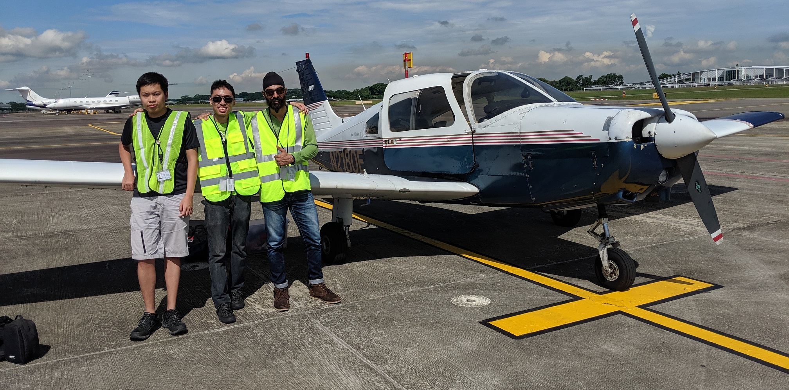
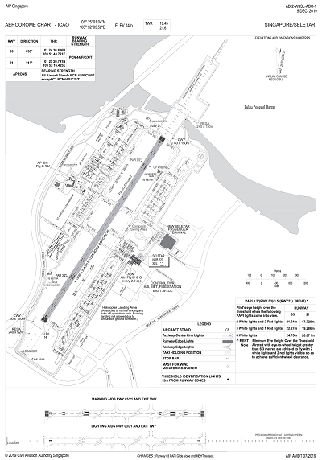
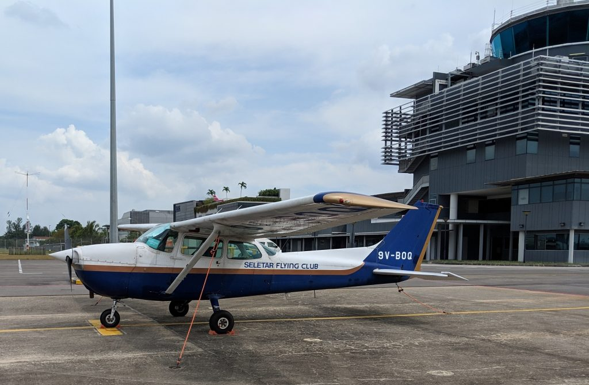
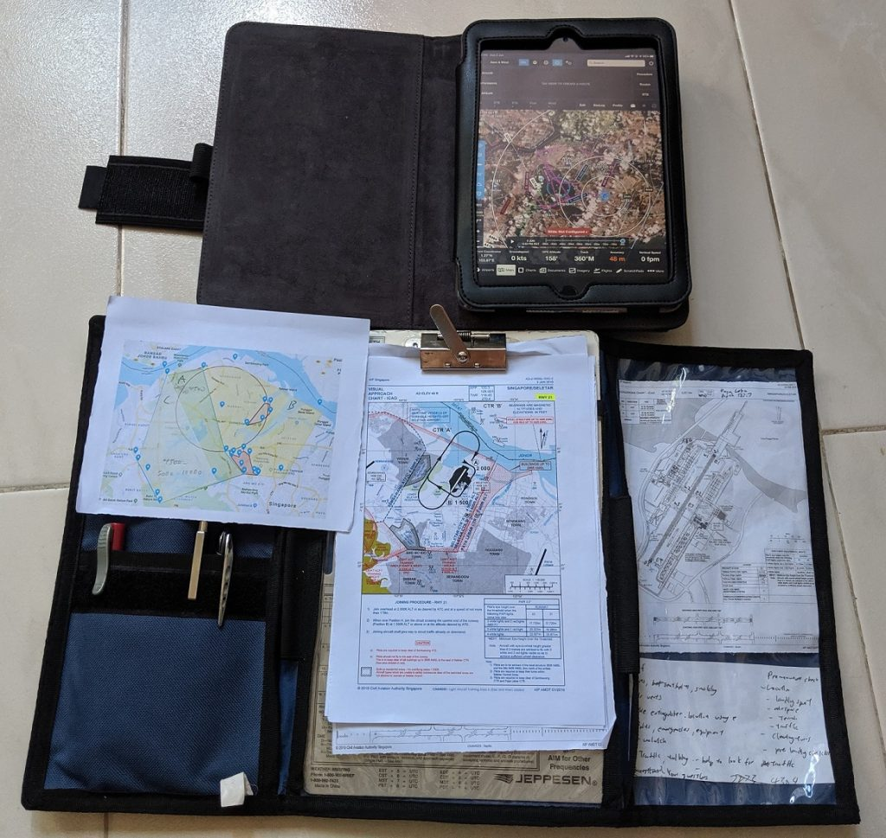
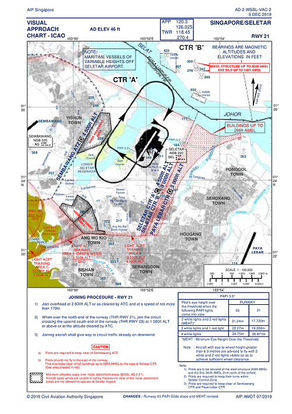
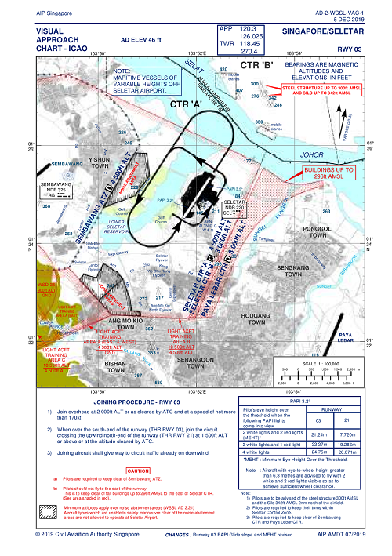
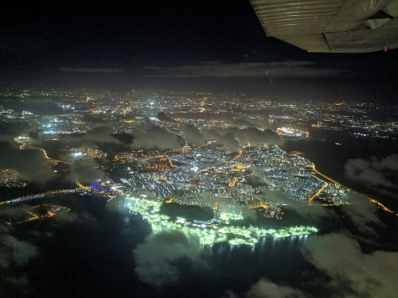
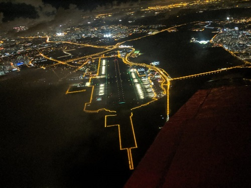
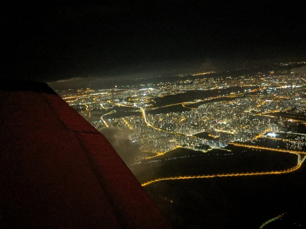

Having [obtained my FAA PPL earlier this year](/2019/02/i-became-a-private-pilot-and-this-is-my-story-part-1-2-in-singapore/), I decided to join [Seletar Flying Club](http://www.seletar-flying-club.org/) (SFC) to maintain my flying proficiency and to also rent aircraft to bring friends and family up to the skies.

Before I can rent SFC's planes to fly others, I have to complete a checkout flight with the club's instructor to familiarise myself with SFC's planes as well as the Singapore's airspace and local procedures at Seletar Airport.

From left, SFC's instructor Eric, myself and my training buddy Davinder when I was in the US.

After all, my knowledge have all been based on the way the Americans (FAA) do things which will likely differ from how Singapore (ICAO) work.

This blog post was originally meant for my personal notes for how does a General Aviation pilot fly within Singapore from Seletar Airport but I thought why not share it as well as such information seems to be quite scarce online. I'll also try to list out the differences I learned between FAA and ICAO style.

<!--more-->

# Video of my flight

In this checkout flight, Eric taught me the local procedures as well as how to operate the Piper Warrior as I trained on the Cessna 172R. I would fly the plane out to the training area, do the private pilot maneuvers and return to Seletar Airport.



Here are the key procedural moments I was taught to execute.

- 00:00:00 - Procedures to prepare and start the plane
- 00:14:16 - Calling Ground
- 00:16:45 - Start the taxi
- 00:21:00 - Runup
- 00:25:22 - Calling Tower ready for departure
- 00:26:00 - Cleared for takeoff
- 00:28:11 - Right turn after passing SLE
- 00:28:50 - Switching to Paya Lebar Approach
- 00:30:39 - Start turning North soon to avoid exceeding practice area
- 00:35:20 - Pre manuever
- 00:38:18 - Slow Flight, stalls, steep turn, engine failure drill
- 01:03:35 - Request rejoin Seletar
- 01:04:44 - Rejoin Seletar
- 01:05:33 - Switching Frequencies to Seletar
- 01:05:50 - Contact Seletar Tower
- 01:08:25 - Reported overhead. My sucky reply as I mistaken the reply. Descending
- 01:10:25 - Descending to crosswind for first landing
- 01:11:10 - Calling downwind
- 01:13:00 - Turn base
- 01:13:57 - On finals for first landing in 4 months
- 01:14:55 - Touch and go
- 01:17:16 - On 2nd downwind
- 01:19:20 - Turning to final
- 01:20:00 - Going around
- 01:23:50 - Cleared to land
- 01:25:00 - Second-last full stop landing
- 01:26:00 - Request taxi back for taxi
- 01:38:32 - Line up for final takeoff
- 01:44:24 - Report final
- 01:44:50 - Cleared for final landing
- 01:47:20 - Request taxi to stand

# About Seletar Airport (WSSL)

Seletar Airport (WSSL) is Singapore's only general aviation airport. The others like Changi is only meant for fast jet traffic and the rest are all military airbases. It is located in the North East area of Singapore.

Seletar Airport data as well as data for other local airports can be found at [CAAS Aeronautical Information Publication & Amendments website](https://www.caas.gov.sg/legislation-regulations/guidelines-advisory/air-navigation-services/aeronautical-information-publication-amendments). A navigable html version can also be found [here](https://aim-sg.caas.gov.sg/eaip.html).

Here are WSSL details:

- 1 runway 03-21, **1836m** x 46m (**6023** x 151 feet)
- 03 PAPI: 3°, 21 PAPI: 3.5°
- Field elevation **14m (46 feet)**
- Circuit altitude (Traffic Pattern): 800 feet
- Left Pattern for 03, Right Pattern for 21
- Tower Frequency: 118.45 Mhz
- Ground Frequency: 121.6 Mhz
- Ground radio check Frequency: 122.9 Mhz
- ATIS Frequency: 128.425 Mhz

Notice that everything is given in meters whereas it is feet in the US.

SFC's aircraft are typically parked at stand A50 - A58 near the control tower.

Security is pretty tight at WSSL. So everybody who enters the airside area has to have a season pass or visitor pass (escorted by a season pass holder). Visitor pass typically takes 5 working days to register. More details on pass registration can be found [here](http://www.seletarairport.com/pass-application-procedure.html).

General aviation is not as impromptu as in the US where one can take off anytime you want. A departure has to be arranged with the airport the day before for every flight.

# Preparing for a flight to the training area

During my Private Pilot training, I was taught the NWKRAFT acronym.

Standing by all relevant helpful documents in my kneeboard. Training area map, airport joining procedure and airport map. I'm using Foreflight to help me ensure I stay within the training area.

- NOTAMs/TFRs: [CAAS NOTAMS website](https://www.caas.gov.sg/legislation-regulations/guidelines-advisory/air-navigation-services/notam-list) that is updated monthly. Temporary stuff like NDP airspace closures can be found at [Aeronautical Information Publication Supplements](https://www.caas.gov.sg/legislation-regulations/guidelines-advisory/air-navigation-services/aeronautical-information-publication-supplements).
- Weather: It seems like [aviationweather.gov has Seletar info](https://www.aviationweather.gov/metar/data?ids=wssl&format=decoded&hours=0&taf=on&layout=on).
- Known ATC Delays: Not sure about this
- Runway lengths: See previous section
- Alternates: No real alternative to WSSL except in an emergency in which case the most likely diversion airport is Paya Lebar Airbase (WSAP)
- Fuel Requirements: To be calculated
- Takeoff/Landing Distances: To be calculated

Weight and balance data were provided by SFC for my calculations.

## Alternate: Paya Lebar Airbase (WSAP)

In an emergency, for example if Seletar Airport is closed due to say, runway problems, WSAP is stated as an "Alternate/Emergency Diversionary Aerodrome for Singapore"

> Actual emergency or diversion will be accepted at 30 min notification.
> 
> #### WSAP AD 2.3 OPERATIONAL HOURS

More details can be found from this [link](https://aim-sg.caas.gov.sg/aip/2020-03-26-Non-AIRAC/final/2020-03-26-Non-AIRAC/html/eAIP/AD-2.WSAP-en-GB.html).

# Departure process

## Listening to ATIS

Seletar ATIS is now operational as of June 2020.



After listening to ATIS, can make the ground call.

## Request engine startup

Requesting engine startup is mandatory for an international flight as you may need time to be cleared via ATC. It is however optional for a local flight. Nevertheless, I generally do this out of habit even for local flights.

> Seletar Ground, N2180E, request engine startup, I'm at stand A51 with 4.5 hours, 3 POB, heading to area A/B/C with Information Bravo

Once startup is approved, I start the engines and call for taxi when ready.

## Ground call ready for taxi

> N2180E, ready to taxi.



00:07 - ATIS Information Bravo (testing mode)  
01:34 - Engine start request  
08:46 - Ready to taxi  

> Seletar Ground, N2180E, request taxi for departure to A training area, 4.5 hours endurance, 3 POB (people on board) at stand A51 (optionally can say with Information XYZ)

Apparently I have to provide the endurance and persons on board which I don't have to in the US.

At this point, the Ground may tell us the altimeter setting which is in QNH 10XX which is different from the US of inches of mercury.

In the US, I can use a callsign like "Piper 2180E" and the abbreviated callsign is "80E". However the ICAO abbreviated standard is "N0E".

## Request takeoff clearance

Once I have completed the runup, I have to switch over to Tower to request for Takeoff clearance. In the US, I can just switch to Tower directly. However, here I have to tell Ground that I'm switching.

Me: N2180E switching to tower 118.45

Gnd: Roger...

Me: Seletar Tower, N2180E, holding at E1, ready for departure to Area A or Area B/C via A or Area B/C via overhead climb

Tower: Line up runway 21

**Wait for red stop bar lights to be off before entering runway.**

Tower: N2180E, surface wind is X at X, runway 21 clear for takeoff.

# Training Area

Official information of the light aircraft training areas and procedures can be found in [eAIP ENR 5.2](https://aim-sg.caas.gov.sg/aip/2020-03-26-Non-AIRAC/final/2020-03-26-Non-AIRAC/html/eAIP/ENR-5.2-en-GB.html#ENR-5.2).

>1.1 The airspaces designated as Light Aircraft Training Areas are for Local Flying and Training purposes. Flights are to be conducted during DAYLIGHT hours and in VMC ONLY. The Training Areas are uncontrolled airspaces. It will be the responsibility of pilots to maintain adequate separation with other aircraft including those operating in the Seletar and Sembawang aerodrome circuits. All aircraft are to operate strictly within the designated areas and not to stray out of the areas or intrude into adjacent controlled airspaces.
>
>1.2 Aerobatics and test flights are prohibited in Light Aircraft Training Areas A, B and C.
>
>1.3 The provision of FIS is the responsibility of Paya Lebar Approach. However, due to the nature of training operations carried out, position and altitude of aircraft will not be made available. The only information that can be provided to pilots will be the number of REPORTED aircraft within the areas concerned.
>
>1.4 On receipt of the relevant information, it shall be the responsibility of the pilot to decide whether his intended flight can be carried out safely in view of the prevailing air traffic.
>
>1.5 To enable Paya Lebar Approach to maintain an accurate record of aircraft operating in the areas and to disseminate up-to-date information, all pilots must report entering and leaving the Training Areas to Paya Lebar Approach.
>
>1.6 Pilots of all aircraft operating within the areas are required to keep a listening watch on the appropriate Paya Lebar Approach VHF/RT control frequency 127.7 MHz.
>
>1.7 All flights in the Training Areas are to be conducted on Singapore QNH. This value can be obtained from Paya Lebar Approach.
>
>1.8 In the interest of flight safety, aircraft operating in Light Aircraft Training Area A are advised to make a broadcast on the controlling frequency specifying their callsign and position when climbing or descending through 2,000ft.

## Area Boundary

A map of the training area boundaries was provided to me by SFC.

Area A (Blue): Surface to 4500 feet

Area B (Yellow): 4500 to 10500 feet

Area C (White): 4500 to 10500 feet

The red circle indicates Sembawang Air Base Control Zone of 4500 feet and below. The shaded area in red denote HDB flats which we cannot fly overhead unless we are at least 1500 feet altitude.

## Entering Training Area

### Entering Area A or Area B/C via A

The tough part was the climbing entry to the A training area after takeoff especially from runway 21. The aircraft is still climbing at that point at less than 1500 feet altitude. So we have to squeeze between the red HDB area and the Sembawang Air base control zone.

I was taught by Eric to do the following:

### Flight Path:

1. Circuit departure
    - For runway 21, make right crosswind departure so start turning when I reach a safe altitude of 500 feet
    - For runway 03, make left downwind departure.
2. Follow the SLE to avoid the HDB
3. After clearing the HDB, point towards Bukit Timah hill

### Radio work for entering Area A :

1. Contact Seletar Tower to report switching to Paya Lebar Approach 127.7
2. Switch to Paya Lebar approach. "Paya Lebar Approach, N2180E, entering area A (for climb to B/C)"
3. Paya Lebar Approach will inform us about the traffic in the area, QNH value and tell us to report established
4. After entering area A, tell Paya Lebar Approach that I have established area A

At this point, we are probably nearing the left and bottom boundary of area A. The BKE somewhat marks the left boundary of the training area so I should turn North before reaching the BKE. Take care not to cut into Sembawang airspace.

On a regular basis, Eric reported to Paya Lebar approach "Ops normal, at X altitude". This also helps alert the other traffic in the area monitoring the frequency.

If we want to climb to B or C training area, I have to "Request B C" and get approval before climbing. Once reach Area B/C, report established Area B/C.

### Entering Area B/C via overhead climb

It's possible to enter Area B/C by doing a shuttle climb above Seletar.



11:37 - Ask for takeoff clearance to go to Area B/C via overhead climb  
12:22 - Cleared for takeoff 03, report passing 4000 feet  
20:25 - Passing 4000 and switching to Paya Lebar Approach  

# Leaving training area to rejoin Seletar

Once done in the training area, we have to tell Paya Lebar approach that we want to go back. Start heading towards Seletar and circle around catchment area between Seletar and Bukit Timah hill until cleared to rejoin.

Me: Request rejoin Seletar.

PL Aprch: Standby for join...

...

PL Aprch: Rejoin overhead at X altitude for runway X report switching

...

Me: Switching...

# Arrival process

The arrival process in Seletar is different from what I was used to in the US. In the US, planes usually join at 45° to the downwind. In Seletar, planes join overhead then descend to circuit altitude after cleared by Tower.

Me: Seletar Tower, N2180E, joining overhead at X (altitude), for runway X

WSSL Twr: Join overhead at X (altitude), runway X, QNH 10XX, X in the circuit...

Me: (State request like landing or circuits)

## Circuit Joining Procedure from Area A

There are 2 joining procedures depending on the assigned runway.

### Runway 21

1. Join overhead at 2 000ft ALT or as cleared by ATC and at a speed of not more than 170kt.
2. When over the north-end of the runway (THR RWY 21), join the circuit crossing the upwind south-end of the runway (THR RWY 03) at 1 500ft ALT or above or at the altitude cleared by ATC.
3. Joining aircraft shall give way to circuit traffic already on downwind.

### Runway 03

1) Join overhead at 2 000ft ALT or as cleared by ATC and at a speed of not more than 170kt.
2) When over the south-end of the runway (THR RWY 03), join the circuit crossing the upwind north-end of the runway (THR RWY 21) at 1 500ft ALT or above or at the altitude cleared by ATC.
3) Joining aircraft shall give way to circuit traffic already on downwind.

## Circuit Joining Procedure from Area B/C

It's possible to do an overhead descent from Area B/C into Seletar.



In this video, I request to join Seletar from an altitude of 10000 feet which is the highest permitted in Area B/C.

- 32:47 - Request overhead descent to Seletar
- 33:18 - Descend overhead, report passing 5000. Commence PFL from here.
- 34:05 - Realised I forgot to say PFL earlier. So tell Paya Lebar Approach again.
- 39:35 - Passing 5000, contacting Seletar Tower

## Common Downwind Procedures

1. Turn towards downwind and report to tower "In the downwind"
2. Tower will tell us we are number X in the circuit
3. Turn base and check finals clear before turning finals then report "on final"
4. Tower will then tell us "continue approach/cleared to land/go around" and follow accordingly.

In the US, the Tower controllers will tell us the precise position of other aircraft in the circuit/pattern. For WSSL, the controllers do not which makes it tough to locate the other traffic. US Tower controllers may also proactively clear us for landing early instead of waiting until you tell them you are on finals.

### Custom ATC instructions

The joining procedures listed above are the typical ones. However those procedures may differ depending on the custom instructions given by Seletar Tower. Here is one where I descended directly to the downwind of runway 21 instead of joining overhead.



41:05 - Switching to Seletar. Join direct downwind for runway 21  
42:20 - Descend to circuit altitude

# Taxing back to stand

Tower: Vacate via X and contact Seletar Ground 121.6

Switch to Ground frequency

Me: Seletar Ground, N2180E, at X request taxi to Stand

Ground: (Taxi instructions)

# Conclusion

The extremely claustrophobic training airspace means one have be at the top of their game to not exceed the boundaries. The extremely hot and humid Singapore weather also added to the difficulty. These factors made me so glad to say I was quite fortunate to be able to do my training in the US with cooler weather and larger training areas.

Most importantly though, I felt this 2 hours felt like a cramped refresher of a private pilot training. After not flying for so long, I felt really rusty already. It makes me have a greater urge to fly more often to maintain my skills proficiency and bring up people at the same time to experience the romance of aviation! (And save me $$$ too :P)

GA flying in Singapore seems to have many administrative overheads like registering visitors, departure slots and landing fees. One cannot just simply hop into a plane and takeoff as and when you like. Nevertheless, this is Singapore and one has to abide by the rules.

# Night

This is a bonus section. I had a great opportunity to backseats night flight. The training areas are closed at night which means one can only do circuits over WSSL. Here are 2 great videos!



Watching a landing. Marvel at the runway lights...



We were asked to hold at 4000 feet within Seletar Control Zone to let the jet takeoff and clear the area. It's rare as even in the day, planes in the control zone have to vacate to make way for jet operations.

At 4000 feet

WSSL at 3000 feet

HDBs at 3000 feet.

Truly unforgettable. In terms of seeing Singapore through your naked eyes, it just doesn't get better than this.