I told a friend I was heading to Malacca over the weekend. Asked how I was going there. Car? Bus? Train? Don’t tell me boat? How about PLANE!

Seletar Flying Club (SFC) had a navigation trip planned for Malacca and back on 13 July 2019. For this trip, I had a "heavily-subsidised" backseat ride on a modern air-conditioned [Diamond DA-40](https://en.wikipedia.org/wiki/Diamond_DA40).

I will then fly the return trip on SFC’s Piper Warrior under the guidance of safety pilot Dr Fadzil! I was eager also as I have not flown a cross-country flight since I finished my PPL.

This was an opportunity that I couldn't refuse.

# The Plane!

[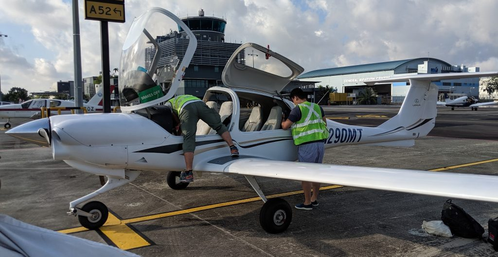](images/malacca-flight-preflight.jpg)

The pilot SFC president Wei Siang and safety pilot Jason doing the preflight-inspection of the sleek plane while I just observe.

<!--more-->

[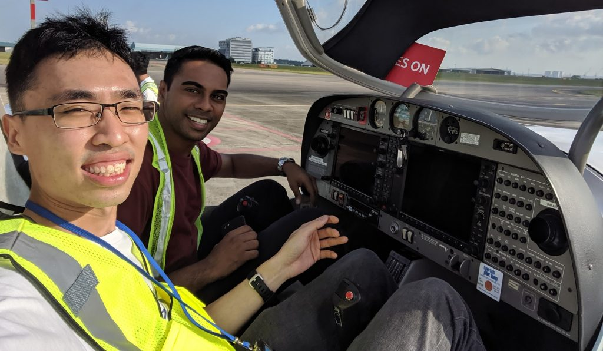](images/malacca-flight-pretend-pilots.jpg)

Fellow SFC member Vikram and I pretending to be pilots of this plane. The DA-40 uses modern glass-cockpit instrumentation instead of the steam-gauges I have been using all this while.

[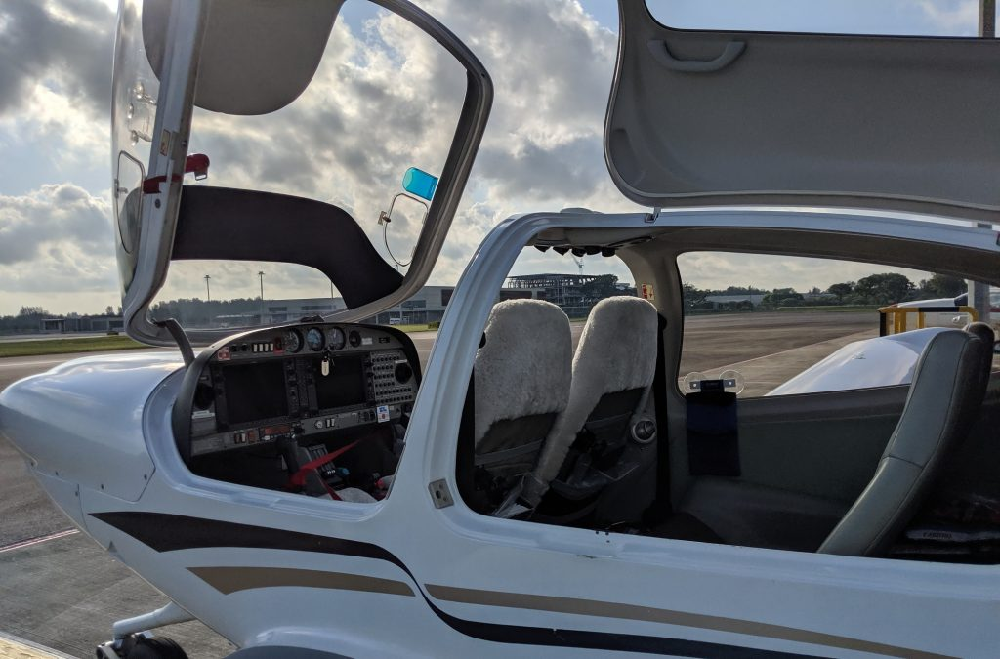](images/malacca-flight-cockpit.jpg)

This plane N290MT was [manufactured in 2005](http://www.aviationdb.com/Aviation/Aircraft/2/N290MT.shtm) which is a actually very young in the General Aviation world.

In addition to N290MT, SFC's 9V-BOQ and N2180E also took part in this navigation exercise. I would fly N2180E in the return leg.

# Seletar (WSSL) to Malacca (WMKM)

After the necessary preflight operations, we took off from Seletar around 9.30am in the morning .



[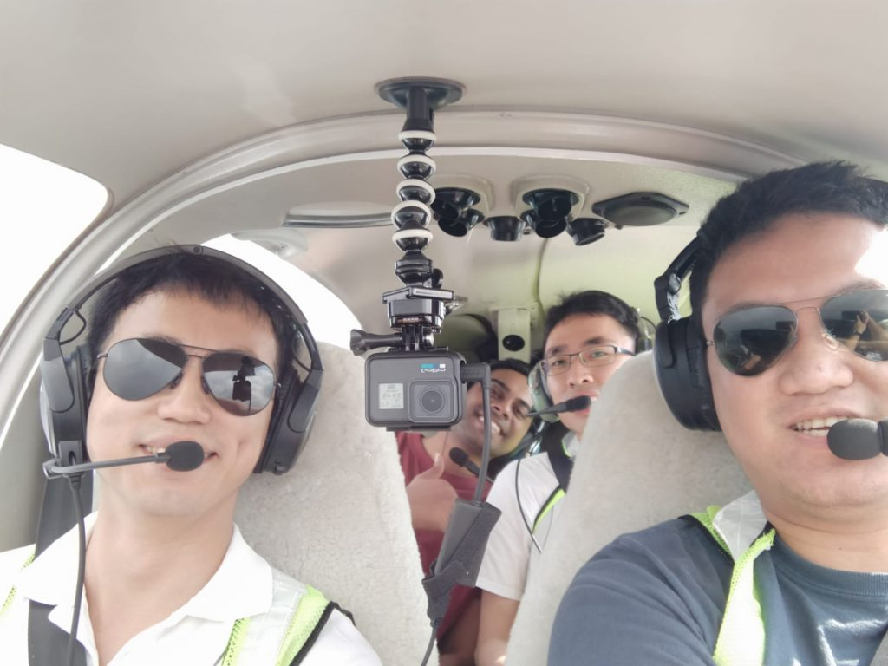](images/malacca-flight-da40-ppl.jpg)

A full load of 4 POB!

[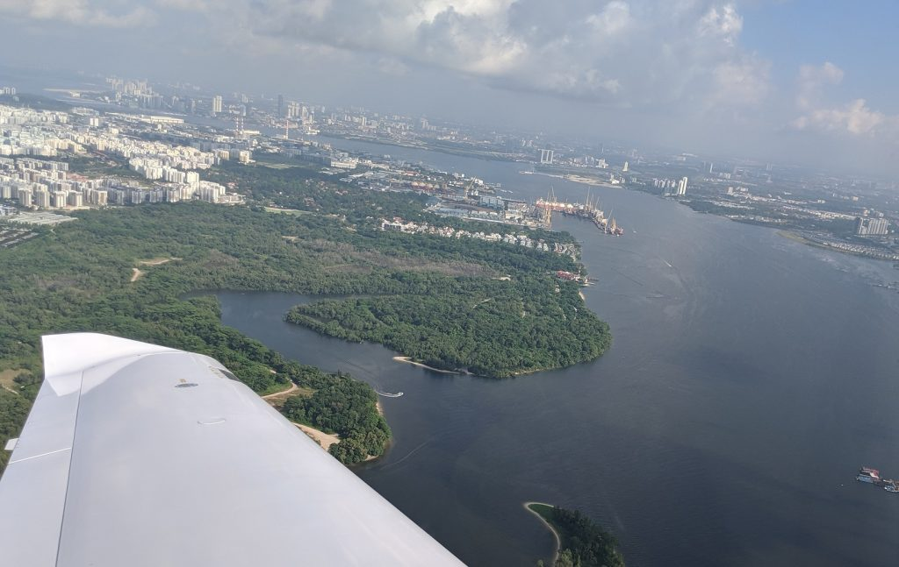](images/malacca-flight-leaving-sg.jpg)

First time leaving Singapore in a General Aviation plane.

## Route from WSSL to WMKM

[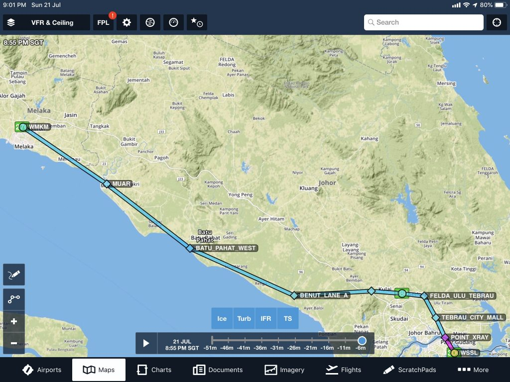](images/malacca-flight-wssl-wmkm-foreflight.jpg)

According to the flight plan filed by the club, this is the route as plotted out in Foreflight. Someday I would want to learn how to file my own.

The route between Senai Airport (WMKJ) and Seletar Airport (WSSL) is set down by CAAS Aeronautical Information Publication (AIP). CAAS eAIP link [ENR 1.10 FLIGHT PLANNING](https://aim-sg.caas.gov.sg/aip/2020-03-26-Non-AIRAC/final/2020-03-26-Non-AIRAC/html/eAIP/ENR-1.10-en-GB.html#ENR-1.10t)**.**

> 1.1.6 VFR flight operating between Seletar and Johor Bahru shall route via Point X (012830N1034954E), Tebrau City Mall (013259N1034748E), Felda Ulu Tebrau (013751N1034510E) and vice versa.
> 
> **_ENR 1.10 FLIGHT PLANNING, 1 PROCEDURES FOR SUBMISSION OF A FLIGHT PLAN_**

[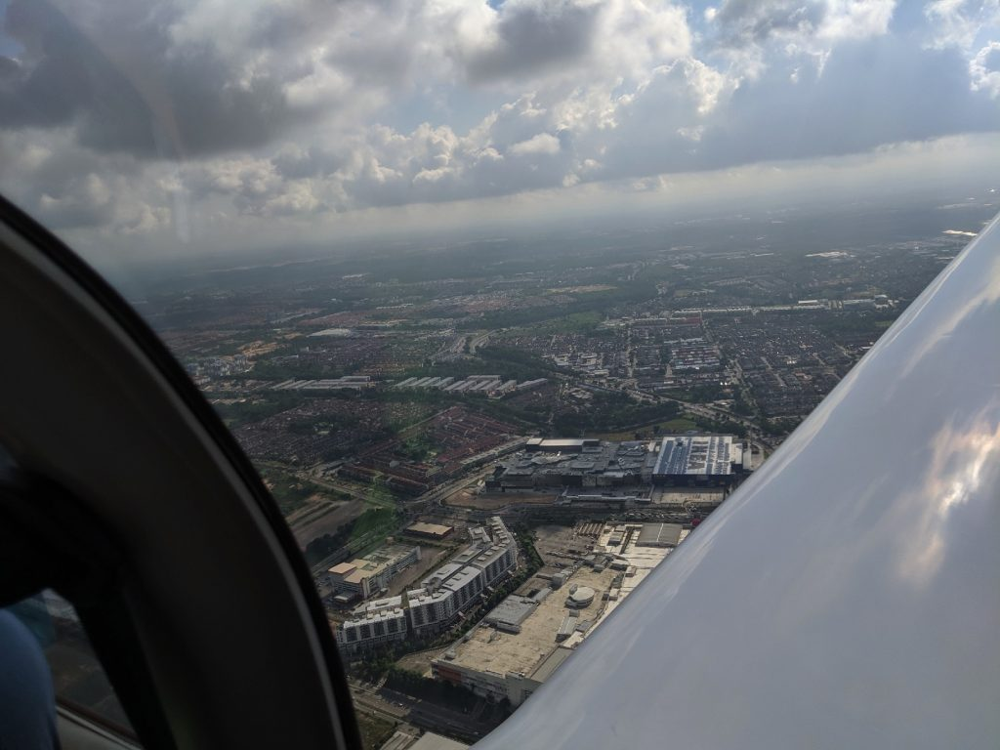](images/malacca-flight-tebrau-ikea.jpg)

The IKEA building actually overshadows the visual landmark Tebrau City Mall we are supposed to use.

The route from Senai (WMKJ) to Benut and along the coast through Batu Pahat and Muar is known as VFR Lane A.

> 3.5.9.1.1 VFR LANE ALPHA: Coastal - 1500FT - Benut - Kuai Tol Plaza - University Technology Malaysia (UTM)
> 
> **3.5.9.1  Lane description, 3.5.9  VFR LANE SYSTEM - JOHOR BAHRU CONTROL ZONE AND TMA**

DCA eAIP link [ENR 3.5 OTHER ATS ROUTES](http://aip.dca.gov.my/aip/eAIP/2020-03-26/html/eAIP/WM-ENR-3.5-en-MS.html#ENR-3.5).

## Landing at Malacca Airport

[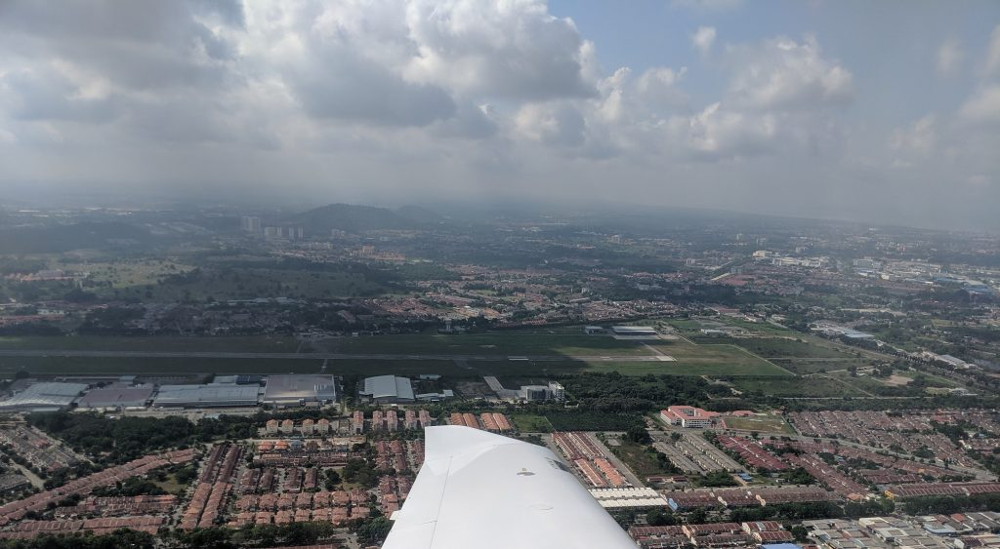](images/malacca-flight-downwind-1024x563.jpg)

In left Downwind of runway 03 preparing to land.



Landing on Runway 03 of WMKM

[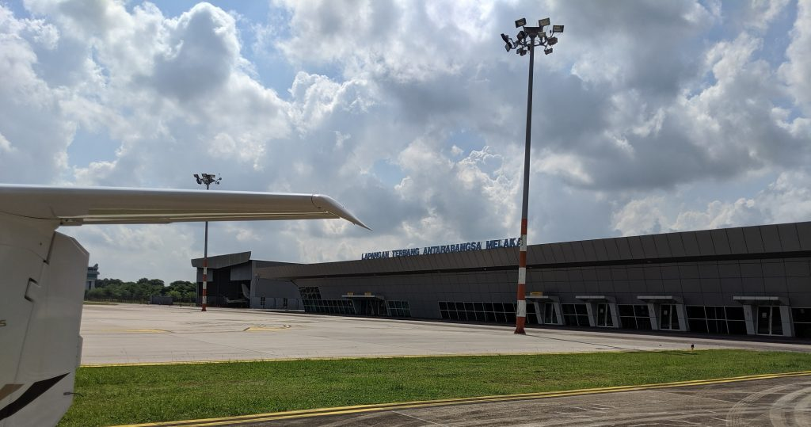](images/malacca-flight-malacca-airport.jpg)

Customary Photo of the Airport

SFC's 9V-BOQ is probably the most heavily-utilised General Aviation plane in Singapore.

[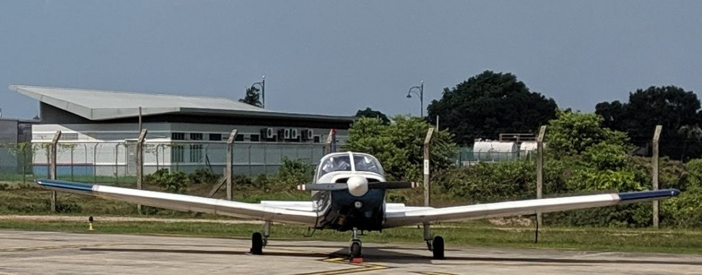](images/malacca-flight-n2180e.jpeg)

I would fly the Piper Warrior N2180E on the return leg.

## Details of Malacca International Airport (WMKM)

DCA AIP details of Malacca Airport can be found [here](http://aip.dca.gov.my/aip/eAIP/2020-03-26/html/eAIP/WM-AD-2.WMKM-en-MS.html#AD-2.WMKM).

[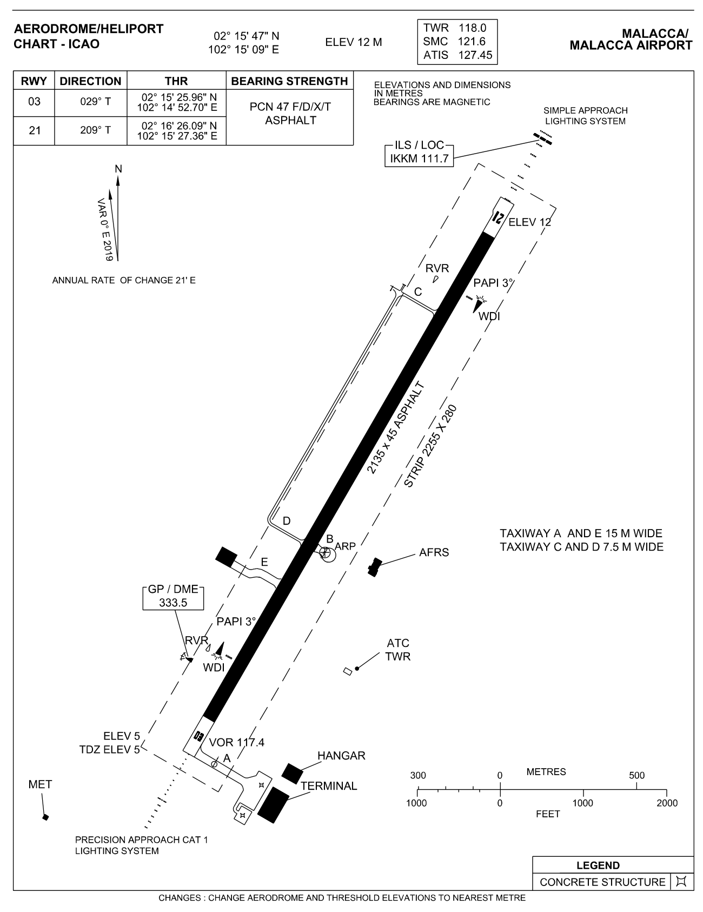](images/malacca-flight-wmkm-map.png)

- 1 runway 03-21, 2135m x 45m
- 03-21 PAPI: 3°
- Field elevation 12.1m (40 feet)
- Circuit altitude (Traffic Pattern): 1000 feet
- Left Pattern for 03, Right Pattern for 21
- Tower Frequency: 118.0 Mhz
- Ground Frequency: 121.6 Mhz
- ATIS: 127.45 Mhz

This airport shares many similarities with Seletar Airport [which I wrote about earlier](/2019/06/notes-on-flying-in-wssl-and-sg-training-area/). Same runway direction, same traffic pattern, same ground frequency, almost the same tower frequency and field elevation.

# The $100-dollar burger

The [$100 dollar is an aviation slang](https://en.wikipedia.org/wiki/$100_hamburger) from the US of making an aviation excuse to fly somewhere to have a meal.

Given the higher costs of aviation in Singapore. It costs way more than $100 for me though.

[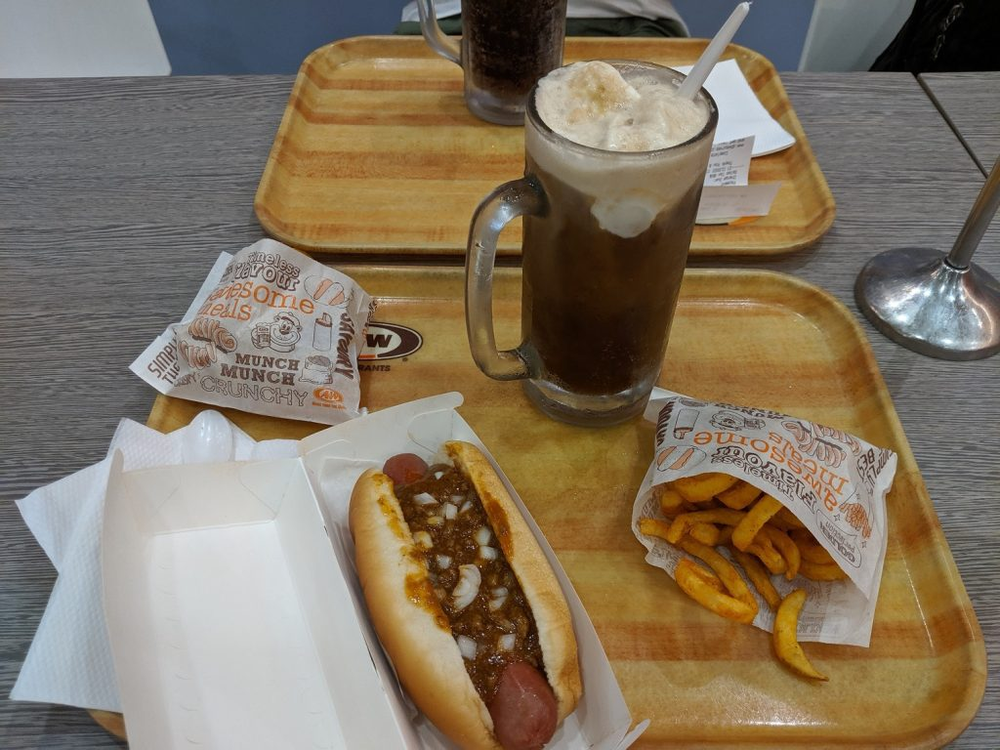](images/malacca-flight-anw.jpg)

Most expensive A&W I would eat so far.

[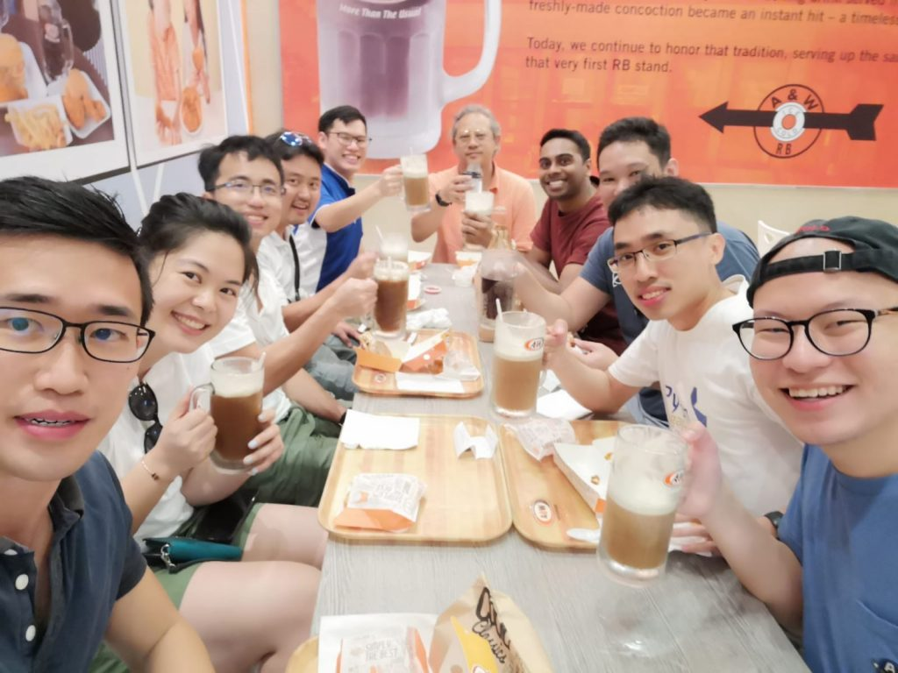](images/malacca-flight-group-photo.jpg)

Great to travel in the company of pilots.

# Malacca (WMKM) to Senai (WMKJ)

In the return trip, I would fly the Piper Warrior with safety pilot Dr Fadzil since this is my first time I'm doing so and am unfamiliar with the route and procedures.

We would make a fuel stopover at Senai in Johor as we are cheapskates and want to save money by using cheaper fuel just like typical Singaporean car drivers.

What a rare sight to see an Antonov and coaxial-rotor Kamov KA-32.

[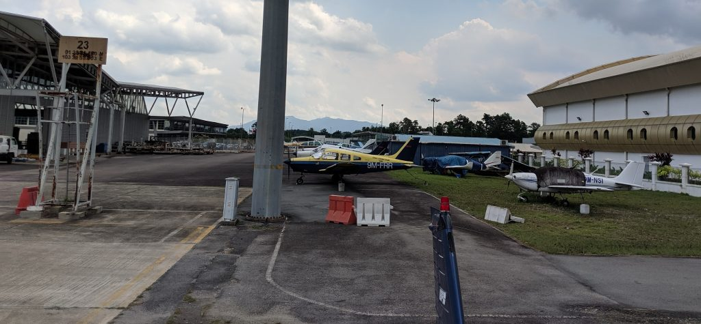](images/malacca-flight-senai-ga-planes.jpg)

The many GA planes in this area.

Anyway, it was quite nostalgic to be back at Senai Airport. The [last time I was here](/2017/09/first-flight-experience-in-a-light-plane-socata-tb10/), I was actually inspired to take up my PPL.

## Route from WMKM to WMKJ

In this leg, we would take an inland route.

[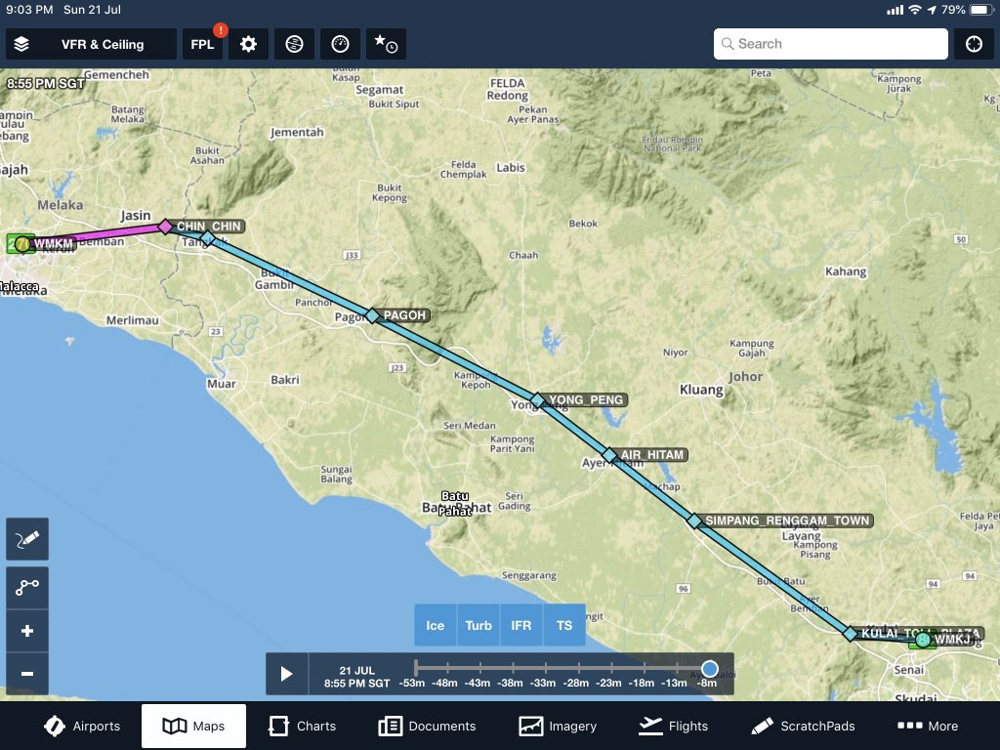](images/malacca-flight-wmkm-wmkj-foreflight.jpg)

The waypoints were imported into Foreflight with the help of an anonymous someone who made the [Malaysian ATC reporting points](https://maps.google.com/maps/ms?msid=218446447100026127553.0004b82505c41381799d9&msa=0).

The route from Malacca to Senai via Chin Chin, Pagoh, Yong Peng, Air Hitam, Simpang Rengam and Kulai is known as VFR Lane B.

> 3.5.9.1.2 VFR LANE BRAVO: Inland - 1500FT - Simpang Renggam - Kulai Tol Plaza - University Technology Malaysia (UTM)
> 
> **3.5.9.1  Lane description, 3.5.9  VFR LANE SYSTEM - JOHOR BAHRU CONTROL ZONE AND TMA**

DCA eAIP link [ENR 3.5 OTHER ATS ROUTES](http://aip.dca.gov.my/aip/eAIP/2020-03-26/html/eAIP/WM-ENR-3.5-en-MS.html#ENR-3.5).



Key moments:

- 12:35 - Cleared for takeoff. Almost run off the runway with excessive rudder
- 15:30 - Outstation call that heading towards Tangkak expect to reach at 42 mins past the hour
- 17:38 - Dr Fadzil telling me about restricted local training areas. So head towards Chin Chin
- 25:03 - Arrived at Tangkak, heading towards Pagoh expect to reach Pagoh at 52 mins past the hour.
- 35:20 - At Pagoh, expect Yong Peng at 03 past the hour. Contact Johor Tower 118.15
- 35:49 - Dr Fadzil teaching me how to establish comms with Johor Tower
- 36:34 - Tower says enter enter Johor Control zone via Lane Bravo then Simpang Renggam. Yong Peng then Bravo. Report when reach Yong Peng.
- 46:46 - Dr Fazil explains the area. Follow the road and lookout for towns of Air Hitam and Simpang Renggam
- 47:59 - Johor Tower asks our location and we reached Yong Peng.
- 50:45 - Johor Tower tells me to descent 1500 for Simpang Renggam
- 59:40 - Overhead Simpang Renggam. Prepare to report heading to Kulai and report
- 1:06:25 - Dr Fazil points out the Gunung Pulai mountain to me
- 1:11:16 - Tell Tower approaching Kulai at 1500. Track west of Johor Airfield and report
- 1:27:20 - Turning final. Cleared to land on 16.

## Details of Senai International Airport (WMKJ)

DCA AIP details of Senai Airport can be found [here](http://aip.dca.gov.my/aip/eAIP/2020-03-26/html/eAIP/WM-AD-2.WMKJ-en-MS.html#AD-2.WMKJJ).

[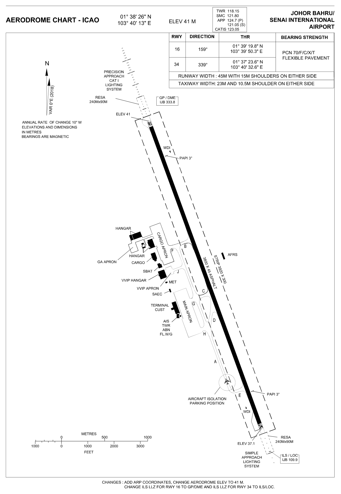](images/malacca-flight-wmkj-map.png)

- 1 runway 03-21, 3800m x 45m
- 16-34 PAPI: 3°
- Field elevation 41m (135 feet)
- Circuit altitude (Traffic Pattern): 1000 feet
- Left Pattern for 16, Right Pattern for 34
- Tower Frequency: 118.15 Mhz
- Ground Frequency: 121.8 Mhz
- ATIS: 123.05 Mhz

# Senai (WMKJ) to Seletar (WSSL)

The route from WMKJ to WSSL is the reverse of the initial journey out. This would by my first international flight too!

[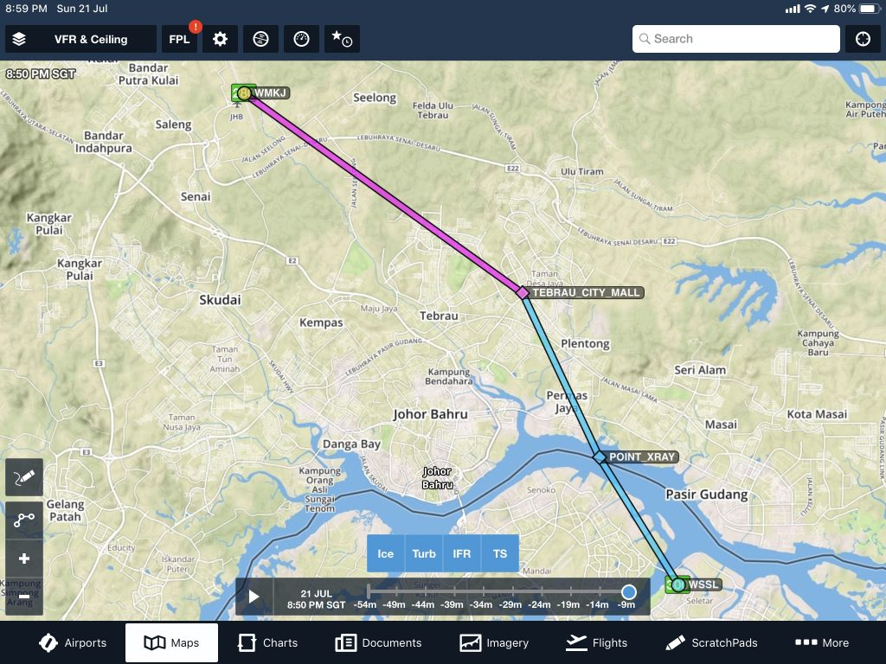](images/wmkj-wssl-foreflight.jpg)

This flight was so much shorter (less than 30 mins) than I expected but I felt was the most intense owing to the larger amount of ATC communications compressed in this short time.



Key Moments: 
- 07:53 - Clear for takeoff 
- 10:06 - Johor Tower ask estimate to Tebrau City Mall 
- 15:00 - Reaching Tebrau City Mall and tell us to switch to Seletar Tower
- 15:45 - Dr Fadzil teaches me how to talk to Seletar Tower 
- 15:59 - Contact Seletar Tower report when reach Point X-ray 
- 18:15 - Report over Point X at Straits of Johor 
- 19:42 - Seletar Tower tell me to approach Runway 21 and land. 
- 21:57 - On finals runway 21

# Conclusion

This journey truly felt so surreal. I still can't believe it actually happened but it did and achievement accomplished for having made an international flight! It was tiring as hell to hand-fly the plane all the way without autopilot to lighten my workload.

[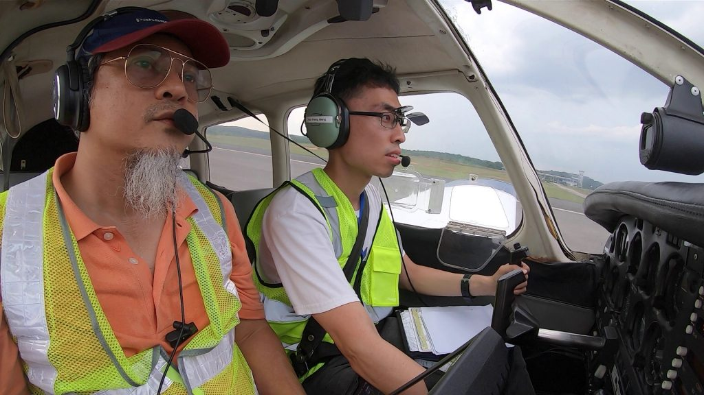](images/malacca-flight-me-and-fadzil.jpg)

Many thanks to Dr Fadzil for his patience and guiding me throughout the entire journey from Malacca and answering the radio calls. I would have no clue about this journey.

Thanks to fellow Seletar Club Members for organising this trip! It was truly an eye-opening to make such a long cross-country flight after a long time. In the meantime I got a huge crash-course on the Malaysian towns from Malacca to Johor!

After my flights so far, I realised it's one thing to learn skills during training missions. It's another to put those skills into practice by carrying actual passengers and making real trips. The responsibilities are so much higher and the risks more real.

Given the cost of this, it'll take some time before I do something like this again bah... In the meantime, I'll take friends on local flights to subsidise my flights.
