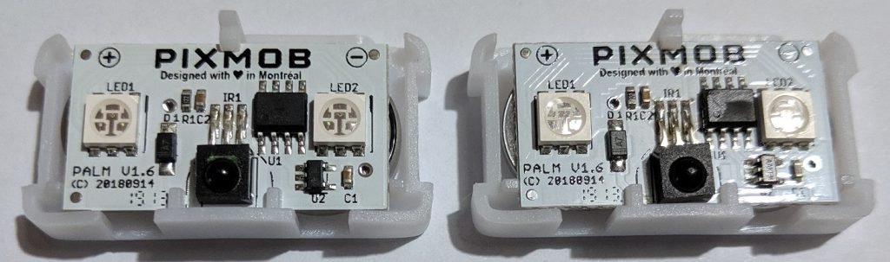
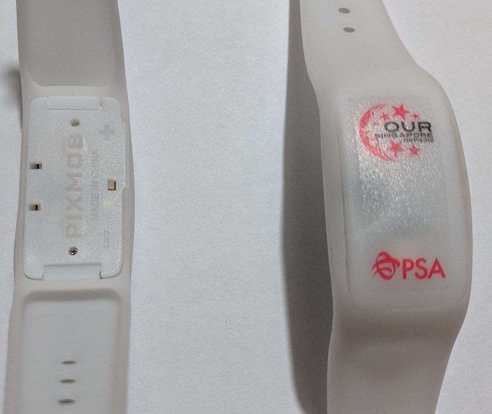
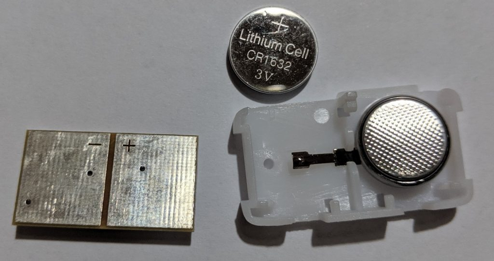
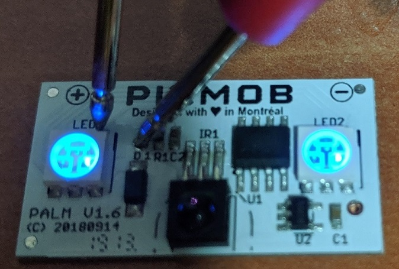
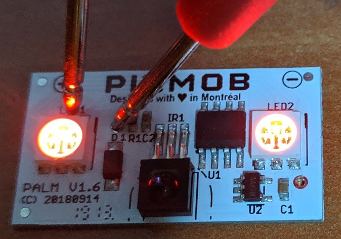
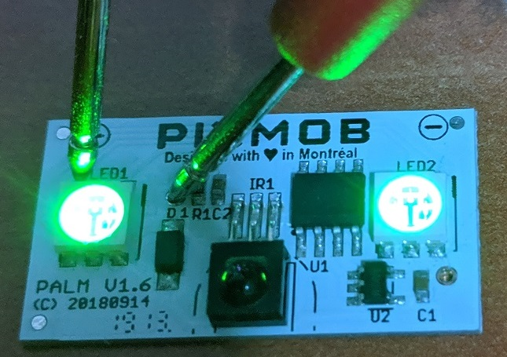
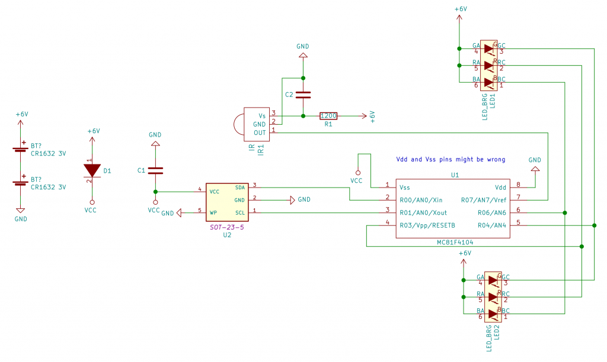
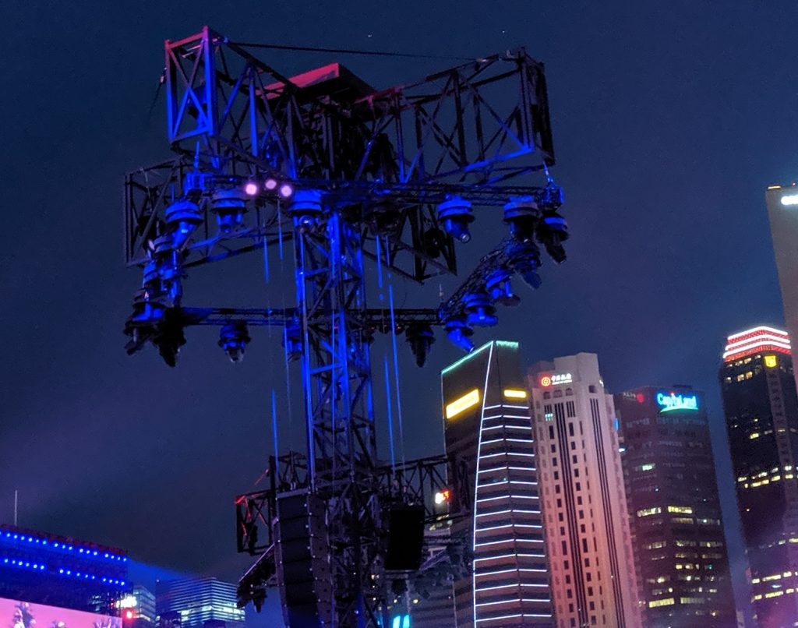

3 years ago, [I tore down the NDP 2016 LED wristband](/2016/08/partial-reverse-engineering-the-ndp-2016-led-wristband/) as I got one during the Singapore National Day Parade (NDP) Preview. 3 years later, I got another one during the NDP preview held on 28 July 2019.

Board internals

Band in original condition

So time for another teardown!

<!--more-->

# Wristbands in action!

Let's see how the wristbands perform during the event!



Blue, white, yellow LED



Thousands of bands were synchronised to blink at the same time. Notice that the performers' drums also blink at the same time.

# Opening the band

## Front of board

The manufacturer of the band [Pixmob](https://www.pixmob.com/) is the same as the one that made the 2016 model.

The band this time comes with 2 RGB LEDs but no accelerometer. A microcontroller and a suspected EEPROM form the 3 main IC chips .

There are no IC markings on the microcontroller. Since I only have 2 bands this time (my family returned the rest), I can't tell if this is deliberate obfuscation or something happened between the production process and me receiving it.

## Back of board

The board is powered by 2x 3V CR1632 connected in series.

## LEDs

Using the diode mode of the multimeter and tap input/output pins.

We can see the LEDs are just connected in parallel.

# Schematic

Using a Multimeter and some trace inspection by eye, I mapped out the connections between the components as shown below.

The microcontroller chip does not have an IC marking. According to my friend [Jin Gen (@jg\_lim)](https://twitter.com/jg_lim) who managed to [run custom code on the NDP2016 wristband](http://jg.sn.sg/ndp-pixmob-1/), whom I'm paraphrasing:

**"It is suspected to be the [Abov MC81F4104](http://www.abov.co.kr/en/index.php?Depth1=3&Depth2=1&Depth3=1&Depth4=2&Item=MC81F4104) as it is from the same family as the Abov 81F4204R used in the NDP 2016 wristband. The MC81F4104 suspicion is further cemented by the fact this chip is the only one with the 8-SO package in [Abov's 8-bit Flash MCU lineup](http://www.abov.co.kr/en/index.php?Depth1=3&Depth2=1&Depth3=1&Depth4=2)."**

But if this is the case, it seems strange that the Vss is connected to power and Vdd to GND when it is supposed to be vice-versa. Nevertheless I'll remain on this assumption.

No programming points can be found on the PCB so the guess is the firmware is programmed before assembly?

I made some assumptions about the U2 I2C component. I assume it is the same EEPROM used in NDP2016's wristband as has a marking AAKFM which Google does not give an answer to.

Overall, a much simpler design than the 2016 model.

The source files of the Kicad schematic can be found [here](https://github.com/yeokm1/ndp2019-wristband-teardown).

# Suspected Emitter

From my 2016 experience, I now knew what to look for.

I can't confirm this but it seems like the infrared emitter is hung on the light tower. Waving my Pixel 2 around, I found the 3 purple infrared emission that is visible on my Pixel 2's camera but not to the naked eye.



The emitter seems to be "sending" something

If only I have brought some form of IR recording device, then it would be much easier to reverse engineer the protocol used. But then again, such a device might not have gotten past the stringent security.

# Conclusion

This time, I didn't bother to reverse engineer the IR protocol as I know there could be numerous unknown combinations. It is my sincere hope that Pixmob or NDP committee can make the IR protocol public so this wristband can have its uses after the NDP. Or even better however unlikely, detailed documentation on the BOM and how to modify this band.

The LED wristband added a nice touch to the NDP. However, I just felt this was quite a waste of resources. I'm not sure how this band can be recycled given hygiene reasons and it'll most probably be disposed of after the event.
