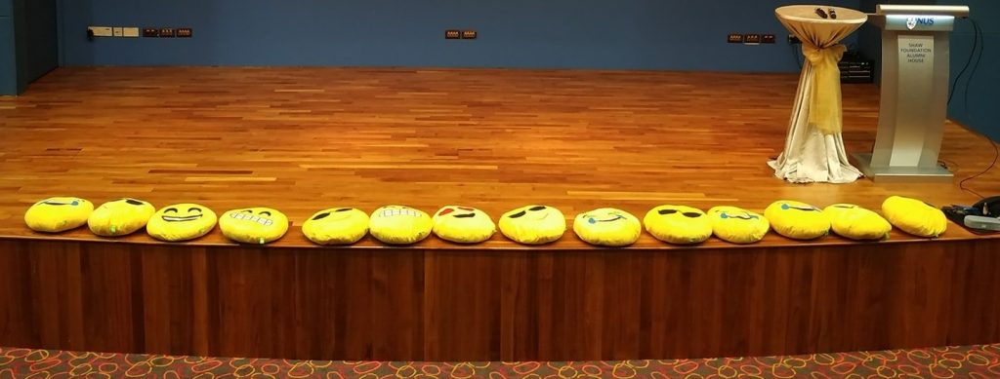

I was the emcee in [GeekcampSG 2019.](https://www.facebook.com/events/384878335732606/) I asked a total of 66 trivia questions in the effort and excuse to give out leftover plushies from the previous Geekcamp 2018+.

These questions spanned topics from Singapore, Science, Fiction, Computing, Retro-tech and miscellaneous general knowledge. Topics I feel would appeal to a stereotypical geek audience and someone like myself. Try to see how many you can answer.

Trust me, the collating of these questions and researching their answers took over a period of several years to prepare for such a day. It was fun to finally see the fruits of my labour. Coming up with questions that can't be too easy that everyone knows the answer or too hard that no one knows is difficult. Fortunately for me, at least 3/4 of the questions could be answered correctly by at least one person.

<!--more-->

# Singapore

**SG timezone is +8 but this wasn’t always true. What was our previous time zone and when was the change made?**

Previous was UTC+07:30. Deprecated in 1 January 1982.

**Our rubbish is incinerated then buried on which island?**

Pulau Semakau. Operations started in April 1999 and projected to last to 2035-2045.

**When you watch Western law shows, you will notice that they have jury where a panel of ordinary people will decide the verdict instead of the judge. Singapore used to have a jury system up to 1969. Why was this abolished?**

This abolishment was largely due to Lee Kuan Yew. He says and I quote “I had no faith in a system that allowed the superstition, ignorance, biases, and prejudices of seven jurymen to determine guilt or innocence" (The Singapore Story: Memoirs of Lee Kuan Yew)

**Singapore’s currency has constant parity to which other currency?**

Brunei. Currency Interchangeability Agreement in 1967. Singapore, Malaysia and Brunei were the original parties in the agreement. Malaysia pulled out in 1973. This was partly due the to the events of 1971 where the US dollar was decoupled and no longer backed by gold. Google Nixon Shock and Bretton Woods for more info.

**We know that the country code for Singapore is +65? Why is that so?**

Country codes are assigned by a UN organisation called International Telecommunications Union.

9 Zones worldwide. Singapore is in Zone 6 for South East Asia and Australia. The second digit is roughly the order in which the country became independent or requested from the Union.

**Where did this phrase “Little red dot” come from?**

It originated from former Indonesian President BJ Habbie in 1998 when he remarked to the Asian Wall Street Journal. “It's O.K. with me, but there are 211 million people (in Indonesia). All the green (area) is Indonesia. And that red dot is Singapore.”

**This economic indicator NODX is commonly used by Singapore economists but not so much in other countries. What is it and why is this the case?**

Non-oil domestic exports. Oil refinery and export activities contribute about 5% to our GDP which skews our economic performance when lumped with other categories. Therefore economists remove oil figures when it comes to accessing Singapore’s economic health.

**On the first noon of every month, why is there a nationwide chime?**

To test our SCDF Public Warning System. It is also sounded on other occasions like Total Defence day on 15 February as well as during National Day and Lee Kuan Yew’s funeral.

**The Straits Time Index or STI is regarded as the benchmark index used in the Singapore stock market. What kind of stocks does it track?**

Top 30 companies listed in the Singapore Exchange by market capitalisation

**These words Stayers and Quitters caused quite a bit of controversy when a Singapore politician said them. Who said them?**

Former PM Goh Chok Tong in 2002 National Day Rally

“Fair-weather Singaporeans will run away whenever the country runs into stormy weather. I call them "quitters".

Fortunately, "quitters" are in the minority. The majority of Singaporeans are "stayers". "Stayers" are committed to Singapore. Rain or shine, they will be with Singapore. As we say in Hokkien, "pah see buay zao".”

**Which former Singapore minister said the following “The problem now is that under the banyan tree very little else can grow. When state institutions are too pervasive, civic institutions cannot thrive. It's necessary to prune the banyan trees so other plants can grow.”?**

George Yeo in 1991 then Minister for Information and the Arts, George Yeo

**Who said this and I quote “My attack on Singapore was a bluff – a bluff that worked. I had 30,000 men and was outnumbered more than three to one. I knew if I had to fight long for Singapore I would be beaten.”?**

Lt-Gen Tomoyuki Yamashita. Commander of the Japanese 25th Army which invaded Malaya and Singapore. Executed in February 1946 for war crimes.

“That is why the surrender had to be at once. I was frightened all the time that the British would discover our numerical weakness and lack of supplies and force me into disastrous street fighting.”

**There was once a time nuclear weapons in Singapore. When did this happen?**

1962-1970. 48 tactical nuclear weapons called Red Beard kept at today’s Tengah Air Base. Those weapons were placed here by the British without the knowledge of the Malaysia or Singapore government as part of the Cold War strategy. We only know about this today because the British Ministry of Defence declassified documents in 2000.

**This commentary “A Great Affective Divide” made some ministers uncomfortable when it was published in The Straits Times in 1994. Who wrote it?**

Catherine Lim. A local fiction author. The essay is about how the government is out of touch with the citizens.

**How long can Singapore’s rice reserves last?**

3 months. 2 months in government warehouses and one month on supplier side

**Why does the licence plates of our SAF vehicles have the MID prefix?**

MID stands for Ministry of Interior and Defense.

Lee Kuan Yew from his memoirs The Singapore Story: “To my relief, Goh Keng Swee was willing and eager to take on the task of building up the forces. I decided to have him take charge of home affairs and defence, put together into one ministry called MID (ministry of interior and defence). This would allow him to use the police force to help in the basic training of army recruits.”

**What was the lowest temperature ever recorded in Singapore?**

19C. Paya Lebar 14 Feb 1989.

**What is the first Singapore company to be listed on the NASDAQ stock exchange in US?**

Creative in 1992. Delisted in 2007. National Association of Securities Dealers Automated Quotations

**Who wrote “Please, get out of my elite uncaring face” ?**

Wee Shu Min daughter of former MP Wee Siew Kim. Former RJC scholar. Wrote that in 2006 blog post where she criticised another person Derek Nam for writing to the Straits Times about job difficulties.

**What is the Southernmost point on mainland Singapore?**

Tuas

# Science

**What does the term Astronomical Unit mean?**

Average distance between Earth and Sun. 150 million kilometres

**What are superconductors and why are they an active research area?**

Materials which have no electrical resistance. Useful applications like long range power transmission and no losses, maglev trains.

**What is the Computing equivalent to the Nobel Prize?**

Turing Award. First award was given out in 1966

**There is evidence millions of years ago that all the 7 continents today actually formed a single supercontinent. What is this supercontinent called?**

Pangaea. Formed 335 million years ago and separated 175 million years ago.

**What is considered the equivalent to the Nobel prize for Mathematics?**

Fields Medal. Only given out once every 4 years to a mathematician under 40

**Human cells will divide for about 40-60 times before they stop. What is this limit called?**

Hayflick limit named after the scientist Leonard Hayflick who discovered it in 1961. Cancer cells don’t have this limit that’s why they keep proliferating.

**What is the temperature of Absolute Zero in Celsius?**

\-273.15 degrees = 0 Kelvin. The world record for lowest temperature was achieved by the Institute for Surface Chemistry in Sweden in 1999. They reached a temperature of 100 picoKelvins. That is 0.000 000 000 1 K.

**Particle accelerators are used to conduct basic scientific research. The largest and most famous particle accelerator in the world is the Large Hadron Collider in France and Switzerland. Singapore actually has one of our own. Where is it?**

Singapore Synchrotron Light Source in NUS. Generate energy of up to 700MeV.

Large Hadron Collider: 13 tera-electron-volts

19000x.

**Most countries in the world have switched to metric system except 3. What are those 3 countries?**

Liberia, Myanmar, and the United States

**In 2-dimensions, we have a square, 3-dimensions we have a cube, in 4-dimensions what do we have?**

Tesseract

# Fiction

**In Star Trek, what race uttered this phrase “Resistance is Futile”**

Borg

**In Star Trek, the Prime Directive is one of the most important orders where the Federation is not supposed to interfere in less advanced worlds. What is the only Directive known to supercede the Prime Directive?**

Omega directive introduced in Star Trek Voyager where Omega particles must be destroyed.

**In Star Wars, who said “If you are not with me, then you are my enemy”?**

Darth Vader. Anakin Skywalker is the second-best answer

**What is a Dyson Sphere?**

A Dyson sphere is a hypothetical megastructure that completely encompasses a star and captures most or all of its power output. Originally Olaf Stapledon in 1937. Popularised by Freeman Dyson in his 1960 paper “Search for Artificial Stellar Sources of Infrared Radiation”

# Computing

**What is lower bound in time complexity for a comparison-based sorting? Give the answer in big-O notation.**

O(nlogn)

**In object-oriented programming, say we have a base class A. We have another class B that inherits from A. Objects of class B should be able to replace objects of class A without any problems. What is this principle called?**

Liskov Substitution Principle. Named after the Barbara Liskov when she first introduced this concept in 1987 in her talk “Data abstraction and hierarchy”. For her work in this field, she won the 2008 Turing Award.

**What is the Year 2038 problem?**

Unix time is stored in 32-bit signed value as the number of seconds since the Unix Epoch of 1 January 1970. This value will overflow on 19 January 2038. The solution is to change the value to a 64-bit one.

# Retro-tech

**Many of us use Microsoft Office very often. What platform did it first support?**

Mac OS in 1989. Microsoft Word 1.0 released in 1984 for Mac. Microsoft Office for Windows was released in 1990 for Windows 3.0.

**What is the capacity of a typical 3.5 inch floppy drive?**

1.44MB

**Apple computers today are based on the x86 architecture but this was not always the case. In fact Apple changed its architecture twice in the last 25 years. What were the previous architectures that Apple used?**

IBM PowerPC: 1994 – 2006

Motorola 68000 series: 1983 – 1995

**Which Windows version is the first to have native Networking capability?**

Windows for Workgroups 3.1 (Oct 1992)

**Early Intel CPUs were called x86, like 386, 486. Why did they change to Pentium in the 1993?**

Numbers cannot be trademarked so there were many clones example from AMD and Cyrix. As for why Pentium

Pent comes from Pentagon or 5 sides. Successor to 486 which was the last one to be called by the old name

\-ium makes it sound scientific

**The recent Meltdown and Spectre Attacks caused quite a lot of stir in the tech world. It is said that this affects CPUs as far back as 1995. Why is this the case? What’s so special about CPUs before 1995 that makes them immune to Meltdown and Spectre?**

Meltdown and Spectre rely on speculative execution for to carry out the attack. The first CPU with this feature is the Pentium Pro released in November 1995. Its generation is more commonly known as the Pentium 2 or 6th generation x86.

# Tech Trivia

**What is considered the world’s most viewed image of all time?**

Windows XP default wallpaper called Bliss. Green hill and blue sky. Taken in 1996 at Sonoma County in California sold to Microsoft in 2000. That image is unedited.

**Who said “It's easier to ask forgiveness than it is to get permission.”?**

Rear Admiral Grace Hopper. US Naval Officer and Computer Scientist. She wrote the earliest compiler in 1951 for a language called A-0.

**Who said “What is Regression testing? If it compiles, it is good; if it boots up, it is perfect”?**

Linus Torvalds

**Who is rumoured to have said but later denied?** **640K Ought to be Enough for Anyone**

Bill Gates in a 1981 Computer Conference

**Who is the designer of the C Programming language?**

Dennis Ritchie during 1969 – 1973. He is also one of the creators of Unix.

**Michael founded Engineers.SG in 2013 to record meetups. The reason he started this was because someone made a complaint. What was this complaint about?**

“I can’t find any Engineers. Where are the engineers in Singapore?” Geekcamp in October 2016

**What is the maximum number of USB devices that can be connected downstream from a root hub?**

127

**Steve Jobs once said quote “\_\_\_\_\_ is a feature, not a product”. What is \_\_\_\_?**

Dropbox. Apple wanted to buy Dropbox in December 2009 for 9 figures. When the founders refused, Jobs said that.

**What are the Rainbow books?**

Collection of Compact Disc format specifications.

Yellow Book: CD-ROM. Red Book: CD-Audio. Orange Book: CD-R and CD-RW

**Which organisation has the most number of IPv4 addresses?**

- US Department of Defense: 201 million
- Level 3 Communications, Inc: 33 million
- Hewlett-Packard: 33 million

**Optical drives have they speeds labelled as 1x, 48x, 52x. What does this X numbers mean?**

CD: 150 kilobytes/s, DVD: 1.32 MiB/s, Blu ray: 36 Megabit/s

**Who said “adding manpower to a late software project makes it later”?**

Fred Brooks, The Mythical Man-Month.

# Miscellaneous

**Where is the deepest part of the ocean?**

Mariana Trench. 11 km below sea level. More people have gone to moon. 12 people to moon, 3 people to that trench.

**Whenever an airplane crashes, the first thing investigators look for are the black boxes because they have critical information of the flight. But black boxes are not the actual names of this devices and are not black in colour. What is the actual colour of these devices and why?**

Orange. To make it easier to spot in the debris. Flight Data Recorder and Cockpit Voice Recorder.

**What is the circumference of the Earth along the Equator?**

40,075km

**Who said “Any sufficiently advanced technology is indistinguishable from magic”?**

Arthur C. Clarke’s Three Laws

1. When a distinguished but elderly scientist states that something is possible, he is almost certainly right. When he states that something is impossible, he is very probably wrong.
2. The only way of discovering the limits of the possible is to venture a little way past them into the impossible.
3. Any sufficiently advanced technology is indistinguishable from magic.

**For hundreds of years, governments in Asia have dreamed of cutting a canal through Thailand to shorten shipping times instead of travelling around the Straits of Malacca. What is this proposed canal called?**

Thai Canal, also known as Kra Canal or Kra Isthmus Canal connecting the Andaman Sea in the West to Gulf of Thailand in the East. Idea was mooted as early in 17th century by the Thai King.

**What machine has this nickname “one-armed bandit”?**

Slot machines in casinos

**Association of South East Asian Nations or ASEAN is an organisation of 10 South East Asian countries to promote regional cooperation. It was formed on 8 August 1967 by 5 countries. What are these initial 5 countries?**

Indonesia, Malaysia, the Philippines, Singapore and Thailand. Others are Brunei, Vietnam, Laos, Myanmar, Cambodia.

**I’m sure many of you in the audience uses Apple iPhones. However, Apple does not actually make iPhones. Which company does Apple outsource the manufacturing to?**

Foxconn

**Who said there are no permanent friends or enemies, only interests?**

Henry Kissinger. US Secretary of State from 1973 to 1977. Originally from former British Prime Minister Henry Temple in 1848.

“We have no eternal allies, and we have no perpetual enemies. Our interests are eternal and perpetual, and those interests it is our duty to follow”

**Who came up with this phrase Irrational Exuberance?**

By former US Federal Reserve chairman Alan Greenspan to describe an dot com bubble forming in the late 1990s to early 2000s. Now we see that happening from cryptocurrency like bitcoin.

**What is Occam’s razor?**

British philosopher, William of Ockham. His principle states that among competing hypothesis, the one with the fewest assumptions should be selected. Or the simplest explanation is more likely to be the right one.
