In October 2019, my company SP Digital held an internal hackathon. My colleague [Subhransu](https://twitter.com/subhransu) and I worked on a whacky idea of writing a brand-new [Windows 3.1](https://en.wikipedia.org/wiki/Windows_3.1x) app which was an OS released almost 30 years ago. The idea we chose was a Slack client. After all, Slack clients exist for most platforms but I'm certain one does not exist for Windows 3.1.

A few months later in Dec 2019, I would join the [Super Silly Hackathon](https://supersillyhackathon.sg/) for the second time with fellow retrocomputing enthusiast [Hui Jing](https://www.chenhuijing.com/). We would develop a small game for Win 3.1 with great help from the knowledge gained from this first project.

For Part 1, I shall detail the learnings and process for how a new old app can be created with the aid of modern tools and hindsight of old technologies. And perhaps what lessons can it offer us today. This blog post is a few months late as I needed time to clean up the code and write the documentation.

Don't forget to checkout out Part 2 of the [game app with Hui Jing](https://www.chenhuijing.com/blog/building-a-win31-app-in-2019/) too!

# The App

Of course let's take a look at the app.

[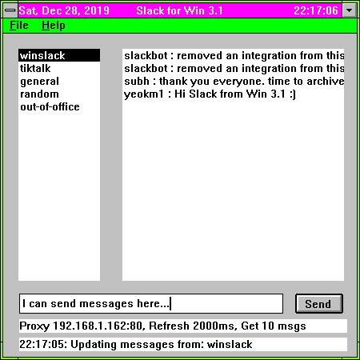](images/wfwslack-shot.png)


[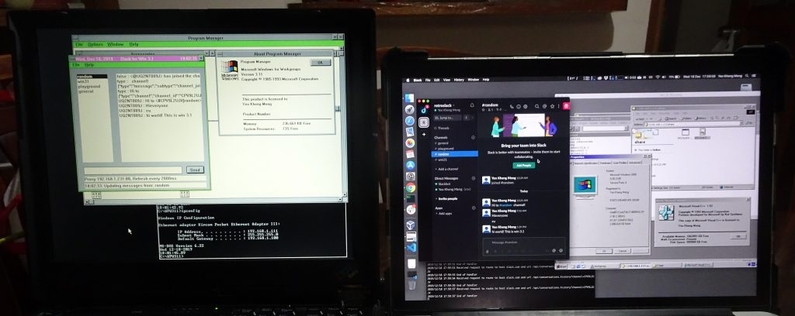](images/wfwslack-both-1024x408.jpg)

<!--more-->



Picture and video of the app in action. Left is my [Thinkpad 390e running Windows 3.1](/2016/09/windows-for-workgroups-3-11-on-vintage-and-modern-hardware-in-2016/). On the right is my Mac with the Slack client for verification.

If you are too lazy to continue reading and want to dive into code, here is the [repository on Github https://github.com/yeokm1/w31slack](https://github.com/yeokm1/w31slack).

# Why Windows 3.1?

Or to be more precise, why [Windows For Workgroups (WFW) 3.11](https://en.wikipedia.org/wiki/Windows_3.1x#Windows_for_Workgroups_3.11)? There is a special reason for this, WFW 3.11 released in 1993 is the first Windows OS for consumers to have network installable TCP/IP support. Therefore, if one wants to write an app using Windows OS standard APIs, WFW 3.11 is the oldest one can go back without putting in even more exponential effort.

Nevertheless, as you will see, the effort to put in to write such an app is still herculean in its own right. **Windows 3.1 also largely consumes 16-bit apps** which is the tail-end of that era before Windows 95 came in.

# Development setup

The most important aspect of developing an app is the compiler toolchain. Everything has to revolve around it and this project is no exception.

[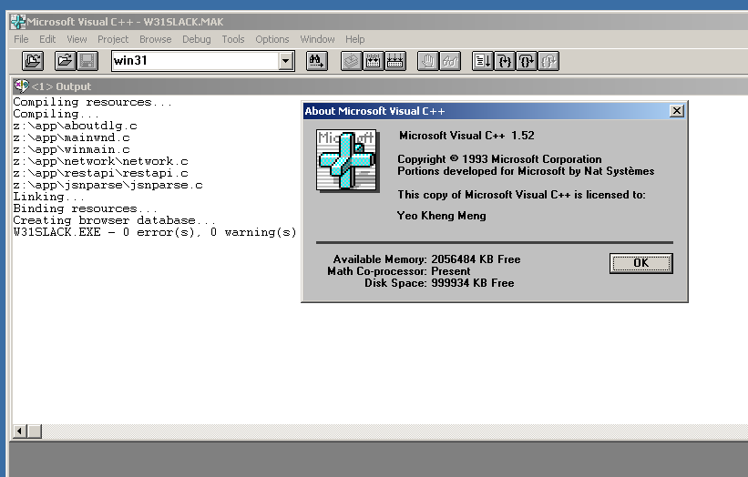](images/wfwslack-compile.png)

For this, we have the Visual C++ 1.52. This is the last VC++ compiler from Microsoft that can target for WFW 3.11. VC++ 1.52 is itself a 16-bit program so it can only be run on 32-bit Windows. Theoretically it should run even on Windows 10 32-bit but I did not have such a native setup lying around.

So I had to take the Virtual Machine option using Windows 2000 with the following considerations in mind.

1. Oldest Windows OS with full Virtualbox support of drivers, network and bidirectional clipboard
2. No product activation unlike its successor Windows XP
3. Lightest resource usage with smallest disk footprint
4. Compatible with both Windows 10/Mac and Windows 3.1 SMB file sharing

Testing a 16-bit program on a 32-bit OS VM is not a very realistic scenario as VMs can be too perfect. We need to occasionally test our app on the actual ancient hardware with WFW 3.11 during development.

Also, we can't write our code directly on the Windows 2000 VM as it has limited software support for modern IDEs like Visual Studio Code not to mention security issues.

Windows 10 and Mac cannot directly talk to the ancient SMB protocol used by WFW 3.11.

## Hardware setup

[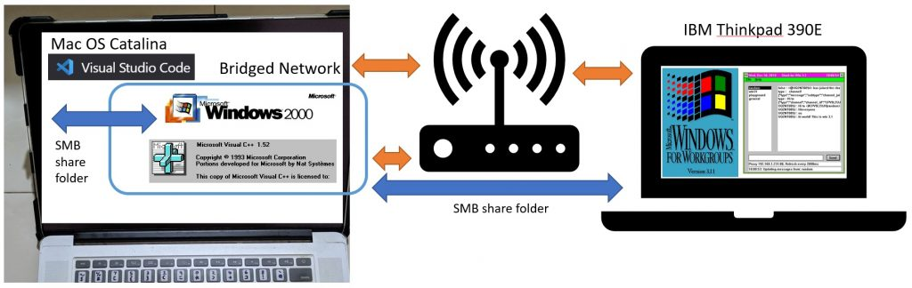](images/wfwslack-setup.jpg)

Primary development is done on the Mac with Visual Studio Code editor with the files residing on the Mac file system. VC++ 1.52 will access the source files using a mapped drive on SMB share and do the compilation.

[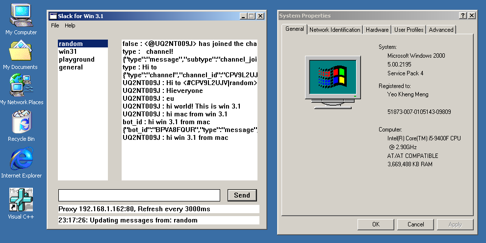](images/wfwslack-app2k.png)

I can do intermediate testing on Win 2K since it can run 16-bit apps.

[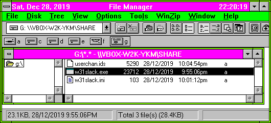](images/wfwslack-wfw-smb-share.png)

With Win 2K VM configured to use a bridged network and thus the same subnet, my native WFW 3.11 system can access the SMB share folder of the Win 2K VM as seen above. That's actually the first time I saw the network drive icon in File Manager.

Size of the binary is 23 KiB. That's many orders of magnitude smaller then the modern Slack app on the App store :P

# Let's get down to the coding business

Coding an ancient app presents some very unique challenges not seen when using modern toolchains and programming languages. I had to wade through many issues which I detail the following key ones.

## API Documentation

API documentation and usage examples are very important when it comes to software development. Typically, programmers will rely quite heavily on Google and Stackoverflow.

Alas, Win 3.1 only came during the dawn of the internet era and Google cannot help if relevant websites do not even exist. Basically Windows 3.1, its API documentation and problems can't be Googled easily, one has to rely on a more traditional method like books!

### Reference Book

[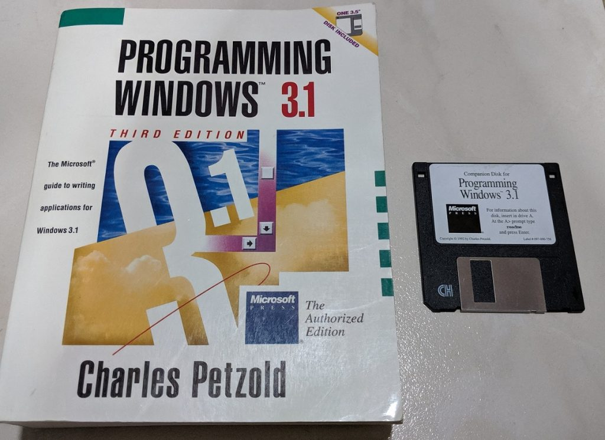](images/wfwslack-book.jpg)

I purchased this book [Programming Windows 3.1 by Charles Petzold from Amazon](https://www.amazon.com/Programming-Windows-3-1-Charles-Petzold/dp/1556153953/).

[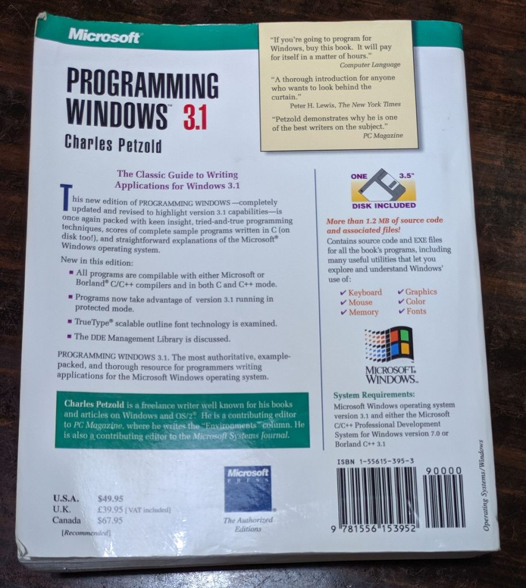](images/wfwslack-book-back.jpg)

>If you are going to program for Windows (3.1), buy this book. It will pay for itself in a matter of hours."
I concur with this.

Try as I might I could not find a softcopy of this book which means I had to do things the old-fashioned way when I comes to research. Going by contents page and index for starters. If it may help others, I uploaded the sample codes of the floppy disk onto [this Github repo](https://github.com/yeokm1/programming-win31).

### Header file inspection

[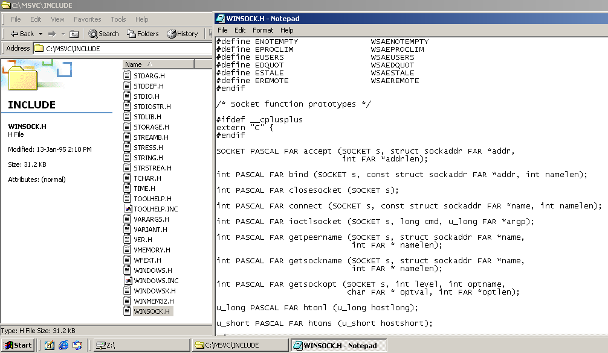](images/wfwslack-headers.png)

Sometimes I have to use certain APIs that may not be documented in the book, for example network APIs. In this case, I'll have to manually inspect the header files in the compiler's "include" directory to see what parameters are required for the functions.

### Inverse deduction from modern Windows API

Looking up the function parameters may not be always sufficient as I need to know what the function actually does. Here is where Microsoft's legendary backward compatibility becomes useful. Many modern Windows APIs are very similar to the traditional ones. Microsoft even has this [walkthrough](https://docs.microsoft.com/en-us/cpp/windows/walkthrough-creating-windows-desktop-applications-cpp?view=vs-2019) to create an app the traditional way.

> The Windows API (also known as the Win32 API, Windows Desktop API, and Windows Classic API) is a C-language-based framework for creating Windows applications. It has been in existence since the 1980s and has been used to create Windows applications for decades. More advanced and easier-to-program frameworks have been built on top of the Windows API. For example, MFC, ATL, the .NET frameworks. Even the most modern Windows Runtime code for UWP and Store apps written in C++/WinRT uses the Windows API underneath.

Even if the modern APIs are different, the documentation may give me enough information to deduce what the older APIs do.

## C89 language

VC++ 1.52 was released in the early 1990s obviously only supported the C standard of that era which was C89. Even though I use C quite a lot in my work, C89 has several intricacies that made my life harder.

### Variable declaration at beginning of function scope

Basically this means I cannot declare a variable in the middle of a function. To get an idea how troublesome this is, take a look at this code sample.

[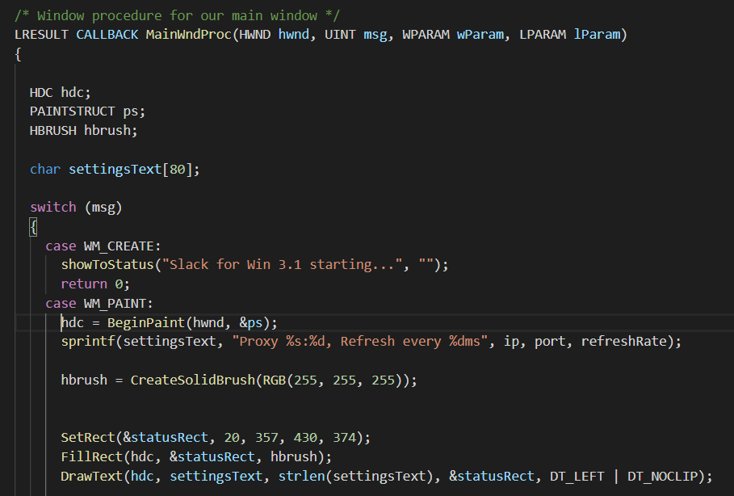](images/wfwslack-c89-vars.png)

This sample code deals with the event loop in receiving callbacks from Windows. The variables ever used in this function has to be declared at the top not when I need to use them. So lots of work scrolling up and down.

[userbinator on Hackernews had this to say](https://news.ycombinator.com/item?id=21832815): "Note that C89 only prevents declarations of variables in the middle of a _scope_; you can simply create an inner scope with new variable declarations at _its_ start."

### No safe functions

I was taught to use "safer" functions like _snprintf_ vs _sprintf_ in school. The newer functions which allow the programmer to specify the number bytes to use thus preventing dangerous buffer overflows. These functions only came out in C99 so no go for me. I have to be very careful in defining my buffer sizes.

### Lack of libraries

The ancient C89-only support rules out many C libraries I can find online. C is a hard-enough language, no library support means doing a lot of work by hand.

## Memory Allocation

This was an extremely tough nut to crack that would have been impossible for me to solve without Petzold's book.

The stack size of a 16-bit program is typically 4-6 KiB with the local heap up to 64KiB. This is smaller than the size of the HTTP reply + JSON returned by Slack!

> In the context of IBM PC compatible and Wintel platforms, a 16-bit application is any software written for MS-DOS, OS/2 1.x or early versions of Microsoft Windows which originally ran on the 16-bit Intel 8088 and Intel 80286 microprocessors. Such applications used a 20-bit or 24-bit segment or selector-offset address representation to extend the range of addressable memory locations beyond what was possible using only 16-bit addresses.
> 
> **Programs containing more than 2^16 bytes (65,536 bytes) of instructions and data therefore required special instructions to switch between their 64-kilobyte segments, increasing the complexity of programming 16-bit applications**.
> 
> Source: [https://en.wikipedia.org/wiki/16-bit#16-bit\_application](https://en.wikipedia.org/wiki/16-bit#16-bit_application)

Wikipedia is so correct !^^^

The following 2 pages literally saved me from hours of Googling assuming Google turns out any answer at all!

[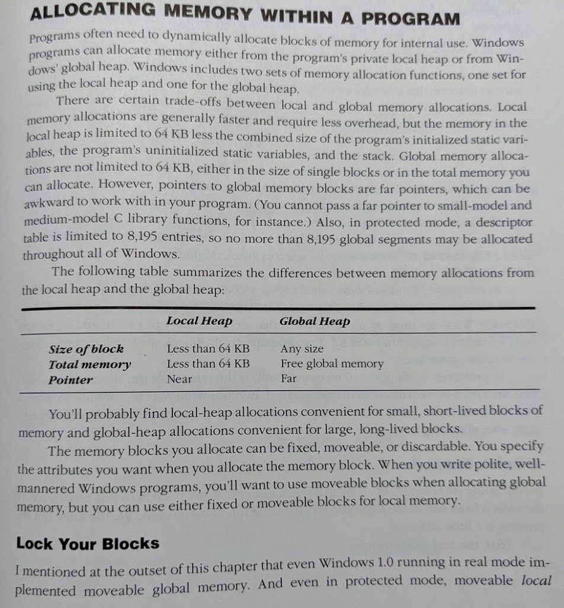](images/wfwslack-allocmem.jpg)

[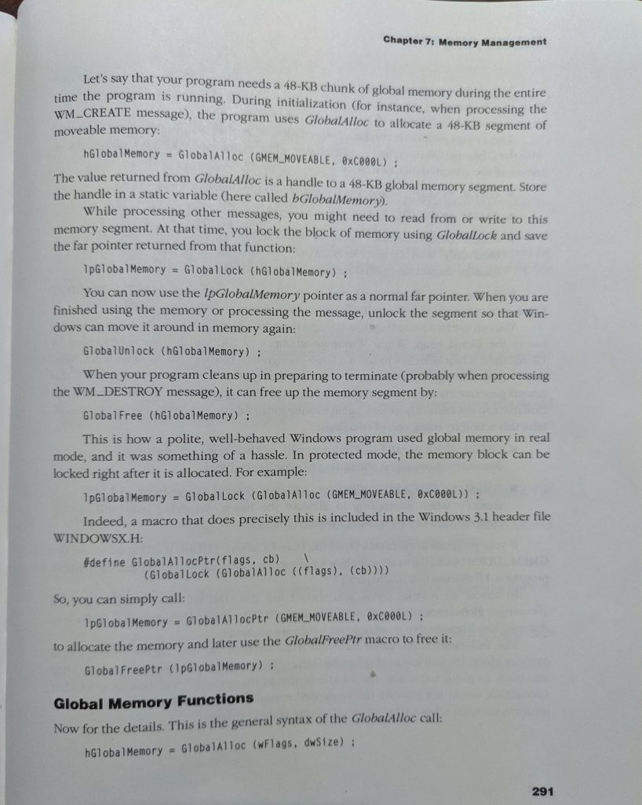](images/wfwslack-memapi.jpg)

To allocate a "large" chunk of memory from the APIs described in the book, we need to allocate them from the Global heap. This is what I did below.

```c++
#include <windowsx.h>

//Up to 64K is possible 
#define MAX_GLOBAL_MEM_ALLOCATION 32000

LPSTR lpGlobalMemory;
DWORD allocatedMemorySize;

lpGlobalMemory = GlobalAllocPtr(GMEM_MOVEABLE, MAX_GLOBAL_MEM_ALLOCATION); 
allocatedMemorySize = GlobalSize(GlobalPtrHandle(lpGlobalMemory));

printf("We got allocated %u bytes of memory\n", allocatedMemorySize);,

GlobalFreePtr(lpGlobalMemory);
```

LPSTR is a "FAR" 32-bit pointer which enables greater range of memory. The conventional "char" pointer type is only 16-bit in this era. We tell WFW 3.11 how much we hope to allocate. After allocating the memory, remember to verify how much was actually allocated. After you finish using the memory remember to free it.

## Networking

### HTTPS issues

Secure Rest API communication via HTTPS is the norm today when it comes to dealing with web services. However it was not really so in that era.

WFW 3.11 uses the [Windows Sockets API (Winsock)](https://en.wikipedia.org/wiki/Winsock) version 1.1. The [Secure Socket Extensions to Winsock](https://docs.microsoft.com/en-us/windows/win32/winsock/using-secure-socket-extensions) only came out in version 2. The conventional way is to use OpenSSL but it's so complex that there's no reasonable chance of me porting that entire project to support C89 on WFW 3.11.

[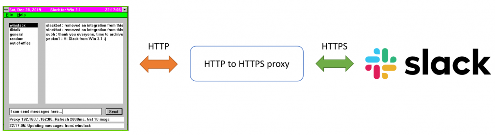](images/wfwslack-https-proxy.png)

After much hesitation and reluctance, I decided to cheat and write my own [http-to-https-proxy](https://github.com/yeokm1/http-to-https-proxy) in Golang. Acting as a transparent middleman, it inspects the host field of the HTTP requests and forwards the raw socket bytes as HTTPS to Slack's servers. The result is then relayed back byte-for-byte back to the app.

Purists may not like this solution but this is the best I can do with my abilities in a reasonable amount of time.

Readers have suggested to me that an existing project called [stunnel](https://www.stunnel.org/) already exists so this self-written proxy is not necessary. I did give stunnel a try but it seems to only work if it is running on the same system as the app that needs the tunnel and it obviously won't work on a Windows 3.1 system.

There might be some SSL libraries for embedded systems that are worth a try like BearSSL, mbed TLS and WolfSSL. See the end of this blog post on my further thoughts of this subject.

### Socket Programming

The last time I did low-level socket programming was in university. This days with modern programming languages and APIs, everything is done for you. But no such libraries exist for C89 last I checked. So I had construct the entire POST request by hand and call the socket APIs directly.

```c++
#include <winsock.h>

#pragma comment(lib,"winsock.lib") 
#define POST_MESSAGE_FORMAT "POST /api/chat.postMessage?channel=%s&as_user=true&text=%s HTTP/1.1\r\nHost: slack.com\r\nAuthorization: Bearer %s\r\nAccept: */*\r\nConnection: close\r\n\r\n"

WSADATA wsaData;
struct sockaddr_in serveraddr;

WORD wVersionRequested = MAKEWORD(1, 1);
nErrorStatus = WSAStartup(wVersionRequested, &wsaData);

sock = socket(PF_INET, SOCK_STREAM, IPPROTO_TCP);

memset(&serveraddr, 0, sizeof(serveraddr));
serveraddr.sin_family = AF_INET;
serveraddr.sin_addr.s_addr = inet_addr(ipaddress);
serveraddr.sin_port = htons((unsigned short) port);
error = connect(socketID, (struct sockaddr *) &serveraddr, sizeof(serveraddr));

sprintf(buff, POST_MESSAGE_FORMAT, "win31", "hello", "token");
bytesSent = send(socketID, request, requestLength, 0);
bytesReceivedThisInstant = recv(socketID, (char *) &buff, 1, 0);

closesocket(socketID);
WSACleanup();
```

The above code starts the Winsock API, creates the TCP socket, connects to it, constructs the request, sends the request, receives the reply, closes the socket, stops the Winsock API.

Most requests today use the _"Content-Encoding: deflate, gzip"_ option by default to enable compression to reduce bandwidth requirements. Here I have no means to decompress it so this is left out to force the server to give the reply in pure text format.

I believe deep down in all networking libraries, this is how things are done. Just that now I don't have the benefit of this abstraction.

### JSON parsing

The output of most REST APIs are in JSON format. Again, no native JSON decoding APIs are available on VC++ 1.52. After much hunting, I found C89-compatible JSON parser called [JSMN,](https://github.com/zserge/jsmn) however it has some quirks that make using it more challenging.

Typical JSON parsers provide a dictionary output where you can access the stored values by providing a key.

```c++
value = jsonDictionary['key']
```


However for memory-saving reasons, JSMN does not output a dictionary. It gives out an array of tokens structs that points to the token boundaries in the original JSON string. Let's give an example from my code

```c++
#include "jsmn.h"

jsmn_parser parser;
jsmntok_t tokens[MAX_TOKENS];
jsmntok_t currentToken;
char currentTokenString[MAX_TOKEN_KEYWORD_SIZE];
LPSTR startOfJson;
DWORD lengthOfJson;

jsmn_init(&parser);
jsmn_parse(&parser, jsonString, lengthOfJson, tokens, MAX_TOKENS);

for(index = 0; index < MAX_TOKENS; index++){ 
    currentToken = tokens[index]; 
    tokenStartPosition = currentToken.start; 
    tokenSize = currentToken.end - tokenStartPosition;

    if(tokenSize <= 0){ 
        continue; 
    } 
    if(tokenSize > MAX_TOKEN_KEYWORD_SIZE){ 
        continue; 
    }

    memset(currentTokenString, 0, MAX_TOKEN_KEYWORD_SIZE);
    fmemcpy(currentTokenString, startOfJson + tokenStartPosition, tokenSize);

    printf("Current token %s\n", currentTokenString);

}
```

What's happening above is that I'm iterating through all tokens provided by JSMN and attempting to print them out. JSMN provides the start and end positions of the parent array hence I need to use those values to copy out from memory to a separate char array for printing purposes. Certainly not so trivial.

_"\_fmemcpy"_ is the FAR pointer equivalent for "memcpy" specific only to the Windows platform. I slightly modified the source code of JSMN to enable it to take larger arrays based on the LPSTR data type.

### JSON parsing optimisation

Due to the very small stack size, the maximum number of tokens that can be parsed at one go is extremely limited. This causes problems as that means I can only parse very few keys and values from the string. To solve this, I did incremental parsing as shown below.

[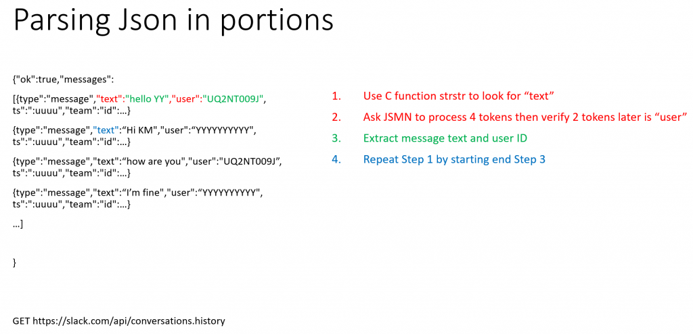](images/wfwslack-json-parse-portions.png)

For this conversation history API, I parse the Json part by part till the end to avoid parsing the entire gigantic Json at one go.

## Testing

Test-driven development (TDD) is used quite often in modern software development but it wasn't so in that era. Testing I felt was extremely critical even for this Science Project as I wanted to make sure my code would work in their unit forms.

VC++ 1.52 does not seem to have testing facilities built in. I could not find a C89-compatible C testing framework that could work with VC++ 1.52 so I rolled a basic one on my own.

[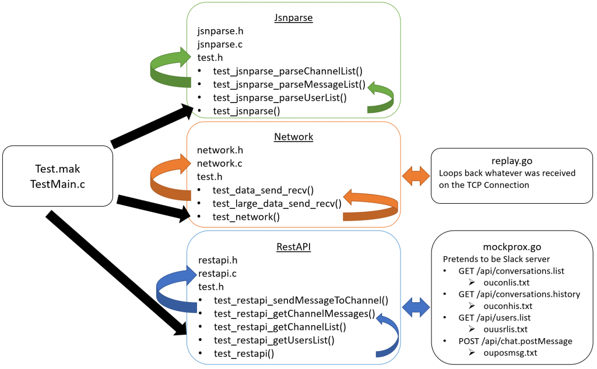](images/wfwslack-test-setup.png)

I created a duplicate project called Test.mak which will compile "TestMain.C" which includes the individual testing "test.h" functions within each package. When running the tests,  "test.h" will execute the individual tests in its file which will in turn test the functions in the package.

[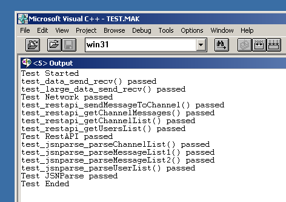](images/wfwslack-test.png)

Test results are then shown in the VC++ debugger output.

### Mock Servers

Due to my unfamiliarity with the Winsock APIs, I actually wrote mock servers in Golang to replay or reply to HTTP sockets requests that will be made during the testing process. Consult the [repo](https://github.com/yeokm1/w31slack) to find out more!

# Resource Usage

By popular demand, there was question about the resource usage of the Windows 3.1 app + VM + proxy compared to the official Mac Slack app. So I did a run and here is the result!

## Mac Memory Usage

[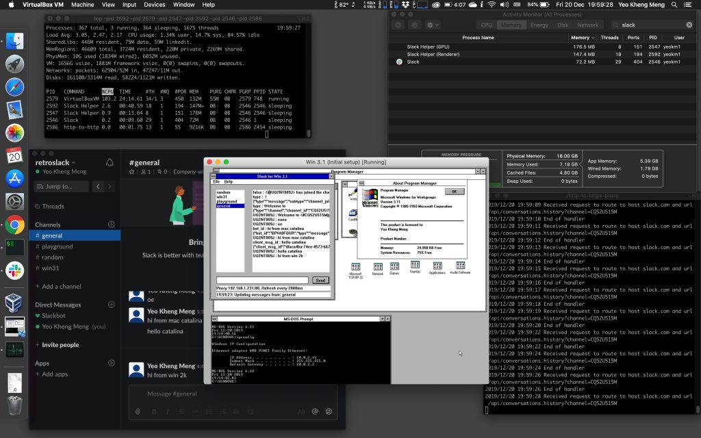](images/wfwslack-mem-usage.jpg)

You can click the file for a closer look. The WFW 3.11 VM is configured to use 8MB RAM with 16MB video RAM. The Mac Slack app is only signed in to one workspace.

Based on the top result

- Virtualbox VM: 132MiB
- http-to-https-proxy: 9 MiB
- Slack: 72.2MiB
- Slack Helper GPU: 176.5MiB
- Slack Helper Renderer: 147.4MiB

So **Slack in total uses 396.1MiB** while the **WFW3.11 VM + proxy uses 141MiB.** On memory usage alone, actually my app can win!

Obviously this is not an apples to apples comparison as the Mac Slack app is fully featured and the VM has a significant overhead.

## Mac Disk Usage

[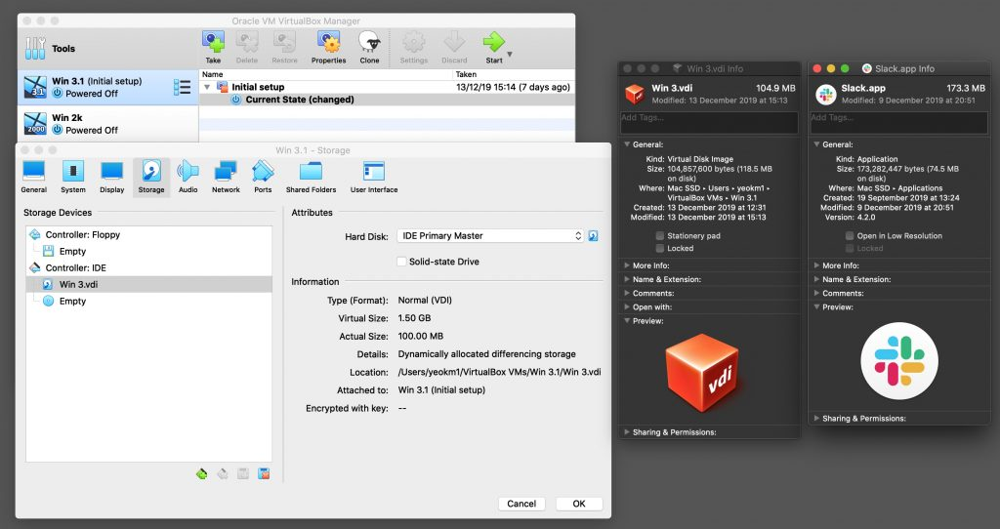](images/wfwslack-disk-usage.jpg)

The VM is currently set to be dynamically-sized but one can see that it uses only 100 MiB versus 165.5 MiB of the official Mac Slack app.

So win again!!!

# Conclusion

This project would not have been possible without the sample guide from [Transmission Zero Building Win16 GUI Applications in C](http://www.transmissionzero.co.uk/computing/win16-apps-in-c/) and my colleague Subh who worked with me during the company hackathon.

Without the benefit of modern libraries and languages, I had to read up and take care of many low level details, socket programming, HTTP, JSON parsing, UI design in code all under tight memory constraints. The extremely unstable and crash-prone WFW 3.1 did not help. Nevertheless, it was a terrific lesson in understanding how things work under the hood.

I had to do things the old-fashioned way reading books and header files due to the dearth of online documentation. I can empathise with the plight of the programmers of yesteryears who had to code without the benefit of online search engines.

If you read to this point, I'm sure you are one of those interested to see how an ancient app can be created with the aid of modern tools and hindsight of old technologies. With this blog post, I hope you enjoyed learning about the extremely painful development process for the newest Windows 3.1 app that's released in the world today.

If you like this, don't forget to check out [Hui Jing's blog post](https://www.chenhuijing.com/blog/building-a-win31-app-in-2019/) of us making a simple Win 3.1 game app. Her blog post has a greater focus on the UI aspect which is actually a great complement to this post as I did not discuss it here.

If you would like to see the live demo of my app and my talk on this topic, watch it here!



# Clarification of me cheating with a proxy

I received many negative feedback regarding me cheating with a http-to-https proxy. So let me clear things out:

1. This app is meant as proof-of-concept of a new 16-bit app built just for fun. Not production use. There's no real benefit if I spend extra effort to get TLS to work when no one in practice will use this app even myself.
2. I have already spent many months worth of weekday nights and weekends to clean up the hackathon code, solve bugs and write the unit tests. I think it's time to stop and document things. I have a full-time job and this is just purely a hobby project.
3. Microcontrollers and other low-memory platforms are cited as examples of "If they can do it, why you can't do it for Win 3.1". People forget the 64K segmented memory model is unusual and the effort to get those libraries to work might not be that straightforward. The C89 language support might pose considerable difficulties. The tiny stack and local heap of 16-bit Win 3.1 apps will definitely up the challenge factor. And those porting efforts are probably done by full-time programmers.
4. Given enough time, I'm sure TLS features can be added to this Win 3.1 app. But the time required will probably exceed the development of the main app functionality itself.
5. I have yet to see any example of a successful TLS 1.2/1.3 capable 16-bit Win 3.1 app out there. If there is one, I'll like to know and learn from the developer of the app how it was accomplished.

Many have recommended Mbed TLS, here is the word from the Mbed TLS team.

> "Mbed TLS, does not support 16 bit architecture... However, I would suspect you will encounter other issues related to 16 bit platforms, in other modules."  
> Source1: [https://tls.mbed.org/discussions/crypto-and-ssl/help-with-ecc-and-bignum](https://tls.mbed.org/discussions/crypto-and-ssl/help-with-ecc-and-bignum)  
> Source2: [https://forums.mbed.com/t/mbed-tls-size-t/3103](https://forums.mbed.com/t/mbed-tls-size-t/3103)

So I hope you understand the reasons behind me giving up and using a proxy. Let me repeat **"Purists may not like this solution but this is the best I can do with my abilities in a reasonable amount of time."**
