I was in the market recently for a new phone as I had to give my previous Google Pixel 2 away to a family member in need of one. With the emphasis these days on sustainability and environmentally-conscious purchasing, the [Fairphone 3](https://en.wikipedia.org/wiki/Fairphone_3) came up at the very top of my research.

From the marketing words of this social enterprise, ["Recycled and fair materials", "Modular and repairable design", "A commitment to fairness"](https://shop.fairphone.com/) and [10/10 score on iFixit's Repairability Rating](https://www.ifixit.com/Device/Fairphone_3), I was sold!

[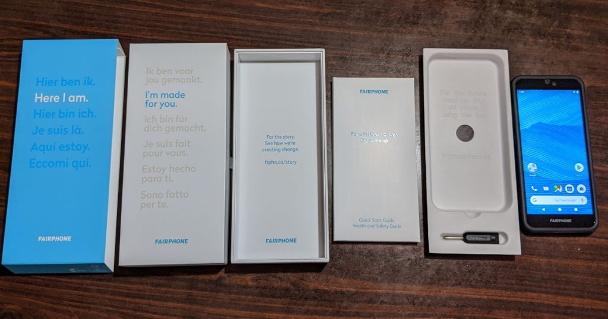](images/fp3-unboxing-1024x538.jpg)

<!--more-->

Notice that contents of the box is just the phone, instruction manual and a screwdriver! I'm totally cool with this, don't ship the cable and charger unless you need it.

I went ahead to purchase and it arrived a few days ago. So after a few days of usage and some itchy hands with the screwdriver, I'll sum things up with this blog post!

Many reviews have already been posted online so much so that [Fairphone has a curated list of reviews](https://forum.fairphone.com/t/curated-list-of-reviews-of-the-fairphone-3/52302). Nevertheless, I shall share my thoughts on those aspects that I felt are important to me.

# Specifications (Pixel 2 vs Fairphone 3)

For comparison purposes, I shall compare the Fairphone 3 with my previous phone the Google Pixel 2. This may not seem like fair comparing phones 2 years apart but let's see shall we.

[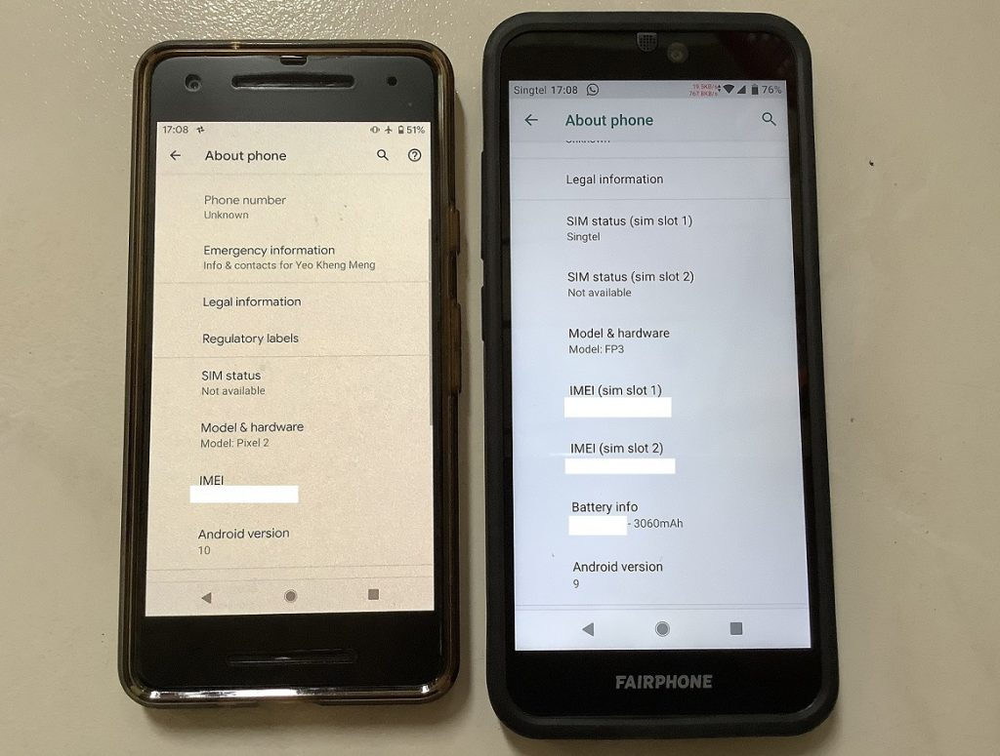](images/fp3-vs-pixel2-1024x775.jpg)

| Specification          | Google Pixel 2                                                                    | Fairphone 3 (FP3)                                                                                     |
|------------------------|-----------------------------------------------------------------------------------|-------------------------------------------------------------------------------------------------------|
| Release Date           | October 2017                                                                      | September 2019                                                                                        |
| System on Chip         | Qualcomm Snapdragon 835                                                           | Qualcomm Snapdragon 632                                                                               |
| RAM                    | 4GB                                                                               | 4GB                                                                                                   |
| Storage                | 64GB or 128GB                                                                     | 64 GB, (optional microSD up to 200 GB)                                                                |
| Camera                 | 12.2MP Sony IMX179, 4K30 video                                                    | 12 MP, Sony IMX363, 4K30 video                                                                        |
| Display                | 5″ AMOLED Gorrilla Glass 5, 1920 × 1080, 441 ppi                                  | 5.65” IPS Gorilla Glass 5, 2160×1080, ~427 ppi. Notification LED |
| Sensors                | Fingerprint, Accelerometer, Proximity sensor, Ambient light sensor, Compass       | Fingerprint, Accelerometer, Proximity sensor, Ambient light sensor, Compass                           |
| Ports and Connectivity | LTE, 802.11ac 2×2 MIMO (2.4/5Ghz), BT5, NFC, USB-C 3.1, GPS, FM-radio, 1x nanoSIM | LTE, 802.11ac (2.4/5Ghz), BT5, NFC, USB-C 2.0, 3.5mm audio jack, GPS, 2x nanoSIM                      |
| Size and Weight        | 145.7 x 69.7 x 7.8 mm, 143g                                                       | 158 × 71.8 × 9.89mm, 189g                                                                             |
| Battery                | 2,700 mAh fixed                                                                   | 3060 mAh removable                                                                                    |
| IP rating              | IP67 (Dustproof and 1m water immersion)                                           | IP54 (Dust and water splashes)                                                                        |
| Launch Price           | US$649 ≈ SG$1000. Second hand is SG$200-250 today.                                | €450 ≈ SG$700                                                                                         |

Other than the size-related aspects, both phones have very similar specifications despite being 2 years apart which will obviously position the FP3 on the mid-low performance tier today. It goes to show that pure feature count is not the main focus for Fairphone.

For the rest of the review, I'll be using the Pixel 2 as a point of reference since that is a wildly-recognised phone model and what I have been using so far.

# Modular and Repairable Design

When a manufacturer uses those words ^^^, of course I want to put them to the test. iFixit has already done a professional job in their [Fairphone 3 Teardown](https://www.ifixit.com/Teardown/Fairphone+3+Teardown/125573) so I won't go to the extent of their effort. Nevertheless, I still wanted to test their claims out myself since after all, I volunteer at [Repair Kopitiam](https://repairkopitiam.sg/) where I take things apart every time.

[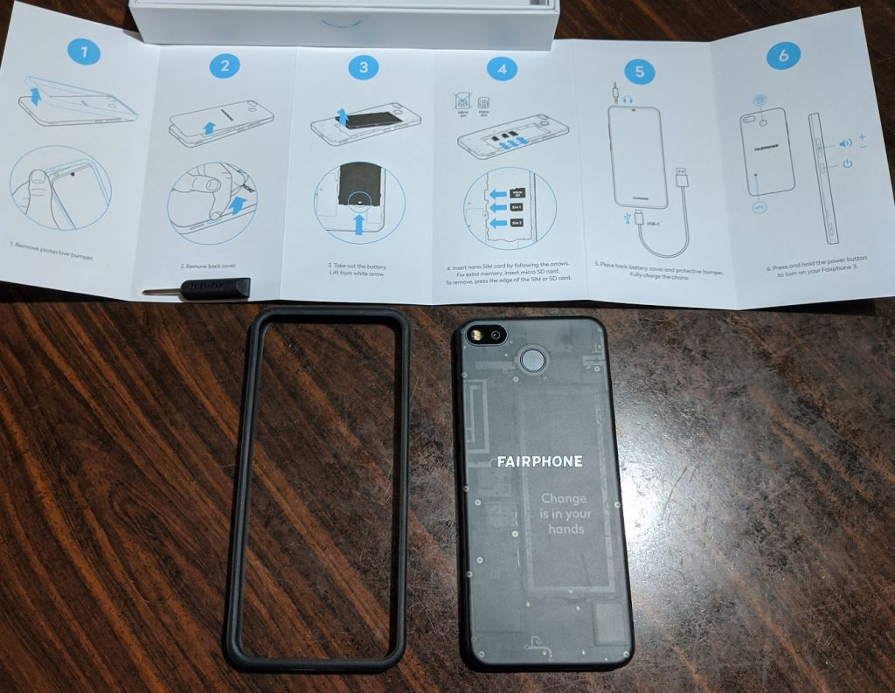](images/fp3-back.jpg)

Turning the phone over and removing the provided TPU bumper "made from bio-based oil". The back cover is translucent with inspiring words bleeding through.

[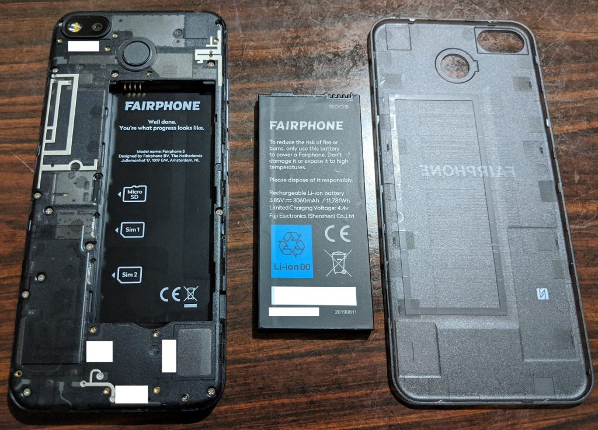](images/fp3-back-opened.jpg)

Just popping out some catches and the rear cover is out! Battery is easily removed too! Wow, my first phone with removable-battery in years!

[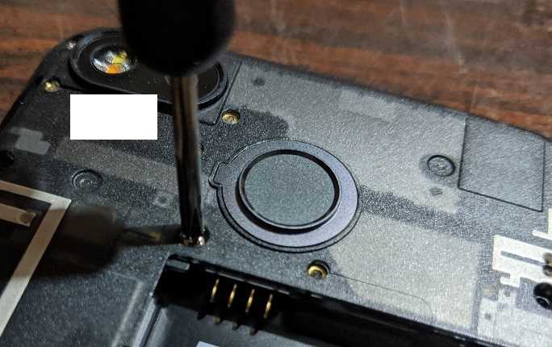](images/fp3-screwdriver-opening.jpg)

Subsequent steps are more involved and need some screwdriver work. I tried using the provided screwdriver. Honestly, although it works with some effort, one is advised to use a screwdriver with a larger handle.

[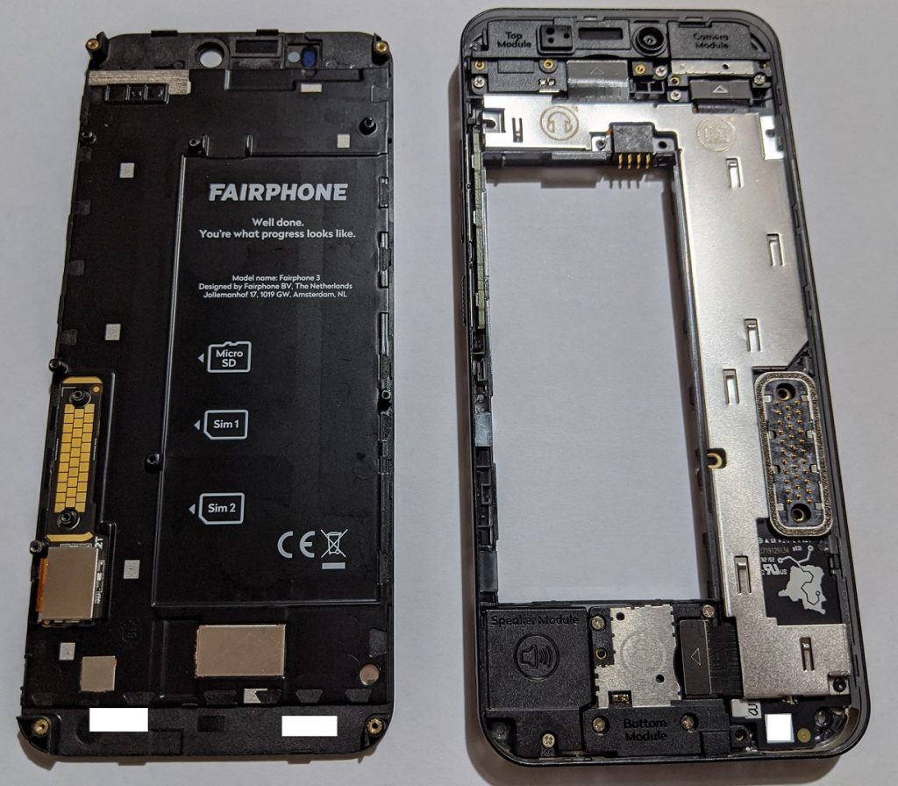](images/fp3-half-opened.jp)

After removing all the screws, the display panel is easily separated! Wows again! In most other phones, you'll have to melt some messy glue with a hot air gun. Spy the Top, Camera, Speaker and Bottom module which are ripe for further removal.

[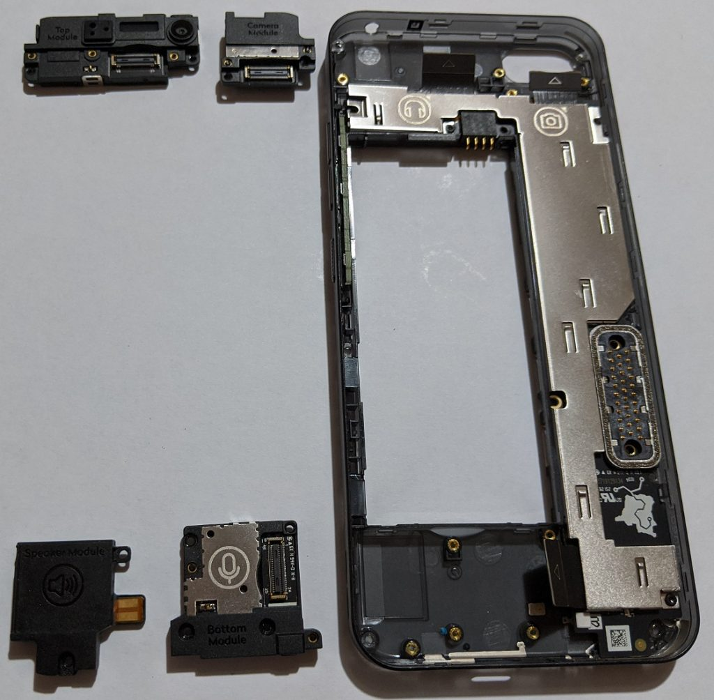](images/fp3-modules-out-1024x1004.jpg)

A few more screws and some flex cable removing later, the 4 modules fall out easily. Here is where I stop further disassembly as what's below the metal shield are the sensitive SoC, modem and other chips which I'm hesitant to potentially damage. [iFixit has already done a great job in that area](https://www.ifixit.com/Teardown/Fairphone+3+Teardown/125573).

[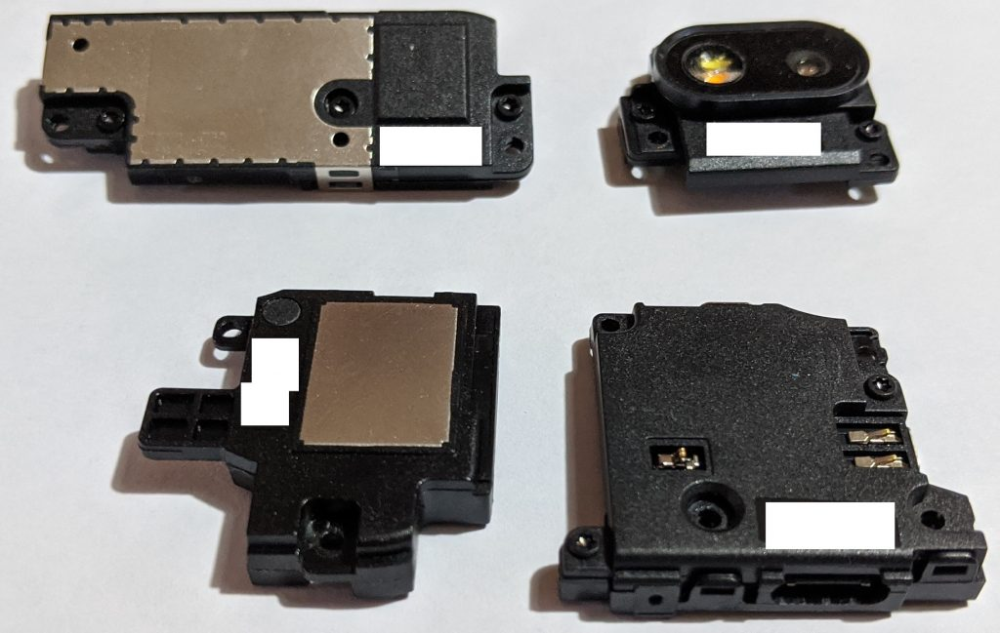](images/fp3-modules-back.jpg)

A close-up look at the back of the modules. They are really so cute and easily removed. If for example the USB port is damaged, you can [purchase spare parts online from Fairphone](https://shop.fairphone.com/en/spare-parts). You can see that spare parts from their earlier FP1 and FP2 models are still available.

[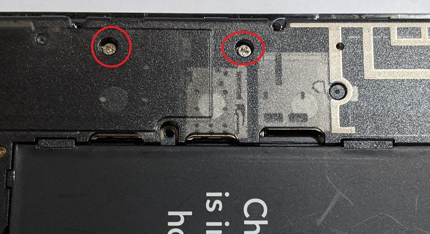](images/fp3-lcd-screws.jpg)

After fixing a product, it is common procedure to test things out before putting back all the screws. Just do take note to at least put in these 2 screws which couple to the electrical connector of the LCD connector. I didn't initially put these in and got a scare when my display did not come on after turning the phone on.

Disassembling and assembling the phone is quite fun as one does not get this opportunity with any other phone. I encourage all Fairphone owners to disassemble their phone at least once to feel the level of empowerment. Just don't do it too often as I don't think the internal connectors are rated for many insertion cycles.

## Usage and Performance

The first thing that I noticed when I started using the FP3 was how similar it was to the Google Pixel experience. No bloat or unnecessary software installed by the manufacturer unlike some other Android brands.

## Performance Benchmark

As I have no easy means of easily comparing the 2 phones, I shall turn to a synthetic benchmark [Antutu Benchmark](https://play.google.com/store/apps/details?id=com.antutu.ABenchMark).

[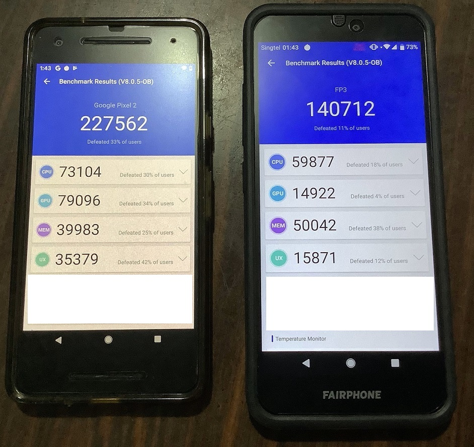](images/fp3-antutu.jpg)

My first time benchmarking phones actually. :) As you can see, the FP3's performance is nothing to write home about and it scores near to the bottom of phones in the market. The 2-year-old Pixel 2 beats it by a very significant margin.

On a day-to-day usage, I can confirm the FP3 seems slightly less responsive than the Pixel 2 when it comes to launching applications and scrolling through photos.

## Camera

Here is one area where the pros can do it better. [Dxomark](https://www.dxomark.com/) gives a score of [66 for the FP3](https://www.dxomark.com/fairphone-3-camera-review/) and [99 for the Pixel 2](https://www.dxomark.com/google-pixel-2-reviewed-sets-new-record-smartphone-camera-quality/) so the comparison is obvious. With the work already done, I can skip this section right?

I still want to do a basic test by taking a day shot of the industrial park beside my block. Photos below are taken with the default camera app at default auto settings. Click on the photos to view the full-size image.

### Fairphone 3

[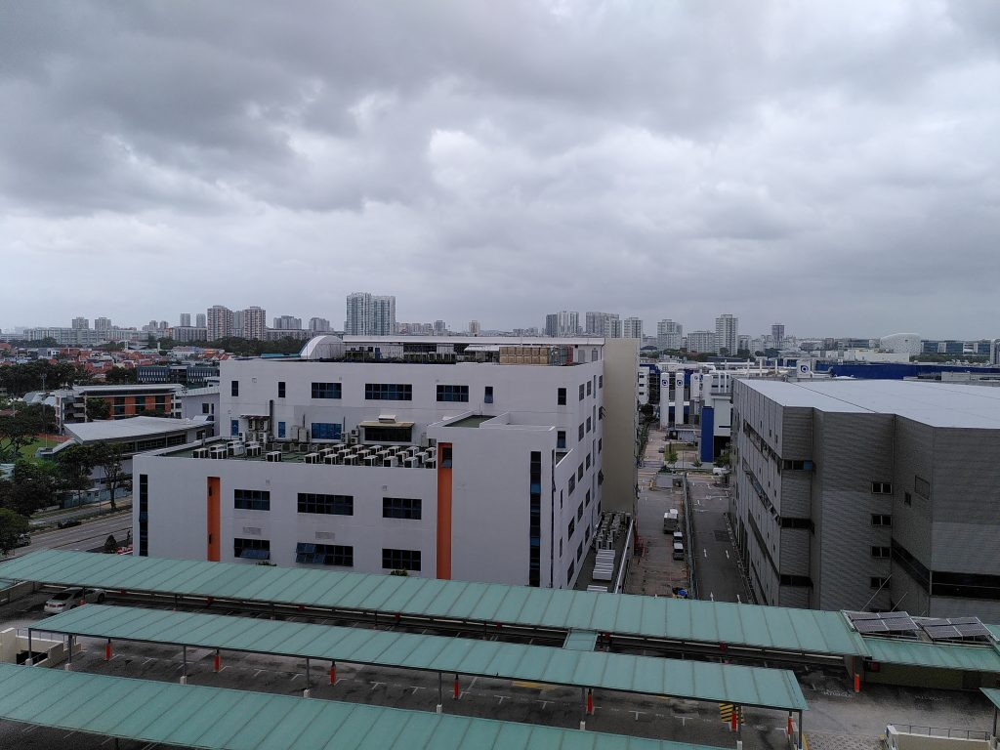](images/fp3-camera.jpg)

4000x3000, 5.37MB

### Pixel 2

[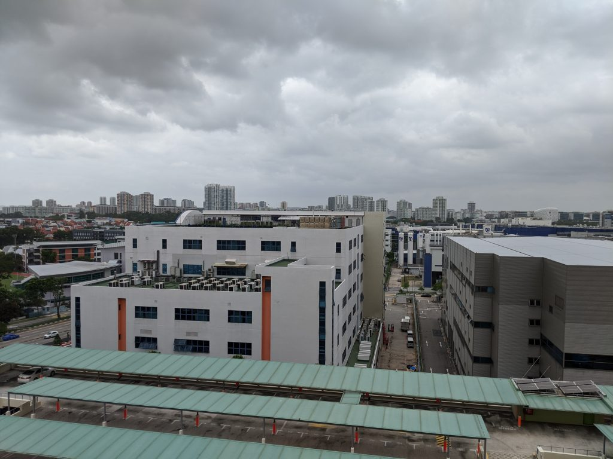](images/fp3-pixel2-camera-1024x768.jpg)

4032x3024, 2.90MB

Immediately the colours from the Pixel 2 appear much more natural whereas the FP3 has that blue tint. I'm unsure why the file size difference of the FP3 is almost double. The FP3 image appears to be sharper as a result when you zoom in but not by much and not enough to justify the huge file size difference.

I don't normally take night shots but I do understand that Pixel's Night Sight feature works really well. In practice, most photos I take are posted to social media where lower resolutions suffice and colour is thus more important. This is one area where I'll make a significant downgrade by switching to the FP3.

BUT, there are unofficial hacks to get the Google Camera app to work on the Fairphone 3. I cannot openly recommend where to download these hacks so look them up.

## Battery life

Battery life is a very subjective thing unless you use some synthetic benchmarks but I'm not keen for this stage. At 3060mAh, this capacity seems like an average for phones of this category.

I started off with a full charge in the morning and I used the phone as per normal. I took the following screenshot when I got home.

[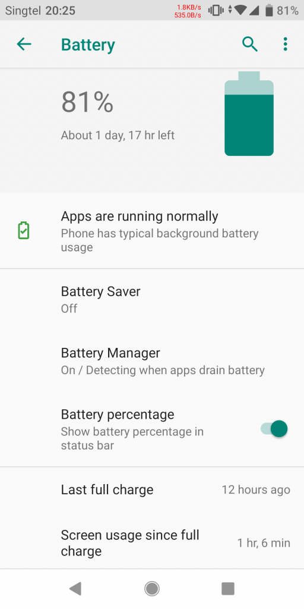](images/fp3-battery-page.png)

I'm a pretty light user when it comes to phones, I occasionally surf the web, check social media and emails etc. No games, music or video watching. Any heavier work I'll use a PC or tablet. Typically by this time of the day, my 2-year-old (with obviously-deteriorated battery) Pixel 2 would drop to about 40-50%.

So it seems not bad, for a new battery, I should be able to make it last at least 2 days between charges.

If for some reason you always burn through your battery before your day is up, hey, you can always bring a spare battery without the need for a power bank!

# Gripes

There is quite a list of shortcomings in the design and usability aspects that one usually cannot determine on spec sheets but becomes obvious when using the phone. At least compared to the Pixel 2 and other phones, the FP3 I feel falls short in this areas. Some may not be the fault of the FP3.

## Charge Status LED ≠ Notification LED

When I first saw a front LED light up when I plugged in the charger, I was elated! I haven't used a phone with such an LED in years.

[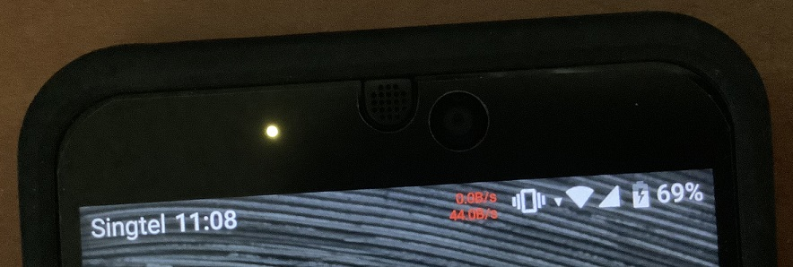](images/fp3-yellow-charging-led.jpg)

Boy I was let down when I realised that the LED never lit up for any other use-case. Research on Fairphone forums confirms that [this LED is to indicate charge status only](https://forum.fairphone.com/t/led-notifications-do-not-work/53013) and there are no plans to change this.

If this was a hardware LED tied to the charging circuit, then nothing more to do here, no changes are possible.

To confirm this, we can bring up the service menu to have some fun. Dial \*#\*#66#\*#\*. Go to Service Tests ->  Test Single -> FlashLED Test.

[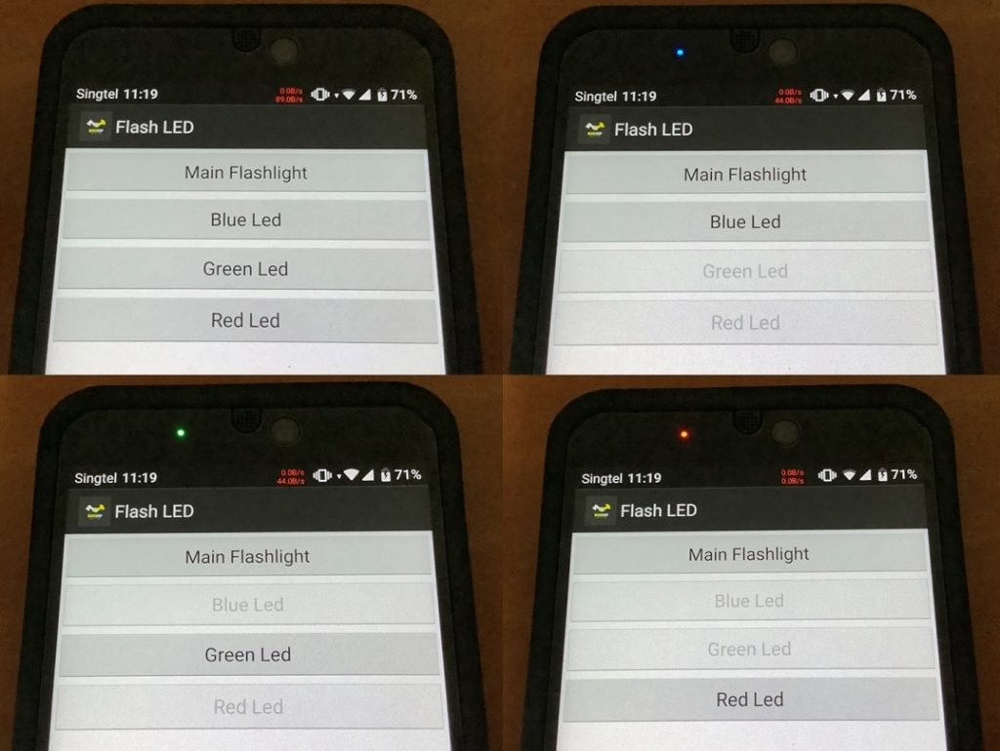](images/fp3-led-colours.jpg)

This proves that the LED is software-controllable. If Fairphone wanted to, it's a technical possibility to make the notification LED feature available to the Android OS and apps just via a software update.

### Software Update to enable Notification LED (April 2020)



A recent software update FP3 A.0118 has allowed the LED to be used for notification purposes.



## Fingerprint sensor too high

[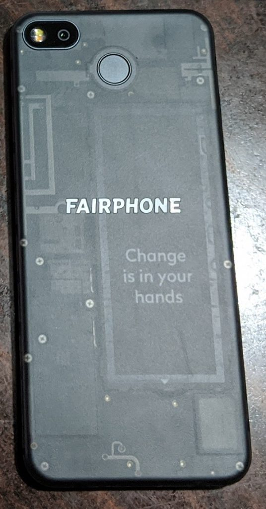](images/fp3-back-fp-sensor.jpg)

The Fingerprint sensor seems to be in an awkwardly high position to me. I always have difficult reaching up to it when I pick up the FP3. I guess in time I'll have no choice but to get used to it though.

The position of the fingerprint sensor is understandably limited due to the position of the battery and the modules below it so the engineers' hands were tied but I still feel this is something that should be improved in future.

## Off-centre USB-C port

This is a small issue but something that bugs me. Most of my prior phones before have their charging port placed at the bottom center.

[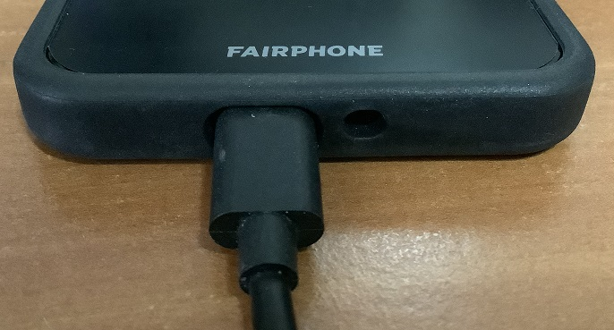](images/fp3-usbc-off-centre.jpg)

The FP3's USB port is slightly offset to the left. My OCD kicks in!!!

Now I understand that this is due to the design of the modular components but still, it's another design compromise I must stomach.

## Cases and bumpers

The FP3 comes with a bumper to help protect the phone from drops. Count on that being your only protection case for some time due to the rarity of the phone. I went to a couple of phone shops and none have heard of a Fairphone!

For the Matte screen protector, I had to get a shop to custom cut a plastic screen protector to fit the dimensions of the FP3. Just know what you are getting into when getting an extremely niche phone.

## Shipping

The FP3 does not ship to Singapore direct. So I had to get it shipped to a European freight-forwarder before getting my hands on it in Singapore.

# Conclusion

The FP3 has certain features on paper that are uncommon or rare in modern phones: microSD, removable battery, 3.5mm audio jack, charge status LED, dual-SIM and SIM changing without ejector pin. **By these features alone, I would purchase the FP3 without the other modular, environmental and ethical aspects.**

This phone may not fit everyone's needs. For the same specs, one can easily get a phone that is a few hundred dollars cheaper or for the same price, a new Pixel 3a with much better camera software.

**Designing a repairable, modular, and sustainable phone by this small limited-resourced social enterprise has its compromises.** You'll have to live with a chunky phone that looks like one made half-decade ago. Unlike a desktop PC, there is only so much a manufacturer can work with in a space-constrained portable device. Software optimisations like the camera for example will have to take a back seat.

You have to pay a premium for the relatively-small production run that obtains materials from "more ethical" sources.

To prevent the price from climbing to astronomical levels, Fairphone engineers have to use lower-performance components. The phone is noticeably slow today, imagine [5 years later which Fairphone has promised to support.](https://support.fairphone.com/hc/en-us/articles/360032971751-Operating-systems-OS-for-the-Fairphone-3)

However if you can live with these compromises like I do, supporting the Fairphone by putting my money where my mouth is feels like the right thing to do.

Given the track record of Fairphone where they are still selling spare parts to their first model sold in 2013, I'm confident they'll still be around to do the same for the Fairphone 3. I wish them all the best.
