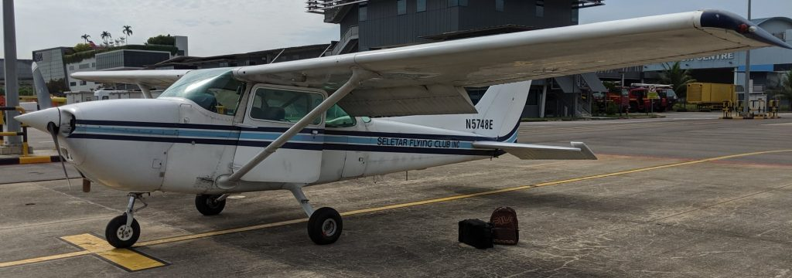
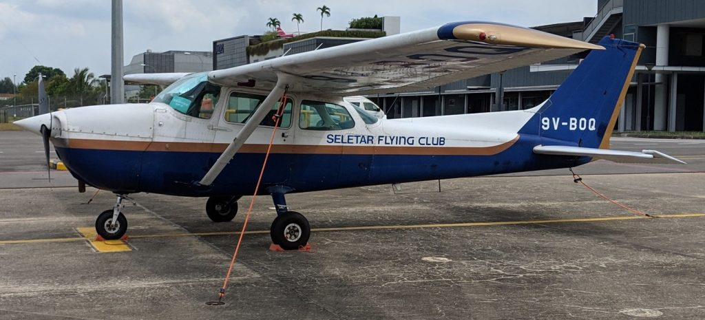

The costs of flying General Aviation (GA) is a question I get asked a lot ever since I started taking up my family and friends.

I had this question too as I needed to plan my frequency of flights for personal budgetary reasons. It may seem to be a simple question but the answer can be quite complex owing to the myriad of regulations and cost structures. While tabulating the numbers, I thought to make my calculations public due to the limited information online on this topic and the general lack of GA awareness in Singapore.

Flying costs vary greatly depending but not limited to the following high-level factors:

- Legal maintenance requirements
- The club you join
- Hourly rental rates (solo/dual) and landing fees
- Amount of flying one wants to do

I'm a member of Seletar Flying Club (SFC) which offers the lowest flying rates locally. Rates are cheaper across the causeway at Senai airport in Johor but I avoid going there due to the hassle of traveling and the fact my local friends are unlikely to follow me across.

So with this, let's do an in-depth analysis of the costs of flying GA in Singapore.
<!--more-->

# Base rates

Let's first start with the basic costs of renting the planes as those are the fundamental rates everything is based on. All rates are wet which means they include everything like fuel, maintenance and parking charges except the landing fees. Below are the planes that are operated by SFC. Don't get shocked by the age of the planes. A plane's safety is not determined by age but by how well-maintained it is.

All rates in Singapore dollars and obtained from [SFC's official website here](http://www.seletar-flying-club.org/flights.php).

## Cessna 172N (1978) - C172N - N5748E/9V-BOQ - \\$470/h

These 2x C172N planes can be considered basic trainers typically used for initial flight instruction. Nevertheless, they are good and economical enough for GA pilots like myself. I can only fly the US-registered N5748E due to my American FAA license.

## Instructor costs

Instructors are required for training and plane checkouts. For dual flights, it'll cost a total of \\$550/h.

## Landing fees

Every landing is chargeable at Seletar Airport. The moment the plane's wheels touch the runway including touch-and-gos means \\$$$.

It currently costs \\$37.50 per landing.

> Aircraft of maximum taxi weight up to 6 tonnes -  \\$11.60/ton (Subject to minimum charge of \\$35)
> 
> (Including GST means \\$37.50)
> 
> List of Fees & Charges - Applicable in Seletar Airport - With effect from 1 December 2018
> 
> [https://www.seletarairport.com/docs/List\_of\_Fees\_Charges\_at\_Seletar\_Airport\_\_wef\_from\_1\_Dec\_18\_\_rev.pdf](https://www.seletarairport.com/docs/List_of_Fees_Charges_at_Seletar_Airport__wef_from_1_Dec_18__rev.pdf)

However I heard it will may go up to  \\$50 soon. I'll assume \\$50 in this calculation as it's a better round number too.

For comparison, Senai airport in Johor charges RM\\$12 = SG\\$4 for landing. This makes Seletar landing fees very exorbitant for GA operations. Landings are generally free in the US for example.

# Legal Maintenance Requirements

Unlike car licenses, pilot licenses require continuous effort to maintain. This is because flying skills are deemed to be perishable as a pilot who has not flown for some time is deemed to be unsafe.

This concept is known as "pilot currency" where the law requires pilots to engage in a minimum amount of flying activities in order to maintain their skills.

**Therefore, maintaining one's currency and license validity as a private pilot is an important factor when it comes to estimating costs.**

## To be a Pilot-in-Command (PIC)

[Being a PIC](https://en.wikipedia.org/wiki/Pilot_in_command) of a flight means the pilot is in charge of all aspects of the flight. Every manned aircraft in the world must have a designated person as the PIC before it can move on its own power. If anything happens, the legal responsibility and repercussions will fall onto the PIC.

This privilege does not last forever the moment the pilot passes the relevant test. Different countries impose different sets of rules to maintain PIC privileges.

I'll discuss about Singapore, USA and Malaysia as these are the typical countries that Singaporean pilots get their license from.

### Civil Aviation Authority of Singapore (CAAS)

CAAS-licensed pilots are required to fly a minimum of 5 hours every year of which 2 of those must be with an instructor.

> 7.2 The minimum flying experience required to maintain an Aircraft Rating is **5 hours as pilot of** **aeroplanes within the 12 months preceding the date of issue of a C of E or C of T**. All flying must be completed within the validity period of an existing C of E or C of T. 7.3 Of the 5 hours minimum experience required, **a minimum of 2 hours must be of dual flying** **instruction under a flying instructor**. Upon completion of the dual flight(s), the instructor must certify that the pilot is fit to fly as PIC and so certifies in his logbook.
> 
> Source: Singapore Air Safety Publication (SASP) Part 1 (Licensing of Student Pilots and Private Pilots)
> 
> [https://www.caas.gov.sg/docs/default-source/pdf/sasp1-(issue\_9-amendment-2).pdf](https://www.caas.gov.sg/docs/default-source/pdf/sasp1-(issue_9-amendment-2).pdf)

C of T: Certificate of Test

C of E: Certificate of Experience

If the pilot does not meet this 5/2 hour requirement, the license will expire and a test with a CAAS examiner is required again. There is more to this so see section 7.6 of SASP1.

### Civil Aviation Authority of Malaysia (CAAM)

If you ask me, CAAM has the strictest standards of all. One needs to take an annual test with a CAAM examiner.

> within the 3 months preceding the expiry date of the rating, pass a proficiency check in the relevant class in accordance with Appendix 9 to these Directives with an examiner
> 
> Source: CAAM Flight Crew Licensing, Flight Operations Directive 10FC-16 Issue 2 Revision 0 (Mar 2019)
> 
> FCL.740.A Revalidation of class and type ratings — aeroplanes
> 
> [http://www.dca.gov.my/wp-content/uploads/FOD\_FlightCrewLicensing190419.pdf](http://www.dca.gov.my/wp-content/uploads/FOD_FlightCrewLicensing190419.pdf)

### Federal Aviation Administration (FAA) of USA

The FAA PPL which is the license I hold requires me to take a flight review every 2 years.

This flight review needs to have minimum 1 hour of flight and 1 hour ground instruction with an FAA instructor. The instructor will put me through a battery of tests to the PPL standards and only if he deems me proficient will he endorse on my log book to allow me to fly as PIC for another 2 years.

Source: [FAR 61.56: Flight Review](https://www.ecfr.gov/cgi-bin/text-idx?SID=7666e463f196348d54c5dd8b89c7af45&mc=true&node=pt14.2.61&rgn=div5#se14.2.61_156)

**The FAA PPL never expires.** If I miss my flight review by 10 years for some reason and I theoretically fly to a standard that satisfies an instructor, I can regain my PIC privileges. I never have to meet an examiner again in my life if I just want to maintain my license.

No independent flight hours needed but in practice if one has not flown for such a long time whether is 2 years or 10 years, it unlikely the pilot can still fly the plane to a safe standard that the instructor will endorse.

An FAA license is anecdotally deemed by most pilots worldwide to be the easiest and cheapest to maintain to minimum legal standards.

## To carry passengers

When the lives of others are in the picture, governments are stricter and additional flying requirements are imposed on top of the PIC requirements. **To be a PIC of a passenger-carrying flight, a pilot is required to do a minimum of 3 takeoffs and 3 landings in the preceding 90 days before the flight.**

So for example, if I want to take passengers today, I need to look back at the past 90 days and count the number of takeoffs and landings I accomplished and make sure there are at least 3.

If I do not have this requisite currency, I'm legally required to do solo flights or flights with an instructor to gain back my minimum currency before I can take others. **Flying clubs like SFC are free to tag on additional rules such as no solo flights are permitted to regain landing currency, they must be done with an instructor. This is usually due to insurance requirements.**

# Fixed costs

## One Time Membership Cost

**Entrance Fee: \\$2000 (Entrance fee includes a complimentary 1 hour trial flight with instructor)**

**Initial checkout: ~$800 and 1.5 hours**

An aircraft checkout (outside of the trial flight) with an instructor is required before one can fly any of the planes. It also includes a familiarisation of Singapore's airspace.

The checkout is within the [local training area](/2019/06/notes-on-flying-in-wssl-and-sg-training-area/) hence no cross-country flight is needed. I had to do the usual maneuvers of stalls, slow flight, steep turns, emergencies, airport operations and some landings to PPL standards.

SFC requires that an initial upfront payment of the monthly membership rate from the join date to the end of the year at \\$160/month. Example if I join in July 2020 to Dec 2020, it'll be 6 \* \\$160 = \\$960.

Assuming a July join date:

**Total one time costs: \\$2000 + \\$800 + \\$960 = \\$3760**

## Membership Renewal

There are 2 options for membership renewal

- Block rate of \\$1800/year
- Monthly rate \\$160/mth

The former is a savings of \\$120/year. For subsequent calculation, I'll assume the block rate.

# Cost Estimation

With all the above information, let's come to counting the \\$$$. Given the varying requirements and possible usage patterns, I shall make the following assumptions

1. One time SFC costs are ignored as they are after all just one-time.
2. Malaysian license requirements are ignored as such license holders typically fly in Malaysia instead
3. FAA requirements are too lenient and do not actually paint a proper picture to fly safely

Even though I possess an FAA license, I shall adopt the CAAS requirements as guidelines as they more closely approximate the flying pattern of a typical GA pilot in SFC and I feel it's a safer set of requirements too.

Since instructor flights are annual fixed costs, let's calculate it here first. I assume one would need 5 landings for the instructor to go through all the required landing maneuvers and extra practice.

**Annual 2h flights with instructor with 5 landings: (2 \* \\$550) + (5 \* \\$50) = \\$1350**

With these considerations, let's analyse the annual costs of 4 different scenarios. I'll make up the landing numbers to approximate the situation.

## Scenario 1: Minimum cost to maintain the (CAAS) license for PIC privileges

3h PIC Flights with 3 landings: 3 \* ($470 + \\$50) = \\$1560

**Minimum cost to maintain a CAAS PPL annually: \\$1800 (membership) + \\$1560 + \\$1350 (w/ instructor) = \\$4710**

## Scenario 2: Maintain minimal passenger-carrying currency

In this scenario, one would just do 3 takeoffs and landings every 90 days. I'll assume 1 PIC flight will be made for each of the first 3 quarters of the year where each flight will do 3 takeoffs and landings. (This can be done by flying circuits around the airport by doing 2 touch-and-go and 1 full stop landing) For the last quarter, the 2h flight with the instructor will be done.

Flight per quarter (1h flight and 3 landings) = \\$470 + (3 \* \\$50) = \\$620

**Minimum cost to maintain passenger carrying currency: \\$1800 (membership) + \\$620 \* 3 + \\$1350 (w/ instructor) = \\$5010**

The cost of this scenario may seem not much more than Scenario 1. However in practice, it's a relatively risky way to maintain currency if due to bad weather or mechanical issue and you can't fly for some time, you'll lose your passenger currency very quickly.

Such limited flying once every 3 months also means one would lose proficiency dramatically. The pilot may legally be allowed to carry passengers but I personally won't feel safe with the lack of recent experience.

## Scenario 3: Safer passenger-carrying currency

To avoid the loss-of-currency problem and increase the safety of Scenario 2, let's have the pilot fly every month with an average of 2 landings per flight. Flights with instructor will happen on the last 2 months.

Monthly flight (1h flight and 2 landings) = \\$470 + (2 \* \\$50) = \\$570

**Cost of safer passenger carrying currency: \\$1800 (membership) + \\$570 \* 10 + \\$1350 (w/ instructor) = \\$8850**

Now the cost has jumped significantly but such is the price of safety I feel.

## Scenario 4: Fly to best proficiency

Nevertheless as a relatively new pilot, I don't think Scenario 3 is adequate. I personally feel quite rusty if I just fly once a month. Let's try to fly once every 3 weeks to increase proficiency levels but only one landing per flight is needed now. The instructor flights will take the place of flights in the last 6 weeks of the year.

Total flights required: (52 - 6) / 3 ≈ 16

Triweekly flight cost (1h flight and 1 landing) = \\$470 + \\$50 = \\$520

**Cost to fly to best proficiency: \\$1800 (membership) + \\$520 \* 16 + \\$1350 (w/ instructor) = \\$11470**

# Conclusion

Flying is expensive wherever you go worldwide. But much more so in Singapore given the low economies of scale for GA operations here. I personally try to aim for around Scenario 3 or 4 depending on my schedule and aircraft availability.

So utilising my flying privilege comes with sacrifices especially if one does not have an upper class background. I minimise expenses by not eating at expensive restaurants, buying stuff I don't need, making my possessions go the distance, not going out unnecessarily, minimise overseas holidays and most importantly, I don't own a car. So I'm probably one of the rare people/private pilot in Singapore that flies planes more than driving cars. I take public transport and an occasional Grab to/from Seletar airport.

One point I have not factored in is that private pilots are allowed to share costs. This is why I keep trying to take friends on flights if possible, they help defray my costs without me footing the entire bill. It's a win-win for us. :P

**Therefore my calculations are likely an overestimate as most flights do not need one full hour especially if done monthly or more frequently. And as a FAA PPL holder, I don't need to fly with the instructor every year. Nevertheless, I rather paint a realistic picture rather than underestimate the costs.**

I hope with this blog post, I would help enlighten readers on the costs of GA in Singapore. I'm in no way profiteering from my flights as some have accused. It's really this expensive despite being in the cheapest club to rent in SG. Besides, my PPL does not allow me to do so as well.

P/S: Note that I made best effort to verify figures and regulations at the time of writing only. They may be subject to change in future.
